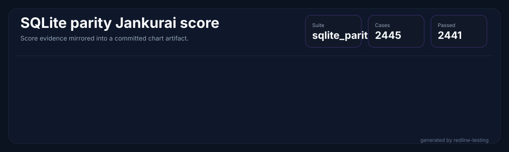
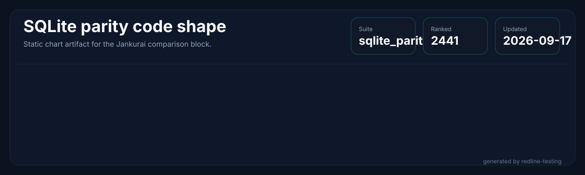
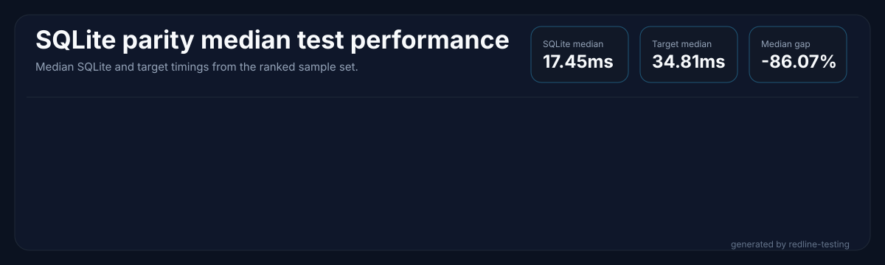
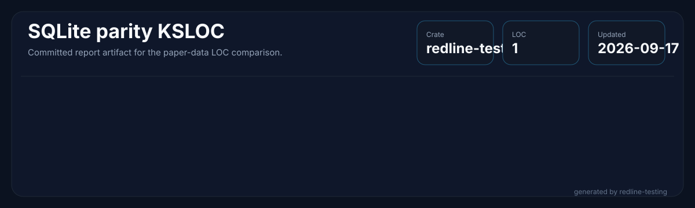
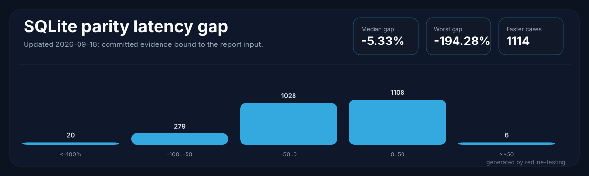
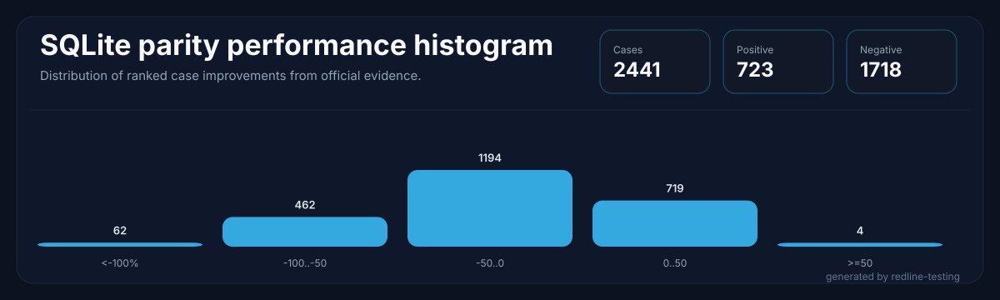
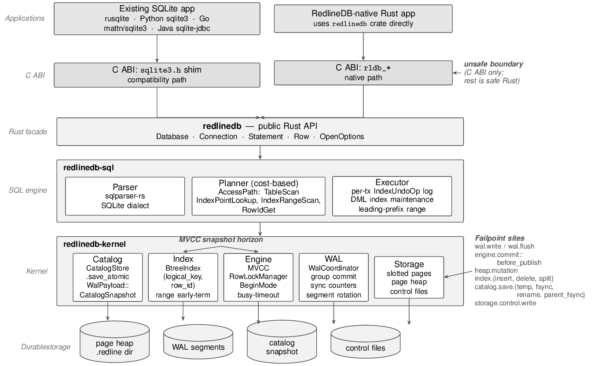
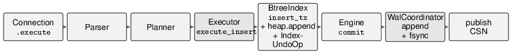

<p align="center">
  
</p>

<h1 align="center">RedlineDB</h1>

<p align="center">
  <em>Rust-native embedded SQL with SQLite-shaped compatibility, concurrent writes, and deterministic recovery.</em>
</p>

<p align="center">
  <a href="#sqlite-parity-status"></a>
  <a href="#sqlite-parity-status"></a>
  <a href="LICENSE"></a>
  <a href="rust-toolchain.toml"></a>
  
  <!-- jankurai-score-badge:begin -->
  <a href=".jankurai/repo-score.md"></a>
  <!-- jankurai-score-badge:end -->
</p>

RedlineDB is an embedded SQL engine written in Rust. It keeps the SQLite-facing
API familiar while replacing the storage core with MVCC, a concurrent B-tree,
group-commit WAL, and crash recovery designed for multi-writer workloads.

## Engine Metrics

<!-- sqlite-parity-metrics:begin -->








<!-- sqlite-parity-metrics:end -->

## Redline Mission

RedlineDB keeps SQLite-shaped compatibility where that contract is valuable:
small embedded deployments, familiar SQL, a direct Rust API, and a SQLite-shaped
C surface for integrations that already expect it.

The engine is not a SQLite wrapper. It rebuilds the storage core in Rust so
MVCC, concurrent writes, WAL behavior, and recovery can be owned directly
instead of treated as constraints inherited from a single-writer file engine.

The codebase is also shaped for fast repair by agents and humans: smaller
modules, local invariants, routed proof lanes, generated evidence, and audit
metadata that point a fix at the narrowest lawful surface.

## At a Glance

| Area | What it is |
|---|---|
| Rust API | `redlinedb` for embedded use |
| CLI | `redlinedb-cli` for shell-style workflows |
| FFI | `crates/ffi` exports a SQLite-shaped C ABI surface |
| SQL engine | Parser, planner, executor, pragmas, and compatibility shims |
| Storage | Kernel-owned MVCC, WAL, catalog, and recovery layers |
| Default proof lane | `just fast` |
| SQLite parity gate | `just redline-testing-official` |

## Install

### Rust library

Pin the release in `Cargo.toml`:

```toml
[dependencies]
  redlinedb = "=2.0.5"
```

For libraries, `redlinedb = "1"` is usually fine. For binaries, keep the exact
pin and commit `Cargo.lock`.

### CLI binary

Install the published shell on Linux or macOS:

```bash
curl -LsSf https://raw.githubusercontent.com/neverhuman/RedlineDB/main/scripts/install.sh | bash
```

Pin a specific release when you need reproducible installs:

```bash
curl -LsSf https://raw.githubusercontent.com/neverhuman/RedlineDB/main/scripts/install.sh | VERSION=v2.0.5 bash
```

Lock the exact tarball digest in CI or release automation:

```bash
curl -LsSf https://raw.githubusercontent.com/neverhuman/RedlineDB/main/scripts/install.sh | \
  VERSION=v2.0.5 REDLINEDB_SHA256=<sha256> bash
```

### Build from source

```bash
cargo install redlinedb-cli --version 2.0.5 --locked
```

Or install from the tagged repository release:

```bash
cargo install --git https://github.com/neverhuman/RedlineDB.git --tag v2.0.5 --package redlinedb-cli --locked
```

### Direct download

Release tarballs are published on the [releases page](https://github.com/neverhuman/RedlineDB/releases):

| Platform | File |
|---|---|
| Linux x86_64 | `redlinedb-v2.0.5-linux-x86_64.tar.gz` |
| macOS Apple Silicon | `redlinedb-v2.0.5-macos-arm64.tar.gz` |
| macOS Intel | `redlinedb-v2.0.5-macos-x86_64.tar.gz` |

Each tarball ships with a matching `.sha256` checksum and contains the CLI,
shared libraries, and public headers.

## Quick Start

### Embedded use

```rust
use redlinedb::Database;

fn main() -> redlinedb::Result<()> {
    let db = Database::create("/tmp/demo.redline")?;
    let mut conn = db.connect()?;

    conn.execute("CREATE TABLE kv(k INTEGER PRIMARY KEY, v TEXT NOT NULL)", ())?;
    conn.execute("INSERT INTO kv VALUES (1, 'hello')", ())?;

    let value: String = conn.query_row("SELECT v FROM kv WHERE k = 1", ())?;
    println!("{value}");

    Ok(())
}
```

### CLI use

```bash
rtk cargo run -p redlinedb-cli --release -- exec /tmp/demo.redline "SELECT count(*) FROM kv"
rtk cargo run -p redlinedb-cli --release -- stats /tmp/demo.redline --json
rtk cargo run -p redlinedb-cli --release -- backup /tmp/demo.redline /tmp/demo.bak --physical
```

### Default verification

```bash
rtk just fast
rtk just redline-testing-official
rtk just sqlite-parity-report-check
```

## SQLite Parity Status

The official parity lane is sourced only from the pinned external
`neverhuman/redline-testing` release artifact, which is the sole official
evidence source. Missing, skipped, failed, or unmeasured cases are hard
report-check failures rather than excluded from the denominator. The live report
below is generated only from `benchmark-results/sqlite-parity/latest/` after
`official-evidence.processed.json` validates `raw.jsonl` against the
hash-bound upstream official evidence chain, including the hard-pinned release
tarball SHA-256, the `redline-testing` binary SHA-256, the release manifest, and
the GitHub artifact attestation.

<!-- sqlite-parity-report:begin -->
**SQLite parity coverage:** **1127 / 1127** cases passed in CI. Failed: **0**. Missing: **0**. Skipped: **0**. Updated 2026-05-24.

**SQLite parity latency:** median gap **-19.82%**, worst gap **-377.81%**, faster cases **308**.





<details id="sqlite-parity-ranked-latency-table">
<summary>Full ranked latency table</summary>

| Rank | Case | Priority | Profile | Category | SQLite median ns | RedlineDB median ns | Improvement |
| ---: | --- | --- | --- | --- | ---: | ---: | ---: |
| 1 | AGG_GROUP_HAVING_011 | P1 | memory | GEN_SQL_AGGREGATE | 3271392 | 15631166 | -377.81% |
| 2 | CASE_COALESCE_NULLIF_IIF | P0 | memory | SQL_EXPRESSIONS | 4226851 | 14601818 | -245.45% |
| 3 | INDEX_SCHEMA_PRAGMA_007 | P2 | memory | GEN_SQL_INDEX_PRAGMA | 3759826 | 12360726 | -228.76% |
| 4 | DML_WHERE_ORDER_LIMIT_111 | P1 | memory | GEN_SQL_DML | 5276958 | 16949922 | -221.21% |
| 5 | CTE_RECURSIVE_MATRIX_052 | P1 | memory | GEN_SQL_CTE | 4083049 | 12490231 | -205.90% |
| 6 | DML_WHERE_ORDER_LIMIT_065 | P1 | memory | GEN_SQL_DML | 4318223 | 13064268 | -202.54% |
| 7 | AGG_GROUP_HAVING_032 | P1 | memory | GEN_SQL_AGGREGATE | 5343544 | 16069696 | -200.73% |
| 8 | COLLATE_NOCASE_RTRIM_BINARY | P0 | memory | SQL_COLLATION | 3236255 | 9678930 | -199.08% |
| 9 | VIEW_TRIGGER_GENERATED_059 | P2 | memory | GEN_SQL_VIEW_TRIGGER | 5056391 | 13717213 | -171.28% |
| 10 | INDEXED_BY | P0 | memory | SQL_INDEX | 3580066 | 9109963 | -154.46% |
| 11 | WINDOW_PARTITION_SUM_049 | P2 | memory | GEN_SQL_WINDOW | 4188107 | 10647613 | -154.23% |
| 12 | AGG_GROUP_HAVING_055 | P1 | memory | GEN_SQL_AGGREGATE | 5461497 | 13689702 | -150.66% |
| 13 | JSON_EXTRACT_SET_052 | P2 | memory | GEN_SQL_JSON | 5607243 | 13810510 | -146.30% |
| 14 | SCALAR_ARITH_007 | P1 | memory | GEN_SQL_SCALAR | 4636005 | 11338381 | -144.57% |
| 15 | AGG_GROUP_HAVING_022 | P1 | memory | GEN_SQL_AGGREGATE | 6817764 | 16560966 | -142.91% |
| 16 | INDEX_SCHEMA_PRAGMA_053 | P2 | memory | GEN_SQL_INDEX_PRAGMA | 2885401 | 7281071 | -142.70% |
| 17 | JOIN_SUBQUERY_EXISTS_071 | P1 | memory | GEN_SQL_JOIN_SUBQUERY | 7527888 | 18116580 | -140.66% |
| 18 | WINDOW_PARTITION_SUM_080 | P2 | memory | GEN_SQL_WINDOW | 5650776 | 13045092 | -130.85% |
| 19 | EXPRESSION_INDEX | P0 | memory | SQL_INDEX | 3425333 | 7865037 | -129.61% |
| 20 | SCALAR_ARITH_005 | P1 | memory | GEN_SQL_SCALAR | 5737770 | 13126936 | -128.78% |
| 21 | AGG_GROUP_HAVING_061 | P1 | memory | GEN_SQL_AGGREGATE | 5515851 | 12603505 | -128.50% |
| 22 | OPT_INIT_TEMPFILE | P2 | tempfile | CLI_OPTION_TEMPFILE | 4498284 | 10265800 | -128.22% |
| 23 | BEGIN_MODES | P0 | memory | SQL_TRANSACTION | 2869541 | 6769954 | -125.67% |
| 24 | JOIN_SUBQUERY_EXISTS_035 | P1 | memory | GEN_SQL_JOIN_SUBQUERY | 3733918 | 8264793 | -121.34% |
| 25 | CTE_RECURSIVE_MATRIX_038 | P1 | memory | GEN_SQL_CTE | 5901490 | 12994666 | -120.19% |

</details>
<!-- sqlite-parity-report:end -->

## Jankurai Breakdown

<!-- sqlite-jankurai-breakdown:begin -->

{
  "generated_by": "redline-testing jankurai-compare",
  "redlinedb_score": 78,
  "redlinedb_status": "unknown",
  "score_delta": 58,
  "sqlite_ref": "version-3.53.1",
  "sqlite_score": 20,
  "sqlite_status": "unknown",
  "updated_date": "2026-05-24"
}
<!-- sqlite-jankurai-breakdown:end -->

## Architecture

<p align="center">
  
</p>

<p align="center">
  
</p>

RedlineDB is a layered Rust workspace:

- `crates/redlinedb` is the public embedded facade.
- `crates/sql` owns the parser, planner, executor, and SQLite compatibility.
- `crates/kernel` owns storage, catalog, WAL, MVCC, and recovery.
- `crates/ffi` exports the SQLite-shaped C ABI for compatibility testing.
- `crates/cli` provides the shell and administrative commands.
- `crates/bench` keeps engine-local tests and non-official harness code only.
- The official conformance corpus, memory suite, beyond-SQLite coverage, benchmark gate, and report authority live in `neverhuman/redline-testing`.

The dependency graph stays one-way: lower layers do not depend on higher layers.
That keeps the engine testable, replaceable, and easy to reason about in the
agent routing model used by this repository.

## Repository Layout

| Path | Purpose |
|---|---|
| `crates/redlinedb/` | Public Rust API |
| `crates/sql/` | SQL parser, planner, executor, and dialect support |
| `crates/kernel/` | Storage, WAL, MVCC, catalog, and recovery |
| `crates/ffi/` | SQLite-shaped C ABI shim |
| `crates/cli/` | Command-line shell |
| `crates/server/` | Optional framed server |
| `crates/bench/` | Engine-local tests and non-official harness code; not a parity evidence producer |
| `benchmark-results/sqlite-parity/latest/` | Current external-suite report artifacts and processed official evidence |
| `docs/` | Architecture, testing, and audit guidance |
| `paper/` | Evaluation writeup and reproducibility assets |

## Development Notes

- `just fast` is the default local proof lane for ordinary edits.
- `just redline-testing-official` runs the pinned external official suite wrapper.
- `just official-evidence-guard` fails if official metrics can be regenerated without the pinned external runner.
- `just sqlite-parity-report-update` refreshes the generated parity report from the latest processed official evidence bundle.
- `just sqlite-parity-report-check` verifies the README report block matches the committed processed official evidence bundle.
- `just sqlite-parity-report-publish-pr` is the CI entrypoint that regenerates the report and opens or updates the draft report PR after main CI succeeds.
- `scripts/ci-local.sh all` mirrors the broader local CI surface when you need it.

The repository does not expose local SQLite parity coverage, benchmark, report,
or sentinel producers. The sole source for SQLite, memory, beyond-SQLite,
latency, chart, README, Jankurai, and score evidence is the pinned
`neverhuman/redline-testing` release artifact and its processed evidence
bundle.

## Contributing

Read the root `AGENTS.md`, then follow `docs/testing.md` for proof lanes and
`docs/architecture.md` for workspace structure. Keep changes narrow, avoid
touching generated zones by hand, and prefer the smallest lawful edit that
restores the invariant.

## Citing

If you reference RedlineDB in a paper or writeup, cite the evaluation material
in `paper/main.pdf` and link back to this repository release.

## License

Apache-2.0. See [LICENSE](LICENSE).
