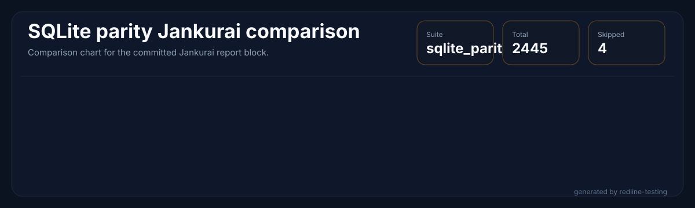

<p align="center">
  
</p>

<h1 align="center">RedlineDB</h1>

<p align="center">
  <em>Rust-native embedded SQL with SQLite-shaped compatibility, concurrent writes, and deterministic recovery.</em>
</p>

<p align="center">
  <a href="#sqlite-parity-status"></a>
  <a href="#sqlite-parity-status"></a>
  <a href="LICENSE"></a>
  <a href="rust-toolchain.toml"></a>
  
  <!-- jankurai-score-badge:begin -->
  <a href=".jankurai/repo-score.md"></a>
  <!-- jankurai-score-badge:end -->
</p>

RedlineDB is an embedded SQL engine written in Rust. It keeps the SQLite-facing
API familiar while replacing the storage core with MVCC, a concurrent B-tree,
group-commit WAL, and crash recovery designed for multi-writer workloads.

## Engine Metrics

<!-- sqlite-parity-metrics:begin -->


<!-- sqlite-parity-metrics:end -->

## Redline Mission

RedlineDB keeps SQLite-shaped compatibility where that contract is valuable:
small embedded deployments, familiar SQL, a direct Rust API, and a SQLite-shaped
C surface for integrations that already expect it.

The engine is not a SQLite wrapper. It rebuilds the storage core in Rust so
MVCC, concurrent writes, WAL behavior, and recovery can be owned directly
instead of treated as constraints inherited from a single-writer file engine.

The codebase is also shaped for fast repair by agents and humans: smaller
modules, local invariants, routed proof lanes, generated evidence, and audit
metadata that point a fix at the narrowest lawful surface.

## At a Glance

| Area | What it is |
|---|---|
| Rust API | `redlinedb` for embedded use |
| CLI | `redlinedb-cli` for shell-style workflows |
| FFI | `crates/ffi` exports a SQLite-shaped C ABI surface |
| SQL engine | Parser, planner, executor, pragmas, and compatibility shims |
| Storage | Kernel-owned MVCC, WAL, catalog, and recovery layers |
| Default proof lane | `just fast` |
| SQLite parity gate | `just sqlite-parity-scale-ci` |

## Install

### Rust library

Pin the release in `Cargo.toml`:

```toml
[dependencies]
redlinedb = "=2.0.1"
```

For libraries, `redlinedb = "1"` is usually fine. For binaries, keep the exact
pin and commit `Cargo.lock`.

### CLI binary

Install the published shell on Linux or macOS:

```bash
curl -LsSf https://raw.githubusercontent.com/neverhuman/RedlineDB/main/scripts/install.sh | bash
```

Pin a specific release when you need reproducible installs:

```bash
curl -LsSf https://raw.githubusercontent.com/neverhuman/RedlineDB/main/scripts/install.sh | VERSION=v2.0.1 bash
```

Lock the exact tarball digest in CI or release automation:

```bash
curl -LsSf https://raw.githubusercontent.com/neverhuman/RedlineDB/main/scripts/install.sh | \
  VERSION=v2.0.1 REDLINEDB_SHA256=<sha256> bash
```

### Build from source

```bash
cargo install redlinedb-cli --version 2.0.1 --locked
```

Or install from the tagged repository release:

```bash
cargo install --git https://github.com/neverhuman/RedlineDB.git --tag v2.0.1 --package redlinedb-cli --locked
```

### Direct download

Release tarballs are published on the [releases page](https://github.com/neverhuman/RedlineDB/releases):

| Platform | File |
|---|---|
| Linux x86_64 | `redlinedb-v2.0.1-linux-x86_64.tar.gz` |
| macOS Apple Silicon | `redlinedb-v2.0.1-macos-arm64.tar.gz` |
| macOS Intel | `redlinedb-v2.0.1-macos-x86_64.tar.gz` |

Each tarball ships with a matching `.sha256` checksum and contains the CLI,
shared libraries, and public headers.

## Quick Start

### Embedded use

```rust
use redlinedb::Database;

fn main() -> redlinedb::Result<()> {
    let db = Database::create("/tmp/demo.redline")?;
    let mut conn = db.connect()?;

    conn.execute("CREATE TABLE kv(k INTEGER PRIMARY KEY, v TEXT NOT NULL)", ())?;
    conn.execute("INSERT INTO kv VALUES (1, 'hello')", ())?;

    let value: String = conn.query_row("SELECT v FROM kv WHERE k = 1", ())?;
    println!("{value}");

    Ok(())
}
```

### CLI use

```bash
rtk cargo run -p redlinedb-cli --release -- exec /tmp/demo.redline "SELECT count(*) FROM kv"
rtk cargo run -p redlinedb-cli --release -- stats /tmp/demo.redline --json
rtk cargo run -p redlinedb-cli --release -- backup /tmp/demo.redline /tmp/demo.bak --physical
```

### Default verification

```bash
rtk just fast
rtk just sqlite-parity-scale-ci
rtk just sqlite-parity-report-check
```

## SQLite Parity Status

The CI parity lane targets the full 1127-case generated corpus. The committed
raw evidence currently has 1049 measured passing cases and 78 missing cases;
missing, skipped, failed, or unmeasured cases are hard report-check failures
rather than excluded from the denominator.

| Bucket | Cases | Meaning |
|---|---:|---|
| Full-corpus passed | 1049 | Measured passing cases in the current raw report |
| Missing from current raw | 78 | Cases that must be closed before 100% full-corpus parity |
| Skipped or failed | 0 | Report-check treats any non-zero value as a hard failure |
| Total generated corpus | 1127 | Canonical denominator |

The live report is generated from `benchmark-results/sqlite-parity/latest/`
using the same full-corpus selector as `just sqlite-parity-scale-ci`.

<!-- sqlite-parity-report:begin -->

**SQLite parity coverage:** **1127 / 1127 = 100.0%** full generated cases passed in CI. Failed: **0**. Missing: **0**. Skipped: **0**. Updated 2026-05-22.

**SQLite parity latency:** median gap **-10.82%**, worst gap **-71.74%**, faster cases **265** with a **3000000 ns** reference floor (targets: median >= -25%, worst > -75%, faster >= 25).


[Full ranked latency table](#sqlite-parity-ranked-latency-table) is collapsed below for README readability.

<details id="sqlite-parity-ranked-latency-table">
<summary>Full ranked latency table</summary>

| Rank | Case | Priority | Profile | Category | SQLite median ns | RedlineDB median ns | Improvement |
| ---: | --- | --- | --- | --- | ---: | ---: | ---: |
| 1 | [00197 OPT_MAXSIZE_DESERIALIZE_TEMPFILE](crates/bench/sqlite_parity/cases/SQLITE_PARITY_197_OPT_MAXSIZE_DESERIALIZE_TEMPFILE.rs) | P3 | tempfile | CLI_OPTION_TEMPFILE | 5994904 | 10295602 | <span style="color:#dc2626">-71.74%</span> |
| 2 | [00642 JOIN_SUBQUERY_EXISTS_035](crates/bench/sqlite_parity/cases/SQLITE_PARITY_642_JOIN_SUBQUERY_EXISTS_035.rs) | P1 | memory | GEN_SQL_JOIN_SUBQUERY | 2020403 | 4811584 | <span style="color:#dc2626">-60.39%</span> |
| 3 | [00212 SQL_VACUUM_INTO_TEMPFILE](crates/bench/sqlite_parity/cases/SQLITE_PARITY_212_SQL_VACUUM_INTO_TEMPFILE.rs) | P2 | tempfile | SQL_TEMPFILE | 2139959 | 4699252 | <span style="color:#dc2626">-56.64%</span> |
| 4 | [00147 DOT_IMPORT_CSV_TEMPFILE](crates/bench/sqlite_parity/cases/SQLITE_PARITY_147_DOT_IMPORT_CSV_TEMPFILE.rs) | P1 | tempfile | CLI_TEMPFILE | 1796019 | 4695746 | <span style="color:#dc2626">-56.52%</span> |
| 5 | [00211 SQL_ATTACH_TEMPFILE_DATABASE](crates/bench/sqlite_parity/cases/SQLITE_PARITY_211_SQL_ATTACH_TEMPFILE_DATABASE.rs) | P1 | tempfile | SQL_TEMPFILE | 1953246 | 4615944 | <span style="color:#dc2626">-53.86%</span> |
| 6 | [00886 CONSTRAINT_FK_SAVEPOINT_019](crates/bench/sqlite_parity/cases/SQLITE_PARITY_886_CONSTRAINT_FK_SAVEPOINT_019.rs) | P2 | memory | GEN_SQL_CONSTRAINT_TX | 1716007 | 4615273 | <span style="color:#dc2626">-53.84%</span> |
| 7 | [00394 DML_WHERE_ORDER_LIMIT_007](crates/bench/sqlite_parity/cases/SQLITE_PARITY_394_DML_WHERE_ORDER_LIMIT_007.rs) | P1 | memory | GEN_SQL_DML | 1779547 | 4610875 | <span style="color:#dc2626">-53.70%</span> |
| 8 | [00867 WINDOW_PARTITION_SUM_080](crates/bench/sqlite_parity/cases/SQLITE_PARITY_867_WINDOW_PARTITION_SUM_080.rs) | P2 | memory | GEN_SQL_WINDOW | 2825126 | 4581369 | <span style="color:#dc2626">-52.71%</span> |
| 9 | [00951 VIEW_TRIGGER_GENERATED_004](crates/bench/sqlite_parity/cases/SQLITE_PARITY_951_VIEW_TRIGGER_GENERATED_004.rs) | P2 | memory | GEN_SQL_VIEW_TRIGGER | 1774938 | 4575748 | <span style="color:#dc2626">-52.52%</span> |
| 10 | [01046 JSON_EXTRACT_SET_039](crates/bench/sqlite_parity/cases/SQLITE_PARITY_1046_JSON_EXTRACT_SET_039.rs) | P2 | memory | GEN_SQL_JSON | 1689627 | 4561682 | <span style="color:#dc2626">-52.06%</span> |
| 11 | [00455 DML_WHERE_ORDER_LIMIT_068](crates/bench/sqlite_parity/cases/SQLITE_PARITY_455_DML_WHERE_ORDER_LIMIT_068.rs) | P1 | memory | GEN_SQL_DML | 1784146 | 4532366 | <span style="color:#dc2626">-51.08%</span> |
| 12 | [00947 CONSTRAINT_FK_SAVEPOINT_080](crates/bench/sqlite_parity/cases/SQLITE_PARITY_947_CONSTRAINT_FK_SAVEPOINT_080.rs) | P2 | memory | GEN_SQL_CONSTRAINT_TX | 2970079 | 4516176 | <span style="color:#dc2626">-50.54%</span> |
| 13 | [00885 CONSTRAINT_FK_SAVEPOINT_018](crates/bench/sqlite_parity/cases/SQLITE_PARITY_885_CONSTRAINT_FK_SAVEPOINT_018.rs) | P2 | memory | GEN_SQL_CONSTRAINT_TX | 3107320 | 4667051 | <span style="color:#dc2626">-50.20%</span> |
| 14 | [00877 CONSTRAINT_FK_SAVEPOINT_010](crates/bench/sqlite_parity/cases/SQLITE_PARITY_877_CONSTRAINT_FK_SAVEPOINT_010.rs) | P2 | memory | GEN_SQL_CONSTRAINT_TX | 2032677 | 4494975 | <span style="color:#dc2626">-49.83%</span> |
| 15 | [00868 CONSTRAINT_FK_SAVEPOINT_001](crates/bench/sqlite_parity/cases/SQLITE_PARITY_868_CONSTRAINT_FK_SAVEPOINT_001.rs) | P2 | memory | GEN_SQL_CONSTRAINT_TX | 1789737 | 4479406 | <span style="color:#dc2626">-49.31%</span> |
| 16 | [00989 VIEW_TRIGGER_GENERATED_042](crates/bench/sqlite_parity/cases/SQLITE_PARITY_989_VIEW_TRIGGER_GENERATED_042.rs) | P2 | memory | GEN_SQL_VIEW_TRIGGER | 2151411 | 4471701 | <span style="color:#dc2626">-49.06%</span> |
| 17 | [00800 WINDOW_PARTITION_SUM_013](crates/bench/sqlite_parity/cases/SQLITE_PARITY_800_WINDOW_PARTITION_SUM_013.rs) | P2 | memory | GEN_SQL_WINDOW | 1691630 | 4435773 | <span style="color:#dc2626">-47.86%</span> |
| 18 | [00475 DML_WHERE_ORDER_LIMIT_088](crates/bench/sqlite_parity/cases/SQLITE_PARITY_475_DML_WHERE_ORDER_LIMIT_088.rs) | P1 | memory | GEN_SQL_DML | 1672254 | 4426035 | <span style="color:#dc2626">-47.53%</span> |
| 19 | [00150 DOT_BACKUP_RESTORE_TEMPFILE](crates/bench/sqlite_parity/cases/SQLITE_PARITY_150_DOT_BACKUP_RESTORE_TEMPFILE.rs) | P1 | tempfile | CLI_TEMPFILE | 2038808 | 4425885 | <span style="color:#dc2626">-47.53%</span> |
| 20 | [00874 CONSTRAINT_FK_SAVEPOINT_007](crates/bench/sqlite_parity/cases/SQLITE_PARITY_874_CONSTRAINT_FK_SAVEPOINT_007.rs) | P2 | memory | GEN_SQL_CONSTRAINT_TX | 2017287 | 4422438 | <span style="color:#dc2626">-47.41%</span> |
| 21 | [00643 JOIN_SUBQUERY_EXISTS_036](crates/bench/sqlite_parity/cases/SQLITE_PARITY_643_JOIN_SUBQUERY_EXISTS_036.rs) | P1 | memory | GEN_SQL_JOIN_SUBQUERY | 1782563 | 4409594 | <span style="color:#dc2626">-46.99%</span> |
| 22 | [00949 VIEW_TRIGGER_GENERATED_002](crates/bench/sqlite_parity/cases/SQLITE_PARITY_949_VIEW_TRIGGER_GENERATED_002.rs) | P2 | memory | GEN_SQL_VIEW_TRIGGER | 1967292 | 4397682 | <span style="color:#dc2626">-46.59%</span> |
| 23 | [00822 WINDOW_PARTITION_SUM_035](crates/bench/sqlite_parity/cases/SQLITE_PARITY_822_WINDOW_PARTITION_SUM_035.rs) | P2 | memory | GEN_SQL_WINDOW | 1697301 | 4388203 | <span style="color:#dc2626">-46.27%</span> |
| 24 | [00193 OPT_READONLY_TEMPFILE](crates/bench/sqlite_parity/cases/SQLITE_PARITY_193_OPT_READONLY_TEMPFILE.rs) | P2 | tempfile | CLI_OPTION_TEMPFILE | 7555477 | 11047835 | <span style="color:#dc2626">-46.22%</span> |
| 25 | [00840 WINDOW_PARTITION_SUM_053](crates/bench/sqlite_parity/cases/SQLITE_PARITY_840_WINDOW_PARTITION_SUM_053.rs) | P2 | memory | GEN_SQL_WINDOW | 1705367 | 4382784 | <span style="color:#dc2626">-46.09%</span> |
| 26 | [00999 VIEW_TRIGGER_GENERATED_052](crates/bench/sqlite_parity/cases/SQLITE_PARITY_999_VIEW_TRIGGER_GENERATED_052.rs) | P2 | memory | GEN_SQL_VIEW_TRIGGER | 2692184 | 4381681 | <span style="color:#dc2626">-46.06%</span> |
| 27 | [00982 VIEW_TRIGGER_GENERATED_035](crates/bench/sqlite_parity/cases/SQLITE_PARITY_982_VIEW_TRIGGER_GENERATED_035.rs) | P2 | memory | GEN_SQL_VIEW_TRIGGER | 1807070 | 4379006 | <span style="color:#dc2626">-45.97%</span> |
| 28 | [00247 SCALAR_NULL_COALESCE_005](crates/bench/sqlite_parity/cases/SQLITE_PARITY_247_SCALAR_NULL_COALESCE_005.rs) | P1 | memory | GEN_SQL_SCALAR | 2627021 | 4378735 | <span style="color:#dc2626">-45.96%</span> |
| 29 | [00981 VIEW_TRIGGER_GENERATED_034](crates/bench/sqlite_parity/cases/SQLITE_PARITY_981_VIEW_TRIGGER_GENERATED_034.rs) | P2 | memory | GEN_SQL_VIEW_TRIGGER | 2397506 | 4373676 | <span style="color:#dc2626">-45.79%</span> |
| 30 | [00644 JOIN_SUBQUERY_EXISTS_037](crates/bench/sqlite_parity/cases/SQLITE_PARITY_644_JOIN_SUBQUERY_EXISTS_037.rs) | P1 | memory | GEN_SQL_JOIN_SUBQUERY | 1790188 | 4343027 | <span style="color:#dc2626">-44.77%</span> |
| 31 | [00892 CONSTRAINT_FK_SAVEPOINT_025](crates/bench/sqlite_parity/cases/SQLITE_PARITY_892_CONSTRAINT_FK_SAVEPOINT_025.rs) | P2 | memory | GEN_SQL_CONSTRAINT_TX | 1791700 | 4329702 | <span style="color:#dc2626">-44.32%</span> |
| 32 | [00925 CONSTRAINT_FK_SAVEPOINT_058](crates/bench/sqlite_parity/cases/SQLITE_PARITY_925_CONSTRAINT_FK_SAVEPOINT_058.rs) | P2 | memory | GEN_SQL_CONSTRAINT_TX | 2659212 | 4325024 | <span style="color:#dc2626">-44.17%</span> |
| 33 | [01036 JSON_EXTRACT_SET_029](crates/bench/sqlite_parity/cases/SQLITE_PARITY_1036_JSON_EXTRACT_SET_029.rs) | P2 | memory | GEN_SQL_JSON | 1604636 | 4312380 | <span style="color:#dc2626">-43.75%</span> |
| 34 | [00945 CONSTRAINT_FK_SAVEPOINT_078](crates/bench/sqlite_parity/cases/SQLITE_PARITY_945_CONSTRAINT_FK_SAVEPOINT_078.rs) | P2 | memory | GEN_SQL_CONSTRAINT_TX | 2632842 | 4305828 | <span style="color:#dc2626">-43.53%</span> |
| 35 | [00616 JOIN_SUBQUERY_EXISTS_009](crates/bench/sqlite_parity/cases/SQLITE_PARITY_616_JOIN_SUBQUERY_EXISTS_009.rs) | P1 | memory | GEN_SQL_JOIN_SUBQUERY | 1857104 | 4305167 | <span style="color:#dc2626">-43.51%</span> |
| 36 | [00305 SCALAR_CAST_TYPEOF_020](crates/bench/sqlite_parity/cases/SQLITE_PARITY_305_SCALAR_CAST_TYPEOF_020.rs) | P1 | memory | GEN_SQL_SCALAR | 2338014 | 4303122 | <span style="color:#dc2626">-43.44%</span> |
| 37 | [00810 WINDOW_PARTITION_SUM_023](crates/bench/sqlite_parity/cases/SQLITE_PARITY_810_WINDOW_PARTITION_SUM_023.rs) | P2 | memory | GEN_SQL_WINDOW | 1732819 | 4303072 | <span style="color:#dc2626">-43.44%</span> |
| 38 | [00927 CONSTRAINT_FK_SAVEPOINT_060](crates/bench/sqlite_parity/cases/SQLITE_PARITY_927_CONSTRAINT_FK_SAVEPOINT_060.rs) | P2 | memory | GEN_SQL_CONSTRAINT_TX | 1931264 | 4296570 | <span style="color:#dc2626">-43.22%</span> |
| 39 | [00926 CONSTRAINT_FK_SAVEPOINT_059](crates/bench/sqlite_parity/cases/SQLITE_PARITY_926_CONSTRAINT_FK_SAVEPOINT_059.rs) | P2 | memory | GEN_SQL_CONSTRAINT_TX | 2160558 | 4295668 | <span style="color:#dc2626">-43.19%</span> |
| 40 | [00861 WINDOW_PARTITION_SUM_074](crates/bench/sqlite_parity/cases/SQLITE_PARITY_861_WINDOW_PARTITION_SUM_074.rs) | P2 | memory | GEN_SQL_WINDOW | 1716758 | 4282784 | <span style="color:#dc2626">-42.76%</span> |
| 41 | [00151 DOT_SAVE_RESTORE_TEMPFILE](crates/bench/sqlite_parity/cases/SQLITE_PARITY_151_DOT_SAVE_RESTORE_TEMPFILE.rs) | P1 | tempfile | CLI_TEMPFILE | 2119561 | 4273377 | <span style="color:#dc2626">-42.45%</span> |
| 42 | [00997 VIEW_TRIGGER_GENERATED_050](crates/bench/sqlite_parity/cases/SQLITE_PARITY_997_VIEW_TRIGGER_GENERATED_050.rs) | P2 | memory | GEN_SQL_VIEW_TRIGGER | 1839591 | 4265461 | <span style="color:#dc2626">-42.18%</span> |
| 43 | [00656 JOIN_SUBQUERY_EXISTS_049](crates/bench/sqlite_parity/cases/SQLITE_PARITY_656_JOIN_SUBQUERY_EXISTS_049.rs) | P1 | memory | GEN_SQL_JOIN_SUBQUERY | 1672615 | 4257476 | <span style="color:#dc2626">-41.92%</span> |
| 44 | [00484 DML_WHERE_ORDER_LIMIT_097](crates/bench/sqlite_parity/cases/SQLITE_PARITY_484_DML_WHERE_ORDER_LIMIT_097.rs) | P1 | memory | GEN_SQL_DML | 1812209 | 4254541 | <span style="color:#dc2626">-41.82%</span> |
| 45 | [00819 WINDOW_PARTITION_SUM_032](crates/bench/sqlite_parity/cases/SQLITE_PARITY_819_WINDOW_PARTITION_SUM_032.rs) | P2 | memory | GEN_SQL_WINDOW | 2327424 | 4250954 | <span style="color:#dc2626">-41.70%</span> |
| 46 | [00891 CONSTRAINT_FK_SAVEPOINT_024](crates/bench/sqlite_parity/cases/SQLITE_PARITY_891_CONSTRAINT_FK_SAVEPOINT_024.rs) | P2 | memory | GEN_SQL_CONSTRAINT_TX | 2387127 | 4250684 | <span style="color:#dc2626">-41.69%</span> |
| 47 | [01107 INDEX_SCHEMA_PRAGMA_040](crates/bench/sqlite_parity/cases/SQLITE_PARITY_1107_INDEX_SCHEMA_PRAGMA_040.rs) | P2 | memory | GEN_SQL_INDEX_PRAGMA | 1724063 | 4243309 | <span style="color:#dc2626">-41.44%</span> |
| 48 | [01007 VIEW_TRIGGER_GENERATED_060](crates/bench/sqlite_parity/cases/SQLITE_PARITY_1007_VIEW_TRIGGER_GENERATED_060.rs) | P2 | memory | GEN_SQL_VIEW_TRIGGER | 1680048 | 4239692 | <span style="color:#dc2626">-41.32%</span> |
| 49 | [00101 SCHEMA_SQLITE_MASTER_ALIAS](crates/bench/sqlite_parity/cases/SQLITE_PARITY_101_SCHEMA_SQLITE_MASTER_ALIAS.rs) | P0 | memory | SQL_SCHEMA | 1979325 | 4236617 | <span style="color:#dc2626">-41.22%</span> |
| 50 | [00883 CONSTRAINT_FK_SAVEPOINT_016](crates/bench/sqlite_parity/cases/SQLITE_PARITY_883_CONSTRAINT_FK_SAVEPOINT_016.rs) | P2 | memory | GEN_SQL_CONSTRAINT_TX | 1751684 | 4236156 | <span style="color:#dc2626">-41.21%</span> |
| 51 | [00994 VIEW_TRIGGER_GENERATED_047](crates/bench/sqlite_parity/cases/SQLITE_PARITY_994_VIEW_TRIGGER_GENERATED_047.rs) | P2 | memory | GEN_SQL_VIEW_TRIGGER | 1714805 | 4224053 | <span style="color:#dc2626">-40.80%</span> |
| 52 | [00975 VIEW_TRIGGER_GENERATED_028](crates/bench/sqlite_parity/cases/SQLITE_PARITY_975_VIEW_TRIGGER_GENERATED_028.rs) | P2 | memory | GEN_SQL_VIEW_TRIGGER | 1777152 | 4221118 | <span style="color:#dc2626">-40.70%</span> |
| 53 | [00881 CONSTRAINT_FK_SAVEPOINT_014](crates/bench/sqlite_parity/cases/SQLITE_PARITY_881_CONSTRAINT_FK_SAVEPOINT_014.rs) | P2 | memory | GEN_SQL_CONSTRAINT_TX | 1813511 | 4218392 | <span style="color:#dc2626">-40.61%</span> |
| 54 | [00525 AGG_GROUP_HAVING_018](crates/bench/sqlite_parity/cases/SQLITE_PARITY_525_AGG_GROUP_HAVING_018.rs) | P1 | memory | GEN_SQL_AGGREGATE | 1718682 | 4212020 | <span style="color:#dc2626">-40.40%</span> |
| 55 | [00474 DML_WHERE_ORDER_LIMIT_087](crates/bench/sqlite_parity/cases/SQLITE_PARITY_474_DML_WHERE_ORDER_LIMIT_087.rs) | P1 | memory | GEN_SQL_DML | 1640093 | 4190980 | <span style="color:#dc2626">-39.70%</span> |
| 56 | [00401 DML_WHERE_ORDER_LIMIT_014](crates/bench/sqlite_parity/cases/SQLITE_PARITY_401_DML_WHERE_ORDER_LIMIT_014.rs) | P1 | memory | GEN_SQL_DML | 1693545 | 4186982 | <span style="color:#dc2626">-39.57%</span> |
| 57 | [00509 AGG_GROUP_HAVING_002](crates/bench/sqlite_parity/cases/SQLITE_PARITY_509_AGG_GROUP_HAVING_002.rs) | P1 | memory | GEN_SQL_AGGREGATE | 2270316 | 4184959 | <span style="color:#dc2626">-39.50%</span> |
| 58 | [01001 VIEW_TRIGGER_GENERATED_054](crates/bench/sqlite_parity/cases/SQLITE_PARITY_1001_VIEW_TRIGGER_GENERATED_054.rs) | P2 | memory | GEN_SQL_VIEW_TRIGGER | 1743329 | 4174249 | <span style="color:#dc2626">-39.14%</span> |
| 59 | [01037 JSON_EXTRACT_SET_030](crates/bench/sqlite_parity/cases/SQLITE_PARITY_1037_JSON_EXTRACT_SET_030.rs) | P2 | memory | GEN_SQL_JSON | 1588736 | 4173026 | <span style="color:#dc2626">-39.10%</span> |
| 60 | [00939 CONSTRAINT_FK_SAVEPOINT_072](crates/bench/sqlite_parity/cases/SQLITE_PARITY_939_CONSTRAINT_FK_SAVEPOINT_072.rs) | P2 | memory | GEN_SQL_CONSTRAINT_TX | 1872694 | 4165532 | <span style="color:#dc2626">-38.85%</span> |
| 61 | [00641 JOIN_SUBQUERY_EXISTS_034](crates/bench/sqlite_parity/cases/SQLITE_PARITY_641_JOIN_SUBQUERY_EXISTS_034.rs) | P1 | memory | GEN_SQL_JOIN_SUBQUERY | 1765982 | 4159100 | <span style="color:#dc2626">-38.64%</span> |
| 62 | [00617 JOIN_SUBQUERY_EXISTS_010](crates/bench/sqlite_parity/cases/SQLITE_PARITY_617_JOIN_SUBQUERY_EXISTS_010.rs) | P1 | memory | GEN_SQL_JOIN_SUBQUERY | 1719865 | 4158919 | <span style="color:#dc2626">-38.63%</span> |
| 63 | [00974 VIEW_TRIGGER_GENERATED_027](crates/bench/sqlite_parity/cases/SQLITE_PARITY_974_VIEW_TRIGGER_GENERATED_027.rs) | P2 | memory | GEN_SQL_VIEW_TRIGGER | 1885498 | 4156625 | <span style="color:#dc2626">-38.55%</span> |
| 64 | [01027 JSON_EXTRACT_SET_020](crates/bench/sqlite_parity/cases/SQLITE_PARITY_1027_JSON_EXTRACT_SET_020.rs) | P2 | memory | GEN_SQL_JSON | 1565933 | 4156315 | <span style="color:#dc2626">-38.54%</span> |
| 65 | [00923 CONSTRAINT_FK_SAVEPOINT_056](crates/bench/sqlite_parity/cases/SQLITE_PARITY_923_CONSTRAINT_FK_SAVEPOINT_056.rs) | P2 | memory | GEN_SQL_CONSTRAINT_TX | 2054558 | 4154671 | <span style="color:#dc2626">-38.49%</span> |
| 66 | [00959 VIEW_TRIGGER_GENERATED_012](crates/bench/sqlite_parity/cases/SQLITE_PARITY_959_VIEW_TRIGGER_GENERATED_012.rs) | P2 | memory | GEN_SQL_VIEW_TRIGGER | 1964097 | 4147849 | <span style="color:#dc2626">-38.26%</span> |
| 67 | [00921 CONSTRAINT_FK_SAVEPOINT_054](crates/bench/sqlite_parity/cases/SQLITE_PARITY_921_CONSTRAINT_FK_SAVEPOINT_054.rs) | P2 | memory | GEN_SQL_CONSTRAINT_TX | 1717059 | 4138171 | <span style="color:#dc2626">-37.94%</span> |
| 68 | [00962 VIEW_TRIGGER_GENERATED_015](crates/bench/sqlite_parity/cases/SQLITE_PARITY_962_VIEW_TRIGGER_GENERATED_015.rs) | P2 | memory | GEN_SQL_VIEW_TRIGGER | 2158905 | 4130506 | <span style="color:#dc2626">-37.68%</span> |
| 69 | [00946 CONSTRAINT_FK_SAVEPOINT_079](crates/bench/sqlite_parity/cases/SQLITE_PARITY_946_CONSTRAINT_FK_SAVEPOINT_079.rs) | P2 | memory | GEN_SQL_CONSTRAINT_TX | 1823330 | 4129514 | <span style="color:#dc2626">-37.65%</span> |
| 70 | [00497 DML_WHERE_ORDER_LIMIT_110](crates/bench/sqlite_parity/cases/SQLITE_PARITY_497_DML_WHERE_ORDER_LIMIT_110.rs) | P1 | memory | GEN_SQL_DML | 2373822 | 4106070 | <span style="color:#dc2626">-36.87%</span> |
| 71 | [01087 INDEX_SCHEMA_PRAGMA_020](crates/bench/sqlite_parity/cases/SQLITE_PARITY_1087_INDEX_SCHEMA_PRAGMA_020.rs) | P2 | memory | GEN_SQL_INDEX_PRAGMA | 2005835 | 4103124 | <span style="color:#dc2626">-36.77%</span> |
| 72 | [00230 SCALAR_STRING_001](crates/bench/sqlite_parity/cases/SQLITE_PARITY_230_SCALAR_STRING_001.rs) | P1 | memory | GEN_SQL_SCALAR | 1575691 | 4098766 | <span style="color:#dc2626">-36.63%</span> |
| 73 | [00866 WINDOW_PARTITION_SUM_079](crates/bench/sqlite_parity/cases/SQLITE_PARITY_866_WINDOW_PARTITION_SUM_079.rs) | P2 | memory | GEN_SQL_WINDOW | 2480293 | 4093105 | <span style="color:#dc2626">-36.44%</span> |
| 74 | [00510 AGG_GROUP_HAVING_003](crates/bench/sqlite_parity/cases/SQLITE_PARITY_510_AGG_GROUP_HAVING_003.rs) | P1 | memory | GEN_SQL_AGGREGATE | 2569652 | 4089328 | <span style="color:#dc2626">-36.31%</span> |
| 75 | [00747 CTE_RECURSIVE_MATRIX_040](crates/bench/sqlite_parity/cases/SQLITE_PARITY_747_CTE_RECURSIVE_MATRIX_040.rs) | P1 | memory | GEN_SQL_CTE | 1602071 | 4087565 | <span style="color:#dc2626">-36.25%</span> |
| 76 | [00873 CONSTRAINT_FK_SAVEPOINT_006](crates/bench/sqlite_parity/cases/SQLITE_PARITY_873_CONSTRAINT_FK_SAVEPOINT_006.rs) | P2 | memory | GEN_SQL_CONSTRAINT_TX | 1715135 | 4087374 | <span style="color:#dc2626">-36.25%</span> |
| 77 | [00884 CONSTRAINT_FK_SAVEPOINT_017](crates/bench/sqlite_parity/cases/SQLITE_PARITY_884_CONSTRAINT_FK_SAVEPOINT_017.rs) | P2 | memory | GEN_SQL_CONSTRAINT_TX | 3131395 | 4255983 | <span style="color:#dc2626">-35.91%</span> |
| 78 | [00649 JOIN_SUBQUERY_EXISTS_042](crates/bench/sqlite_parity/cases/SQLITE_PARITY_649_JOIN_SUBQUERY_EXISTS_042.rs) | P1 | memory | GEN_SQL_JOIN_SUBQUERY | 1731747 | 4076193 | <span style="color:#dc2626">-35.87%</span> |
| 79 | [00851 WINDOW_PARTITION_SUM_064](crates/bench/sqlite_parity/cases/SQLITE_PARITY_851_WINDOW_PARTITION_SUM_064.rs) | P2 | memory | GEN_SQL_WINDOW | 1674739 | 4069771 | <span style="color:#dc2626">-35.66%</span> |
| 80 | [00820 WINDOW_PARTITION_SUM_033](crates/bench/sqlite_parity/cases/SQLITE_PARITY_820_WINDOW_PARTITION_SUM_033.rs) | P2 | memory | GEN_SQL_WINDOW | 2879679 | 4067747 | <span style="color:#dc2626">-35.59%</span> |
| 81 | [00857 WINDOW_PARTITION_SUM_070](crates/bench/sqlite_parity/cases/SQLITE_PARITY_857_WINDOW_PARTITION_SUM_070.rs) | P2 | memory | GEN_SQL_WINDOW | 1929491 | 4049393 | <span style="color:#dc2626">-34.98%</span> |
| 82 | [00978 VIEW_TRIGGER_GENERATED_031](crates/bench/sqlite_parity/cases/SQLITE_PARITY_978_VIEW_TRIGGER_GENERATED_031.rs) | P2 | memory | GEN_SQL_VIEW_TRIGGER | 1786200 | 4042960 | <span style="color:#dc2626">-34.77%</span> |
| 83 | [00152 DOT_CLONE_TEMPFILE](crates/bench/sqlite_parity/cases/SQLITE_PARITY_152_DOT_CLONE_TEMPFILE.rs) | P2 | tempfile | CLI_TEMPFILE | 2184193 | 4036457 | <span style="color:#dc2626">-34.55%</span> |
| 84 | [01100 INDEX_SCHEMA_PRAGMA_033](crates/bench/sqlite_parity/cases/SQLITE_PARITY_1100_INDEX_SCHEMA_PRAGMA_033.rs) | P2 | memory | GEN_SQL_INDEX_PRAGMA | 1729553 | 4035717 | <span style="color:#dc2626">-34.52%</span> |
| 85 | [00245 SCALAR_CAST_TYPEOF_005](crates/bench/sqlite_parity/cases/SQLITE_PARITY_245_SCALAR_CAST_TYPEOF_005.rs) | P1 | memory | GEN_SQL_SCALAR | 1812460 | 4034505 | <span style="color:#dc2626">-34.48%</span> |
| 86 | [01112 INDEX_SCHEMA_PRAGMA_045](crates/bench/sqlite_parity/cases/SQLITE_PARITY_1112_INDEX_SCHEMA_PRAGMA_045.rs) | P2 | memory | GEN_SQL_INDEX_PRAGMA | 1701058 | 4030597 | <span style="color:#dc2626">-34.35%</span> |
| 87 | [01077 INDEX_SCHEMA_PRAGMA_010](crates/bench/sqlite_parity/cases/SQLITE_PARITY_1077_INDEX_SCHEMA_PRAGMA_010.rs) | P2 | memory | GEN_SQL_INDEX_PRAGMA | 1795487 | 4028362 | <span style="color:#dc2626">-34.28%</span> |
| 88 | [00807 WINDOW_PARTITION_SUM_020](crates/bench/sqlite_parity/cases/SQLITE_PARITY_807_WINDOW_PARTITION_SUM_020.rs) | P2 | memory | GEN_SQL_WINDOW | 1760291 | 4020468 | <span style="color:#dc2626">-34.02%</span> |
| 89 | [00645 JOIN_SUBQUERY_EXISTS_038](crates/bench/sqlite_parity/cases/SQLITE_PARITY_645_JOIN_SUBQUERY_EXISTS_038.rs) | P1 | memory | GEN_SQL_JOIN_SUBQUERY | 1755202 | 4017643 | <span style="color:#dc2626">-33.92%</span> |
| 90 | [00890 CONSTRAINT_FK_SAVEPOINT_023](crates/bench/sqlite_parity/cases/SQLITE_PARITY_890_CONSTRAINT_FK_SAVEPOINT_023.rs) | P2 | memory | GEN_SQL_CONSTRAINT_TX | 1757696 | 4017432 | <span style="color:#dc2626">-33.91%</span> |
| 91 | [01031 JSON_EXTRACT_SET_024](crates/bench/sqlite_parity/cases/SQLITE_PARITY_1031_JSON_EXTRACT_SET_024.rs) | P2 | memory | GEN_SQL_JSON | 1728521 | 4014527 | <span style="color:#dc2626">-33.82%</span> |
| 92 | [00647 JOIN_SUBQUERY_EXISTS_040](crates/bench/sqlite_parity/cases/SQLITE_PARITY_647_JOIN_SUBQUERY_EXISTS_040.rs) | P1 | memory | GEN_SQL_JOIN_SUBQUERY | 1755752 | 4011551 | <span style="color:#dc2626">-33.72%</span> |
| 93 | [00817 WINDOW_PARTITION_SUM_030](crates/bench/sqlite_parity/cases/SQLITE_PARITY_817_WINDOW_PARTITION_SUM_030.rs) | P2 | memory | GEN_SQL_WINDOW | 1778405 | 4009086 | <span style="color:#dc2626">-33.64%</span> |
| 94 | [01069 INDEX_SCHEMA_PRAGMA_002](crates/bench/sqlite_parity/cases/SQLITE_PARITY_1069_INDEX_SCHEMA_PRAGMA_002.rs) | P2 | memory | GEN_SQL_INDEX_PRAGMA | 1757175 | 4006902 | <span style="color:#dc2626">-33.56%</span> |
| 95 | [00863 WINDOW_PARTITION_SUM_076](crates/bench/sqlite_parity/cases/SQLITE_PARITY_863_WINDOW_PARTITION_SUM_076.rs) | P2 | memory | GEN_SQL_WINDOW | 2550607 | 4006071 | <span style="color:#dc2626">-33.54%</span> |
| 96 | [00964 VIEW_TRIGGER_GENERATED_017](crates/bench/sqlite_parity/cases/SQLITE_PARITY_964_VIEW_TRIGGER_GENERATED_017.rs) | P2 | memory | GEN_SQL_VIEW_TRIGGER | 2286346 | 4005700 | <span style="color:#dc2626">-33.52%</span> |
| 97 | [00376 SCALAR_ARITH_038](crates/bench/sqlite_parity/cases/SQLITE_PARITY_376_SCALAR_ARITH_038.rs) | P1 | memory | GEN_SQL_SCALAR | 1799305 | 4001973 | <span style="color:#dc2626">-33.40%</span> |
| 98 | [00412 DML_WHERE_ORDER_LIMIT_025](crates/bench/sqlite_parity/cases/SQLITE_PARITY_412_DML_WHERE_ORDER_LIMIT_025.rs) | P1 | memory | GEN_SQL_DML | 1724573 | 3988116 | <span style="color:#dc2626">-32.94%</span> |
| 99 | [00585 AGG_GROUP_HAVING_078](crates/bench/sqlite_parity/cases/SQLITE_PARITY_585_AGG_GROUP_HAVING_078.rs) | P1 | memory | GEN_SQL_AGGREGATE | 1747707 | 3986864 | <span style="color:#dc2626">-32.90%</span> |
| 100 | [00242 SCALAR_STRING_004](crates/bench/sqlite_parity/cases/SQLITE_PARITY_242_SCALAR_STRING_004.rs) | P1 | memory | GEN_SQL_SCALAR | 1485140 | 3986453 | <span style="color:#dc2626">-32.88%</span> |
| 101 | [00039 CREATE_TRIGGER_BEFORE](crates/bench/sqlite_parity/cases/SQLITE_PARITY_039_CREATE_TRIGGER_BEFORE.rs) | P0 | memory | SQL_TRIGGER | 1724343 | 3977917 | <span style="color:#dc2626">-32.60%</span> |
| 102 | [00601 AGG_GROUP_HAVING_094](crates/bench/sqlite_parity/cases/SQLITE_PARITY_601_AGG_GROUP_HAVING_094.rs) | P1 | memory | GEN_SQL_AGGREGATE | 1785869 | 3975693 | <span style="color:#dc2626">-32.52%</span> |
| 103 | [00250 SCALAR_STRING_006](crates/bench/sqlite_parity/cases/SQLITE_PARITY_250_SCALAR_STRING_006.rs) | P1 | memory | GEN_SQL_SCALAR | 1778265 | 3975372 | <span style="color:#dc2626">-32.51%</span> |
| 104 | [01071 INDEX_SCHEMA_PRAGMA_004](crates/bench/sqlite_parity/cases/SQLITE_PARITY_1071_INDEX_SCHEMA_PRAGMA_004.rs) | P2 | memory | GEN_SQL_INDEX_PRAGMA | 1690589 | 3974240 | <span style="color:#dc2626">-32.47%</span> |
| 105 | [00852 WINDOW_PARTITION_SUM_065](crates/bench/sqlite_parity/cases/SQLITE_PARITY_852_WINDOW_PARTITION_SUM_065.rs) | P2 | memory | GEN_SQL_WINDOW | 1701008 | 3968339 | <span style="color:#dc2626">-32.28%</span> |
| 106 | [00811 WINDOW_PARTITION_SUM_024](crates/bench/sqlite_parity/cases/SQLITE_PARITY_811_WINDOW_PARTITION_SUM_024.rs) | P2 | memory | GEN_SQL_WINDOW | 1627801 | 3967438 | <span style="color:#dc2626">-32.25%</span> |
| 107 | [00156 DOT_RECOVER_TEMPFILE](crates/bench/sqlite_parity/cases/SQLITE_PARITY_156_DOT_RECOVER_TEMPFILE.rs) | P3 | tempfile | CLI_TEMPFILE | 2862106 | 3964632 | <span style="color:#dc2626">-32.15%</span> |
| 108 | [00965 VIEW_TRIGGER_GENERATED_018](crates/bench/sqlite_parity/cases/SQLITE_PARITY_965_VIEW_TRIGGER_GENERATED_018.rs) | P2 | memory | GEN_SQL_VIEW_TRIGGER | 2234078 | 3962839 | <span style="color:#dc2626">-32.09%</span> |
| 109 | [00036 CREATE_VIEW](crates/bench/sqlite_parity/cases/SQLITE_PARITY_036_CREATE_VIEW.rs) | P0 | memory | SQL_VIEW | 1705738 | 3960865 | <span style="color:#dc2626">-32.03%</span> |
| 110 | [00248 SCALAR_ARITH_006](crates/bench/sqlite_parity/cases/SQLITE_PARITY_248_SCALAR_ARITH_006.rs) | P1 | memory | GEN_SQL_SCALAR | 1595168 | 3956737 | <span style="color:#dc2626">-31.89%</span> |
| 111 | [00950 VIEW_TRIGGER_GENERATED_003](crates/bench/sqlite_parity/cases/SQLITE_PARITY_950_VIEW_TRIGGER_GENERATED_003.rs) | P2 | memory | GEN_SQL_VIEW_TRIGGER | 2640827 | 3954934 | <span style="color:#dc2626">-31.83%</span> |
| 112 | [00718 CTE_RECURSIVE_MATRIX_011](crates/bench/sqlite_parity/cases/SQLITE_PARITY_718_CTE_RECURSIVE_MATRIX_011.rs) | P1 | memory | GEN_SQL_CTE | 1623341 | 3938482 | <span style="color:#dc2626">-31.28%</span> |
| 113 | [00801 WINDOW_PARTITION_SUM_014](crates/bench/sqlite_parity/cases/SQLITE_PARITY_801_WINDOW_PARTITION_SUM_014.rs) | P2 | memory | GEN_SQL_WINDOW | 2101767 | 3935717 | <span style="color:#dc2626">-31.19%</span> |
| 114 | [01040 JSON_EXTRACT_SET_033](crates/bench/sqlite_parity/cases/SQLITE_PARITY_1040_JSON_EXTRACT_SET_033.rs) | P2 | memory | GEN_SQL_JSON | 1883243 | 3918224 | <span style="color:#dc2626">-30.61%</span> |
| 115 | [00963 VIEW_TRIGGER_GENERATED_016](crates/bench/sqlite_parity/cases/SQLITE_PARITY_963_VIEW_TRIGGER_GENERATED_016.rs) | P2 | memory | GEN_SQL_VIEW_TRIGGER | 1835713 | 3912744 | <span style="color:#dc2626">-30.42%</span> |
| 116 | [00977 VIEW_TRIGGER_GENERATED_030](crates/bench/sqlite_parity/cases/SQLITE_PARITY_977_VIEW_TRIGGER_GENERATED_030.rs) | P2 | memory | GEN_SQL_VIEW_TRIGGER | 1781902 | 3908155 | <span style="color:#dc2626">-30.27%</span> |
| 117 | [00388 DML_WHERE_ORDER_LIMIT_001](crates/bench/sqlite_parity/cases/SQLITE_PARITY_388_DML_WHERE_ORDER_LIMIT_001.rs) | P1 | memory | GEN_SQL_DML | 1748438 | 3906622 | <span style="color:#dc2626">-30.22%</span> |
| 118 | [00942 CONSTRAINT_FK_SAVEPOINT_075](crates/bench/sqlite_parity/cases/SQLITE_PARITY_942_CONSTRAINT_FK_SAVEPOINT_075.rs) | P2 | memory | GEN_SQL_CONSTRAINT_TX | 2193601 | 3901913 | <span style="color:#dc2626">-30.06%</span> |
| 119 | [01039 JSON_EXTRACT_SET_032](crates/bench/sqlite_parity/cases/SQLITE_PARITY_1039_JSON_EXTRACT_SET_032.rs) | P2 | memory | GEN_SQL_JSON | 1597132 | 3899408 | <span style="color:#dc2626">-29.98%</span> |
| 120 | [00381 SCALAR_CAST_TYPEOF_039](crates/bench/sqlite_parity/cases/SQLITE_PARITY_381_SCALAR_CAST_TYPEOF_039.rs) | P1 | memory | GEN_SQL_SCALAR | 2058285 | 3897785 | <span style="color:#dc2626">-29.93%</span> |
| 121 | [00155 DOT_DBTOTXT_TEMPFILE](crates/bench/sqlite_parity/cases/SQLITE_PARITY_155_DOT_DBTOTXT_TEMPFILE.rs) | P3 | tempfile | CLI_TEMPFILE | 1758107 | 3895200 | <span style="color:#dc2626">-29.84%</span> |
| 122 | [00082 CORE_STRING_FUNCTIONS](crates/bench/sqlite_parity/cases/SQLITE_PARITY_082_CORE_STRING_FUNCTIONS.rs) | P0 | memory | SQL_FUNCTIONS | 1511009 | 3894699 | <span style="color:#dc2626">-29.82%</span> |
| 123 | [00933 CONSTRAINT_FK_SAVEPOINT_066](crates/bench/sqlite_parity/cases/SQLITE_PARITY_933_CONSTRAINT_FK_SAVEPOINT_066.rs) | P2 | memory | GEN_SQL_CONSTRAINT_TX | 1729643 | 3885492 | <span style="color:#dc2626">-29.52%</span> |
| 124 | [00488 DML_WHERE_ORDER_LIMIT_101](crates/bench/sqlite_parity/cases/SQLITE_PARITY_488_DML_WHERE_ORDER_LIMIT_101.rs) | P1 | memory | GEN_SQL_DML | 2319399 | 3875704 | <span style="color:#dc2626">-29.19%</span> |
| 125 | [00980 VIEW_TRIGGER_GENERATED_033](crates/bench/sqlite_parity/cases/SQLITE_PARITY_980_VIEW_TRIGGER_GENERATED_033.rs) | P2 | memory | GEN_SQL_VIEW_TRIGGER | 1867323 | 3856157 | <span style="color:#dc2626">-28.54%</span> |
| 126 | [01000 VIEW_TRIGGER_GENERATED_053](crates/bench/sqlite_parity/cases/SQLITE_PARITY_1000_VIEW_TRIGGER_GENERATED_053.rs) | P2 | memory | GEN_SQL_VIEW_TRIGGER | 2404229 | 3855706 | <span style="color:#dc2626">-28.52%</span> |
| 127 | [00670 JOIN_SUBQUERY_EXISTS_063](crates/bench/sqlite_parity/cases/SQLITE_PARITY_670_JOIN_SUBQUERY_EXISTS_063.rs) | P1 | memory | GEN_SQL_JOIN_SUBQUERY | 1743970 | 3848762 | <span style="color:#dc2626">-28.29%</span> |
| 128 | [00389 DML_WHERE_ORDER_LIMIT_002](crates/bench/sqlite_parity/cases/SQLITE_PARITY_389_DML_WHERE_ORDER_LIMIT_002.rs) | P1 | memory | GEN_SQL_DML | 1750763 | 3846299 | <span style="color:#dc2626">-28.21%</span> |
| 129 | [00398 DML_WHERE_ORDER_LIMIT_011](crates/bench/sqlite_parity/cases/SQLITE_PARITY_398_DML_WHERE_ORDER_LIMIT_011.rs) | P1 | memory | GEN_SQL_DML | 1648419 | 3842962 | <span style="color:#dc2626">-28.10%</span> |
| 130 | [00385 SCALAR_CAST_TYPEOF_040](crates/bench/sqlite_parity/cases/SQLITE_PARITY_385_SCALAR_CAST_TYPEOF_040.rs) | P1 | memory | GEN_SQL_SCALAR | 2517433 | 3842321 | <span style="color:#dc2626">-28.08%</span> |
| 131 | [00354 SCALAR_STRING_032](crates/bench/sqlite_parity/cases/SQLITE_PARITY_354_SCALAR_STRING_032.rs) | P1 | memory | GEN_SQL_SCALAR | 1577866 | 3833233 | <span style="color:#dc2626">-27.77%</span> |
| 132 | [00483 DML_WHERE_ORDER_LIMIT_096](crates/bench/sqlite_parity/cases/SQLITE_PARITY_483_DML_WHERE_ORDER_LIMIT_096.rs) | P1 | memory | GEN_SQL_DML | 1639212 | 3824206 | <span style="color:#dc2626">-27.47%</span> |
| 133 | [01014 JSON_EXTRACT_SET_007](crates/bench/sqlite_parity/cases/SQLITE_PARITY_1014_JSON_EXTRACT_SET_007.rs) | P2 | memory | GEN_SQL_JSON | 1584719 | 3823044 | <span style="color:#dc2626">-27.43%</span> |
| 134 | [00808 WINDOW_PARTITION_SUM_021](crates/bench/sqlite_parity/cases/SQLITE_PARITY_808_WINDOW_PARTITION_SUM_021.rs) | P2 | memory | GEN_SQL_WINDOW | 2607083 | 3819107 | <span style="color:#dc2626">-27.30%</span> |
| 135 | [00023 TRANSACTION_ROLLBACK](crates/bench/sqlite_parity/cases/SQLITE_PARITY_023_TRANSACTION_ROLLBACK.rs) | P0 | memory | SQL_TRANSACTION | 1608673 | 3817033 | <span style="color:#dc2626">-27.23%</span> |
| 136 | [01044 JSON_EXTRACT_SET_037](crates/bench/sqlite_parity/cases/SQLITE_PARITY_1044_JSON_EXTRACT_SET_037.rs) | P2 | memory | GEN_SQL_JSON | 1573407 | 3813145 | <span style="color:#dc2626">-27.10%</span> |
| 137 | [00969 VIEW_TRIGGER_GENERATED_022](crates/bench/sqlite_parity/cases/SQLITE_PARITY_969_VIEW_TRIGGER_GENERATED_022.rs) | P2 | memory | GEN_SQL_VIEW_TRIGGER | 1773566 | 3812634 | <span style="color:#dc2626">-27.09%</span> |
| 138 | [01018 JSON_EXTRACT_SET_011](crates/bench/sqlite_parity/cases/SQLITE_PARITY_1018_JSON_EXTRACT_SET_011.rs) | P2 | memory | GEN_SQL_JSON | 1780229 | 3811923 | <span style="color:#dc2626">-27.06%</span> |
| 139 | [00213 SQL_WAL_CHECKPOINT_TEMPFILE](crates/bench/sqlite_parity/cases/SQLITE_PARITY_213_SQL_WAL_CHECKPOINT_TEMPFILE.rs) | P2 | tempfile | SQL_TEMPFILE | 1856153 | 3810801 | <span style="color:#dc2626">-27.03%</span> |
| 140 | [00307 SCALAR_NULL_COALESCE_020](crates/bench/sqlite_parity/cases/SQLITE_PARITY_307_SCALAR_NULL_COALESCE_020.rs) | P1 | memory | GEN_SQL_SCALAR | 1518894 | 3807234 | <span style="color:#dc2626">-26.91%</span> |
| 141 | [00428 DML_WHERE_ORDER_LIMIT_041](crates/bench/sqlite_parity/cases/SQLITE_PARITY_428_DML_WHERE_ORDER_LIMIT_041.rs) | P1 | memory | GEN_SQL_DML | 2702143 | 3804188 | <span style="color:#dc2626">-26.81%</span> |
| 142 | [00961 VIEW_TRIGGER_GENERATED_014](crates/bench/sqlite_parity/cases/SQLITE_PARITY_961_VIEW_TRIGGER_GENERATED_014.rs) | P2 | memory | GEN_SQL_VIEW_TRIGGER | 1941934 | 3803266 | <span style="color:#dc2626">-26.78%</span> |
| 143 | [01026 JSON_EXTRACT_SET_019](crates/bench/sqlite_parity/cases/SQLITE_PARITY_1026_JSON_EXTRACT_SET_019.rs) | P2 | memory | GEN_SQL_JSON | 1588986 | 3801323 | <span style="color:#dc2626">-26.71%</span> |
| 144 | [00658 JOIN_SUBQUERY_EXISTS_051](crates/bench/sqlite_parity/cases/SQLITE_PARITY_658_JOIN_SUBQUERY_EXISTS_051.rs) | P1 | memory | GEN_SQL_JOIN_SUBQUERY | 1714063 | 3801173 | <span style="color:#dc2626">-26.71%</span> |
| 145 | [00461 DML_WHERE_ORDER_LIMIT_074](crates/bench/sqlite_parity/cases/SQLITE_PARITY_461_DML_WHERE_ORDER_LIMIT_074.rs) | P1 | memory | GEN_SQL_DML | 1715225 | 3800592 | <span style="color:#dc2626">-26.69%</span> |
| 146 | [00489 DML_WHERE_ORDER_LIMIT_102](crates/bench/sqlite_parity/cases/SQLITE_PARITY_489_DML_WHERE_ORDER_LIMIT_102.rs) | P1 | memory | GEN_SQL_DML | 1664419 | 3797366 | <span style="color:#dc2626">-26.58%</span> |
| 147 | [00619 JOIN_SUBQUERY_EXISTS_012](crates/bench/sqlite_parity/cases/SQLITE_PARITY_619_JOIN_SUBQUERY_EXISTS_012.rs) | P1 | memory | GEN_SQL_JOIN_SUBQUERY | 1794275 | 3789952 | <span style="color:#dc2626">-26.33%</span> |
| 148 | [01060 JSON_EXTRACT_SET_053](crates/bench/sqlite_parity/cases/SQLITE_PARITY_1060_JSON_EXTRACT_SET_053.rs) | P2 | memory | GEN_SQL_JSON | 1599266 | 3788097 | <span style="color:#dc2626">-26.27%</span> |
| 149 | [00085 CORE_RANDOM_SHAPE](crates/bench/sqlite_parity/cases/SQLITE_PARITY_085_CORE_RANDOM_SHAPE.rs) | P0 | memory | SQL_FUNCTIONS | 1476113 | 3780614 | <span style="color:#dc2626">-26.02%</span> |
| 150 | [01024 JSON_EXTRACT_SET_017](crates/bench/sqlite_parity/cases/SQLITE_PARITY_1024_JSON_EXTRACT_SET_017.rs) | P2 | memory | GEN_SQL_JSON | 1648168 | 3779772 | <span style="color:#dc2626">-25.99%</span> |
| 151 | [00973 VIEW_TRIGGER_GENERATED_026](crates/bench/sqlite_parity/cases/SQLITE_PARITY_973_VIEW_TRIGGER_GENERATED_026.rs) | P2 | memory | GEN_SQL_VIEW_TRIGGER | 1792662 | 3778420 | <span style="color:#dc2626">-25.95%</span> |
| 152 | [01042 JSON_EXTRACT_SET_035](crates/bench/sqlite_parity/cases/SQLITE_PARITY_1042_JSON_EXTRACT_SET_035.rs) | P2 | memory | GEN_SQL_JSON | 1524344 | 3777558 | <span style="color:#dc2626">-25.92%</span> |
| 153 | [00948 VIEW_TRIGGER_GENERATED_001](crates/bench/sqlite_parity/cases/SQLITE_PARITY_948_VIEW_TRIGGER_GENERATED_001.rs) | P2 | memory | GEN_SQL_VIEW_TRIGGER | 1752907 | 3777408 | <span style="color:#dc2626">-25.91%</span> |
| 154 | [01022 JSON_EXTRACT_SET_015](crates/bench/sqlite_parity/cases/SQLITE_PARITY_1022_JSON_EXTRACT_SET_015.rs) | P2 | memory | GEN_SQL_JSON | 1687073 | 3777298 | <span style="color:#dc2626">-25.91%</span> |
| 155 | [01004 VIEW_TRIGGER_GENERATED_057](crates/bench/sqlite_parity/cases/SQLITE_PARITY_1004_VIEW_TRIGGER_GENERATED_057.rs) | P2 | memory | GEN_SQL_VIEW_TRIGGER | 1796490 | 3775273 | <span style="color:#dc2626">-25.84%</span> |
| 156 | [00956 VIEW_TRIGGER_GENERATED_009](crates/bench/sqlite_parity/cases/SQLITE_PARITY_956_VIEW_TRIGGER_GENERATED_009.rs) | P2 | memory | GEN_SQL_VIEW_TRIGGER | 2467699 | 3775204 | <span style="color:#dc2626">-25.84%</span> |
| 157 | [00252 SCALAR_ARITH_007](crates/bench/sqlite_parity/cases/SQLITE_PARITY_252_SCALAR_ARITH_007.rs) | P1 | memory | GEN_SQL_SCALAR | 2175978 | 3773190 | <span style="color:#dc2626">-25.77%</span> |
| 158 | [00176 OPT_LINE_MODE](crates/bench/sqlite_parity/cases/SQLITE_PARITY_176_OPT_LINE_MODE.rs) | P2 | memory | CLI_OPTION | 1621708 | 3769422 | <span style="color:#dc2626">-25.65%</span> |
| 159 | [00944 CONSTRAINT_FK_SAVEPOINT_077](crates/bench/sqlite_parity/cases/SQLITE_PARITY_944_CONSTRAINT_FK_SAVEPOINT_077.rs) | P2 | memory | GEN_SQL_CONSTRAINT_TX | 2374904 | 3768110 | <span style="color:#dc2626">-25.60%</span> |
| 160 | [00502 DML_WHERE_ORDER_LIMIT_115](crates/bench/sqlite_parity/cases/SQLITE_PARITY_502_DML_WHERE_ORDER_LIMIT_115.rs) | P1 | memory | GEN_SQL_DML | 1630264 | 3768010 | <span style="color:#dc2626">-25.60%</span> |
| 161 | [00121 DOT_PARAMETER](crates/bench/sqlite_parity/cases/SQLITE_PARITY_121_DOT_PARAMETER.rs) | P0 | memory | CLI_DOT_COMMAND | 1676542 | 3767248 | <span style="color:#dc2626">-25.57%</span> |
| 162 | [00530 AGG_GROUP_HAVING_023](crates/bench/sqlite_parity/cases/SQLITE_PARITY_530_AGG_GROUP_HAVING_023.rs) | P1 | memory | GEN_SQL_AGGREGATE | 1728070 | 3758211 | <span style="color:#dc2626">-25.27%</span> |
| 163 | [00108 DOT_MODE_CSV_AND_QUOTE](crates/bench/sqlite_parity/cases/SQLITE_PARITY_108_DOT_MODE_CSV_AND_QUOTE.rs) | P0 | memory | CLI_DOT_COMMAND | 1682583 | 3738714 | <span style="color:#dc2626">-24.62%</span> |
| 164 | [00865 WINDOW_PARTITION_SUM_078](crates/bench/sqlite_parity/cases/SQLITE_PARITY_865_WINDOW_PARTITION_SUM_078.rs) | P2 | memory | GEN_SQL_WINDOW | 2793686 | 3736030 | <span style="color:#dc2626">-24.53%</span> |
| 165 | [01023 JSON_EXTRACT_SET_016](crates/bench/sqlite_parity/cases/SQLITE_PARITY_1023_JSON_EXTRACT_SET_016.rs) | P2 | memory | GEN_SQL_JSON | 1552688 | 3732513 | <span style="color:#dc2626">-24.42%</span> |
| 166 | [00175 OPT_QUOTE_MODE](crates/bench/sqlite_parity/cases/SQLITE_PARITY_175_OPT_QUOTE_MODE.rs) | P1 | memory | CLI_OPTION | 1529183 | 3728785 | <span style="color:#dc2626">-24.29%</span> |
| 167 | [00970 VIEW_TRIGGER_GENERATED_023](crates/bench/sqlite_parity/cases/SQLITE_PARITY_970_VIEW_TRIGGER_GENERATED_023.rs) | P2 | memory | GEN_SQL_VIEW_TRIGGER | 2829985 | 3728735 | <span style="color:#dc2626">-24.29%</span> |
| 168 | [00679 JOIN_SUBQUERY_EXISTS_072](crates/bench/sqlite_parity/cases/SQLITE_PARITY_679_JOIN_SUBQUERY_EXISTS_072.rs) | P1 | memory | GEN_SQL_JOIN_SUBQUERY | 1707601 | 3728105 | <span style="color:#dc2626">-24.27%</span> |
| 169 | [00091 MATH_FUNCTIONS_OPTIONAL](crates/bench/sqlite_parity/cases/SQLITE_PARITY_091_MATH_FUNCTIONS_OPTIONAL.rs) | P2 | memory | SQL_FUNCTIONS_OPTIONAL | 1571654 | 3726692 | <span style="color:#dc2626">-24.22%</span> |
| 170 | [00482 DML_WHERE_ORDER_LIMIT_095](crates/bench/sqlite_parity/cases/SQLITE_PARITY_482_DML_WHERE_ORDER_LIMIT_095.rs) | P1 | memory | GEN_SQL_DML | 1641607 | 3722844 | <span style="color:#dc2626">-24.09%</span> |
| 171 | [00876 CONSTRAINT_FK_SAVEPOINT_009](crates/bench/sqlite_parity/cases/SQLITE_PARITY_876_CONSTRAINT_FK_SAVEPOINT_009.rs) | P2 | memory | GEN_SQL_CONSTRAINT_TX | 2559413 | 3720370 | <span style="color:#dc2626">-24.01%</span> |
| 172 | [00100 SCHEMA_SQLITE_SCHEMA](crates/bench/sqlite_parity/cases/SQLITE_PARITY_100_SCHEMA_SQLITE_SCHEMA.rs) | P0 | memory | SQL_SCHEMA | 2072451 | 3718216 | <span style="color:#dc2626">-23.94%</span> |
| 173 | [01025 JSON_EXTRACT_SET_018](crates/bench/sqlite_parity/cases/SQLITE_PARITY_1025_JSON_EXTRACT_SET_018.rs) | P2 | memory | GEN_SQL_JSON | 1616228 | 3713477 | <span style="color:#dc2626">-23.78%</span> |
| 174 | [00639 JOIN_SUBQUERY_EXISTS_032](crates/bench/sqlite_parity/cases/SQLITE_PARITY_639_JOIN_SUBQUERY_EXISTS_032.rs) | P1 | memory | GEN_SQL_JOIN_SUBQUERY | 1679287 | 3712876 | <span style="color:#dc2626">-23.76%</span> |
| 175 | [01045 JSON_EXTRACT_SET_038](crates/bench/sqlite_parity/cases/SQLITE_PARITY_1045_JSON_EXTRACT_SET_038.rs) | P2 | memory | GEN_SQL_JSON | 2596222 | 3701875 | <span style="color:#dc2626">-23.40%</span> |
| 176 | [00122 DOT_CHANGES](crates/bench/sqlite_parity/cases/SQLITE_PARITY_122_DOT_CHANGES.rs) | P0 | memory | CLI_DOT_COMMAND | 1906206 | 3697837 | <span style="color:#dc2626">-23.26%</span> |
| 177 | [00622 JOIN_SUBQUERY_EXISTS_015](crates/bench/sqlite_parity/cases/SQLITE_PARITY_622_JOIN_SUBQUERY_EXISTS_015.rs) | P1 | memory | GEN_SQL_JOIN_SUBQUERY | 1679448 | 3692937 | <span style="color:#dc2626">-23.10%</span> |
| 178 | [00878 CONSTRAINT_FK_SAVEPOINT_011](crates/bench/sqlite_parity/cases/SQLITE_PARITY_878_CONSTRAINT_FK_SAVEPOINT_011.rs) | P2 | memory | GEN_SQL_CONSTRAINT_TX | 2045160 | 3688239 | <span style="color:#dc2626">-22.94%</span> |
| 179 | [00869 CONSTRAINT_FK_SAVEPOINT_002](crates/bench/sqlite_parity/cases/SQLITE_PARITY_869_CONSTRAINT_FK_SAVEPOINT_002.rs) | P2 | memory | GEN_SQL_CONSTRAINT_TX | 1969536 | 3685504 | <span style="color:#dc2626">-22.85%</span> |
| 180 | [00648 JOIN_SUBQUERY_EXISTS_041](crates/bench/sqlite_parity/cases/SQLITE_PARITY_648_JOIN_SUBQUERY_EXISTS_041.rs) | P1 | memory | GEN_SQL_JOIN_SUBQUERY | 1688736 | 3684792 | <span style="color:#dc2626">-22.83%</span> |
| 181 | [00427 DML_WHERE_ORDER_LIMIT_040](crates/bench/sqlite_parity/cases/SQLITE_PARITY_427_DML_WHERE_ORDER_LIMIT_040.rs) | P1 | memory | GEN_SQL_DML | 1626568 | 3684592 | <span style="color:#dc2626">-22.82%</span> |
| 182 | [00409 DML_WHERE_ORDER_LIMIT_022](crates/bench/sqlite_parity/cases/SQLITE_PARITY_409_DML_WHERE_ORDER_LIMIT_022.rs) | P1 | memory | GEN_SQL_DML | 1912870 | 3684291 | <span style="color:#dc2626">-22.81%</span> |
| 183 | [00504 DML_WHERE_ORDER_LIMIT_117](crates/bench/sqlite_parity/cases/SQLITE_PARITY_504_DML_WHERE_ORDER_LIMIT_117.rs) | P1 | memory | GEN_SQL_DML | 1726717 | 3683530 | <span style="color:#dc2626">-22.78%</span> |
| 184 | [01113 INDEX_SCHEMA_PRAGMA_046](crates/bench/sqlite_parity/cases/SQLITE_PARITY_1113_INDEX_SCHEMA_PRAGMA_046.rs) | P2 | memory | GEN_SQL_INDEX_PRAGMA | 1691261 | 3680043 | <span style="color:#dc2626">-22.67%</span> |
| 185 | [00105 CASE_SENSITIVE_LIKE_PRAGMA](crates/bench/sqlite_parity/cases/SQLITE_PARITY_105_CASE_SENSITIVE_LIKE_PRAGMA.rs) | P2 | memory | SQL_PRAGMA | 2003191 | 3677529 | <span style="color:#dc2626">-22.58%</span> |
| 186 | [00254 SCALAR_STRING_007](crates/bench/sqlite_parity/cases/SQLITE_PARITY_254_SCALAR_STRING_007.rs) | P1 | memory | GEN_SQL_SCALAR | 1732609 | 3676607 | <span style="color:#dc2626">-22.55%</span> |
| 187 | [00411 DML_WHERE_ORDER_LIMIT_024](crates/bench/sqlite_parity/cases/SQLITE_PARITY_411_DML_WHERE_ORDER_LIMIT_024.rs) | P1 | memory | GEN_SQL_DML | 1646095 | 3672489 | <span style="color:#dc2626">-22.42%</span> |
| 188 | [00532 AGG_GROUP_HAVING_025](crates/bench/sqlite_parity/cases/SQLITE_PARITY_532_AGG_GROUP_HAVING_025.rs) | P1 | memory | GEN_SQL_AGGREGATE | 1819412 | 3671617 | <span style="color:#dc2626">-22.39%</span> |
| 189 | [00839 WINDOW_PARTITION_SUM_052](crates/bench/sqlite_parity/cases/SQLITE_PARITY_839_WINDOW_PARTITION_SUM_052.rs) | P2 | memory | GEN_SQL_WINDOW | 1653188 | 3669363 | <span style="color:#dc2626">-22.31%</span> |
| 190 | [00566 AGG_GROUP_HAVING_059](crates/bench/sqlite_parity/cases/SQLITE_PARITY_566_AGG_GROUP_HAVING_059.rs) | P1 | memory | GEN_SQL_AGGREGATE | 2220502 | 3668321 | <span style="color:#dc2626">-22.28%</span> |
| 191 | [00088 JSON_SCALAR_FUNCTIONS](crates/bench/sqlite_parity/cases/SQLITE_PARITY_088_JSON_SCALAR_FUNCTIONS.rs) | P0 | memory | SQL_JSON | 1942846 | 3667580 | <span style="color:#dc2626">-22.25%</span> |
| 192 | [00200 OPT_HEAP](crates/bench/sqlite_parity/cases/SQLITE_PARITY_200_OPT_HEAP.rs) | P4 | memory | CLI_OPTION | 1540085 | 3665146 | <span style="color:#dc2626">-22.17%</span> |
| 193 | [00599 AGG_GROUP_HAVING_092](crates/bench/sqlite_parity/cases/SQLITE_PARITY_599_AGG_GROUP_HAVING_092.rs) | P1 | memory | GEN_SQL_AGGREGATE | 1747988 | 3660957 | <span style="color:#dc2626">-22.03%</span> |
| 194 | [00952 VIEW_TRIGGER_GENERATED_005](crates/bench/sqlite_parity/cases/SQLITE_PARITY_952_VIEW_TRIGGER_GENERATED_005.rs) | P2 | memory | GEN_SQL_VIEW_TRIGGER | 2459945 | 3660908 | <span style="color:#dc2626">-22.03%</span> |
| 195 | [00407 DML_WHERE_ORDER_LIMIT_020](crates/bench/sqlite_parity/cases/SQLITE_PARITY_407_DML_WHERE_ORDER_LIMIT_020.rs) | P1 | memory | GEN_SQL_DML | 1861102 | 3658253 | <span style="color:#dc2626">-21.94%</span> |
| 196 | [00983 VIEW_TRIGGER_GENERATED_036](crates/bench/sqlite_parity/cases/SQLITE_PARITY_983_VIEW_TRIGGER_GENERATED_036.rs) | P2 | memory | GEN_SQL_VIEW_TRIGGER | 1805978 | 3654605 | <span style="color:#dc2626">-21.82%</span> |
| 197 | [00882 CONSTRAINT_FK_SAVEPOINT_015](crates/bench/sqlite_parity/cases/SQLITE_PARITY_882_CONSTRAINT_FK_SAVEPOINT_015.rs) | P2 | memory | GEN_SQL_CONSTRAINT_TX | 2569683 | 3653323 | <span style="color:#dc2626">-21.78%</span> |
| 198 | [00887 CONSTRAINT_FK_SAVEPOINT_020](crates/bench/sqlite_parity/cases/SQLITE_PARITY_887_CONSTRAINT_FK_SAVEPOINT_020.rs) | P2 | memory | GEN_SQL_CONSTRAINT_TX | 1783455 | 3649476 | <span style="color:#dc2626">-21.65%</span> |
| 199 | [00984 VIEW_TRIGGER_GENERATED_037](crates/bench/sqlite_parity/cases/SQLITE_PARITY_984_VIEW_TRIGGER_GENERATED_037.rs) | P2 | memory | GEN_SQL_VIEW_TRIGGER | 1789676 | 3648744 | <span style="color:#dc2626">-21.62%</span> |
| 200 | [00677 JOIN_SUBQUERY_EXISTS_070](crates/bench/sqlite_parity/cases/SQLITE_PARITY_677_JOIN_SUBQUERY_EXISTS_070.rs) | P1 | memory | GEN_SQL_JOIN_SUBQUERY | 1793203 | 3646199 | <span style="color:#dc2626">-21.54%</span> |
| 201 | [00267 SCALAR_NULL_COALESCE_010](crates/bench/sqlite_parity/cases/SQLITE_PARITY_267_SCALAR_NULL_COALESCE_010.rs) | P1 | memory | GEN_SQL_SCALAR | 1646306 | 3645989 | <span style="color:#dc2626">-21.53%</span> |
| 202 | [00383 SCALAR_NULL_COALESCE_039](crates/bench/sqlite_parity/cases/SQLITE_PARITY_383_SCALAR_NULL_COALESCE_039.rs) | P1 | memory | GEN_SQL_SCALAR | 1578417 | 3645328 | <span style="color:#dc2626">-21.51%</span> |
| 203 | [00136 DOT_LOG](crates/bench/sqlite_parity/cases/SQLITE_PARITY_136_DOT_LOG.rs) | P0 | memory | CLI_DOT_COMMAND | 1491011 | 3644225 | <span style="color:#dc2626">-21.47%</span> |
| 204 | [00259 SCALAR_NULL_COALESCE_008](crates/bench/sqlite_parity/cases/SQLITE_PARITY_259_SCALAR_NULL_COALESCE_008.rs) | P1 | memory | GEN_SQL_SCALAR | 1510208 | 3641841 | <span style="color:#dc2626">-21.39%</span> |
| 205 | [00682 JOIN_SUBQUERY_EXISTS_075](crates/bench/sqlite_parity/cases/SQLITE_PARITY_682_JOIN_SUBQUERY_EXISTS_075.rs) | P1 | memory | GEN_SQL_JOIN_SUBQUERY | 1779807 | 3639507 | <span style="color:#dc2626">-21.32%</span> |
| 206 | [00620 JOIN_SUBQUERY_EXISTS_013](crates/bench/sqlite_parity/cases/SQLITE_PARITY_620_JOIN_SUBQUERY_EXISTS_013.rs) | P1 | memory | GEN_SQL_JOIN_SUBQUERY | 1724854 | 3638905 | <span style="color:#dc2626">-21.30%</span> |
| 207 | [00055 JOINS_RIGHT_FULL_OUTER](crates/bench/sqlite_parity/cases/SQLITE_PARITY_055_JOINS_RIGHT_FULL_OUTER.rs) | P0 | memory | SQL_JOIN | 1737959 | 3634737 | <span style="color:#dc2626">-21.16%</span> |
| 208 | [01008 JSON_EXTRACT_SET_001](crates/bench/sqlite_parity/cases/SQLITE_PARITY_1008_JSON_EXTRACT_SET_001.rs) | P2 | memory | GEN_SQL_JSON | 1589948 | 3633175 | <span style="color:#dc2626">-21.11%</span> |
| 209 | [00630 JOIN_SUBQUERY_EXISTS_023](crates/bench/sqlite_parity/cases/SQLITE_PARITY_630_JOIN_SUBQUERY_EXISTS_023.rs) | P1 | memory | GEN_SQL_JOIN_SUBQUERY | 1719063 | 3632674 | <span style="color:#dc2626">-21.09%</span> |
| 210 | [01122 INDEX_SCHEMA_PRAGMA_055](crates/bench/sqlite_parity/cases/SQLITE_PARITY_1122_INDEX_SCHEMA_PRAGMA_055.rs) | P2 | memory | GEN_SQL_INDEX_PRAGMA | 1702231 | 3631651 | <span style="color:#dc2626">-21.06%</span> |
| 211 | [00060 FILTER_CLAUSE](crates/bench/sqlite_parity/cases/SQLITE_PARITY_060_FILTER_CLAUSE.rs) | P0 | memory | SQL_AGGREGATE | 1564931 | 3629518 | <span style="color:#dc2626">-20.98%</span> |
| 212 | [00888 CONSTRAINT_FK_SAVEPOINT_021](crates/bench/sqlite_parity/cases/SQLITE_PARITY_888_CONSTRAINT_FK_SAVEPOINT_021.rs) | P2 | memory | GEN_SQL_CONSTRAINT_TX | 1867794 | 3626742 | <span style="color:#dc2626">-20.89%</span> |
| 213 | [00653 JOIN_SUBQUERY_EXISTS_046](crates/bench/sqlite_parity/cases/SQLITE_PARITY_653_JOIN_SUBQUERY_EXISTS_046.rs) | P1 | memory | GEN_SQL_JOIN_SUBQUERY | 1686571 | 3623507 | <span style="color:#dc2626">-20.78%</span> |
| 214 | [00960 VIEW_TRIGGER_GENERATED_013](crates/bench/sqlite_parity/cases/SQLITE_PARITY_960_VIEW_TRIGGER_GENERATED_013.rs) | P2 | memory | GEN_SQL_VIEW_TRIGGER | 1991228 | 3619449 | <span style="color:#dc2626">-20.65%</span> |
| 215 | [01104 INDEX_SCHEMA_PRAGMA_037](crates/bench/sqlite_parity/cases/SQLITE_PARITY_1104_INDEX_SCHEMA_PRAGMA_037.rs) | P2 | memory | GEN_SQL_INDEX_PRAGMA | 1688886 | 3617736 | <span style="color:#dc2626">-20.59%</span> |
| 216 | [00042 TEMP_TABLE_TEMP_SCHEMA](crates/bench/sqlite_parity/cases/SQLITE_PARITY_042_TEMP_TABLE_TEMP_SCHEMA.rs) | P0 | memory | SQL_TEMP | 1632589 | 3615812 | <span style="color:#dc2626">-20.53%</span> |
| 217 | [01051 JSON_EXTRACT_SET_044](crates/bench/sqlite_parity/cases/SQLITE_PARITY_1051_JSON_EXTRACT_SET_044.rs) | P2 | memory | GEN_SQL_JSON | 1632449 | 3615672 | <span style="color:#dc2626">-20.52%</span> |
| 218 | [00941 CONSTRAINT_FK_SAVEPOINT_074](crates/bench/sqlite_parity/cases/SQLITE_PARITY_941_CONSTRAINT_FK_SAVEPOINT_074.rs) | P2 | memory | GEN_SQL_CONSTRAINT_TX | 1691020 | 3615441 | <span style="color:#dc2626">-20.51%</span> |
| 219 | [00695 JOIN_SUBQUERY_EXISTS_088](crates/bench/sqlite_parity/cases/SQLITE_PARITY_695_JOIN_SUBQUERY_EXISTS_088.rs) | P1 | memory | GEN_SQL_JOIN_SUBQUERY | 1737397 | 3614729 | <span style="color:#dc2626">-20.49%</span> |
| 220 | [00922 CONSTRAINT_FK_SAVEPOINT_055](crates/bench/sqlite_parity/cases/SQLITE_PARITY_922_CONSTRAINT_FK_SAVEPOINT_055.rs) | P2 | memory | GEN_SQL_CONSTRAINT_TX | 1689136 | 3614369 | <span style="color:#dc2626">-20.48%</span> |
| 221 | [00251 SCALAR_NULL_COALESCE_006](crates/bench/sqlite_parity/cases/SQLITE_PARITY_251_SCALAR_NULL_COALESCE_006.rs) | P1 | memory | GEN_SQL_SCALAR | 1514425 | 3612966 | <span style="color:#dc2626">-20.43%</span> |
| 222 | [01002 VIEW_TRIGGER_GENERATED_055](crates/bench/sqlite_parity/cases/SQLITE_PARITY_1002_VIEW_TRIGGER_GENERATED_055.rs) | P2 | memory | GEN_SQL_VIEW_TRIGGER | 2330369 | 3610942 | <span style="color:#dc2626">-20.36%</span> |
| 223 | [01098 INDEX_SCHEMA_PRAGMA_031](crates/bench/sqlite_parity/cases/SQLITE_PARITY_1098_INDEX_SCHEMA_PRAGMA_031.rs) | P2 | memory | GEN_SQL_INDEX_PRAGMA | 1866031 | 3608838 | <span style="color:#dc2626">-20.29%</span> |
| 224 | [00935 CONSTRAINT_FK_SAVEPOINT_068](crates/bench/sqlite_parity/cases/SQLITE_PARITY_935_CONSTRAINT_FK_SAVEPOINT_068.rs) | P2 | memory | GEN_SQL_CONSTRAINT_TX | 1679357 | 3608798 | <span style="color:#dc2626">-20.29%</span> |
| 225 | [00405 DML_WHERE_ORDER_LIMIT_018](crates/bench/sqlite_parity/cases/SQLITE_PARITY_405_DML_WHERE_ORDER_LIMIT_018.rs) | P1 | memory | GEN_SQL_DML | 2655796 | 3607736 | <span style="color:#dc2626">-20.26%</span> |
| 226 | [00706 JOIN_SUBQUERY_EXISTS_099](crates/bench/sqlite_parity/cases/SQLITE_PARITY_706_JOIN_SUBQUERY_EXISTS_099.rs) | P1 | memory | GEN_SQL_JOIN_SUBQUERY | 1719334 | 3607386 | <span style="color:#dc2626">-20.25%</span> |
| 227 | [00550 AGG_GROUP_HAVING_043](crates/bench/sqlite_parity/cases/SQLITE_PARITY_550_AGG_GROUP_HAVING_043.rs) | P1 | memory | GEN_SQL_AGGREGATE | 1790448 | 3606905 | <span style="color:#dc2626">-20.23%</span> |
| 228 | [00673 JOIN_SUBQUERY_EXISTS_066](crates/bench/sqlite_parity/cases/SQLITE_PARITY_673_JOIN_SUBQUERY_EXISTS_066.rs) | P1 | memory | GEN_SQL_JOIN_SUBQUERY | 1766563 | 3606354 | <span style="color:#dc2626">-20.21%</span> |
| 229 | [00608 JOIN_SUBQUERY_EXISTS_001](crates/bench/sqlite_parity/cases/SQLITE_PARITY_608_JOIN_SUBQUERY_EXISTS_001.rs) | P1 | memory | GEN_SQL_JOIN_SUBQUERY | 1777153 | 3606063 | <span style="color:#dc2626">-20.20%</span> |
| 230 | [00125 DOT_TIMER](crates/bench/sqlite_parity/cases/SQLITE_PARITY_125_DOT_TIMER.rs) | P3 | memory | CLI_DOT_COMMAND_DIAGNOSTIC | 1532620 | 3604661 | <span style="color:#dc2626">-20.16%</span> |
| 231 | [00683 JOIN_SUBQUERY_EXISTS_076](crates/bench/sqlite_parity/cases/SQLITE_PARITY_683_JOIN_SUBQUERY_EXISTS_076.rs) | P1 | memory | GEN_SQL_JOIN_SUBQUERY | 1855622 | 3600333 | <span style="color:#dc2626">-20.01%</span> |
| 232 | [00966 VIEW_TRIGGER_GENERATED_019](crates/bench/sqlite_parity/cases/SQLITE_PARITY_966_VIEW_TRIGGER_GENERATED_019.rs) | P2 | memory | GEN_SQL_VIEW_TRIGGER | 1738499 | 3599922 | <span style="color:#dc2626">-20.00%</span> |
| 233 | [00633 JOIN_SUBQUERY_EXISTS_026](crates/bench/sqlite_parity/cases/SQLITE_PARITY_633_JOIN_SUBQUERY_EXISTS_026.rs) | P1 | memory | GEN_SQL_JOIN_SUBQUERY | 1711598 | 3595544 | <span style="color:#dc2626">-19.85%</span> |
| 234 | [00692 JOIN_SUBQUERY_EXISTS_085](crates/bench/sqlite_parity/cases/SQLITE_PARITY_692_JOIN_SUBQUERY_EXISTS_085.rs) | P1 | memory | GEN_SQL_JOIN_SUBQUERY | 1775420 | 3595474 | <span style="color:#dc2626">-19.85%</span> |
| 235 | [00971 VIEW_TRIGGER_GENERATED_024](crates/bench/sqlite_parity/cases/SQLITE_PARITY_971_VIEW_TRIGGER_GENERATED_024.rs) | P2 | memory | GEN_SQL_VIEW_TRIGGER | 2039259 | 3594882 | <span style="color:#dc2626">-19.83%</span> |
| 236 | [00954 VIEW_TRIGGER_GENERATED_007](crates/bench/sqlite_parity/cases/SQLITE_PARITY_954_VIEW_TRIGGER_GENERATED_007.rs) | P2 | memory | GEN_SQL_VIEW_TRIGGER | 2415480 | 3593680 | <span style="color:#dc2626">-19.79%</span> |
| 237 | [00669 JOIN_SUBQUERY_EXISTS_062](crates/bench/sqlite_parity/cases/SQLITE_PARITY_669_JOIN_SUBQUERY_EXISTS_062.rs) | P1 | memory | GEN_SQL_JOIN_SUBQUERY | 2104091 | 3593420 | <span style="color:#dc2626">-19.78%</span> |
| 238 | [01012 JSON_EXTRACT_SET_005](crates/bench/sqlite_parity/cases/SQLITE_PARITY_1012_JSON_EXTRACT_SET_005.rs) | P2 | memory | GEN_SQL_JSON | 1614054 | 3593189 | <span style="color:#dc2626">-19.77%</span> |
| 239 | [00654 JOIN_SUBQUERY_EXISTS_047](crates/bench/sqlite_parity/cases/SQLITE_PARITY_654_JOIN_SUBQUERY_EXISTS_047.rs) | P1 | memory | GEN_SQL_JOIN_SUBQUERY | 1702923 | 3592227 | <span style="color:#dc2626">-19.74%</span> |
| 240 | [00505 DML_WHERE_ORDER_LIMIT_118](crates/bench/sqlite_parity/cases/SQLITE_PARITY_505_DML_WHERE_ORDER_LIMIT_118.rs) | P1 | memory | GEN_SQL_DML | 2342582 | 3590694 | <span style="color:#dc2626">-19.69%</span> |
| 241 | [00697 JOIN_SUBQUERY_EXISTS_090](crates/bench/sqlite_parity/cases/SQLITE_PARITY_697_JOIN_SUBQUERY_EXISTS_090.rs) | P1 | memory | GEN_SQL_JOIN_SUBQUERY | 1826616 | 3588791 | <span style="color:#dc2626">-19.63%</span> |
| 242 | [01038 JSON_EXTRACT_SET_031](crates/bench/sqlite_parity/cases/SQLITE_PARITY_1038_JSON_EXTRACT_SET_031.rs) | P2 | memory | GEN_SQL_JSON | 1546987 | 3588540 | <span style="color:#dc2626">-19.62%</span> |
| 243 | [00995 VIEW_TRIGGER_GENERATED_048](crates/bench/sqlite_parity/cases/SQLITE_PARITY_995_VIEW_TRIGGER_GENERATED_048.rs) | P2 | memory | GEN_SQL_VIEW_TRIGGER | 2180827 | 3585775 | <span style="color:#dc2626">-19.53%</span> |
| 244 | [00957 VIEW_TRIGGER_GENERATED_010](crates/bench/sqlite_parity/cases/SQLITE_PARITY_957_VIEW_TRIGGER_GENERATED_010.rs) | P2 | memory | GEN_SQL_VIEW_TRIGGER | 2097339 | 3582569 | <span style="color:#dc2626">-19.42%</span> |
| 245 | [00646 JOIN_SUBQUERY_EXISTS_039](crates/bench/sqlite_parity/cases/SQLITE_PARITY_646_JOIN_SUBQUERY_EXISTS_039.rs) | P1 | memory | GEN_SQL_JOIN_SUBQUERY | 2059968 | 3580204 | <span style="color:#dc2626">-19.34%</span> |
| 246 | [00632 JOIN_SUBQUERY_EXISTS_025](crates/bench/sqlite_parity/cases/SQLITE_PARITY_632_JOIN_SUBQUERY_EXISTS_025.rs) | P1 | memory | GEN_SQL_JOIN_SUBQUERY | 1676833 | 3576839 | <span style="color:#dc2626">-19.23%</span> |
| 247 | [00696 JOIN_SUBQUERY_EXISTS_089](crates/bench/sqlite_parity/cases/SQLITE_PARITY_696_JOIN_SUBQUERY_EXISTS_089.rs) | P1 | memory | GEN_SQL_JOIN_SUBQUERY | 1716428 | 3576398 | <span style="color:#dc2626">-19.21%</span> |
| 248 | [00650 JOIN_SUBQUERY_EXISTS_043](crates/bench/sqlite_parity/cases/SQLITE_PARITY_650_JOIN_SUBQUERY_EXISTS_043.rs) | P1 | memory | GEN_SQL_JOIN_SUBQUERY | 1784737 | 3576067 | <span style="color:#dc2626">-19.20%</span> |
| 249 | [01091 INDEX_SCHEMA_PRAGMA_024](crates/bench/sqlite_parity/cases/SQLITE_PARITY_1091_INDEX_SCHEMA_PRAGMA_024.rs) | P2 | memory | GEN_SQL_INDEX_PRAGMA | 1785739 | 3575906 | <span style="color:#dc2626">-19.20%</span> |
| 250 | [00551 AGG_GROUP_HAVING_044](crates/bench/sqlite_parity/cases/SQLITE_PARITY_551_AGG_GROUP_HAVING_044.rs) | P1 | memory | GEN_SQL_AGGREGATE | 1784126 | 3575105 | <span style="color:#dc2626">-19.17%</span> |
| 251 | [00976 VIEW_TRIGGER_GENERATED_029](crates/bench/sqlite_parity/cases/SQLITE_PARITY_976_VIEW_TRIGGER_GENERATED_029.rs) | P2 | memory | GEN_SQL_VIEW_TRIGGER | 2168984 | 3573421 | <span style="color:#dc2626">-19.11%</span> |
| 252 | [00547 AGG_GROUP_HAVING_040](crates/bench/sqlite_parity/cases/SQLITE_PARITY_547_AGG_GROUP_HAVING_040.rs) | P1 | memory | GEN_SQL_AGGREGATE | 1712230 | 3571308 | <span style="color:#dc2626">-19.04%</span> |
| 253 | [01078 INDEX_SCHEMA_PRAGMA_011](crates/bench/sqlite_parity/cases/SQLITE_PARITY_1078_INDEX_SCHEMA_PRAGMA_011.rs) | P2 | memory | GEN_SQL_INDEX_PRAGMA | 1737056 | 3570906 | <span style="color:#dc2626">-19.03%</span> |
| 254 | [00631 JOIN_SUBQUERY_EXISTS_024](crates/bench/sqlite_parity/cases/SQLITE_PARITY_631_JOIN_SUBQUERY_EXISTS_024.rs) | P1 | memory | GEN_SQL_JOIN_SUBQUERY | 1748699 | 3569714 | <span style="color:#dc2626">-18.99%</span> |
| 255 | [00095 CREATE_VIRTUAL_TABLE_RTREE_OPTIONAL](crates/bench/sqlite_parity/cases/SQLITE_PARITY_095_CREATE_VIRTUAL_TABLE_RTREE_OPTIONAL.rs) | P2 | memory | SQL_VIRTUAL_TABLE_OPTIONAL | 1778535 | 3569465 | <span style="color:#dc2626">-18.98%</span> |
| 256 | [00694 JOIN_SUBQUERY_EXISTS_087](crates/bench/sqlite_parity/cases/SQLITE_PARITY_694_JOIN_SUBQUERY_EXISTS_087.rs) | P1 | memory | GEN_SQL_JOIN_SUBQUERY | 1714184 | 3569193 | <span style="color:#dc2626">-18.97%</span> |
| 257 | [00613 JOIN_SUBQUERY_EXISTS_006](crates/bench/sqlite_parity/cases/SQLITE_PARITY_613_JOIN_SUBQUERY_EXISTS_006.rs) | P1 | memory | GEN_SQL_JOIN_SUBQUERY | 1667425 | 3568272 | <span style="color:#dc2626">-18.94%</span> |
| 258 | [01070 INDEX_SCHEMA_PRAGMA_003](crates/bench/sqlite_parity/cases/SQLITE_PARITY_1070_INDEX_SCHEMA_PRAGMA_003.rs) | P2 | memory | GEN_SQL_INDEX_PRAGMA | 1980948 | 3568212 | <span style="color:#dc2626">-18.94%</span> |
| 259 | [00490 DML_WHERE_ORDER_LIMIT_103](crates/bench/sqlite_parity/cases/SQLITE_PARITY_490_DML_WHERE_ORDER_LIMIT_103.rs) | P1 | memory | GEN_SQL_DML | 1654932 | 3567490 | <span style="color:#dc2626">-18.92%</span> |
| 260 | [00027 FOREIGN_KEY_FAILURE](crates/bench/sqlite_parity/cases/SQLITE_PARITY_027_FOREIGN_KEY_FAILURE.rs) | P0 | memory | SQL_FOREIGN_KEYS_NEGATIVE | 2043697 | 3566689 | <span style="color:#dc2626">-18.89%</span> |
| 261 | [00972 VIEW_TRIGGER_GENERATED_025](crates/bench/sqlite_parity/cases/SQLITE_PARITY_972_VIEW_TRIGGER_GENERATED_025.rs) | P2 | memory | GEN_SQL_VIEW_TRIGGER | 2062102 | 3565677 | <span style="color:#dc2626">-18.86%</span> |
| 262 | [00035 DROP_INDEX](crates/bench/sqlite_parity/cases/SQLITE_PARITY_035_DROP_INDEX.rs) | P0 | memory | SQL_DROP | 1682484 | 3565527 | <span style="color:#dc2626">-18.85%</span> |
| 263 | [01103 INDEX_SCHEMA_PRAGMA_036](crates/bench/sqlite_parity/cases/SQLITE_PARITY_1103_INDEX_SCHEMA_PRAGMA_036.rs) | P2 | memory | GEN_SQL_INDEX_PRAGMA | 1692733 | 3564695 | <span style="color:#dc2626">-18.82%</span> |
| 264 | [00691 JOIN_SUBQUERY_EXISTS_084](crates/bench/sqlite_parity/cases/SQLITE_PARITY_691_JOIN_SUBQUERY_EXISTS_084.rs) | P1 | memory | GEN_SQL_JOIN_SUBQUERY | 1728841 | 3562361 | <span style="color:#dc2626">-18.75%</span> |
| 265 | [00549 AGG_GROUP_HAVING_042](crates/bench/sqlite_parity/cases/SQLITE_PARITY_549_AGG_GROUP_HAVING_042.rs) | P1 | memory | GEN_SQL_AGGREGATE | 1716999 | 3561279 | <span style="color:#dc2626">-18.71%</span> |
| 266 | [00657 JOIN_SUBQUERY_EXISTS_050](crates/bench/sqlite_parity/cases/SQLITE_PARITY_657_JOIN_SUBQUERY_EXISTS_050.rs) | P1 | memory | GEN_SQL_JOIN_SUBQUERY | 1691902 | 3559325 | <span style="color:#dc2626">-18.64%</span> |
| 267 | [00013 INSERT_SELECT](crates/bench/sqlite_parity/cases/SQLITE_PARITY_013_INSERT_SELECT.rs) | P0 | memory | SQL_INSERT | 1511129 | 3557793 | <span style="color:#dc2626">-18.59%</span> |
| 268 | [00663 JOIN_SUBQUERY_EXISTS_056](crates/bench/sqlite_parity/cases/SQLITE_PARITY_663_JOIN_SUBQUERY_EXISTS_056.rs) | P1 | memory | GEN_SQL_JOIN_SUBQUERY | 1702511 | 3557131 | <span style="color:#dc2626">-18.57%</span> |
| 269 | [00705 JOIN_SUBQUERY_EXISTS_098](crates/bench/sqlite_parity/cases/SQLITE_PARITY_705_JOIN_SUBQUERY_EXISTS_098.rs) | P1 | memory | GEN_SQL_JOIN_SUBQUERY | 1988573 | 3556269 | <span style="color:#dc2626">-18.54%</span> |
| 270 | [00624 JOIN_SUBQUERY_EXISTS_017](crates/bench/sqlite_parity/cases/SQLITE_PARITY_624_JOIN_SUBQUERY_EXISTS_017.rs) | P1 | memory | GEN_SQL_JOIN_SUBQUERY | 1694647 | 3556059 | <span style="color:#dc2626">-18.54%</span> |
| 271 | [00684 JOIN_SUBQUERY_EXISTS_077](crates/bench/sqlite_parity/cases/SQLITE_PARITY_684_JOIN_SUBQUERY_EXISTS_077.rs) | P1 | memory | GEN_SQL_JOIN_SUBQUERY | 1761914 | 3555919 | <span style="color:#dc2626">-18.53%</span> |
| 272 | [00618 JOIN_SUBQUERY_EXISTS_011](crates/bench/sqlite_parity/cases/SQLITE_PARITY_618_JOIN_SUBQUERY_EXISTS_011.rs) | P1 | memory | GEN_SQL_JOIN_SUBQUERY | 1876681 | 3555749 | <span style="color:#dc2626">-18.52%</span> |
| 273 | [00953 VIEW_TRIGGER_GENERATED_006](crates/bench/sqlite_parity/cases/SQLITE_PARITY_953_VIEW_TRIGGER_GENERATED_006.rs) | P2 | memory | GEN_SQL_VIEW_TRIGGER | 1805156 | 3555177 | <span style="color:#dc2626">-18.51%</span> |
| 274 | [00602 AGG_GROUP_HAVING_095](crates/bench/sqlite_parity/cases/SQLITE_PARITY_602_AGG_GROUP_HAVING_095.rs) | P1 | memory | GEN_SQL_AGGREGATE | 1767394 | 3554976 | <span style="color:#dc2626">-18.50%</span> |
| 275 | [00420 DML_WHERE_ORDER_LIMIT_033](crates/bench/sqlite_parity/cases/SQLITE_PARITY_420_DML_WHERE_ORDER_LIMIT_033.rs) | P1 | memory | GEN_SQL_DML | 1668077 | 3554856 | <span style="color:#dc2626">-18.50%</span> |
| 276 | [00503 DML_WHERE_ORDER_LIMIT_116](crates/bench/sqlite_parity/cases/SQLITE_PARITY_503_DML_WHERE_ORDER_LIMIT_116.rs) | P1 | memory | GEN_SQL_DML | 2011437 | 3554856 | <span style="color:#dc2626">-18.50%</span> |
| 277 | [01081 INDEX_SCHEMA_PRAGMA_014](crates/bench/sqlite_parity/cases/SQLITE_PARITY_1081_INDEX_SCHEMA_PRAGMA_014.rs) | P2 | memory | GEN_SQL_INDEX_PRAGMA | 1895237 | 3554176 | <span style="color:#dc2626">-18.47%</span> |
| 278 | [00636 JOIN_SUBQUERY_EXISTS_029](crates/bench/sqlite_parity/cases/SQLITE_PARITY_636_JOIN_SUBQUERY_EXISTS_029.rs) | P1 | memory | GEN_SQL_JOIN_SUBQUERY | 1747757 | 3553464 | <span style="color:#dc2626">-18.45%</span> |
| 279 | [00681 JOIN_SUBQUERY_EXISTS_074](crates/bench/sqlite_parity/cases/SQLITE_PARITY_681_JOIN_SUBQUERY_EXISTS_074.rs) | P1 | memory | GEN_SQL_JOIN_SUBQUERY | 1717340 | 3552092 | <span style="color:#dc2626">-18.40%</span> |
| 280 | [00433 DML_WHERE_ORDER_LIMIT_046](crates/bench/sqlite_parity/cases/SQLITE_PARITY_433_DML_WHERE_ORDER_LIMIT_046.rs) | P1 | memory | GEN_SQL_DML | 1714615 | 3551260 | <span style="color:#dc2626">-18.38%</span> |
| 281 | [00403 DML_WHERE_ORDER_LIMIT_016](crates/bench/sqlite_parity/cases/SQLITE_PARITY_403_DML_WHERE_ORDER_LIMIT_016.rs) | P1 | memory | GEN_SQL_DML | 1717740 | 3550338 | <span style="color:#dc2626">-18.34%</span> |
| 282 | [00635 JOIN_SUBQUERY_EXISTS_028](crates/bench/sqlite_parity/cases/SQLITE_PARITY_635_JOIN_SUBQUERY_EXISTS_028.rs) | P1 | memory | GEN_SQL_JOIN_SUBQUERY | 1784928 | 3549747 | <span style="color:#dc2626">-18.32%</span> |
| 283 | [01005 VIEW_TRIGGER_GENERATED_058](crates/bench/sqlite_parity/cases/SQLITE_PARITY_1005_VIEW_TRIGGER_GENERATED_058.rs) | P2 | memory | GEN_SQL_VIEW_TRIGGER | 1851323 | 3547973 | <span style="color:#dc2626">-18.27%</span> |
| 284 | [00605 AGG_GROUP_HAVING_098](crates/bench/sqlite_parity/cases/SQLITE_PARITY_605_AGG_GROUP_HAVING_098.rs) | P1 | memory | GEN_SQL_AGGREGATE | 1709084 | 3547953 | <span style="color:#dc2626">-18.27%</span> |
| 285 | [01099 INDEX_SCHEMA_PRAGMA_032](crates/bench/sqlite_parity/cases/SQLITE_PARITY_1099_INDEX_SCHEMA_PRAGMA_032.rs) | P2 | memory | GEN_SQL_INDEX_PRAGMA | 1739392 | 3547522 | <span style="color:#dc2626">-18.25%</span> |
| 286 | [00678 JOIN_SUBQUERY_EXISTS_071](crates/bench/sqlite_parity/cases/SQLITE_PARITY_678_JOIN_SUBQUERY_EXISTS_071.rs) | P1 | memory | GEN_SQL_JOIN_SUBQUERY | 1748108 | 3547312 | <span style="color:#dc2626">-18.24%</span> |
| 287 | [00615 JOIN_SUBQUERY_EXISTS_008](crates/bench/sqlite_parity/cases/SQLITE_PARITY_615_JOIN_SUBQUERY_EXISTS_008.rs) | P1 | memory | GEN_SQL_JOIN_SUBQUERY | 1668397 | 3547212 | <span style="color:#dc2626">-18.24%</span> |
| 288 | [01079 INDEX_SCHEMA_PRAGMA_012](crates/bench/sqlite_parity/cases/SQLITE_PARITY_1079_INDEX_SCHEMA_PRAGMA_012.rs) | P2 | memory | GEN_SQL_INDEX_PRAGMA | 2420210 | 3545438 | <span style="color:#dc2626">-18.18%</span> |
| 289 | [00676 JOIN_SUBQUERY_EXISTS_069](crates/bench/sqlite_parity/cases/SQLITE_PARITY_676_JOIN_SUBQUERY_EXISTS_069.rs) | P1 | memory | GEN_SQL_JOIN_SUBQUERY | 1680290 | 3545138 | <span style="color:#dc2626">-18.17%</span> |
| 290 | [00707 JOIN_SUBQUERY_EXISTS_100](crates/bench/sqlite_parity/cases/SQLITE_PARITY_707_JOIN_SUBQUERY_EXISTS_100.rs) | P1 | memory | GEN_SQL_JOIN_SUBQUERY | 1806017 | 3544387 | <span style="color:#dc2626">-18.15%</span> |
| 291 | [00291 SCALAR_NULL_COALESCE_016](crates/bench/sqlite_parity/cases/SQLITE_PARITY_291_SCALAR_NULL_COALESCE_016.rs) | P1 | memory | GEN_SQL_SCALAR | 1546736 | 3544187 | <span style="color:#dc2626">-18.14%</span> |
| 292 | [01115 INDEX_SCHEMA_PRAGMA_048](crates/bench/sqlite_parity/cases/SQLITE_PARITY_1115_INDEX_SCHEMA_PRAGMA_048.rs) | P2 | memory | GEN_SQL_INDEX_PRAGMA | 1734212 | 3543645 | <span style="color:#dc2626">-18.12%</span> |
| 293 | [00668 JOIN_SUBQUERY_EXISTS_061](crates/bench/sqlite_parity/cases/SQLITE_PARITY_668_JOIN_SUBQUERY_EXISTS_061.rs) | P1 | memory | GEN_SQL_JOIN_SUBQUERY | 1770420 | 3543445 | <span style="color:#dc2626">-18.11%</span> |
| 294 | [00231 SCALAR_NULL_COALESCE_001](crates/bench/sqlite_parity/cases/SQLITE_PARITY_231_SCALAR_NULL_COALESCE_001.rs) | P1 | memory | GEN_SQL_SCALAR | 1704285 | 3543245 | <span style="color:#dc2626">-18.11%</span> |
| 295 | [00958 VIEW_TRIGGER_GENERATED_011](crates/bench/sqlite_parity/cases/SQLITE_PARITY_958_VIEW_TRIGGER_GENERATED_011.rs) | P2 | memory | GEN_SQL_VIEW_TRIGGER | 1764509 | 3543174 | <span style="color:#dc2626">-18.11%</span> |
| 296 | [00652 JOIN_SUBQUERY_EXISTS_045](crates/bench/sqlite_parity/cases/SQLITE_PARITY_652_JOIN_SUBQUERY_EXISTS_045.rs) | P1 | memory | GEN_SQL_JOIN_SUBQUERY | 1737458 | 3543084 | <span style="color:#dc2626">-18.10%</span> |
| 297 | [00629 JOIN_SUBQUERY_EXISTS_022](crates/bench/sqlite_parity/cases/SQLITE_PARITY_629_JOIN_SUBQUERY_EXISTS_022.rs) | P1 | memory | GEN_SQL_JOIN_SUBQUERY | 1697452 | 3543044 | <span style="color:#dc2626">-18.10%</span> |
| 298 | [00391 DML_WHERE_ORDER_LIMIT_004](crates/bench/sqlite_parity/cases/SQLITE_PARITY_391_DML_WHERE_ORDER_LIMIT_004.rs) | P1 | memory | GEN_SQL_DML | 1736235 | 3542763 | <span style="color:#dc2626">-18.09%</span> |
| 299 | [00672 JOIN_SUBQUERY_EXISTS_065](crates/bench/sqlite_parity/cases/SQLITE_PARITY_672_JOIN_SUBQUERY_EXISTS_065.rs) | P1 | memory | GEN_SQL_JOIN_SUBQUERY | 1660882 | 3541722 | <span style="color:#dc2626">-18.06%</span> |
| 300 | [00637 JOIN_SUBQUERY_EXISTS_030](crates/bench/sqlite_parity/cases/SQLITE_PARITY_637_JOIN_SUBQUERY_EXISTS_030.rs) | P1 | memory | GEN_SQL_JOIN_SUBQUERY | 1690027 | 3541602 | <span style="color:#dc2626">-18.05%</span> |
| 301 | [00993 VIEW_TRIGGER_GENERATED_046](crates/bench/sqlite_parity/cases/SQLITE_PARITY_993_VIEW_TRIGGER_GENERATED_046.rs) | P2 | memory | GEN_SQL_VIEW_TRIGGER | 1730395 | 3541601 | <span style="color:#dc2626">-18.05%</span> |
| 302 | [00998 VIEW_TRIGGER_GENERATED_051](crates/bench/sqlite_parity/cases/SQLITE_PARITY_998_VIEW_TRIGGER_GENERATED_051.rs) | P2 | memory | GEN_SQL_VIEW_TRIGGER | 2109762 | 3541361 | <span style="color:#dc2626">-18.05%</span> |
| 303 | [00897 CONSTRAINT_FK_SAVEPOINT_030](crates/bench/sqlite_parity/cases/SQLITE_PARITY_897_CONSTRAINT_FK_SAVEPOINT_030.rs) | P2 | memory | GEN_SQL_CONSTRAINT_TX | 1926375 | 3540589 | <span style="color:#dc2626">-18.02%</span> |
| 304 | [00680 JOIN_SUBQUERY_EXISTS_073](crates/bench/sqlite_parity/cases/SQLITE_PARITY_680_JOIN_SUBQUERY_EXISTS_073.rs) | P1 | memory | GEN_SQL_JOIN_SUBQUERY | 2323507 | 3540420 | <span style="color:#dc2626">-18.01%</span> |
| 305 | [00955 VIEW_TRIGGER_GENERATED_008](crates/bench/sqlite_parity/cases/SQLITE_PARITY_955_VIEW_TRIGGER_GENERATED_008.rs) | P2 | memory | GEN_SQL_VIEW_TRIGGER | 2571917 | 3540148 | <span style="color:#dc2626">-18.00%</span> |
| 306 | [00256 SCALAR_ARITH_008](crates/bench/sqlite_parity/cases/SQLITE_PARITY_256_SCALAR_ARITH_008.rs) | P1 | memory | GEN_SQL_SCALAR | 1516630 | 3538726 | <span style="color:#dc2626">-17.96%</span> |
| 307 | [00666 JOIN_SUBQUERY_EXISTS_059](crates/bench/sqlite_parity/cases/SQLITE_PARITY_666_JOIN_SUBQUERY_EXISTS_059.rs) | P1 | memory | GEN_SQL_JOIN_SUBQUERY | 1714714 | 3537694 | <span style="color:#dc2626">-17.92%</span> |
| 308 | [01125 INDEX_SCHEMA_PRAGMA_058](crates/bench/sqlite_parity/cases/SQLITE_PARITY_1125_INDEX_SCHEMA_PRAGMA_058.rs) | P2 | memory | GEN_SQL_INDEX_PRAGMA | 1708503 | 3536592 | <span style="color:#dc2626">-17.89%</span> |
| 309 | [00612 JOIN_SUBQUERY_EXISTS_005](crates/bench/sqlite_parity/cases/SQLITE_PARITY_612_JOIN_SUBQUERY_EXISTS_005.rs) | P1 | memory | GEN_SQL_JOIN_SUBQUERY | 1674178 | 3536302 | <span style="color:#dc2626">-17.88%</span> |
| 310 | [00979 VIEW_TRIGGER_GENERATED_032](crates/bench/sqlite_parity/cases/SQLITE_PARITY_979_VIEW_TRIGGER_GENERATED_032.rs) | P2 | memory | GEN_SQL_VIEW_TRIGGER | 1776712 | 3536041 | <span style="color:#dc2626">-17.87%</span> |
| 311 | [00396 DML_WHERE_ORDER_LIMIT_009](crates/bench/sqlite_parity/cases/SQLITE_PARITY_396_DML_WHERE_ORDER_LIMIT_009.rs) | P1 | memory | GEN_SQL_DML | 2148325 | 3535760 | <span style="color:#dc2626">-17.86%</span> |
| 312 | [00655 JOIN_SUBQUERY_EXISTS_048](crates/bench/sqlite_parity/cases/SQLITE_PARITY_655_JOIN_SUBQUERY_EXISTS_048.rs) | P1 | memory | GEN_SQL_JOIN_SUBQUERY | 1709545 | 3535540 | <span style="color:#dc2626">-17.85%</span> |
| 313 | [00908 CONSTRAINT_FK_SAVEPOINT_041](crates/bench/sqlite_parity/cases/SQLITE_PARITY_908_CONSTRAINT_FK_SAVEPOINT_041.rs) | P2 | memory | GEN_SQL_CONSTRAINT_TX | 1700006 | 3533566 | <span style="color:#dc2626">-17.79%</span> |
| 314 | [01074 INDEX_SCHEMA_PRAGMA_007](crates/bench/sqlite_parity/cases/SQLITE_PARITY_1074_INDEX_SCHEMA_PRAGMA_007.rs) | P2 | memory | GEN_SQL_INDEX_PRAGMA | 1667666 | 3533235 | <span style="color:#dc2626">-17.77%</span> |
| 315 | [00813 WINDOW_PARTITION_SUM_026](crates/bench/sqlite_parity/cases/SQLITE_PARITY_813_WINDOW_PARTITION_SUM_026.rs) | P2 | memory | GEN_SQL_WINDOW | 1653629 | 3533085 | <span style="color:#dc2626">-17.77%</span> |
| 316 | [00614 JOIN_SUBQUERY_EXISTS_007](crates/bench/sqlite_parity/cases/SQLITE_PARITY_614_JOIN_SUBQUERY_EXISTS_007.rs) | P1 | memory | GEN_SQL_JOIN_SUBQUERY | 1750793 | 3532955 | <span style="color:#dc2626">-17.77%</span> |
| 317 | [00638 JOIN_SUBQUERY_EXISTS_031](crates/bench/sqlite_parity/cases/SQLITE_PARITY_638_JOIN_SUBQUERY_EXISTS_031.rs) | P1 | memory | GEN_SQL_JOIN_SUBQUERY | 1749901 | 3532204 | <span style="color:#dc2626">-17.74%</span> |
| 318 | [00693 JOIN_SUBQUERY_EXISTS_086](crates/bench/sqlite_parity/cases/SQLITE_PARITY_693_JOIN_SUBQUERY_EXISTS_086.rs) | P1 | memory | GEN_SQL_JOIN_SUBQUERY | 1687544 | 3530791 | <span style="color:#dc2626">-17.69%</span> |
| 319 | [00659 JOIN_SUBQUERY_EXISTS_052](crates/bench/sqlite_parity/cases/SQLITE_PARITY_659_JOIN_SUBQUERY_EXISTS_052.rs) | P1 | memory | GEN_SQL_JOIN_SUBQUERY | 1998421 | 3529609 | <span style="color:#dc2626">-17.65%</span> |
| 320 | [00397 DML_WHERE_ORDER_LIMIT_010](crates/bench/sqlite_parity/cases/SQLITE_PARITY_397_DML_WHERE_ORDER_LIMIT_010.rs) | P1 | memory | GEN_SQL_DML | 1758628 | 3529098 | <span style="color:#dc2626">-17.64%</span> |
| 321 | [01068 INDEX_SCHEMA_PRAGMA_001](crates/bench/sqlite_parity/cases/SQLITE_PARITY_1068_INDEX_SCHEMA_PRAGMA_001.rs) | P2 | memory | GEN_SQL_INDEX_PRAGMA | 1688935 | 3528606 | <span style="color:#dc2626">-17.62%</span> |
| 322 | [01120 INDEX_SCHEMA_PRAGMA_053](crates/bench/sqlite_parity/cases/SQLITE_PARITY_1120_INDEX_SCHEMA_PRAGMA_053.rs) | P2 | memory | GEN_SQL_INDEX_PRAGMA | 1750051 | 3527846 | <span style="color:#dc2626">-17.59%</span> |
| 323 | [01110 INDEX_SCHEMA_PRAGMA_043](crates/bench/sqlite_parity/cases/SQLITE_PARITY_1110_INDEX_SCHEMA_PRAGMA_043.rs) | P2 | memory | GEN_SQL_INDEX_PRAGMA | 1704705 | 3527655 | <span style="color:#dc2626">-17.59%</span> |
| 324 | [01075 INDEX_SCHEMA_PRAGMA_008](crates/bench/sqlite_parity/cases/SQLITE_PARITY_1075_INDEX_SCHEMA_PRAGMA_008.rs) | P2 | memory | GEN_SQL_INDEX_PRAGMA | 1695328 | 3527044 | <span style="color:#dc2626">-17.57%</span> |
| 325 | [00393 DML_WHERE_ORDER_LIMIT_006](crates/bench/sqlite_parity/cases/SQLITE_PARITY_393_DML_WHERE_ORDER_LIMIT_006.rs) | P1 | memory | GEN_SQL_DML | 1675650 | 3526823 | <span style="color:#dc2626">-17.56%</span> |
| 326 | [00880 CONSTRAINT_FK_SAVEPOINT_013](crates/bench/sqlite_parity/cases/SQLITE_PARITY_880_CONSTRAINT_FK_SAVEPOINT_013.rs) | P2 | memory | GEN_SQL_CONSTRAINT_TX | 2431641 | 3526313 | <span style="color:#dc2626">-17.54%</span> |
| 327 | [00675 JOIN_SUBQUERY_EXISTS_068](crates/bench/sqlite_parity/cases/SQLITE_PARITY_675_JOIN_SUBQUERY_EXISTS_068.rs) | P1 | memory | GEN_SQL_JOIN_SUBQUERY | 1680280 | 3525712 | <span style="color:#dc2626">-17.52%</span> |
| 328 | [01105 INDEX_SCHEMA_PRAGMA_038](crates/bench/sqlite_parity/cases/SQLITE_PARITY_1105_INDEX_SCHEMA_PRAGMA_038.rs) | P2 | memory | GEN_SQL_INDEX_PRAGMA | 1661263 | 3525000 | <span style="color:#dc2626">-17.50%</span> |
| 329 | [01092 INDEX_SCHEMA_PRAGMA_025](crates/bench/sqlite_parity/cases/SQLITE_PARITY_1092_INDEX_SCHEMA_PRAGMA_025.rs) | P2 | memory | GEN_SQL_INDEX_PRAGMA | 1758778 | 3524419 | <span style="color:#dc2626">-17.48%</span> |
| 330 | [00610 JOIN_SUBQUERY_EXISTS_003](crates/bench/sqlite_parity/cases/SQLITE_PARITY_610_JOIN_SUBQUERY_EXISTS_003.rs) | P1 | memory | GEN_SQL_JOIN_SUBQUERY | 1717429 | 3523177 | <span style="color:#dc2626">-17.44%</span> |
| 331 | [00640 JOIN_SUBQUERY_EXISTS_033](crates/bench/sqlite_parity/cases/SQLITE_PARITY_640_JOIN_SUBQUERY_EXISTS_033.rs) | P1 | memory | GEN_SQL_JOIN_SUBQUERY | 1758909 | 3523087 | <span style="color:#dc2626">-17.44%</span> |
| 332 | [00609 JOIN_SUBQUERY_EXISTS_002](crates/bench/sqlite_parity/cases/SQLITE_PARITY_609_JOIN_SUBQUERY_EXISTS_002.rs) | P1 | memory | GEN_SQL_JOIN_SUBQUERY | 2017828 | 3520071 | <span style="color:#dc2626">-17.34%</span> |
| 333 | [00689 JOIN_SUBQUERY_EXISTS_082](crates/bench/sqlite_parity/cases/SQLITE_PARITY_689_JOIN_SUBQUERY_EXISTS_082.rs) | P1 | memory | GEN_SQL_JOIN_SUBQUERY | 1689787 | 3519610 | <span style="color:#dc2626">-17.32%</span> |
| 334 | [01124 INDEX_SCHEMA_PRAGMA_057](crates/bench/sqlite_parity/cases/SQLITE_PARITY_1124_INDEX_SCHEMA_PRAGMA_057.rs) | P2 | memory | GEN_SQL_INDEX_PRAGMA | 1681782 | 3519419 | <span style="color:#dc2626">-17.31%</span> |
| 335 | [00685 JOIN_SUBQUERY_EXISTS_078](crates/bench/sqlite_parity/cases/SQLITE_PARITY_685_JOIN_SUBQUERY_EXISTS_078.rs) | P1 | memory | GEN_SQL_JOIN_SUBQUERY | 1682453 | 3519199 | <span style="color:#dc2626">-17.31%</span> |
| 336 | [01117 INDEX_SCHEMA_PRAGMA_050](crates/bench/sqlite_parity/cases/SQLITE_PARITY_1117_INDEX_SCHEMA_PRAGMA_050.rs) | P2 | memory | GEN_SQL_INDEX_PRAGMA | 1752636 | 3518758 | <span style="color:#dc2626">-17.29%</span> |
| 337 | [01093 INDEX_SCHEMA_PRAGMA_026](crates/bench/sqlite_parity/cases/SQLITE_PARITY_1093_INDEX_SCHEMA_PRAGMA_026.rs) | P2 | memory | GEN_SQL_INDEX_PRAGMA | 1679067 | 3517796 | <span style="color:#dc2626">-17.26%</span> |
| 338 | [00516 AGG_GROUP_HAVING_009](crates/bench/sqlite_parity/cases/SQLITE_PARITY_516_AGG_GROUP_HAVING_009.rs) | P1 | memory | GEN_SQL_AGGREGATE | 1755302 | 3516755 | <span style="color:#dc2626">-17.23%</span> |
| 339 | [00968 VIEW_TRIGGER_GENERATED_021](crates/bench/sqlite_parity/cases/SQLITE_PARITY_968_VIEW_TRIGGER_GENERATED_021.rs) | P2 | memory | GEN_SQL_VIEW_TRIGGER | 2040030 | 3514921 | <span style="color:#dc2626">-17.16%</span> |
| 340 | [00493 DML_WHERE_ORDER_LIMIT_106](crates/bench/sqlite_parity/cases/SQLITE_PARITY_493_DML_WHERE_ORDER_LIMIT_106.rs) | P1 | memory | GEN_SQL_DML | 1722088 | 3513739 | <span style="color:#dc2626">-17.12%</span> |
| 341 | [01006 VIEW_TRIGGER_GENERATED_059](crates/bench/sqlite_parity/cases/SQLITE_PARITY_1006_VIEW_TRIGGER_GENERATED_059.rs) | P2 | memory | GEN_SQL_VIEW_TRIGGER | 1713502 | 3512898 | <span style="color:#dc2626">-17.10%</span> |
| 342 | [01101 INDEX_SCHEMA_PRAGMA_034](crates/bench/sqlite_parity/cases/SQLITE_PARITY_1101_INDEX_SCHEMA_PRAGMA_034.rs) | P2 | memory | GEN_SQL_INDEX_PRAGMA | 1700999 | 3512526 | <span style="color:#dc2626">-17.08%</span> |
| 343 | [00626 JOIN_SUBQUERY_EXISTS_019](crates/bench/sqlite_parity/cases/SQLITE_PARITY_626_JOIN_SUBQUERY_EXISTS_019.rs) | P1 | memory | GEN_SQL_JOIN_SUBQUERY | 1728350 | 3512456 | <span style="color:#dc2626">-17.08%</span> |
| 344 | [00991 VIEW_TRIGGER_GENERATED_044](crates/bench/sqlite_parity/cases/SQLITE_PARITY_991_VIEW_TRIGGER_GENERATED_044.rs) | P2 | memory | GEN_SQL_VIEW_TRIGGER | 1774979 | 3511795 | <span style="color:#dc2626">-17.06%</span> |
| 345 | [00623 JOIN_SUBQUERY_EXISTS_016](crates/bench/sqlite_parity/cases/SQLITE_PARITY_623_JOIN_SUBQUERY_EXISTS_016.rs) | P1 | memory | GEN_SQL_JOIN_SUBQUERY | 1708854 | 3511505 | <span style="color:#dc2626">-17.05%</span> |
| 346 | [00024 SAVEPOINT_ROLLBACK_RELEASE](crates/bench/sqlite_parity/cases/SQLITE_PARITY_024_SAVEPOINT_ROLLBACK_RELEASE.rs) | P0 | memory | SQL_SAVEPOINT | 1534072 | 3511254 | <span style="color:#dc2626">-17.04%</span> |
| 347 | [00704 JOIN_SUBQUERY_EXISTS_097](crates/bench/sqlite_parity/cases/SQLITE_PARITY_704_JOIN_SUBQUERY_EXISTS_097.rs) | P1 | memory | GEN_SQL_JOIN_SUBQUERY | 1687373 | 3510943 | <span style="color:#dc2626">-17.03%</span> |
| 348 | [00634 JOIN_SUBQUERY_EXISTS_027](crates/bench/sqlite_parity/cases/SQLITE_PARITY_634_JOIN_SUBQUERY_EXISTS_027.rs) | P1 | memory | GEN_SQL_JOIN_SUBQUERY | 1671272 | 3510253 | <span style="color:#dc2626">-17.01%</span> |
| 349 | [00459 DML_WHERE_ORDER_LIMIT_072](crates/bench/sqlite_parity/cases/SQLITE_PARITY_459_DML_WHERE_ORDER_LIMIT_072.rs) | P1 | memory | GEN_SQL_DML | 1653568 | 3509361 | <span style="color:#dc2626">-16.98%</span> |
| 350 | [00674 JOIN_SUBQUERY_EXISTS_067](crates/bench/sqlite_parity/cases/SQLITE_PARITY_674_JOIN_SUBQUERY_EXISTS_067.rs) | P1 | memory | GEN_SQL_JOIN_SUBQUERY | 1685068 | 3509200 | <span style="color:#dc2626">-16.97%</span> |
| 351 | [00437 DML_WHERE_ORDER_LIMIT_050](crates/bench/sqlite_parity/cases/SQLITE_PARITY_437_DML_WHERE_ORDER_LIMIT_050.rs) | P1 | memory | GEN_SQL_DML | 1844349 | 3508890 | <span style="color:#dc2626">-16.96%</span> |
| 352 | [00495 DML_WHERE_ORDER_LIMIT_108](crates/bench/sqlite_parity/cases/SQLITE_PARITY_495_DML_WHERE_ORDER_LIMIT_108.rs) | P1 | memory | GEN_SQL_DML | 1747687 | 3508349 | <span style="color:#dc2626">-16.94%</span> |
| 353 | [00487 DML_WHERE_ORDER_LIMIT_100](crates/bench/sqlite_parity/cases/SQLITE_PARITY_487_DML_WHERE_ORDER_LIMIT_100.rs) | P1 | memory | GEN_SQL_DML | 1592263 | 3508189 | <span style="color:#dc2626">-16.94%</span> |
| 354 | [01096 INDEX_SCHEMA_PRAGMA_029](crates/bench/sqlite_parity/cases/SQLITE_PARITY_1096_INDEX_SCHEMA_PRAGMA_029.rs) | P2 | memory | GEN_SQL_INDEX_PRAGMA | 1714043 | 3507718 | <span style="color:#dc2626">-16.92%</span> |
| 355 | [00671 JOIN_SUBQUERY_EXISTS_064](crates/bench/sqlite_parity/cases/SQLITE_PARITY_671_JOIN_SUBQUERY_EXISTS_064.rs) | P1 | memory | GEN_SQL_JOIN_SUBQUERY | 2274805 | 3507147 | <span style="color:#dc2626">-16.90%</span> |
| 356 | [00621 JOIN_SUBQUERY_EXISTS_014](crates/bench/sqlite_parity/cases/SQLITE_PARITY_621_JOIN_SUBQUERY_EXISTS_014.rs) | P1 | memory | GEN_SQL_JOIN_SUBQUERY | 1713563 | 3507056 | <span style="color:#dc2626">-16.90%</span> |
| 357 | [00458 DML_WHERE_ORDER_LIMIT_071](crates/bench/sqlite_parity/cases/SQLITE_PARITY_458_DML_WHERE_ORDER_LIMIT_071.rs) | P1 | memory | GEN_SQL_DML | 1668347 | 3505464 | <span style="color:#dc2626">-16.85%</span> |
| 358 | [00512 AGG_GROUP_HAVING_005](crates/bench/sqlite_parity/cases/SQLITE_PARITY_512_AGG_GROUP_HAVING_005.rs) | P1 | memory | GEN_SQL_AGGREGATE | 2616290 | 3505203 | <span style="color:#dc2626">-16.84%</span> |
| 359 | [00875 CONSTRAINT_FK_SAVEPOINT_008](crates/bench/sqlite_parity/cases/SQLITE_PARITY_875_CONSTRAINT_FK_SAVEPOINT_008.rs) | P2 | memory | GEN_SQL_CONSTRAINT_TX | 2461678 | 3504421 | <span style="color:#dc2626">-16.81%</span> |
| 360 | [00690 JOIN_SUBQUERY_EXISTS_083](crates/bench/sqlite_parity/cases/SQLITE_PARITY_690_JOIN_SUBQUERY_EXISTS_083.rs) | P1 | memory | GEN_SQL_JOIN_SUBQUERY | 1698324 | 3503980 | <span style="color:#dc2626">-16.80%</span> |
| 361 | [00478 DML_WHERE_ORDER_LIMIT_091](crates/bench/sqlite_parity/cases/SQLITE_PARITY_478_DML_WHERE_ORDER_LIMIT_091.rs) | P1 | memory | GEN_SQL_DML | 1688605 | 3503720 | <span style="color:#dc2626">-16.79%</span> |
| 362 | [01126 INDEX_SCHEMA_PRAGMA_059](crates/bench/sqlite_parity/cases/SQLITE_PARITY_1126_INDEX_SCHEMA_PRAGMA_059.rs) | P2 | memory | GEN_SQL_INDEX_PRAGMA | 1687884 | 3503479 | <span style="color:#dc2626">-16.78%</span> |
| 363 | [01094 INDEX_SCHEMA_PRAGMA_027](crates/bench/sqlite_parity/cases/SQLITE_PARITY_1094_INDEX_SCHEMA_PRAGMA_027.rs) | P2 | memory | GEN_SQL_INDEX_PRAGMA | 1758637 | 3503369 | <span style="color:#dc2626">-16.78%</span> |
| 364 | [00996 VIEW_TRIGGER_GENERATED_049](crates/bench/sqlite_parity/cases/SQLITE_PARITY_996_VIEW_TRIGGER_GENERATED_049.rs) | P2 | memory | GEN_SQL_VIEW_TRIGGER | 1755011 | 3501756 | <span style="color:#dc2626">-16.73%</span> |
| 365 | [00686 JOIN_SUBQUERY_EXISTS_079](crates/bench/sqlite_parity/cases/SQLITE_PARITY_686_JOIN_SUBQUERY_EXISTS_079.rs) | P1 | memory | GEN_SQL_JOIN_SUBQUERY | 1679227 | 3501606 | <span style="color:#dc2626">-16.72%</span> |
| 366 | [00477 DML_WHERE_ORDER_LIMIT_090](crates/bench/sqlite_parity/cases/SQLITE_PARITY_477_DML_WHERE_ORDER_LIMIT_090.rs) | P1 | memory | GEN_SQL_DML | 1968535 | 3500934 | <span style="color:#dc2626">-16.70%</span> |
| 367 | [00660 JOIN_SUBQUERY_EXISTS_053](crates/bench/sqlite_parity/cases/SQLITE_PARITY_660_JOIN_SUBQUERY_EXISTS_053.rs) | P1 | memory | GEN_SQL_JOIN_SUBQUERY | 2088101 | 3500734 | <span style="color:#dc2626">-16.69%</span> |
| 368 | [01114 INDEX_SCHEMA_PRAGMA_047](crates/bench/sqlite_parity/cases/SQLITE_PARITY_1114_INDEX_SCHEMA_PRAGMA_047.rs) | P2 | memory | GEN_SQL_INDEX_PRAGMA | 1834712 | 3498470 | <span style="color:#dc2626">-16.62%</span> |
| 369 | [00828 WINDOW_PARTITION_SUM_041](crates/bench/sqlite_parity/cases/SQLITE_PARITY_828_WINDOW_PARTITION_SUM_041.rs) | P2 | memory | GEN_SQL_WINDOW | 1734522 | 3495685 | <span style="color:#dc2626">-16.52%</span> |
| 370 | [01085 INDEX_SCHEMA_PRAGMA_018](crates/bench/sqlite_parity/cases/SQLITE_PARITY_1085_INDEX_SCHEMA_PRAGMA_018.rs) | P2 | memory | GEN_SQL_INDEX_PRAGMA | 1694366 | 3494893 | <span style="color:#dc2626">-16.50%</span> |
| 371 | [00471 DML_WHERE_ORDER_LIMIT_084](crates/bench/sqlite_parity/cases/SQLITE_PARITY_471_DML_WHERE_ORDER_LIMIT_084.rs) | P1 | memory | GEN_SQL_DML | 1901307 | 3494632 | <span style="color:#dc2626">-16.49%</span> |
| 372 | [01089 INDEX_SCHEMA_PRAGMA_022](crates/bench/sqlite_parity/cases/SQLITE_PARITY_1089_INDEX_SCHEMA_PRAGMA_022.rs) | P2 | memory | GEN_SQL_INDEX_PRAGMA | 1740574 | 3494572 | <span style="color:#dc2626">-16.49%</span> |
| 373 | [01121 INDEX_SCHEMA_PRAGMA_054](crates/bench/sqlite_parity/cases/SQLITE_PARITY_1121_INDEX_SCHEMA_PRAGMA_054.rs) | P2 | memory | GEN_SQL_INDEX_PRAGMA | 1686492 | 3494152 | <span style="color:#dc2626">-16.47%</span> |
| 374 | [00611 JOIN_SUBQUERY_EXISTS_004](crates/bench/sqlite_parity/cases/SQLITE_PARITY_611_JOIN_SUBQUERY_EXISTS_004.rs) | P1 | memory | GEN_SQL_JOIN_SUBQUERY | 1679899 | 3493541 | <span style="color:#dc2626">-16.45%</span> |
| 375 | [00413 DML_WHERE_ORDER_LIMIT_026](crates/bench/sqlite_parity/cases/SQLITE_PARITY_413_DML_WHERE_ORDER_LIMIT_026.rs) | P1 | memory | GEN_SQL_DML | 1766663 | 3492028 | <span style="color:#dc2626">-16.40%</span> |
| 376 | [00476 DML_WHERE_ORDER_LIMIT_089](crates/bench/sqlite_parity/cases/SQLITE_PARITY_476_DML_WHERE_ORDER_LIMIT_089.rs) | P1 | memory | GEN_SQL_DML | 1764769 | 3491857 | <span style="color:#dc2626">-16.40%</span> |
| 377 | [01095 INDEX_SCHEMA_PRAGMA_028](crates/bench/sqlite_parity/cases/SQLITE_PARITY_1095_INDEX_SCHEMA_PRAGMA_028.rs) | P2 | memory | GEN_SQL_INDEX_PRAGMA | 1785759 | 3489613 | <span style="color:#dc2626">-16.32%</span> |
| 378 | [00700 JOIN_SUBQUERY_EXISTS_093](crates/bench/sqlite_parity/cases/SQLITE_PARITY_700_JOIN_SUBQUERY_EXISTS_093.rs) | P1 | memory | GEN_SQL_JOIN_SUBQUERY | 1672054 | 3489292 | <span style="color:#dc2626">-16.31%</span> |
| 379 | [00462 DML_WHERE_ORDER_LIMIT_075](crates/bench/sqlite_parity/cases/SQLITE_PARITY_462_DML_WHERE_ORDER_LIMIT_075.rs) | P1 | memory | GEN_SQL_DML | 1673987 | 3487849 | <span style="color:#dc2626">-16.26%</span> |
| 380 | [00498 DML_WHERE_ORDER_LIMIT_111](crates/bench/sqlite_parity/cases/SQLITE_PARITY_498_DML_WHERE_ORDER_LIMIT_111.rs) | P1 | memory | GEN_SQL_DML | 1756214 | 3486337 | <span style="color:#dc2626">-16.21%</span> |
| 381 | [01086 INDEX_SCHEMA_PRAGMA_019](crates/bench/sqlite_parity/cases/SQLITE_PARITY_1086_INDEX_SCHEMA_PRAGMA_019.rs) | P2 | memory | GEN_SQL_INDEX_PRAGMA | 1718251 | 3486076 | <span style="color:#dc2626">-16.20%</span> |
| 382 | [00480 DML_WHERE_ORDER_LIMIT_093](crates/bench/sqlite_parity/cases/SQLITE_PARITY_480_DML_WHERE_ORDER_LIMIT_093.rs) | P1 | memory | GEN_SQL_DML | 1732419 | 3483391 | <span style="color:#dc2626">-16.11%</span> |
| 383 | [00746 CTE_RECURSIVE_MATRIX_039](crates/bench/sqlite_parity/cases/SQLITE_PARITY_746_CTE_RECURSIVE_MATRIX_039.rs) | P1 | memory | GEN_SQL_CTE | 1620837 | 3483170 | <span style="color:#dc2626">-16.11%</span> |
| 384 | [00457 DML_WHERE_ORDER_LIMIT_070](crates/bench/sqlite_parity/cases/SQLITE_PARITY_457_DML_WHERE_ORDER_LIMIT_070.rs) | P1 | memory | GEN_SQL_DML | 1875269 | 3482950 | <span style="color:#dc2626">-16.10%</span> |
| 385 | [00473 DML_WHERE_ORDER_LIMIT_086](crates/bench/sqlite_parity/cases/SQLITE_PARITY_473_DML_WHERE_ORDER_LIMIT_086.rs) | P1 | memory | GEN_SQL_DML | 1656955 | 3482099 | <span style="color:#dc2626">-16.07%</span> |
| 386 | [00701 JOIN_SUBQUERY_EXISTS_094](crates/bench/sqlite_parity/cases/SQLITE_PARITY_701_JOIN_SUBQUERY_EXISTS_094.rs) | P1 | memory | GEN_SQL_JOIN_SUBQUERY | 1733330 | 3481237 | <span style="color:#dc2626">-16.04%</span> |
| 387 | [00479 DML_WHERE_ORDER_LIMIT_092](crates/bench/sqlite_parity/cases/SQLITE_PARITY_479_DML_WHERE_ORDER_LIMIT_092.rs) | P1 | memory | GEN_SQL_DML | 1619524 | 3480576 | <span style="color:#dc2626">-16.02%</span> |
| 388 | [00357 SCALAR_CAST_TYPEOF_033](crates/bench/sqlite_parity/cases/SQLITE_PARITY_357_SCALAR_CAST_TYPEOF_033.rs) | P1 | memory | GEN_SQL_SCALAR | 1495650 | 3480355 | <span style="color:#dc2626">-16.01%</span> |
| 389 | [00003 CREATE_TABLE_INSERT_SELECT](crates/bench/sqlite_parity/cases/SQLITE_PARITY_003_CREATE_TABLE_INSERT_SELECT.rs) | P0 | memory | SQL_DDL_DML | 1668858 | 3479584 | <span style="color:#dc2626">-15.99%</span> |
| 390 | [00054 JOINS_INNER_LEFT_CROSS_NATURAL](crates/bench/sqlite_parity/cases/SQLITE_PARITY_054_JOINS_INNER_LEFT_CROSS_NATURAL.rs) | P0 | memory | SQL_JOIN | 1731606 | 3478021 | <span style="color:#dc2626">-15.93%</span> |
| 391 | [00486 DML_WHERE_ORDER_LIMIT_099](crates/bench/sqlite_parity/cases/SQLITE_PARITY_486_DML_WHERE_ORDER_LIMIT_099.rs) | P1 | memory | GEN_SQL_DML | 1696290 | 3477981 | <span style="color:#dc2626">-15.93%</span> |
| 392 | [00496 DML_WHERE_ORDER_LIMIT_109](crates/bench/sqlite_parity/cases/SQLITE_PARITY_496_DML_WHERE_ORDER_LIMIT_109.rs) | P1 | memory | GEN_SQL_DML | 1658669 | 3477881 | <span style="color:#dc2626">-15.93%</span> |
| 393 | [00594 AGG_GROUP_HAVING_087](crates/bench/sqlite_parity/cases/SQLITE_PARITY_594_AGG_GROUP_HAVING_087.rs) | P1 | memory | GEN_SQL_AGGREGATE | 1773366 | 3476478 | <span style="color:#dc2626">-15.88%</span> |
| 394 | [00988 VIEW_TRIGGER_GENERATED_041](crates/bench/sqlite_parity/cases/SQLITE_PARITY_988_VIEW_TRIGGER_GENERATED_041.rs) | P2 | memory | GEN_SQL_VIEW_TRIGGER | 1709746 | 3475756 | <span style="color:#dc2626">-15.86%</span> |
| 395 | [00438 DML_WHERE_ORDER_LIMIT_051](crates/bench/sqlite_parity/cases/SQLITE_PARITY_438_DML_WHERE_ORDER_LIMIT_051.rs) | P1 | memory | GEN_SQL_DML | 1611620 | 3473693 | <span style="color:#dc2626">-15.79%</span> |
| 396 | [00967 VIEW_TRIGGER_GENERATED_020](crates/bench/sqlite_parity/cases/SQLITE_PARITY_967_VIEW_TRIGGER_GENERATED_020.rs) | P2 | memory | GEN_SQL_VIEW_TRIGGER | 1750282 | 3471037 | <span style="color:#dc2626">-15.70%</span> |
| 397 | [01059 JSON_EXTRACT_SET_052](crates/bench/sqlite_parity/cases/SQLITE_PARITY_1059_JSON_EXTRACT_SET_052.rs) | P2 | memory | GEN_SQL_JSON | 2263533 | 3470677 | <span style="color:#dc2626">-15.69%</span> |
| 398 | [01119 INDEX_SCHEMA_PRAGMA_052](crates/bench/sqlite_parity/cases/SQLITE_PARITY_1119_INDEX_SCHEMA_PRAGMA_052.rs) | P2 | memory | GEN_SQL_INDEX_PRAGMA | 1748228 | 3470337 | <span style="color:#dc2626">-15.68%</span> |
| 399 | [00390 DML_WHERE_ORDER_LIMIT_003](crates/bench/sqlite_parity/cases/SQLITE_PARITY_390_DML_WHERE_ORDER_LIMIT_003.rs) | P1 | memory | GEN_SQL_DML | 1988433 | 3469756 | <span style="color:#dc2626">-15.66%</span> |
| 400 | [00698 JOIN_SUBQUERY_EXISTS_091](crates/bench/sqlite_parity/cases/SQLITE_PARITY_698_JOIN_SUBQUERY_EXISTS_091.rs) | P1 | memory | GEN_SQL_JOIN_SUBQUERY | 1692493 | 3468744 | <span style="color:#dc2626">-15.62%</span> |
| 401 | [00627 JOIN_SUBQUERY_EXISTS_020](crates/bench/sqlite_parity/cases/SQLITE_PARITY_627_JOIN_SUBQUERY_EXISTS_020.rs) | P1 | memory | GEN_SQL_JOIN_SUBQUERY | 1728410 | 3468453 | <span style="color:#dc2626">-15.62%</span> |
| 402 | [00076 EXPLAIN_BYTECODE](crates/bench/sqlite_parity/cases/SQLITE_PARITY_076_EXPLAIN_BYTECODE.rs) | P0 | memory | SQL_EXPLAIN | 2148656 | 3467290 | <span style="color:#dc2626">-15.58%</span> |
| 403 | [00511 AGG_GROUP_HAVING_004](crates/bench/sqlite_parity/cases/SQLITE_PARITY_511_AGG_GROUP_HAVING_004.rs) | P1 | memory | GEN_SQL_AGGREGATE | 2082420 | 3466990 | <span style="color:#dc2626">-15.57%</span> |
| 404 | [00985 VIEW_TRIGGER_GENERATED_038](crates/bench/sqlite_parity/cases/SQLITE_PARITY_985_VIEW_TRIGGER_GENERATED_038.rs) | P2 | memory | GEN_SQL_VIEW_TRIGGER | 2378390 | 3466429 | <span style="color:#dc2626">-15.55%</span> |
| 405 | [00031 CREATE_INDEX](crates/bench/sqlite_parity/cases/SQLITE_PARITY_031_CREATE_INDEX.rs) | P0 | memory | SQL_INDEX | 1578146 | 3465648 | <span style="color:#dc2626">-15.52%</span> |
| 406 | [01097 INDEX_SCHEMA_PRAGMA_030](crates/bench/sqlite_parity/cases/SQLITE_PARITY_1097_INDEX_SCHEMA_PRAGMA_030.rs) | P2 | memory | GEN_SQL_INDEX_PRAGMA | 2964590 | 3465287 | <span style="color:#dc2626">-15.51%</span> |
| 407 | [00688 JOIN_SUBQUERY_EXISTS_081](crates/bench/sqlite_parity/cases/SQLITE_PARITY_688_JOIN_SUBQUERY_EXISTS_081.rs) | P1 | memory | GEN_SQL_JOIN_SUBQUERY | 1676352 | 3465187 | <span style="color:#dc2626">-15.51%</span> |
| 408 | [00664 JOIN_SUBQUERY_EXISTS_057](crates/bench/sqlite_parity/cases/SQLITE_PARITY_664_JOIN_SUBQUERY_EXISTS_057.rs) | P1 | memory | GEN_SQL_JOIN_SUBQUERY | 1724533 | 3465136 | <span style="color:#dc2626">-15.50%</span> |
| 409 | [00662 JOIN_SUBQUERY_EXISTS_055](crates/bench/sqlite_parity/cases/SQLITE_PARITY_662_JOIN_SUBQUERY_EXISTS_055.rs) | P1 | memory | GEN_SQL_JOIN_SUBQUERY | 1758227 | 3464275 | <span style="color:#dc2626">-15.48%</span> |
| 410 | [00468 DML_WHERE_ORDER_LIMIT_081](crates/bench/sqlite_parity/cases/SQLITE_PARITY_468_DML_WHERE_ORDER_LIMIT_081.rs) | P1 | memory | GEN_SQL_DML | 1645483 | 3464035 | <span style="color:#dc2626">-15.47%</span> |
| 411 | [00687 JOIN_SUBQUERY_EXISTS_080](crates/bench/sqlite_parity/cases/SQLITE_PARITY_687_JOIN_SUBQUERY_EXISTS_080.rs) | P1 | memory | GEN_SQL_JOIN_SUBQUERY | 1730775 | 3463393 | <span style="color:#dc2626">-15.45%</span> |
| 412 | [00466 DML_WHERE_ORDER_LIMIT_079](crates/bench/sqlite_parity/cases/SQLITE_PARITY_466_DML_WHERE_ORDER_LIMIT_079.rs) | P1 | memory | GEN_SQL_DML | 1655703 | 3463233 | <span style="color:#dc2626">-15.44%</span> |
| 413 | [00469 DML_WHERE_ORDER_LIMIT_082](crates/bench/sqlite_parity/cases/SQLITE_PARITY_469_DML_WHERE_ORDER_LIMIT_082.rs) | P1 | memory | GEN_SQL_DML | 1674168 | 3462752 | <span style="color:#dc2626">-15.43%</span> |
| 414 | [00454 DML_WHERE_ORDER_LIMIT_067](crates/bench/sqlite_parity/cases/SQLITE_PARITY_454_DML_WHERE_ORDER_LIMIT_067.rs) | P1 | memory | GEN_SQL_DML | 1660242 | 3458885 | <span style="color:#dc2626">-15.30%</span> |
| 415 | [00506 DML_WHERE_ORDER_LIMIT_119](crates/bench/sqlite_parity/cases/SQLITE_PARITY_506_DML_WHERE_ORDER_LIMIT_119.rs) | P1 | memory | GEN_SQL_DML | 1718933 | 3458725 | <span style="color:#dc2626">-15.29%</span> |
| 416 | [00467 DML_WHERE_ORDER_LIMIT_080](crates/bench/sqlite_parity/cases/SQLITE_PARITY_467_DML_WHERE_ORDER_LIMIT_080.rs) | P1 | memory | GEN_SQL_DML | 1883574 | 3458435 | <span style="color:#dc2626">-15.28%</span> |
| 417 | [00419 DML_WHERE_ORDER_LIMIT_032](crates/bench/sqlite_parity/cases/SQLITE_PARITY_419_DML_WHERE_ORDER_LIMIT_032.rs) | P1 | memory | GEN_SQL_DML | 1637949 | 3455268 | <span style="color:#dc2626">-15.18%</span> |
| 418 | [00834 WINDOW_PARTITION_SUM_047](crates/bench/sqlite_parity/cases/SQLITE_PARITY_834_WINDOW_PARTITION_SUM_047.rs) | P2 | memory | GEN_SQL_WINDOW | 1643550 | 3454998 | <span style="color:#dc2626">-15.17%</span> |
| 419 | [00507 DML_WHERE_ORDER_LIMIT_120](crates/bench/sqlite_parity/cases/SQLITE_PARITY_507_DML_WHERE_ORDER_LIMIT_120.rs) | P1 | memory | GEN_SQL_DML | 1672846 | 3454346 | <span style="color:#dc2626">-15.14%</span> |
| 420 | [00229 SCALAR_CAST_TYPEOF_001](crates/bench/sqlite_parity/cases/SQLITE_PARITY_229_SCALAR_CAST_TYPEOF_001.rs) | P1 | memory | GEN_SQL_SCALAR | 1550263 | 3454006 | <span style="color:#dc2626">-15.13%</span> |
| 421 | [00665 JOIN_SUBQUERY_EXISTS_058](crates/bench/sqlite_parity/cases/SQLITE_PARITY_665_JOIN_SUBQUERY_EXISTS_058.rs) | P1 | memory | GEN_SQL_JOIN_SUBQUERY | 1695358 | 3451882 | <span style="color:#dc2626">-15.06%</span> |
| 422 | [00940 CONSTRAINT_FK_SAVEPOINT_073](crates/bench/sqlite_parity/cases/SQLITE_PARITY_940_CONSTRAINT_FK_SAVEPOINT_073.rs) | P2 | memory | GEN_SQL_CONSTRAINT_TX | 1759339 | 3451861 | <span style="color:#dc2626">-15.06%</span> |
| 423 | [01073 INDEX_SCHEMA_PRAGMA_006](crates/bench/sqlite_parity/cases/SQLITE_PARITY_1073_INDEX_SCHEMA_PRAGMA_006.rs) | P2 | memory | GEN_SQL_INDEX_PRAGMA | 1698123 | 3451451 | <span style="color:#dc2626">-15.05%</span> |
| 424 | [01111 INDEX_SCHEMA_PRAGMA_044](crates/bench/sqlite_parity/cases/SQLITE_PARITY_1111_INDEX_SCHEMA_PRAGMA_044.rs) | P2 | memory | GEN_SQL_INDEX_PRAGMA | 1647107 | 3450549 | <span style="color:#dc2626">-15.02%</span> |
| 425 | [00823 WINDOW_PARTITION_SUM_036](crates/bench/sqlite_parity/cases/SQLITE_PARITY_823_WINDOW_PARTITION_SUM_036.rs) | P2 | memory | GEN_SQL_WINDOW | 2340940 | 3450539 | <span style="color:#dc2626">-15.02%</span> |
| 426 | [00456 DML_WHERE_ORDER_LIMIT_069](crates/bench/sqlite_parity/cases/SQLITE_PARITY_456_DML_WHERE_ORDER_LIMIT_069.rs) | P1 | memory | GEN_SQL_DML | 1778255 | 3450139 | <span style="color:#dc2626">-15.00%</span> |
| 427 | [00470 DML_WHERE_ORDER_LIMIT_083](crates/bench/sqlite_parity/cases/SQLITE_PARITY_470_DML_WHERE_ORDER_LIMIT_083.rs) | P1 | memory | GEN_SQL_DML | 1665721 | 3449567 | <span style="color:#dc2626">-14.99%</span> |
| 428 | [00464 DML_WHERE_ORDER_LIMIT_077](crates/bench/sqlite_parity/cases/SQLITE_PARITY_464_DML_WHERE_ORDER_LIMIT_077.rs) | P1 | memory | GEN_SQL_DML | 1657656 | 3449487 | <span style="color:#dc2626">-14.98%</span> |
| 429 | [00400 DML_WHERE_ORDER_LIMIT_013](crates/bench/sqlite_parity/cases/SQLITE_PARITY_400_DML_WHERE_ORDER_LIMIT_013.rs) | P1 | memory | GEN_SQL_DML | 1665331 | 3449377 | <span style="color:#dc2626">-14.98%</span> |
| 430 | [00435 DML_WHERE_ORDER_LIMIT_048](crates/bench/sqlite_parity/cases/SQLITE_PARITY_435_DML_WHERE_ORDER_LIMIT_048.rs) | P1 | memory | GEN_SQL_DML | 1982722 | 3448475 | <span style="color:#dc2626">-14.95%</span> |
| 431 | [00463 DML_WHERE_ORDER_LIMIT_076](crates/bench/sqlite_parity/cases/SQLITE_PARITY_463_DML_WHERE_ORDER_LIMIT_076.rs) | P1 | memory | GEN_SQL_DML | 1673937 | 3448025 | <span style="color:#dc2626">-14.93%</span> |
| 432 | [00431 DML_WHERE_ORDER_LIMIT_044](crates/bench/sqlite_parity/cases/SQLITE_PARITY_431_DML_WHERE_ORDER_LIMIT_044.rs) | P1 | memory | GEN_SQL_DML | 1649802 | 3446482 | <span style="color:#dc2626">-14.88%</span> |
| 433 | [00399 DML_WHERE_ORDER_LIMIT_012](crates/bench/sqlite_parity/cases/SQLITE_PARITY_399_DML_WHERE_ORDER_LIMIT_012.rs) | P1 | memory | GEN_SQL_DML | 1737728 | 3446141 | <span style="color:#dc2626">-14.87%</span> |
| 434 | [00651 JOIN_SUBQUERY_EXISTS_044](crates/bench/sqlite_parity/cases/SQLITE_PARITY_651_JOIN_SUBQUERY_EXISTS_044.rs) | P1 | memory | GEN_SQL_JOIN_SUBQUERY | 1761182 | 3446091 | <span style="color:#dc2626">-14.87%</span> |
| 435 | [00628 JOIN_SUBQUERY_EXISTS_021](crates/bench/sqlite_parity/cases/SQLITE_PARITY_628_JOIN_SUBQUERY_EXISTS_021.rs) | P1 | memory | GEN_SQL_JOIN_SUBQUERY | 1731075 | 3445249 | <span style="color:#dc2626">-14.84%</span> |
| 436 | [00702 JOIN_SUBQUERY_EXISTS_095](crates/bench/sqlite_parity/cases/SQLITE_PARITY_702_JOIN_SUBQUERY_EXISTS_095.rs) | P1 | memory | GEN_SQL_JOIN_SUBQUERY | 1733951 | 3444969 | <span style="color:#dc2626">-14.83%</span> |
| 437 | [00899 CONSTRAINT_FK_SAVEPOINT_032](crates/bench/sqlite_parity/cases/SQLITE_PARITY_899_CONSTRAINT_FK_SAVEPOINT_032.rs) | P2 | memory | GEN_SQL_CONSTRAINT_TX | 1810566 | 3444227 | <span style="color:#dc2626">-14.81%</span> |
| 438 | [00439 DML_WHERE_ORDER_LIMIT_052](crates/bench/sqlite_parity/cases/SQLITE_PARITY_439_DML_WHERE_ORDER_LIMIT_052.rs) | P1 | memory | GEN_SQL_DML | 1780008 | 3444097 | <span style="color:#dc2626">-14.80%</span> |
| 439 | [00441 DML_WHERE_ORDER_LIMIT_054](crates/bench/sqlite_parity/cases/SQLITE_PARITY_441_DML_WHERE_ORDER_LIMIT_054.rs) | P1 | memory | GEN_SQL_DML | 1725586 | 3443937 | <span style="color:#dc2626">-14.80%</span> |
| 440 | [00699 JOIN_SUBQUERY_EXISTS_092](crates/bench/sqlite_parity/cases/SQLITE_PARITY_699_JOIN_SUBQUERY_EXISTS_092.rs) | P1 | memory | GEN_SQL_JOIN_SUBQUERY | 1688966 | 3443566 | <span style="color:#dc2626">-14.79%</span> |
| 441 | [01106 INDEX_SCHEMA_PRAGMA_039](crates/bench/sqlite_parity/cases/SQLITE_PARITY_1106_INDEX_SCHEMA_PRAGMA_039.rs) | P2 | memory | GEN_SQL_INDEX_PRAGMA | 1733000 | 3442584 | <span style="color:#dc2626">-14.75%</span> |
| 442 | [00423 DML_WHERE_ORDER_LIMIT_036](crates/bench/sqlite_parity/cases/SQLITE_PARITY_423_DML_WHERE_ORDER_LIMIT_036.rs) | P1 | memory | GEN_SQL_DML | 1647607 | 3441933 | <span style="color:#dc2626">-14.73%</span> |
| 443 | [00514 AGG_GROUP_HAVING_007](crates/bench/sqlite_parity/cases/SQLITE_PARITY_514_AGG_GROUP_HAVING_007.rs) | P1 | memory | GEN_SQL_AGGREGATE | 1745653 | 3441592 | <span style="color:#dc2626">-14.72%</span> |
| 444 | [00434 DML_WHERE_ORDER_LIMIT_047](crates/bench/sqlite_parity/cases/SQLITE_PARITY_434_DML_WHERE_ORDER_LIMIT_047.rs) | P1 | memory | GEN_SQL_DML | 1646125 | 3441232 | <span style="color:#dc2626">-14.71%</span> |
| 445 | [00417 DML_WHERE_ORDER_LIMIT_030](crates/bench/sqlite_parity/cases/SQLITE_PARITY_417_DML_WHERE_ORDER_LIMIT_030.rs) | P1 | memory | GEN_SQL_DML | 1681622 | 3440740 | <span style="color:#dc2626">-14.69%</span> |
| 446 | [00425 DML_WHERE_ORDER_LIMIT_038](crates/bench/sqlite_parity/cases/SQLITE_PARITY_425_DML_WHERE_ORDER_LIMIT_038.rs) | P1 | memory | GEN_SQL_DML | 1662727 | 3440670 | <span style="color:#dc2626">-14.69%</span> |
| 447 | [01090 INDEX_SCHEMA_PRAGMA_023](crates/bench/sqlite_parity/cases/SQLITE_PARITY_1090_INDEX_SCHEMA_PRAGMA_023.rs) | P2 | memory | GEN_SQL_INDEX_PRAGMA | 1674879 | 3440570 | <span style="color:#dc2626">-14.69%</span> |
| 448 | [01080 INDEX_SCHEMA_PRAGMA_013](crates/bench/sqlite_parity/cases/SQLITE_PARITY_1080_INDEX_SCHEMA_PRAGMA_013.rs) | P2 | memory | GEN_SQL_INDEX_PRAGMA | 1701380 | 3439007 | <span style="color:#dc2626">-14.63%</span> |
| 449 | [00586 AGG_GROUP_HAVING_079](crates/bench/sqlite_parity/cases/SQLITE_PARITY_586_AGG_GROUP_HAVING_079.rs) | P1 | memory | GEN_SQL_AGGREGATE | 1667195 | 3438746 | <span style="color:#dc2626">-14.62%</span> |
| 450 | [00282 SCALAR_STRING_014](crates/bench/sqlite_parity/cases/SQLITE_PARITY_282_SCALAR_STRING_014.rs) | P1 | memory | GEN_SQL_SCALAR | 1530636 | 3438025 | <span style="color:#dc2626">-14.60%</span> |
| 451 | [00481 DML_WHERE_ORDER_LIMIT_094](crates/bench/sqlite_parity/cases/SQLITE_PARITY_481_DML_WHERE_ORDER_LIMIT_094.rs) | P1 | memory | GEN_SQL_DML | 1670902 | 3436753 | <span style="color:#dc2626">-14.56%</span> |
| 452 | [00402 DML_WHERE_ORDER_LIMIT_015](crates/bench/sqlite_parity/cases/SQLITE_PARITY_402_DML_WHERE_ORDER_LIMIT_015.rs) | P1 | memory | GEN_SQL_DML | 1719163 | 3436482 | <span style="color:#dc2626">-14.55%</span> |
| 453 | [00526 AGG_GROUP_HAVING_019](crates/bench/sqlite_parity/cases/SQLITE_PARITY_526_AGG_GROUP_HAVING_019.rs) | P1 | memory | GEN_SQL_AGGREGATE | 2475194 | 3435180 | <span style="color:#dc2626">-14.51%</span> |
| 454 | [01127 INDEX_SCHEMA_PRAGMA_060](crates/bench/sqlite_parity/cases/SQLITE_PARITY_1127_INDEX_SCHEMA_PRAGMA_060.rs) | P2 | memory | GEN_SQL_INDEX_PRAGMA | 1701500 | 3433888 | <span style="color:#dc2626">-14.46%</span> |
| 455 | [00472 DML_WHERE_ORDER_LIMIT_085](crates/bench/sqlite_parity/cases/SQLITE_PARITY_472_DML_WHERE_ORDER_LIMIT_085.rs) | P1 | memory | GEN_SQL_DML | 1840763 | 3433036 | <span style="color:#dc2626">-14.43%</span> |
| 456 | [00410 DML_WHERE_ORDER_LIMIT_023](crates/bench/sqlite_parity/cases/SQLITE_PARITY_410_DML_WHERE_ORDER_LIMIT_023.rs) | P1 | memory | GEN_SQL_DML | 1661864 | 3432425 | <span style="color:#dc2626">-14.41%</span> |
| 457 | [01123 INDEX_SCHEMA_PRAGMA_056](crates/bench/sqlite_parity/cases/SQLITE_PARITY_1123_INDEX_SCHEMA_PRAGMA_056.rs) | P2 | memory | GEN_SQL_INDEX_PRAGMA | 1676181 | 3432214 | <span style="color:#dc2626">-14.41%</span> |
| 458 | [01118 INDEX_SCHEMA_PRAGMA_051](crates/bench/sqlite_parity/cases/SQLITE_PARITY_1118_INDEX_SCHEMA_PRAGMA_051.rs) | P2 | memory | GEN_SQL_INDEX_PRAGMA | 1757335 | 3432134 | <span style="color:#dc2626">-14.40%</span> |
| 459 | [01083 INDEX_SCHEMA_PRAGMA_016](crates/bench/sqlite_parity/cases/SQLITE_PARITY_1083_INDEX_SCHEMA_PRAGMA_016.rs) | P2 | memory | GEN_SQL_INDEX_PRAGMA | 1715486 | 3432014 | <span style="color:#dc2626">-14.40%</span> |
| 460 | [00492 DML_WHERE_ORDER_LIMIT_105](crates/bench/sqlite_parity/cases/SQLITE_PARITY_492_DML_WHERE_ORDER_LIMIT_105.rs) | P1 | memory | GEN_SQL_DML | 1677284 | 3430541 | <span style="color:#dc2626">-14.35%</span> |
| 461 | [01102 INDEX_SCHEMA_PRAGMA_035](crates/bench/sqlite_parity/cases/SQLITE_PARITY_1102_INDEX_SCHEMA_PRAGMA_035.rs) | P2 | memory | GEN_SQL_INDEX_PRAGMA | 1684487 | 3430431 | <span style="color:#dc2626">-14.35%</span> |
| 462 | [00408 DML_WHERE_ORDER_LIMIT_021](crates/bench/sqlite_parity/cases/SQLITE_PARITY_408_DML_WHERE_ORDER_LIMIT_021.rs) | P1 | memory | GEN_SQL_DML | 1674608 | 3428167 | <span style="color:#dc2626">-14.27%</span> |
| 463 | [00424 DML_WHERE_ORDER_LIMIT_037](crates/bench/sqlite_parity/cases/SQLITE_PARITY_424_DML_WHERE_ORDER_LIMIT_037.rs) | P1 | memory | GEN_SQL_DML | 1658839 | 3428047 | <span style="color:#dc2626">-14.27%</span> |
| 464 | [00499 DML_WHERE_ORDER_LIMIT_112](crates/bench/sqlite_parity/cases/SQLITE_PARITY_499_DML_WHERE_ORDER_LIMIT_112.rs) | P1 | memory | GEN_SQL_DML | 2349876 | 3427575 | <span style="color:#dc2626">-14.25%</span> |
| 465 | [00894 CONSTRAINT_FK_SAVEPOINT_027](crates/bench/sqlite_parity/cases/SQLITE_PARITY_894_CONSTRAINT_FK_SAVEPOINT_027.rs) | P2 | memory | GEN_SQL_CONSTRAINT_TX | 1697132 | 3427486 | <span style="color:#dc2626">-14.25%</span> |
| 466 | [00418 DML_WHERE_ORDER_LIMIT_031](crates/bench/sqlite_parity/cases/SQLITE_PARITY_418_DML_WHERE_ORDER_LIMIT_031.rs) | P1 | memory | GEN_SQL_DML | 1646015 | 3427034 | <span style="color:#dc2626">-14.23%</span> |
| 467 | [00432 DML_WHERE_ORDER_LIMIT_045](crates/bench/sqlite_parity/cases/SQLITE_PARITY_432_DML_WHERE_ORDER_LIMIT_045.rs) | P1 | memory | GEN_SQL_DML | 1678786 | 3425602 | <span style="color:#dc2626">-14.19%</span> |
| 468 | [00414 DML_WHERE_ORDER_LIMIT_027](crates/bench/sqlite_parity/cases/SQLITE_PARITY_414_DML_WHERE_ORDER_LIMIT_027.rs) | P1 | memory | GEN_SQL_DML | 1692392 | 3424991 | <span style="color:#dc2626">-14.17%</span> |
| 469 | [00986 VIEW_TRIGGER_GENERATED_039](crates/bench/sqlite_parity/cases/SQLITE_PARITY_986_VIEW_TRIGGER_GENERATED_039.rs) | P2 | memory | GEN_SQL_VIEW_TRIGGER | 2252342 | 3424801 | <span style="color:#dc2626">-14.16%</span> |
| 470 | [00422 DML_WHERE_ORDER_LIMIT_035](crates/bench/sqlite_parity/cases/SQLITE_PARITY_422_DML_WHERE_ORDER_LIMIT_035.rs) | P1 | memory | GEN_SQL_DML | 1691631 | 3422847 | <span style="color:#dc2626">-14.09%</span> |
| 471 | [00491 DML_WHERE_ORDER_LIMIT_104](crates/bench/sqlite_parity/cases/SQLITE_PARITY_491_DML_WHERE_ORDER_LIMIT_104.rs) | P1 | memory | GEN_SQL_DML | 1635635 | 3420802 | <span style="color:#dc2626">-14.03%</span> |
| 472 | [00934 CONSTRAINT_FK_SAVEPOINT_067](crates/bench/sqlite_parity/cases/SQLITE_PARITY_934_CONSTRAINT_FK_SAVEPOINT_067.rs) | P2 | memory | GEN_SQL_CONSTRAINT_TX | 1724463 | 3420703 | <span style="color:#dc2626">-14.02%</span> |
| 473 | [00661 JOIN_SUBQUERY_EXISTS_054](crates/bench/sqlite_parity/cases/SQLITE_PARITY_661_JOIN_SUBQUERY_EXISTS_054.rs) | P1 | memory | GEN_SQL_JOIN_SUBQUERY | 1731337 | 3419901 | <span style="color:#dc2626">-14.00%</span> |
| 474 | [00603 AGG_GROUP_HAVING_096](crates/bench/sqlite_parity/cases/SQLITE_PARITY_603_AGG_GROUP_HAVING_096.rs) | P1 | memory | GEN_SQL_AGGREGATE | 1745933 | 3418668 | <span style="color:#dc2626">-13.96%</span> |
| 475 | [00494 DML_WHERE_ORDER_LIMIT_107](crates/bench/sqlite_parity/cases/SQLITE_PARITY_494_DML_WHERE_ORDER_LIMIT_107.rs) | P1 | memory | GEN_SQL_DML | 1707271 | 3418619 | <span style="color:#dc2626">-13.95%</span> |
| 476 | [01003 VIEW_TRIGGER_GENERATED_056](crates/bench/sqlite_parity/cases/SQLITE_PARITY_1003_VIEW_TRIGGER_GENERATED_056.rs) | P2 | memory | GEN_SQL_VIEW_TRIGGER | 1780128 | 3417757 | <span style="color:#dc2626">-13.93%</span> |
| 477 | [01084 INDEX_SCHEMA_PRAGMA_017](crates/bench/sqlite_parity/cases/SQLITE_PARITY_1084_INDEX_SCHEMA_PRAGMA_017.rs) | P2 | memory | GEN_SQL_INDEX_PRAGMA | 2277068 | 3416475 | <span style="color:#dc2626">-13.88%</span> |
| 478 | [01033 JSON_EXTRACT_SET_026](crates/bench/sqlite_parity/cases/SQLITE_PARITY_1033_JSON_EXTRACT_SET_026.rs) | P2 | memory | GEN_SQL_JSON | 1573838 | 3415723 | <span style="color:#dc2626">-13.86%</span> |
| 479 | [00217 DETACH_DATABASE_SYNTAX](crates/bench/sqlite_parity/cases/SQLITE_PARITY_217_DETACH_DATABASE_SYNTAX.rs) | P0 | memory | SQL_ATTACH | 1664970 | 3414611 | <span style="color:#dc2626">-13.82%</span> |
| 480 | [00521 AGG_GROUP_HAVING_014](crates/bench/sqlite_parity/cases/SQLITE_PARITY_521_AGG_GROUP_HAVING_014.rs) | P1 | memory | GEN_SQL_AGGREGATE | 1726627 | 3408750 | <span style="color:#dc2626">-13.63%</span> |
| 481 | [00931 CONSTRAINT_FK_SAVEPOINT_064](crates/bench/sqlite_parity/cases/SQLITE_PARITY_931_CONSTRAINT_FK_SAVEPOINT_064.rs) | P2 | memory | GEN_SQL_CONSTRAINT_TX | 1751925 | 3408700 | <span style="color:#dc2626">-13.62%</span> |
| 482 | [00929 CONSTRAINT_FK_SAVEPOINT_062](crates/bench/sqlite_parity/cases/SQLITE_PARITY_929_CONSTRAINT_FK_SAVEPOINT_062.rs) | P2 | memory | GEN_SQL_CONSTRAINT_TX | 1675901 | 3408019 | <span style="color:#dc2626">-13.60%</span> |
| 483 | [00531 AGG_GROUP_HAVING_024](crates/bench/sqlite_parity/cases/SQLITE_PARITY_531_AGG_GROUP_HAVING_024.rs) | P1 | memory | GEN_SQL_AGGREGATE | 1744060 | 3407958 | <span style="color:#dc2626">-13.60%</span> |
| 484 | [00392 DML_WHERE_ORDER_LIMIT_005](crates/bench/sqlite_parity/cases/SQLITE_PARITY_392_DML_WHERE_ORDER_LIMIT_005.rs) | P1 | memory | GEN_SQL_DML | 1696431 | 3407928 | <span style="color:#dc2626">-13.60%</span> |
| 485 | [00501 DML_WHERE_ORDER_LIMIT_114](crates/bench/sqlite_parity/cases/SQLITE_PARITY_501_DML_WHERE_ORDER_LIMIT_114.rs) | P1 | memory | GEN_SQL_DML | 1697752 | 3406896 | <span style="color:#dc2626">-13.56%</span> |
| 486 | [01116 INDEX_SCHEMA_PRAGMA_049](crates/bench/sqlite_parity/cases/SQLITE_PARITY_1116_INDEX_SCHEMA_PRAGMA_049.rs) | P2 | memory | GEN_SQL_INDEX_PRAGMA | 1806047 | 3406636 | <span style="color:#dc2626">-13.55%</span> |
| 487 | [00273 SCALAR_CAST_TYPEOF_012](crates/bench/sqlite_parity/cases/SQLITE_PARITY_273_SCALAR_CAST_TYPEOF_012.rs) | P1 | memory | GEN_SQL_SCALAR | 1541677 | 3405063 | <span style="color:#dc2626">-13.50%</span> |
| 488 | [00444 DML_WHERE_ORDER_LIMIT_057](crates/bench/sqlite_parity/cases/SQLITE_PARITY_444_DML_WHERE_ORDER_LIMIT_057.rs) | P1 | memory | GEN_SQL_DML | 1632169 | 3404952 | <span style="color:#dc2626">-13.50%</span> |
| 489 | [00465 DML_WHERE_ORDER_LIMIT_078](crates/bench/sqlite_parity/cases/SQLITE_PARITY_465_DML_WHERE_ORDER_LIMIT_078.rs) | P1 | memory | GEN_SQL_DML | 1644512 | 3404752 | <span style="color:#dc2626">-13.49%</span> |
| 490 | [00440 DML_WHERE_ORDER_LIMIT_053](crates/bench/sqlite_parity/cases/SQLITE_PARITY_440_DML_WHERE_ORDER_LIMIT_053.rs) | P1 | memory | GEN_SQL_DML | 1658438 | 3404432 | <span style="color:#dc2626">-13.48%</span> |
| 491 | [00992 VIEW_TRIGGER_GENERATED_045](crates/bench/sqlite_parity/cases/SQLITE_PARITY_992_VIEW_TRIGGER_GENERATED_045.rs) | P2 | memory | GEN_SQL_VIEW_TRIGGER | 1726848 | 3403380 | <span style="color:#dc2626">-13.45%</span> |
| 492 | [00135 DOT_PROGRESS](crates/bench/sqlite_parity/cases/SQLITE_PARITY_135_DOT_PROGRESS.rs) | P0 | memory | CLI_DOT_COMMAND | 1472917 | 3403169 | <span style="color:#dc2626">-13.44%</span> |
| 493 | [00864 WINDOW_PARTITION_SUM_077](crates/bench/sqlite_parity/cases/SQLITE_PARITY_864_WINDOW_PARTITION_SUM_077.rs) | P2 | memory | GEN_SQL_WINDOW | 1716909 | 3403009 | <span style="color:#dc2626">-13.43%</span> |
| 494 | [00519 AGG_GROUP_HAVING_012](crates/bench/sqlite_parity/cases/SQLITE_PARITY_519_AGG_GROUP_HAVING_012.rs) | P1 | memory | GEN_SQL_AGGREGATE | 1708723 | 3401506 | <span style="color:#dc2626">-13.38%</span> |
| 495 | [00460 DML_WHERE_ORDER_LIMIT_073](crates/bench/sqlite_parity/cases/SQLITE_PARITY_460_DML_WHERE_ORDER_LIMIT_073.rs) | P1 | memory | GEN_SQL_DML | 1732649 | 3399833 | <span style="color:#dc2626">-13.33%</span> |
| 496 | [01088 INDEX_SCHEMA_PRAGMA_021](crates/bench/sqlite_parity/cases/SQLITE_PARITY_1088_INDEX_SCHEMA_PRAGMA_021.rs) | P2 | memory | GEN_SQL_INDEX_PRAGMA | 1706459 | 3398851 | <span style="color:#dc2626">-13.30%</span> |
| 497 | [01082 INDEX_SCHEMA_PRAGMA_015](crates/bench/sqlite_parity/cases/SQLITE_PARITY_1082_INDEX_SCHEMA_PRAGMA_015.rs) | P2 | memory | GEN_SQL_INDEX_PRAGMA | 1694076 | 3397950 | <span style="color:#dc2626">-13.26%</span> |
| 498 | [00416 DML_WHERE_ORDER_LIMIT_029](crates/bench/sqlite_parity/cases/SQLITE_PARITY_416_DML_WHERE_ORDER_LIMIT_029.rs) | P1 | memory | GEN_SQL_DML | 1655923 | 3397007 | <span style="color:#dc2626">-13.23%</span> |
| 499 | [00527 AGG_GROUP_HAVING_020](crates/bench/sqlite_parity/cases/SQLITE_PARITY_527_AGG_GROUP_HAVING_020.rs) | P1 | memory | GEN_SQL_AGGREGATE | 1769068 | 3394743 | <span style="color:#dc2626">-13.16%</span> |
| 500 | [01072 INDEX_SCHEMA_PRAGMA_005](crates/bench/sqlite_parity/cases/SQLITE_PARITY_1072_INDEX_SCHEMA_PRAGMA_005.rs) | P2 | memory | GEN_SQL_INDEX_PRAGMA | 1662185 | 3394112 | <span style="color:#dc2626">-13.14%</span> |
| 501 | [00523 AGG_GROUP_HAVING_016](crates/bench/sqlite_parity/cases/SQLITE_PARITY_523_AGG_GROUP_HAVING_016.rs) | P1 | memory | GEN_SQL_AGGREGATE | 1689437 | 3393882 | <span style="color:#dc2626">-13.13%</span> |
| 502 | [00421 DML_WHERE_ORDER_LIMIT_034](crates/bench/sqlite_parity/cases/SQLITE_PARITY_421_DML_WHERE_ORDER_LIMIT_034.rs) | P1 | memory | GEN_SQL_DML | 2326291 | 3393661 | <span style="color:#dc2626">-13.12%</span> |
| 503 | [00604 AGG_GROUP_HAVING_097](crates/bench/sqlite_parity/cases/SQLITE_PARITY_604_AGG_GROUP_HAVING_097.rs) | P1 | memory | GEN_SQL_AGGREGATE | 1783775 | 3393381 | <span style="color:#dc2626">-13.11%</span> |
| 504 | [00825 WINDOW_PARTITION_SUM_038](crates/bench/sqlite_parity/cases/SQLITE_PARITY_825_WINDOW_PARTITION_SUM_038.rs) | P2 | memory | GEN_SQL_WINDOW | 2139599 | 3392268 | <span style="color:#dc2626">-13.08%</span> |
| 505 | [00802 WINDOW_PARTITION_SUM_015](crates/bench/sqlite_parity/cases/SQLITE_PARITY_802_WINDOW_PARTITION_SUM_015.rs) | P2 | memory | GEN_SQL_WINDOW | 1650493 | 3391558 | <span style="color:#dc2626">-13.05%</span> |
| 506 | [00337 SCALAR_CAST_TYPEOF_028](crates/bench/sqlite_parity/cases/SQLITE_PARITY_337_SCALAR_CAST_TYPEOF_028.rs) | P1 | memory | GEN_SQL_SCALAR | 1441788 | 3390636 | <span style="color:#dc2626">-13.02%</span> |
| 507 | [00449 DML_WHERE_ORDER_LIMIT_062](crates/bench/sqlite_parity/cases/SQLITE_PARITY_449_DML_WHERE_ORDER_LIMIT_062.rs) | P1 | memory | GEN_SQL_DML | 1649892 | 3390436 | <span style="color:#dc2626">-13.01%</span> |
| 508 | [00591 AGG_GROUP_HAVING_084](crates/bench/sqlite_parity/cases/SQLITE_PARITY_591_AGG_GROUP_HAVING_084.rs) | P1 | memory | GEN_SQL_AGGREGATE | 1707521 | 3389093 | <span style="color:#dc2626">-12.97%</span> |
| 509 | [00043 ATTACH_DETACH_MEMORY](crates/bench/sqlite_parity/cases/SQLITE_PARITY_043_ATTACH_DETACH_MEMORY.rs) | P0 | memory | SQL_ATTACH | 1584879 | 3388602 | <span style="color:#dc2626">-12.95%</span> |
| 510 | [00600 AGG_GROUP_HAVING_093](crates/bench/sqlite_parity/cases/SQLITE_PARITY_600_AGG_GROUP_HAVING_093.rs) | P1 | memory | GEN_SQL_AGGREGATE | 2443964 | 3387330 | <span style="color:#dc2626">-12.91%</span> |
| 511 | [00443 DML_WHERE_ORDER_LIMIT_056](crates/bench/sqlite_parity/cases/SQLITE_PARITY_443_DML_WHERE_ORDER_LIMIT_056.rs) | P1 | memory | GEN_SQL_DML | 1619304 | 3385937 | <span style="color:#dc2626">-12.86%</span> |
| 512 | [00442 DML_WHERE_ORDER_LIMIT_055](crates/bench/sqlite_parity/cases/SQLITE_PARITY_442_DML_WHERE_ORDER_LIMIT_055.rs) | P1 | memory | GEN_SQL_DML | 1685870 | 3384905 | <span style="color:#dc2626">-12.83%</span> |
| 513 | [00524 AGG_GROUP_HAVING_017](crates/bench/sqlite_parity/cases/SQLITE_PARITY_524_AGG_GROUP_HAVING_017.rs) | P1 | memory | GEN_SQL_AGGREGATE | 2029651 | 3384794 | <span style="color:#dc2626">-12.83%</span> |
| 514 | [00625 JOIN_SUBQUERY_EXISTS_018](crates/bench/sqlite_parity/cases/SQLITE_PARITY_625_JOIN_SUBQUERY_EXISTS_018.rs) | P1 | memory | GEN_SQL_JOIN_SUBQUERY | 1734272 | 3384444 | <span style="color:#dc2626">-12.81%</span> |
| 515 | [00930 CONSTRAINT_FK_SAVEPOINT_063](crates/bench/sqlite_parity/cases/SQLITE_PARITY_930_CONSTRAINT_FK_SAVEPOINT_063.rs) | P2 | memory | GEN_SQL_CONSTRAINT_TX | 1914473 | 3382380 | <span style="color:#dc2626">-12.75%</span> |
| 516 | [00596 AGG_GROUP_HAVING_089](crates/bench/sqlite_parity/cases/SQLITE_PARITY_596_AGG_GROUP_HAVING_089.rs) | P1 | memory | GEN_SQL_AGGREGATE | 1736436 | 3382310 | <span style="color:#dc2626">-12.74%</span> |
| 517 | [00453 DML_WHERE_ORDER_LIMIT_066](crates/bench/sqlite_parity/cases/SQLITE_PARITY_453_DML_WHERE_ORDER_LIMIT_066.rs) | P1 | memory | GEN_SQL_DML | 1649121 | 3381669 | <span style="color:#dc2626">-12.72%</span> |
| 518 | [00739 CTE_RECURSIVE_MATRIX_032](crates/bench/sqlite_parity/cases/SQLITE_PARITY_739_CTE_RECURSIVE_MATRIX_032.rs) | P1 | memory | GEN_SQL_CTE | 1567245 | 3381629 | <span style="color:#dc2626">-12.72%</span> |
| 519 | [00515 AGG_GROUP_HAVING_008](crates/bench/sqlite_parity/cases/SQLITE_PARITY_515_AGG_GROUP_HAVING_008.rs) | P1 | memory | GEN_SQL_AGGREGATE | 1766392 | 3379334 | <span style="color:#dc2626">-12.64%</span> |
| 520 | [00445 DML_WHERE_ORDER_LIMIT_058](crates/bench/sqlite_parity/cases/SQLITE_PARITY_445_DML_WHERE_ORDER_LIMIT_058.rs) | P1 | memory | GEN_SQL_DML | 1661344 | 3378413 | <span style="color:#dc2626">-12.61%</span> |
| 521 | [00364 SCALAR_ARITH_035](crates/bench/sqlite_parity/cases/SQLITE_PARITY_364_SCALAR_ARITH_035.rs) | P1 | memory | GEN_SQL_SCALAR | 1529334 | 3378002 | <span style="color:#dc2626">-12.60%</span> |
| 522 | [00426 DML_WHERE_ORDER_LIMIT_039](crates/bench/sqlite_parity/cases/SQLITE_PARITY_426_DML_WHERE_ORDER_LIMIT_039.rs) | P1 | memory | GEN_SQL_DML | 1688936 | 3377451 | <span style="color:#dc2626">-12.58%</span> |
| 523 | [00450 DML_WHERE_ORDER_LIMIT_063](crates/bench/sqlite_parity/cases/SQLITE_PARITY_450_DML_WHERE_ORDER_LIMIT_063.rs) | P1 | memory | GEN_SQL_DML | 1679728 | 3376790 | <span style="color:#dc2626">-12.56%</span> |
| 524 | [00447 DML_WHERE_ORDER_LIMIT_060](crates/bench/sqlite_parity/cases/SQLITE_PARITY_447_DML_WHERE_ORDER_LIMIT_060.rs) | P1 | memory | GEN_SQL_DML | 1602432 | 3375137 | <span style="color:#dc2626">-12.50%</span> |
| 525 | [00415 DML_WHERE_ORDER_LIMIT_028](crates/bench/sqlite_parity/cases/SQLITE_PARITY_415_DML_WHERE_ORDER_LIMIT_028.rs) | P1 | memory | GEN_SQL_DML | 1607171 | 3374234 | <span style="color:#dc2626">-12.47%</span> |
| 526 | [00889 CONSTRAINT_FK_SAVEPOINT_022](crates/bench/sqlite_parity/cases/SQLITE_PARITY_889_CONSTRAINT_FK_SAVEPOINT_022.rs) | P2 | memory | GEN_SQL_CONSTRAINT_TX | 2485152 | 3373734 | <span style="color:#dc2626">-12.46%</span> |
| 527 | [00406 DML_WHERE_ORDER_LIMIT_019](crates/bench/sqlite_parity/cases/SQLITE_PARITY_406_DML_WHERE_ORDER_LIMIT_019.rs) | P1 | memory | GEN_SQL_DML | 1672084 | 3373643 | <span style="color:#dc2626">-12.45%</span> |
| 528 | [01048 JSON_EXTRACT_SET_041](crates/bench/sqlite_parity/cases/SQLITE_PARITY_1048_JSON_EXTRACT_SET_041.rs) | P2 | memory | GEN_SQL_JSON | 1565893 | 3373002 | <span style="color:#dc2626">-12.43%</span> |
| 529 | [00597 AGG_GROUP_HAVING_090](crates/bench/sqlite_parity/cases/SQLITE_PARITY_597_AGG_GROUP_HAVING_090.rs) | P1 | memory | GEN_SQL_AGGREGATE | 1686321 | 3371881 | <span style="color:#dc2626">-12.40%</span> |
| 530 | [00871 CONSTRAINT_FK_SAVEPOINT_004](crates/bench/sqlite_parity/cases/SQLITE_PARITY_871_CONSTRAINT_FK_SAVEPOINT_004.rs) | P2 | memory | GEN_SQL_CONSTRAINT_TX | 1766141 | 3370408 | <span style="color:#dc2626">-12.35%</span> |
| 531 | [00990 VIEW_TRIGGER_GENERATED_043](crates/bench/sqlite_parity/cases/SQLITE_PARITY_990_VIEW_TRIGGER_GENERATED_043.rs) | P2 | memory | GEN_SQL_VIEW_TRIGGER | 1706840 | 3370267 | <span style="color:#dc2626">-12.34%</span> |
| 532 | [00595 AGG_GROUP_HAVING_088](crates/bench/sqlite_parity/cases/SQLITE_PARITY_595_AGG_GROUP_HAVING_088.rs) | P1 | memory | GEN_SQL_AGGREGATE | 1780549 | 3369756 | <span style="color:#dc2626">-12.33%</span> |
| 533 | [00734 CTE_RECURSIVE_MATRIX_027](crates/bench/sqlite_parity/cases/SQLITE_PARITY_734_CTE_RECURSIVE_MATRIX_027.rs) | P1 | memory | GEN_SQL_CTE | 1890898 | 3369556 | <span style="color:#dc2626">-12.32%</span> |
| 534 | [00451 DML_WHERE_ORDER_LIMIT_064](crates/bench/sqlite_parity/cases/SQLITE_PARITY_451_DML_WHERE_ORDER_LIMIT_064.rs) | P1 | memory | GEN_SQL_DML | 1634483 | 3368875 | <span style="color:#dc2626">-12.30%</span> |
| 535 | [00508 AGG_GROUP_HAVING_001](crates/bench/sqlite_parity/cases/SQLITE_PARITY_508_AGG_GROUP_HAVING_001.rs) | P1 | memory | GEN_SQL_AGGREGATE | 2173342 | 3368304 | <span style="color:#dc2626">-12.28%</span> |
| 536 | [00606 AGG_GROUP_HAVING_099](crates/bench/sqlite_parity/cases/SQLITE_PARITY_606_AGG_GROUP_HAVING_099.rs) | P1 | memory | GEN_SQL_AGGREGATE | 1736857 | 3367973 | <span style="color:#dc2626">-12.27%</span> |
| 537 | [00517 AGG_GROUP_HAVING_010](crates/bench/sqlite_parity/cases/SQLITE_PARITY_517_AGG_GROUP_HAVING_010.rs) | P1 | memory | GEN_SQL_AGGREGATE | 1820936 | 3366891 | <span style="color:#dc2626">-12.23%</span> |
| 538 | [00590 AGG_GROUP_HAVING_083](crates/bench/sqlite_parity/cases/SQLITE_PARITY_590_AGG_GROUP_HAVING_083.rs) | P1 | memory | GEN_SQL_AGGREGATE | 1739151 | 3366189 | <span style="color:#dc2626">-12.21%</span> |
| 539 | [00452 DML_WHERE_ORDER_LIMIT_065](crates/bench/sqlite_parity/cases/SQLITE_PARITY_452_DML_WHERE_ORDER_LIMIT_065.rs) | P1 | memory | GEN_SQL_DML | 1641416 | 3365288 | <span style="color:#dc2626">-12.18%</span> |
| 540 | [00987 VIEW_TRIGGER_GENERATED_040](crates/bench/sqlite_parity/cases/SQLITE_PARITY_987_VIEW_TRIGGER_GENERATED_040.rs) | P2 | memory | GEN_SQL_VIEW_TRIGGER | 1708583 | 3362322 | <span style="color:#dc2626">-12.08%</span> |
| 541 | [01043 JSON_EXTRACT_SET_036](crates/bench/sqlite_parity/cases/SQLITE_PARITY_1043_JSON_EXTRACT_SET_036.rs) | P2 | memory | GEN_SQL_JSON | 1618733 | 3360289 | <span style="color:#dc2626">-12.01%</span> |
| 542 | [00144 DOT_PROMPT](crates/bench/sqlite_parity/cases/SQLITE_PARITY_144_DOT_PROMPT.rs) | P0 | memory | CLI_DOT_COMMAND | 1450805 | 3359717 | <span style="color:#dc2626">-11.99%</span> |
| 543 | [00404 DML_WHERE_ORDER_LIMIT_017](crates/bench/sqlite_parity/cases/SQLITE_PARITY_404_DML_WHERE_ORDER_LIMIT_017.rs) | P1 | memory | GEN_SQL_DML | 2426832 | 3355339 | <span style="color:#dc2626">-11.84%</span> |
| 544 | [00001 SELECT_CORE_EXPRESSIONS](crates/bench/sqlite_parity/cases/SQLITE_PARITY_001_SELECT_CORE_EXPRESSIONS.rs) | P0 | memory | SQL_SELECT | 1698283 | 3354727 | <span style="color:#dc2626">-11.82%</span> |
| 545 | [00548 AGG_GROUP_HAVING_041](crates/bench/sqlite_parity/cases/SQLITE_PARITY_548_AGG_GROUP_HAVING_041.rs) | P1 | memory | GEN_SQL_AGGREGATE | 1680981 | 3351802 | <span style="color:#dc2626">-11.73%</span> |
| 546 | [01061 JSON_EXTRACT_SET_054](crates/bench/sqlite_parity/cases/SQLITE_PARITY_1061_JSON_EXTRACT_SET_054.rs) | P2 | memory | GEN_SQL_JSON | 1608554 | 3351441 | <span style="color:#dc2626">-11.71%</span> |
| 547 | [00727 CTE_RECURSIVE_MATRIX_020](crates/bench/sqlite_parity/cases/SQLITE_PARITY_727_CTE_RECURSIVE_MATRIX_020.rs) | P1 | memory | GEN_SQL_CTE | 1572686 | 3349708 | <span style="color:#dc2626">-11.66%</span> |
| 548 | [00430 DML_WHERE_ORDER_LIMIT_043](crates/bench/sqlite_parity/cases/SQLITE_PARITY_430_DML_WHERE_ORDER_LIMIT_043.rs) | P1 | memory | GEN_SQL_DML | 1670862 | 3349488 | <span style="color:#dc2626">-11.65%</span> |
| 549 | [00803 WINDOW_PARTITION_SUM_016](crates/bench/sqlite_parity/cases/SQLITE_PARITY_803_WINDOW_PARTITION_SUM_016.rs) | P2 | memory | GEN_SQL_WINDOW | 1829161 | 3349418 | <span style="color:#dc2626">-11.65%</span> |
| 550 | [00574 AGG_GROUP_HAVING_067](crates/bench/sqlite_parity/cases/SQLITE_PARITY_574_AGG_GROUP_HAVING_067.rs) | P1 | memory | GEN_SQL_AGGREGATE | 1691942 | 3347364 | <span style="color:#dc2626">-11.58%</span> |
| 551 | [00237 SCALAR_CAST_TYPEOF_003](crates/bench/sqlite_parity/cases/SQLITE_PARITY_237_SCALAR_CAST_TYPEOF_003.rs) | P1 | memory | GEN_SQL_SCALAR | 1543861 | 3345580 | <span style="color:#dc2626">-11.52%</span> |
| 552 | [00936 CONSTRAINT_FK_SAVEPOINT_069](crates/bench/sqlite_parity/cases/SQLITE_PARITY_936_CONSTRAINT_FK_SAVEPOINT_069.rs) | P2 | memory | GEN_SQL_CONSTRAINT_TX | 1749009 | 3343477 | <span style="color:#dc2626">-11.45%</span> |
| 553 | [00522 AGG_GROUP_HAVING_015](crates/bench/sqlite_parity/cases/SQLITE_PARITY_522_AGG_GROUP_HAVING_015.rs) | P1 | memory | GEN_SQL_AGGREGATE | 1738610 | 3341653 | <span style="color:#dc2626">-11.39%</span> |
| 554 | [00917 CONSTRAINT_FK_SAVEPOINT_050](crates/bench/sqlite_parity/cases/SQLITE_PARITY_917_CONSTRAINT_FK_SAVEPOINT_050.rs) | P2 | memory | GEN_SQL_CONSTRAINT_TX | 1877252 | 3340491 | <span style="color:#dc2626">-11.35%</span> |
| 555 | [00533 AGG_GROUP_HAVING_026](crates/bench/sqlite_parity/cases/SQLITE_PARITY_533_AGG_GROUP_HAVING_026.rs) | P1 | memory | GEN_SQL_AGGREGATE | 1688104 | 3339770 | <span style="color:#dc2626">-11.33%</span> |
| 556 | [00607 AGG_GROUP_HAVING_100](crates/bench/sqlite_parity/cases/SQLITE_PARITY_607_AGG_GROUP_HAVING_100.rs) | P1 | memory | GEN_SQL_AGGREGATE | 1741114 | 3339509 | <span style="color:#dc2626">-11.32%</span> |
| 557 | [00446 DML_WHERE_ORDER_LIMIT_059](crates/bench/sqlite_parity/cases/SQLITE_PARITY_446_DML_WHERE_ORDER_LIMIT_059.rs) | P1 | memory | GEN_SQL_DML | 1648600 | 3335972 | <span style="color:#dc2626">-11.20%</span> |
| 558 | [00911 CONSTRAINT_FK_SAVEPOINT_044](crates/bench/sqlite_parity/cases/SQLITE_PARITY_911_CONSTRAINT_FK_SAVEPOINT_044.rs) | P2 | memory | GEN_SQL_CONSTRAINT_TX | 1730073 | 3335903 | <span style="color:#dc2626">-11.20%</span> |
| 559 | [00588 AGG_GROUP_HAVING_081](crates/bench/sqlite_parity/cases/SQLITE_PARITY_588_AGG_GROUP_HAVING_081.rs) | P1 | memory | GEN_SQL_AGGREGATE | 1698924 | 3335882 | <span style="color:#dc2626">-11.20%</span> |
| 560 | [00500 DML_WHERE_ORDER_LIMIT_113](crates/bench/sqlite_parity/cases/SQLITE_PARITY_500_DML_WHERE_ORDER_LIMIT_113.rs) | P1 | memory | GEN_SQL_DML | 1627890 | 3332626 | <span style="color:#dc2626">-11.09%</span> |
| 561 | [00520 AGG_GROUP_HAVING_013](crates/bench/sqlite_parity/cases/SQLITE_PARITY_520_AGG_GROUP_HAVING_013.rs) | P1 | memory | GEN_SQL_AGGREGATE | 1785088 | 3331614 | <span style="color:#dc2626">-11.05%</span> |
| 562 | [00919 CONSTRAINT_FK_SAVEPOINT_052](crates/bench/sqlite_parity/cases/SQLITE_PARITY_919_CONSTRAINT_FK_SAVEPOINT_052.rs) | P2 | memory | GEN_SQL_CONSTRAINT_TX | 1750151 | 3331003 | <span style="color:#dc2626">-11.03%</span> |
| 563 | [01054 JSON_EXTRACT_SET_047](crates/bench/sqlite_parity/cases/SQLITE_PARITY_1054_JSON_EXTRACT_SET_047.rs) | P2 | memory | GEN_SQL_JSON | 1609506 | 3327306 | <span style="color:#dc2626">-10.91%</span> |
| 564 | [00518 AGG_GROUP_HAVING_011](crates/bench/sqlite_parity/cases/SQLITE_PARITY_518_AGG_GROUP_HAVING_011.rs) | P1 | memory | GEN_SQL_AGGREGATE | 2089554 | 3324621 | <span style="color:#dc2626">-10.82%</span> |
| 565 | [01047 JSON_EXTRACT_SET_040](crates/bench/sqlite_parity/cases/SQLITE_PARITY_1047_JSON_EXTRACT_SET_040.rs) | P2 | memory | GEN_SQL_JSON | 1789275 | 3322677 | <span style="color:#dc2626">-10.76%</span> |
| 566 | [00720 CTE_RECURSIVE_MATRIX_013](crates/bench/sqlite_parity/cases/SQLITE_PARITY_720_CTE_RECURSIVE_MATRIX_013.rs) | P1 | memory | GEN_SQL_CTE | 1585921 | 3321976 | <span style="color:#dc2626">-10.73%</span> |
| 567 | [00529 AGG_GROUP_HAVING_022](crates/bench/sqlite_parity/cases/SQLITE_PARITY_529_AGG_GROUP_HAVING_022.rs) | P1 | memory | GEN_SQL_AGGREGATE | 1714354 | 3321886 | <span style="color:#dc2626">-10.73%</span> |
| 568 | [00436 DML_WHERE_ORDER_LIMIT_049](crates/bench/sqlite_parity/cases/SQLITE_PARITY_436_DML_WHERE_ORDER_LIMIT_049.rs) | P1 | memory | GEN_SQL_DML | 1675340 | 3320873 | <span style="color:#dc2626">-10.70%</span> |
| 569 | [01053 JSON_EXTRACT_SET_046](crates/bench/sqlite_parity/cases/SQLITE_PARITY_1053_JSON_EXTRACT_SET_046.rs) | P2 | memory | GEN_SQL_JSON | 1636627 | 3317457 | <span style="color:#dc2626">-10.58%</span> |
| 570 | [00513 AGG_GROUP_HAVING_006](crates/bench/sqlite_parity/cases/SQLITE_PARITY_513_AGG_GROUP_HAVING_006.rs) | P1 | memory | GEN_SQL_AGGREGATE | 1758858 | 3313169 | <span style="color:#dc2626">-10.44%</span> |
| 571 | [01049 JSON_EXTRACT_SET_042](crates/bench/sqlite_parity/cases/SQLITE_PARITY_1049_JSON_EXTRACT_SET_042.rs) | P2 | memory | GEN_SQL_JSON | 1627059 | 3312919 | <span style="color:#dc2626">-10.43%</span> |
| 572 | [00541 AGG_GROUP_HAVING_034](crates/bench/sqlite_parity/cases/SQLITE_PARITY_541_AGG_GROUP_HAVING_034.rs) | P1 | memory | GEN_SQL_AGGREGATE | 1666574 | 3312107 | <span style="color:#dc2626">-10.40%</span> |
| 573 | [01062 JSON_EXTRACT_SET_055](crates/bench/sqlite_parity/cases/SQLITE_PARITY_1062_JSON_EXTRACT_SET_055.rs) | P2 | memory | GEN_SQL_JSON | 1720035 | 3311065 | <span style="color:#dc2626">-10.37%</span> |
| 574 | [00448 DML_WHERE_ORDER_LIMIT_061](crates/bench/sqlite_parity/cases/SQLITE_PARITY_448_DML_WHERE_ORDER_LIMIT_061.rs) | P1 | memory | GEN_SQL_DML | 1679568 | 3309472 | <span style="color:#dc2626">-10.32%</span> |
| 575 | [00528 AGG_GROUP_HAVING_021](crates/bench/sqlite_parity/cases/SQLITE_PARITY_528_AGG_GROUP_HAVING_021.rs) | P1 | memory | GEN_SQL_AGGREGATE | 1754610 | 3305986 | <span style="color:#dc2626">-10.20%</span> |
| 576 | [00598 AGG_GROUP_HAVING_091](crates/bench/sqlite_parity/cases/SQLITE_PARITY_598_AGG_GROUP_HAVING_091.rs) | P1 | memory | GEN_SQL_AGGREGATE | 1735283 | 3302048 | <span style="color:#dc2626">-10.07%</span> |
| 577 | [00429 DML_WHERE_ORDER_LIMIT_042](crates/bench/sqlite_parity/cases/SQLITE_PARITY_429_DML_WHERE_ORDER_LIMIT_042.rs) | P1 | memory | GEN_SQL_DML | 1668257 | 3299774 | <span style="color:#dc2626">-9.99%</span> |
| 578 | [00395 DML_WHERE_ORDER_LIMIT_008](crates/bench/sqlite_parity/cases/SQLITE_PARITY_395_DML_WHERE_ORDER_LIMIT_008.rs) | P1 | memory | GEN_SQL_DML | 1667304 | 3299002 | <span style="color:#dc2626">-9.97%</span> |
| 579 | [00589 AGG_GROUP_HAVING_082](crates/bench/sqlite_parity/cases/SQLITE_PARITY_589_AGG_GROUP_HAVING_082.rs) | P1 | memory | GEN_SQL_AGGREGATE | 1663207 | 3296548 | <span style="color:#dc2626">-9.88%</span> |
| 580 | [00932 CONSTRAINT_FK_SAVEPOINT_065](crates/bench/sqlite_parity/cases/SQLITE_PARITY_932_CONSTRAINT_FK_SAVEPOINT_065.rs) | P2 | memory | GEN_SQL_CONSTRAINT_TX | 2054287 | 3295435 | <span style="color:#dc2626">-9.85%</span> |
| 581 | [00202 OPT_APPEND_TEMPFILE](crates/bench/sqlite_parity/cases/SQLITE_PARITY_202_OPT_APPEND_TEMPFILE.rs) | P4 | tempfile | CLI_OPTION_TEMPFILE | 1581964 | 3291288 | <span style="color:#dc2626">-9.71%</span> |
| 582 | [00788 WINDOW_PARTITION_SUM_001](crates/bench/sqlite_parity/cases/SQLITE_PARITY_788_WINDOW_PARTITION_SUM_001.rs) | P2 | memory | GEN_SQL_WINDOW | 1785569 | 3290376 | <span style="color:#dc2626">-9.68%</span> |
| 583 | [00485 DML_WHERE_ORDER_LIMIT_098](crates/bench/sqlite_parity/cases/SQLITE_PARITY_485_DML_WHERE_ORDER_LIMIT_098.rs) | P1 | memory | GEN_SQL_DML | 1667956 | 3289524 | <span style="color:#dc2626">-9.65%</span> |
| 584 | [01029 JSON_EXTRACT_SET_022](crates/bench/sqlite_parity/cases/SQLITE_PARITY_1029_JSON_EXTRACT_SET_022.rs) | P2 | memory | GEN_SQL_JSON | 1656685 | 3288533 | <span style="color:#dc2626">-9.62%</span> |
| 585 | [00916 CONSTRAINT_FK_SAVEPOINT_049](crates/bench/sqlite_parity/cases/SQLITE_PARITY_916_CONSTRAINT_FK_SAVEPOINT_049.rs) | P2 | memory | GEN_SQL_CONSTRAINT_TX | 1721076 | 3288403 | <span style="color:#dc2626">-9.61%</span> |
| 586 | [00056 SUBQUERIES_EXISTS_IN](crates/bench/sqlite_parity/cases/SQLITE_PARITY_056_SUBQUERIES_EXISTS_IN.rs) | P0 | memory | SQL_SELECT | 1602022 | 3287120 | <span style="color:#dc2626">-9.57%</span> |
| 587 | [00924 CONSTRAINT_FK_SAVEPOINT_057](crates/bench/sqlite_parity/cases/SQLITE_PARITY_924_CONSTRAINT_FK_SAVEPOINT_057.rs) | P2 | memory | GEN_SQL_CONSTRAINT_TX | 1788956 | 3287040 | <span style="color:#dc2626">-9.57%</span> |
| 588 | [00909 CONSTRAINT_FK_SAVEPOINT_042](crates/bench/sqlite_parity/cases/SQLITE_PARITY_909_CONSTRAINT_FK_SAVEPOINT_042.rs) | P2 | memory | GEN_SQL_CONSTRAINT_TX | 1700999 | 3285798 | <span style="color:#dc2626">-9.53%</span> |
| 589 | [01066 JSON_EXTRACT_SET_059](crates/bench/sqlite_parity/cases/SQLITE_PARITY_1066_JSON_EXTRACT_SET_059.rs) | P2 | memory | GEN_SQL_JSON | 1618132 | 3285006 | <span style="color:#dc2626">-9.50%</span> |
| 590 | [00895 CONSTRAINT_FK_SAVEPOINT_028](crates/bench/sqlite_parity/cases/SQLITE_PARITY_895_CONSTRAINT_FK_SAVEPOINT_028.rs) | P2 | memory | GEN_SQL_CONSTRAINT_TX | 1682954 | 3284555 | <span style="color:#dc2626">-9.49%</span> |
| 591 | [00870 CONSTRAINT_FK_SAVEPOINT_003](crates/bench/sqlite_parity/cases/SQLITE_PARITY_870_CONSTRAINT_FK_SAVEPOINT_003.rs) | P2 | memory | GEN_SQL_CONSTRAINT_TX | 1691180 | 3283964 | <span style="color:#dc2626">-9.47%</span> |
| 592 | [01067 JSON_EXTRACT_SET_060](crates/bench/sqlite_parity/cases/SQLITE_PARITY_1067_JSON_EXTRACT_SET_060.rs) | P2 | memory | GEN_SQL_JSON | 1624033 | 3283102 | <span style="color:#dc2626">-9.44%</span> |
| 593 | [00745 CTE_RECURSIVE_MATRIX_038](crates/bench/sqlite_parity/cases/SQLITE_PARITY_745_CTE_RECURSIVE_MATRIX_038.rs) | P1 | memory | GEN_SQL_CTE | 1614635 | 3282502 | <span style="color:#dc2626">-9.42%</span> |
| 594 | [00379 SCALAR_NULL_COALESCE_038](crates/bench/sqlite_parity/cases/SQLITE_PARITY_379_SCALAR_NULL_COALESCE_038.rs) | P1 | memory | GEN_SQL_SCALAR | 2233496 | 3281920 | <span style="color:#dc2626">-9.40%</span> |
| 595 | [01063 JSON_EXTRACT_SET_056](crates/bench/sqlite_parity/cases/SQLITE_PARITY_1063_JSON_EXTRACT_SET_056.rs) | P2 | memory | GEN_SQL_JSON | 1628011 | 3281920 | <span style="color:#dc2626">-9.40%</span> |
| 596 | [00920 CONSTRAINT_FK_SAVEPOINT_053](crates/bench/sqlite_parity/cases/SQLITE_PARITY_920_CONSTRAINT_FK_SAVEPOINT_053.rs) | P2 | memory | GEN_SQL_CONSTRAINT_TX | 1913621 | 3281729 | <span style="color:#dc2626">-9.39%</span> |
| 597 | [00667 JOIN_SUBQUERY_EXISTS_060](crates/bench/sqlite_parity/cases/SQLITE_PARITY_667_JOIN_SUBQUERY_EXISTS_060.rs) | P1 | memory | GEN_SQL_JOIN_SUBQUERY | 1737568 | 3278343 | <span style="color:#dc2626">-9.28%</span> |
| 598 | [00728 CTE_RECURSIVE_MATRIX_021](crates/bench/sqlite_parity/cases/SQLITE_PARITY_728_CTE_RECURSIVE_MATRIX_021.rs) | P1 | memory | GEN_SQL_CTE | 1637438 | 3277933 | <span style="color:#dc2626">-9.26%</span> |
| 599 | [00893 CONSTRAINT_FK_SAVEPOINT_026](crates/bench/sqlite_parity/cases/SQLITE_PARITY_893_CONSTRAINT_FK_SAVEPOINT_026.rs) | P2 | memory | GEN_SQL_CONSTRAINT_TX | 1943538 | 3275899 | <span style="color:#dc2626">-9.20%</span> |
| 600 | [00239 SCALAR_NULL_COALESCE_003](crates/bench/sqlite_parity/cases/SQLITE_PARITY_239_SCALAR_NULL_COALESCE_003.rs) | P1 | memory | GEN_SQL_SCALAR | 1712371 | 3274847 | <span style="color:#dc2626">-9.16%</span> |
| 601 | [00898 CONSTRAINT_FK_SAVEPOINT_031](crates/bench/sqlite_parity/cases/SQLITE_PARITY_898_CONSTRAINT_FK_SAVEPOINT_031.rs) | P2 | memory | GEN_SQL_CONSTRAINT_TX | 1658438 | 3272753 | <span style="color:#dc2626">-9.09%</span> |
| 602 | [01109 INDEX_SCHEMA_PRAGMA_042](crates/bench/sqlite_parity/cases/SQLITE_PARITY_1109_INDEX_SCHEMA_PRAGMA_042.rs) | P2 | memory | GEN_SQL_INDEX_PRAGMA | 2357751 | 3270328 | <span style="color:#dc2626">-9.01%</span> |
| 603 | [01021 JSON_EXTRACT_SET_014](crates/bench/sqlite_parity/cases/SQLITE_PARITY_1021_JSON_EXTRACT_SET_014.rs) | P2 | memory | GEN_SQL_JSON | 1564149 | 3270288 | <span style="color:#dc2626">-9.01%</span> |
| 604 | [00587 AGG_GROUP_HAVING_080](crates/bench/sqlite_parity/cases/SQLITE_PARITY_587_AGG_GROUP_HAVING_080.rs) | P1 | memory | GEN_SQL_AGGREGATE | 2363252 | 3268615 | <span style="color:#dc2626">-8.95%</span> |
| 605 | [00713 CTE_RECURSIVE_MATRIX_006](crates/bench/sqlite_parity/cases/SQLITE_PARITY_713_CTE_RECURSIVE_MATRIX_006.rs) | P1 | memory | GEN_SQL_CTE | 1595419 | 3267944 | <span style="color:#dc2626">-8.93%</span> |
| 606 | [00306 SCALAR_STRING_020](crates/bench/sqlite_parity/cases/SQLITE_PARITY_306_SCALAR_STRING_020.rs) | P1 | memory | GEN_SQL_SCALAR | 1551145 | 3267804 | <span style="color:#dc2626">-8.93%</span> |
| 607 | [01034 JSON_EXTRACT_SET_027](crates/bench/sqlite_parity/cases/SQLITE_PARITY_1034_JSON_EXTRACT_SET_027.rs) | P2 | memory | GEN_SQL_JSON | 1574981 | 3267783 | <span style="color:#dc2626">-8.93%</span> |
| 608 | [01064 JSON_EXTRACT_SET_057](crates/bench/sqlite_parity/cases/SQLITE_PARITY_1064_JSON_EXTRACT_SET_057.rs) | P2 | memory | GEN_SQL_JSON | 1619945 | 3266411 | <span style="color:#dc2626">-8.88%</span> |
| 609 | [00915 CONSTRAINT_FK_SAVEPOINT_048](crates/bench/sqlite_parity/cases/SQLITE_PARITY_915_CONSTRAINT_FK_SAVEPOINT_048.rs) | P2 | memory | GEN_SQL_CONSTRAINT_TX | 1732348 | 3266080 | <span style="color:#dc2626">-8.87%</span> |
| 610 | [00872 CONSTRAINT_FK_SAVEPOINT_005](crates/bench/sqlite_parity/cases/SQLITE_PARITY_872_CONSTRAINT_FK_SAVEPOINT_005.rs) | P2 | memory | GEN_SQL_CONSTRAINT_TX | 2711972 | 3264237 | <span style="color:#dc2626">-8.81%</span> |
| 611 | [00858 WINDOW_PARTITION_SUM_071](crates/bench/sqlite_parity/cases/SQLITE_PARITY_858_WINDOW_PARTITION_SUM_071.rs) | P2 | memory | GEN_SQL_WINDOW | 2543273 | 3263486 | <span style="color:#dc2626">-8.78%</span> |
| 612 | [01052 JSON_EXTRACT_SET_045](crates/bench/sqlite_parity/cases/SQLITE_PARITY_1052_JSON_EXTRACT_SET_045.rs) | P2 | memory | GEN_SQL_JSON | 1595339 | 3261962 | <span style="color:#dc2626">-8.73%</span> |
| 613 | [00938 CONSTRAINT_FK_SAVEPOINT_071](crates/bench/sqlite_parity/cases/SQLITE_PARITY_938_CONSTRAINT_FK_SAVEPOINT_071.rs) | P2 | memory | GEN_SQL_CONSTRAINT_TX | 1734682 | 3261932 | <span style="color:#dc2626">-8.73%</span> |
| 614 | [01050 JSON_EXTRACT_SET_043](crates/bench/sqlite_parity/cases/SQLITE_PARITY_1050_JSON_EXTRACT_SET_043.rs) | P2 | memory | GEN_SQL_JSON | 1628100 | 3261391 | <span style="color:#dc2626">-8.71%</span> |
| 615 | [00115 DOT_SCHEMA_TABLES_INDEXES](crates/bench/sqlite_parity/cases/SQLITE_PARITY_115_DOT_SCHEMA_TABLES_INDEXES.rs) | P0 | memory | CLI_DOT_COMMAND | 2058004 | 3260430 | <span style="color:#dc2626">-8.68%</span> |
| 616 | [00918 CONSTRAINT_FK_SAVEPOINT_051](crates/bench/sqlite_parity/cases/SQLITE_PARITY_918_CONSTRAINT_FK_SAVEPOINT_051.rs) | P2 | memory | GEN_SQL_CONSTRAINT_TX | 1705988 | 3259909 | <span style="color:#dc2626">-8.66%</span> |
| 617 | [00703 JOIN_SUBQUERY_EXISTS_096](crates/bench/sqlite_parity/cases/SQLITE_PARITY_703_JOIN_SUBQUERY_EXISTS_096.rs) | P1 | memory | GEN_SQL_JOIN_SUBQUERY | 1684527 | 3258767 | <span style="color:#dc2626">-8.63%</span> |
| 618 | [00815 WINDOW_PARTITION_SUM_028](crates/bench/sqlite_parity/cases/SQLITE_PARITY_815_WINDOW_PARTITION_SUM_028.rs) | P2 | memory | GEN_SQL_WINDOW | 1650953 | 3257544 | <span style="color:#dc2626">-8.58%</span> |
| 619 | [01056 JSON_EXTRACT_SET_049](crates/bench/sqlite_parity/cases/SQLITE_PARITY_1056_JSON_EXTRACT_SET_049.rs) | P2 | memory | GEN_SQL_JSON | 1613183 | 3254659 | <span style="color:#dc2626">-8.49%</span> |
| 620 | [00007 WITHOUT_ROWID_TABLE](crates/bench/sqlite_parity/cases/SQLITE_PARITY_007_WITHOUT_ROWID_TABLE.rs) | P0 | memory | SQL_ROWID | 1606761 | 3253677 | <span style="color:#dc2626">-8.46%</span> |
| 621 | [01017 JSON_EXTRACT_SET_010](crates/bench/sqlite_parity/cases/SQLITE_PARITY_1017_JSON_EXTRACT_SET_010.rs) | P2 | memory | GEN_SQL_JSON | 1648028 | 3251182 | <span style="color:#dc2626">-8.37%</span> |
| 622 | [00722 CTE_RECURSIVE_MATRIX_015](crates/bench/sqlite_parity/cases/SQLITE_PARITY_722_CTE_RECURSIVE_MATRIX_015.rs) | P1 | memory | GEN_SQL_CTE | 1604406 | 3247215 | <span style="color:#dc2626">-8.24%</span> |
| 623 | [00901 CONSTRAINT_FK_SAVEPOINT_034](crates/bench/sqlite_parity/cases/SQLITE_PARITY_901_CONSTRAINT_FK_SAVEPOINT_034.rs) | P2 | memory | GEN_SQL_CONSTRAINT_TX | 1753729 | 3246663 | <span style="color:#dc2626">-8.22%</span> |
| 624 | [01015 JSON_EXTRACT_SET_008](crates/bench/sqlite_parity/cases/SQLITE_PARITY_1015_JSON_EXTRACT_SET_008.rs) | P2 | memory | GEN_SQL_JSON | 1520928 | 3245701 | <span style="color:#dc2626">-8.19%</span> |
| 625 | [00721 CTE_RECURSIVE_MATRIX_014](crates/bench/sqlite_parity/cases/SQLITE_PARITY_721_CTE_RECURSIVE_MATRIX_014.rs) | P1 | memory | GEN_SQL_CTE | 1553339 | 3245682 | <span style="color:#dc2626">-8.19%</span> |
| 626 | [00726 CTE_RECURSIVE_MATRIX_019](crates/bench/sqlite_parity/cases/SQLITE_PARITY_726_CTE_RECURSIVE_MATRIX_019.rs) | P1 | memory | GEN_SQL_CTE | 1543590 | 3244880 | <span style="color:#dc2626">-8.16%</span> |
| 627 | [00821 WINDOW_PARTITION_SUM_034](crates/bench/sqlite_parity/cases/SQLITE_PARITY_821_WINDOW_PARTITION_SUM_034.rs) | P2 | memory | GEN_SQL_WINDOW | 2641709 | 3243808 | <span style="color:#dc2626">-8.13%</span> |
| 628 | [01009 JSON_EXTRACT_SET_002](crates/bench/sqlite_parity/cases/SQLITE_PARITY_1009_JSON_EXTRACT_SET_002.rs) | P2 | memory | GEN_SQL_JSON | 1618432 | 3242655 | <span style="color:#dc2626">-8.09%</span> |
| 629 | [00827 WINDOW_PARTITION_SUM_040](crates/bench/sqlite_parity/cases/SQLITE_PARITY_827_WINDOW_PARTITION_SUM_040.rs) | P2 | memory | GEN_SQL_WINDOW | 1735654 | 3242054 | <span style="color:#dc2626">-8.07%</span> |
| 630 | [00742 CTE_RECURSIVE_MATRIX_035](crates/bench/sqlite_parity/cases/SQLITE_PARITY_742_CTE_RECURSIVE_MATRIX_035.rs) | P1 | memory | GEN_SQL_CTE | 2638843 | 3241764 | <span style="color:#dc2626">-8.06%</span> |
| 631 | [00210 OPT_NOUNICODE_UTF8_CATALOG](crates/bench/sqlite_parity/cases/SQLITE_PARITY_210_OPT_NOUNICODE_UTF8_CATALOG.rs) | P4 | catalog | CLI_OPTION_CATALOG | 2033558 | 3241403 | <span style="color:#dc2626">-8.05%</span> |
| 632 | [00262 SCALAR_STRING_009](crates/bench/sqlite_parity/cases/SQLITE_PARITY_262_SCALAR_STRING_009.rs) | P1 | memory | GEN_SQL_SCALAR | 1533923 | 3241253 | <span style="color:#dc2626">-8.04%</span> |
| 633 | [00784 CTE_RECURSIVE_MATRIX_077](crates/bench/sqlite_parity/cases/SQLITE_PARITY_784_CTE_RECURSIVE_MATRIX_077.rs) | P1 | memory | GEN_SQL_CTE | 1598224 | 3241042 | <span style="color:#dc2626">-8.03%</span> |
| 634 | [01055 JSON_EXTRACT_SET_048](crates/bench/sqlite_parity/cases/SQLITE_PARITY_1055_JSON_EXTRACT_SET_048.rs) | P2 | memory | GEN_SQL_JSON | 1596160 | 3240982 | <span style="color:#dc2626">-8.03%</span> |
| 635 | [00154 DOT_DBINFO_TEMPFILE](crates/bench/sqlite_parity/cases/SQLITE_PARITY_154_DOT_DBINFO_TEMPFILE.rs) | P3 | tempfile | CLI_TEMPFILE_DIAGNOSTIC | 1791460 | 3240121 | <span style="color:#dc2626">-8.00%</span> |
| 636 | [00814 WINDOW_PARTITION_SUM_027](crates/bench/sqlite_parity/cases/SQLITE_PARITY_814_WINDOW_PARTITION_SUM_027.rs) | P2 | memory | GEN_SQL_WINDOW | 1701600 | 3239781 | <span style="color:#dc2626">-7.99%</span> |
| 637 | [00928 CONSTRAINT_FK_SAVEPOINT_061](crates/bench/sqlite_parity/cases/SQLITE_PARITY_928_CONSTRAINT_FK_SAVEPOINT_061.rs) | P2 | memory | GEN_SQL_CONSTRAINT_TX | 1707921 | 3239419 | <span style="color:#dc2626">-7.98%</span> |
| 638 | [01065 JSON_EXTRACT_SET_058](crates/bench/sqlite_parity/cases/SQLITE_PARITY_1065_JSON_EXTRACT_SET_058.rs) | P2 | memory | GEN_SQL_JSON | 1912969 | 3234810 | <span style="color:#dc2626">-7.83%</span> |
| 639 | [00850 WINDOW_PARTITION_SUM_063](crates/bench/sqlite_parity/cases/SQLITE_PARITY_850_WINDOW_PARTITION_SUM_063.rs) | P2 | memory | GEN_SQL_WINDOW | 1706399 | 3233548 | <span style="color:#dc2626">-7.78%</span> |
| 640 | [01108 INDEX_SCHEMA_PRAGMA_041](crates/bench/sqlite_parity/cases/SQLITE_PARITY_1108_INDEX_SCHEMA_PRAGMA_041.rs) | P2 | memory | GEN_SQL_INDEX_PRAGMA | 1682694 | 3233348 | <span style="color:#dc2626">-7.78%</span> |
| 641 | [00382 SCALAR_STRING_039](crates/bench/sqlite_parity/cases/SQLITE_PARITY_382_SCALAR_STRING_039.rs) | P1 | memory | GEN_SQL_SCALAR | 1818962 | 3232006 | <span style="color:#dc2626">-7.73%</span> |
| 642 | [00903 CONSTRAINT_FK_SAVEPOINT_036](crates/bench/sqlite_parity/cases/SQLITE_PARITY_903_CONSTRAINT_FK_SAVEPOINT_036.rs) | P2 | memory | GEN_SQL_CONSTRAINT_TX | 1730434 | 3231144 | <span style="color:#dc2626">-7.70%</span> |
| 643 | [00380 SCALAR_ARITH_039](crates/bench/sqlite_parity/cases/SQLITE_PARITY_380_SCALAR_ARITH_039.rs) | P1 | memory | GEN_SQL_SCALAR | 1792061 | 3231053 | <span style="color:#dc2626">-7.70%</span> |
| 644 | [00845 WINDOW_PARTITION_SUM_058](crates/bench/sqlite_parity/cases/SQLITE_PARITY_845_WINDOW_PARTITION_SUM_058.rs) | P2 | memory | GEN_SQL_WINDOW | 1656485 | 3230183 | <span style="color:#dc2626">-7.67%</span> |
| 645 | [00731 CTE_RECURSIVE_MATRIX_024](crates/bench/sqlite_parity/cases/SQLITE_PARITY_731_CTE_RECURSIVE_MATRIX_024.rs) | P1 | memory | GEN_SQL_CTE | 1611860 | 3229631 | <span style="color:#dc2626">-7.65%</span> |
| 646 | [00708 CTE_RECURSIVE_MATRIX_001](crates/bench/sqlite_parity/cases/SQLITE_PARITY_708_CTE_RECURSIVE_MATRIX_001.rs) | P1 | memory | GEN_SQL_CTE | 1629713 | 3228880 | <span style="color:#dc2626">-7.63%</span> |
| 647 | [00119 DOT_EQP](crates/bench/sqlite_parity/cases/SQLITE_PARITY_119_DOT_EQP.rs) | P0 | memory | CLI_DOT_COMMAND | 1791250 | 3226676 | <span style="color:#dc2626">-7.56%</span> |
| 648 | [00913 CONSTRAINT_FK_SAVEPOINT_046](crates/bench/sqlite_parity/cases/SQLITE_PARITY_913_CONSTRAINT_FK_SAVEPOINT_046.rs) | P2 | memory | GEN_SQL_CONSTRAINT_TX | 2109802 | 3224932 | <span style="color:#dc2626">-7.50%</span> |
| 649 | [00812 WINDOW_PARTITION_SUM_025](crates/bench/sqlite_parity/cases/SQLITE_PARITY_812_WINDOW_PARTITION_SUM_025.rs) | P2 | memory | GEN_SQL_WINDOW | 1617351 | 3223429 | <span style="color:#dc2626">-7.45%</span> |
| 650 | [01011 JSON_EXTRACT_SET_004](crates/bench/sqlite_parity/cases/SQLITE_PARITY_1011_JSON_EXTRACT_SET_004.rs) | P2 | memory | GEN_SQL_JSON | 1566143 | 3223419 | <span style="color:#dc2626">-7.45%</span> |
| 651 | [01076 INDEX_SCHEMA_PRAGMA_009](crates/bench/sqlite_parity/cases/SQLITE_PARITY_1076_INDEX_SCHEMA_PRAGMA_009.rs) | P2 | memory | GEN_SQL_INDEX_PRAGMA | 2191917 | 3222578 | <span style="color:#dc2626">-7.42%</span> |
| 652 | [00740 CTE_RECURSIVE_MATRIX_033](crates/bench/sqlite_parity/cases/SQLITE_PARITY_740_CTE_RECURSIVE_MATRIX_033.rs) | P1 | memory | GEN_SQL_CTE | 1622700 | 3221225 | <span style="color:#dc2626">-7.37%</span> |
| 653 | [00010 GENERATED_COLUMNS](crates/bench/sqlite_parity/cases/SQLITE_PARITY_010_GENERATED_COLUMNS.rs) | P0 | memory | SQL_DDL | 1532119 | 3220253 | <span style="color:#dc2626">-7.34%</span> |
| 654 | [01030 JSON_EXTRACT_SET_023](crates/bench/sqlite_parity/cases/SQLITE_PARITY_1030_JSON_EXTRACT_SET_023.rs) | P2 | memory | GEN_SQL_JSON | 1578357 | 3218029 | <span style="color:#dc2626">-7.27%</span> |
| 655 | [01032 JSON_EXTRACT_SET_025](crates/bench/sqlite_parity/cases/SQLITE_PARITY_1032_JSON_EXTRACT_SET_025.rs) | P2 | memory | GEN_SQL_JSON | 1578306 | 3216987 | <span style="color:#dc2626">-7.23%</span> |
| 656 | [00130 DOT_OPEN_MEMORY](crates/bench/sqlite_parity/cases/SQLITE_PARITY_130_DOT_OPEN_MEMORY.rs) | P0 | memory | CLI_DOT_COMMAND | 1649441 | 3216146 | <span style="color:#dc2626">-7.20%</span> |
| 657 | [00826 WINDOW_PARTITION_SUM_039](crates/bench/sqlite_parity/cases/SQLITE_PARITY_826_WINDOW_PARTITION_SUM_039.rs) | P2 | memory | GEN_SQL_WINDOW | 1673506 | 3214743 | <span style="color:#dc2626">-7.16%</span> |
| 658 | [00743 CTE_RECURSIVE_MATRIX_036](crates/bench/sqlite_parity/cases/SQLITE_PARITY_743_CTE_RECURSIVE_MATRIX_036.rs) | P1 | memory | GEN_SQL_CTE | 1603875 | 3213351 | <span style="color:#dc2626">-7.11%</span> |
| 659 | [00907 CONSTRAINT_FK_SAVEPOINT_040](crates/bench/sqlite_parity/cases/SQLITE_PARITY_907_CONSTRAINT_FK_SAVEPOINT_040.rs) | P2 | memory | GEN_SQL_CONSTRAINT_TX | 1724704 | 3213079 | <span style="color:#dc2626">-7.10%</span> |
| 660 | [00755 CTE_RECURSIVE_MATRIX_048](crates/bench/sqlite_parity/cases/SQLITE_PARITY_755_CTE_RECURSIVE_MATRIX_048.rs) | P1 | memory | GEN_SQL_CTE | 1605929 | 3212348 | <span style="color:#dc2626">-7.08%</span> |
| 661 | [00560 AGG_GROUP_HAVING_053](crates/bench/sqlite_parity/cases/SQLITE_PARITY_560_AGG_GROUP_HAVING_053.rs) | P1 | memory | GEN_SQL_AGGREGATE | 1747607 | 3212229 | <span style="color:#dc2626">-7.07%</span> |
| 662 | [00040 INSTEAD_OF_TRIGGER_ON_VIEW](crates/bench/sqlite_parity/cases/SQLITE_PARITY_040_INSTEAD_OF_TRIGGER_ON_VIEW.rs) | P0 | memory | SQL_TRIGGER | 1670410 | 3212198 | <span style="color:#dc2626">-7.07%</span> |
| 663 | [00830 WINDOW_PARTITION_SUM_043](crates/bench/sqlite_parity/cases/SQLITE_PARITY_830_WINDOW_PARTITION_SUM_043.rs) | P2 | memory | GEN_SQL_WINDOW | 1684838 | 3211407 | <span style="color:#dc2626">-7.05%</span> |
| 664 | [00367 SCALAR_NULL_COALESCE_035](crates/bench/sqlite_parity/cases/SQLITE_PARITY_367_SCALAR_NULL_COALESCE_035.rs) | P1 | memory | GEN_SQL_SCALAR | 1580089 | 3211236 | <span style="color:#dc2626">-7.04%</span> |
| 665 | [01010 JSON_EXTRACT_SET_003](crates/bench/sqlite_parity/cases/SQLITE_PARITY_1010_JSON_EXTRACT_SET_003.rs) | P2 | memory | GEN_SQL_JSON | 1638511 | 3210755 | <span style="color:#dc2626">-7.03%</span> |
| 666 | [00760 CTE_RECURSIVE_MATRIX_053](crates/bench/sqlite_parity/cases/SQLITE_PARITY_760_CTE_RECURSIVE_MATRIX_053.rs) | P1 | memory | GEN_SQL_CTE | 1647548 | 3210525 | <span style="color:#dc2626">-7.02%</span> |
| 667 | [00730 CTE_RECURSIVE_MATRIX_023](crates/bench/sqlite_parity/cases/SQLITE_PARITY_730_CTE_RECURSIVE_MATRIX_023.rs) | P1 | memory | GEN_SQL_CTE | 1528102 | 3209483 | <span style="color:#dc2626">-6.98%</span> |
| 668 | [00776 CTE_RECURSIVE_MATRIX_069](crates/bench/sqlite_parity/cases/SQLITE_PARITY_776_CTE_RECURSIVE_MATRIX_069.rs) | P1 | memory | GEN_SQL_CTE | 1830163 | 3209253 | <span style="color:#dc2626">-6.98%</span> |
| 669 | [00777 CTE_RECURSIVE_MATRIX_070](crates/bench/sqlite_parity/cases/SQLITE_PARITY_777_CTE_RECURSIVE_MATRIX_070.rs) | P1 | memory | GEN_SQL_CTE | 1561595 | 3206878 | <span style="color:#dc2626">-6.90%</span> |
| 670 | [00832 WINDOW_PARTITION_SUM_045](crates/bench/sqlite_parity/cases/SQLITE_PARITY_832_WINDOW_PARTITION_SUM_045.rs) | P2 | memory | GEN_SQL_WINDOW | 1628361 | 3204954 | <span style="color:#dc2626">-6.83%</span> |
| 671 | [00773 CTE_RECURSIVE_MATRIX_066](crates/bench/sqlite_parity/cases/SQLITE_PARITY_773_CTE_RECURSIVE_MATRIX_066.rs) | P1 | memory | GEN_SQL_CTE | 1531128 | 3204283 | <span style="color:#dc2626">-6.81%</span> |
| 672 | [00093 CREATE_VIRTUAL_TABLE_FTS5_OPTIONAL](crates/bench/sqlite_parity/cases/SQLITE_PARITY_093_CREATE_VIRTUAL_TABLE_FTS5_OPTIONAL.rs) | P1 | memory | SQL_VIRTUAL_TABLE_OPTIONAL | 2627892 | 3204263 | <span style="color:#dc2626">-6.81%</span> |
| 673 | [00905 CONSTRAINT_FK_SAVEPOINT_038](crates/bench/sqlite_parity/cases/SQLITE_PARITY_905_CONSTRAINT_FK_SAVEPOINT_038.rs) | P2 | memory | GEN_SQL_CONSTRAINT_TX | 1849840 | 3203792 | <span style="color:#dc2626">-6.79%</span> |
| 674 | [00848 WINDOW_PARTITION_SUM_061](crates/bench/sqlite_parity/cases/SQLITE_PARITY_848_WINDOW_PARTITION_SUM_061.rs) | P2 | memory | GEN_SQL_WINDOW | 1606490 | 3202540 | <span style="color:#dc2626">-6.75%</span> |
| 675 | [00733 CTE_RECURSIVE_MATRIX_026](crates/bench/sqlite_parity/cases/SQLITE_PARITY_733_CTE_RECURSIVE_MATRIX_026.rs) | P1 | memory | GEN_SQL_CTE | 1579348 | 3201187 | <span style="color:#dc2626">-6.71%</span> |
| 676 | [00546 AGG_GROUP_HAVING_039](crates/bench/sqlite_parity/cases/SQLITE_PARITY_546_AGG_GROUP_HAVING_039.rs) | P1 | memory | GEN_SQL_AGGREGATE | 1721337 | 3199555 | <span style="color:#dc2626">-6.65%</span> |
| 677 | [00900 CONSTRAINT_FK_SAVEPOINT_033](crates/bench/sqlite_parity/cases/SQLITE_PARITY_900_CONSTRAINT_FK_SAVEPOINT_033.rs) | P2 | memory | GEN_SQL_CONSTRAINT_TX | 1881150 | 3197189 | <span style="color:#dc2626">-6.57%</span> |
| 678 | [00912 CONSTRAINT_FK_SAVEPOINT_045](crates/bench/sqlite_parity/cases/SQLITE_PARITY_912_CONSTRAINT_FK_SAVEPOINT_045.rs) | P2 | memory | GEN_SQL_CONSTRAINT_TX | 1686691 | 3197120 | <span style="color:#dc2626">-6.57%</span> |
| 679 | [00841 WINDOW_PARTITION_SUM_054](crates/bench/sqlite_parity/cases/SQLITE_PARITY_841_WINDOW_PARTITION_SUM_054.rs) | P2 | memory | GEN_SQL_WINDOW | 1815235 | 3194655 | <span style="color:#dc2626">-6.49%</span> |
| 680 | [00741 CTE_RECURSIVE_MATRIX_034](crates/bench/sqlite_parity/cases/SQLITE_PARITY_741_CTE_RECURSIVE_MATRIX_034.rs) | P1 | memory | GEN_SQL_CTE | 2002469 | 3194395 | <span style="color:#dc2626">-6.48%</span> |
| 681 | [00732 CTE_RECURSIVE_MATRIX_025](crates/bench/sqlite_parity/cases/SQLITE_PARITY_732_CTE_RECURSIVE_MATRIX_025.rs) | P1 | memory | GEN_SQL_CTE | 1588165 | 3193673 | <span style="color:#dc2626">-6.46%</span> |
| 682 | [00844 WINDOW_PARTITION_SUM_057](crates/bench/sqlite_parity/cases/SQLITE_PARITY_844_WINDOW_PARTITION_SUM_057.rs) | P2 | memory | GEN_SQL_WINDOW | 1683836 | 3193292 | <span style="color:#dc2626">-6.44%</span> |
| 683 | [00236 SCALAR_ARITH_003](crates/bench/sqlite_parity/cases/SQLITE_PARITY_236_SCALAR_ARITH_003.rs) | P1 | memory | GEN_SQL_SCALAR | 1619344 | 3192962 | <span style="color:#dc2626">-6.43%</span> |
| 684 | [00073 INDEXED_BY](crates/bench/sqlite_parity/cases/SQLITE_PARITY_073_INDEXED_BY.rs) | P0 | memory | SQL_INDEX | 1880318 | 3192531 | <span style="color:#dc2626">-6.42%</span> |
| 685 | [00544 AGG_GROUP_HAVING_037](crates/bench/sqlite_parity/cases/SQLITE_PARITY_544_AGG_GROUP_HAVING_037.rs) | P1 | memory | GEN_SQL_AGGREGATE | 1670340 | 3192330 | <span style="color:#dc2626">-6.41%</span> |
| 686 | [00117 DOT_DUMP](crates/bench/sqlite_parity/cases/SQLITE_PARITY_117_DOT_DUMP.rs) | P0 | memory | CLI_DOT_COMMAND | 1584538 | 3190216 | <span style="color:#dc2626">-6.34%</span> |
| 687 | [00762 CTE_RECURSIVE_MATRIX_055](crates/bench/sqlite_parity/cases/SQLITE_PARITY_762_CTE_RECURSIVE_MATRIX_055.rs) | P1 | memory | GEN_SQL_CTE | 1581633 | 3189455 | <span style="color:#dc2626">-6.32%</span> |
| 688 | [00859 WINDOW_PARTITION_SUM_072](crates/bench/sqlite_parity/cases/SQLITE_PARITY_859_WINDOW_PARTITION_SUM_072.rs) | P2 | memory | GEN_SQL_WINDOW | 1693655 | 3189435 | <span style="color:#dc2626">-6.31%</span> |
| 689 | [00856 WINDOW_PARTITION_SUM_069](crates/bench/sqlite_parity/cases/SQLITE_PARITY_856_WINDOW_PARTITION_SUM_069.rs) | P2 | memory | GEN_SQL_WINDOW | 1681442 | 3189354 | <span style="color:#dc2626">-6.31%</span> |
| 690 | [00719 CTE_RECURSIVE_MATRIX_012](crates/bench/sqlite_parity/cases/SQLITE_PARITY_719_CTE_RECURSIVE_MATRIX_012.rs) | P1 | memory | GEN_SQL_CTE | 2719997 | 3189195 | <span style="color:#dc2626">-6.31%</span> |
| 691 | [00806 WINDOW_PARTITION_SUM_019](crates/bench/sqlite_parity/cases/SQLITE_PARITY_806_WINDOW_PARTITION_SUM_019.rs) | P2 | memory | GEN_SQL_WINDOW | 1922979 | 3189145 | <span style="color:#dc2626">-6.30%</span> |
| 692 | [00045 REINDEX_COMMAND](crates/bench/sqlite_parity/cases/SQLITE_PARITY_045_REINDEX_COMMAND.rs) | P0 | memory | SQL_REINDEX | 1567607 | 3189024 | <span style="color:#dc2626">-6.30%</span> |
| 693 | [00906 CONSTRAINT_FK_SAVEPOINT_039](crates/bench/sqlite_parity/cases/SQLITE_PARITY_906_CONSTRAINT_FK_SAVEPOINT_039.rs) | P2 | memory | GEN_SQL_CONSTRAINT_TX | 2179494 | 3188754 | <span style="color:#dc2626">-6.29%</span> |
| 694 | [00786 CTE_RECURSIVE_MATRIX_079](crates/bench/sqlite_parity/cases/SQLITE_PARITY_786_CTE_RECURSIVE_MATRIX_079.rs) | P1 | memory | GEN_SQL_CTE | 1565963 | 3187472 | <span style="color:#dc2626">-6.25%</span> |
| 695 | [00896 CONSTRAINT_FK_SAVEPOINT_029](crates/bench/sqlite_parity/cases/SQLITE_PARITY_896_CONSTRAINT_FK_SAVEPOINT_029.rs) | P2 | memory | GEN_SQL_CONSTRAINT_TX | 1695849 | 3186910 | <span style="color:#dc2626">-6.23%</span> |
| 696 | [00902 CONSTRAINT_FK_SAVEPOINT_035](crates/bench/sqlite_parity/cases/SQLITE_PARITY_902_CONSTRAINT_FK_SAVEPOINT_035.rs) | P2 | memory | GEN_SQL_CONSTRAINT_TX | 1650964 | 3186500 | <span style="color:#dc2626">-6.22%</span> |
| 697 | [00769 CTE_RECURSIVE_MATRIX_062](crates/bench/sqlite_parity/cases/SQLITE_PARITY_769_CTE_RECURSIVE_MATRIX_062.rs) | P1 | memory | GEN_SQL_CTE | 1537108 | 3186399 | <span style="color:#dc2626">-6.21%</span> |
| 698 | [00750 CTE_RECURSIVE_MATRIX_043](crates/bench/sqlite_parity/cases/SQLITE_PARITY_750_CTE_RECURSIVE_MATRIX_043.rs) | P1 | memory | GEN_SQL_CTE | 1544262 | 3185568 | <span style="color:#dc2626">-6.19%</span> |
| 699 | [00044 ANALYZE_SQLITE_STAT1](crates/bench/sqlite_parity/cases/SQLITE_PARITY_044_ANALYZE_SQLITE_STAT1.rs) | P0 | memory | SQL_ANALYZE | 1682554 | 3183744 | <span style="color:#dc2626">-6.12%</span> |
| 700 | [00737 CTE_RECURSIVE_MATRIX_030](crates/bench/sqlite_parity/cases/SQLITE_PARITY_737_CTE_RECURSIVE_MATRIX_030.rs) | P1 | memory | GEN_SQL_CTE | 1737798 | 3183164 | <span style="color:#dc2626">-6.11%</span> |
| 701 | [00781 CTE_RECURSIVE_MATRIX_074](crates/bench/sqlite_parity/cases/SQLITE_PARITY_781_CTE_RECURSIVE_MATRIX_074.rs) | P1 | memory | GEN_SQL_CTE | 1563128 | 3180548 | <span style="color:#dc2626">-6.02%</span> |
| 702 | [01058 JSON_EXTRACT_SET_051](crates/bench/sqlite_parity/cases/SQLITE_PARITY_1058_JSON_EXTRACT_SET_051.rs) | P2 | memory | GEN_SQL_JSON | 1568438 | 3179877 | <span style="color:#dc2626">-6.00%</span> |
| 703 | [00789 WINDOW_PARTITION_SUM_002](crates/bench/sqlite_parity/cases/SQLITE_PARITY_789_WINDOW_PARTITION_SUM_002.rs) | P2 | memory | GEN_SQL_WINDOW | 1653298 | 3178384 | <span style="color:#dc2626">-5.95%</span> |
| 704 | [00580 AGG_GROUP_HAVING_073](crates/bench/sqlite_parity/cases/SQLITE_PARITY_580_AGG_GROUP_HAVING_073.rs) | P1 | memory | GEN_SQL_AGGREGATE | 1711258 | 3178174 | <span style="color:#dc2626">-5.94%</span> |
| 705 | [00937 CONSTRAINT_FK_SAVEPOINT_070](crates/bench/sqlite_parity/cases/SQLITE_PARITY_937_CONSTRAINT_FK_SAVEPOINT_070.rs) | P2 | memory | GEN_SQL_CONSTRAINT_TX | 1668848 | 3177773 | <span style="color:#dc2626">-5.93%</span> |
| 706 | [00910 CONSTRAINT_FK_SAVEPOINT_043](crates/bench/sqlite_parity/cases/SQLITE_PARITY_910_CONSTRAINT_FK_SAVEPOINT_043.rs) | P2 | memory | GEN_SQL_CONSTRAINT_TX | 1653128 | 3177503 | <span style="color:#dc2626">-5.92%</span> |
| 707 | [00754 CTE_RECURSIVE_MATRIX_047](crates/bench/sqlite_parity/cases/SQLITE_PARITY_754_CTE_RECURSIVE_MATRIX_047.rs) | P1 | memory | GEN_SQL_CTE | 1638851 | 3177482 | <span style="color:#dc2626">-5.92%</span> |
| 708 | [00025 BEGIN_MODES](crates/bench/sqlite_parity/cases/SQLITE_PARITY_025_BEGIN_MODES.rs) | P0 | memory | SQL_TRANSACTION | 1948286 | 3176280 | <span style="color:#dc2626">-5.88%</span> |
| 709 | [00860 WINDOW_PARTITION_SUM_073](crates/bench/sqlite_parity/cases/SQLITE_PARITY_860_WINDOW_PARTITION_SUM_073.rs) | P2 | memory | GEN_SQL_WINDOW | 1664359 | 3176160 | <span style="color:#dc2626">-5.87%</span> |
| 710 | [00833 WINDOW_PARTITION_SUM_046](crates/bench/sqlite_parity/cases/SQLITE_PARITY_833_WINDOW_PARTITION_SUM_046.rs) | P2 | memory | GEN_SQL_WINDOW | 1872202 | 3175739 | <span style="color:#dc2626">-5.86%</span> |
| 711 | [00780 CTE_RECURSIVE_MATRIX_073](crates/bench/sqlite_parity/cases/SQLITE_PARITY_780_CTE_RECURSIVE_MATRIX_073.rs) | P1 | memory | GEN_SQL_CTE | 1536358 | 3175669 | <span style="color:#dc2626">-5.86%</span> |
| 712 | [01057 JSON_EXTRACT_SET_050](crates/bench/sqlite_parity/cases/SQLITE_PARITY_1057_JSON_EXTRACT_SET_050.rs) | P2 | memory | GEN_SQL_JSON | 1657927 | 3174176 | <span style="color:#dc2626">-5.81%</span> |
| 713 | [00724 CTE_RECURSIVE_MATRIX_017](crates/bench/sqlite_parity/cases/SQLITE_PARITY_724_CTE_RECURSIVE_MATRIX_017.rs) | P1 | memory | GEN_SQL_CTE | 1626317 | 3173656 | <span style="color:#dc2626">-5.79%</span> |
| 714 | [00795 WINDOW_PARTITION_SUM_008](crates/bench/sqlite_parity/cases/SQLITE_PARITY_795_WINDOW_PARTITION_SUM_008.rs) | P2 | memory | GEN_SQL_WINDOW | 1717770 | 3171792 | <span style="color:#dc2626">-5.73%</span> |
| 715 | [00837 WINDOW_PARTITION_SUM_050](crates/bench/sqlite_parity/cases/SQLITE_PARITY_837_WINDOW_PARTITION_SUM_050.rs) | P2 | memory | GEN_SQL_WINDOW | 1696049 | 3171551 | <span style="color:#dc2626">-5.72%</span> |
| 716 | [00026 FOREIGN_KEYS_CASCADE](crates/bench/sqlite_parity/cases/SQLITE_PARITY_026_FOREIGN_KEYS_CASCADE.rs) | P0 | memory | SQL_FOREIGN_KEYS | 1735794 | 3171541 | <span style="color:#dc2626">-5.72%</span> |
| 717 | [00816 WINDOW_PARTITION_SUM_029](crates/bench/sqlite_parity/cases/SQLITE_PARITY_816_WINDOW_PARTITION_SUM_029.rs) | P2 | memory | GEN_SQL_WINDOW | 1985547 | 3170289 | <span style="color:#dc2626">-5.68%</span> |
| 718 | [00761 CTE_RECURSIVE_MATRIX_054](crates/bench/sqlite_parity/cases/SQLITE_PARITY_761_CTE_RECURSIVE_MATRIX_054.rs) | P1 | memory | GEN_SQL_CTE | 1591661 | 3170038 | <span style="color:#dc2626">-5.67%</span> |
| 719 | [00322 SCALAR_STRING_024](crates/bench/sqlite_parity/cases/SQLITE_PARITY_322_SCALAR_STRING_024.rs) | P1 | memory | GEN_SQL_SCALAR | 1699045 | 3167464 | <span style="color:#dc2626">-5.58%</span> |
| 720 | [00751 CTE_RECURSIVE_MATRIX_044](crates/bench/sqlite_parity/cases/SQLITE_PARITY_751_CTE_RECURSIVE_MATRIX_044.rs) | P1 | memory | GEN_SQL_CTE | 1672425 | 3166702 | <span style="color:#dc2626">-5.56%</span> |
| 721 | [00581 AGG_GROUP_HAVING_074](crates/bench/sqlite_parity/cases/SQLITE_PARITY_581_AGG_GROUP_HAVING_074.rs) | P1 | memory | GEN_SQL_AGGREGATE | 1762355 | 3166031 | <span style="color:#dc2626">-5.53%</span> |
| 722 | [00796 WINDOW_PARTITION_SUM_009](crates/bench/sqlite_parity/cases/SQLITE_PARITY_796_WINDOW_PARTITION_SUM_009.rs) | P2 | memory | GEN_SQL_WINDOW | 1589758 | 3165961 | <span style="color:#dc2626">-5.53%</span> |
| 723 | [00215 TRANSACTION_SYNONYMS_END_COMMIT_TRANSACTION](crates/bench/sqlite_parity/cases/SQLITE_PARITY_215_TRANSACTION_SYNONYMS_END_COMMIT_TRANSACTION.rs) | P0 | memory | SQL_TRANSACTION | 1557927 | 3165440 | <span style="color:#dc2626">-5.51%</span> |
| 724 | [00768 CTE_RECURSIVE_MATRIX_061](crates/bench/sqlite_parity/cases/SQLITE_PARITY_768_CTE_RECURSIVE_MATRIX_061.rs) | P1 | memory | GEN_SQL_CTE | 1514326 | 3165419 | <span style="color:#dc2626">-5.51%</span> |
| 725 | [00798 WINDOW_PARTITION_SUM_011](crates/bench/sqlite_parity/cases/SQLITE_PARITY_798_WINDOW_PARTITION_SUM_011.rs) | P2 | memory | GEN_SQL_WINDOW | 1645674 | 3164999 | <span style="color:#dc2626">-5.50%</span> |
| 726 | [00192 OPT_INIT_TEMPFILE](crates/bench/sqlite_parity/cases/SQLITE_PARITY_192_OPT_INIT_TEMPFILE.rs) | P2 | tempfile | CLI_OPTION_TEMPFILE | 1564972 | 3164608 | <span style="color:#dc2626">-5.49%</span> |
| 727 | [00710 CTE_RECURSIVE_MATRIX_003](crates/bench/sqlite_parity/cases/SQLITE_PARITY_710_CTE_RECURSIVE_MATRIX_003.rs) | P1 | memory | GEN_SQL_CTE | 1627510 | 3163726 | <span style="color:#dc2626">-5.46%</span> |
| 728 | [00782 CTE_RECURSIVE_MATRIX_075](crates/bench/sqlite_parity/cases/SQLITE_PARITY_782_CTE_RECURSIVE_MATRIX_075.rs) | P1 | memory | GEN_SQL_CTE | 1573578 | 3160179 | <span style="color:#dc2626">-5.34%</span> |
| 729 | [00838 WINDOW_PARTITION_SUM_051](crates/bench/sqlite_parity/cases/SQLITE_PARITY_838_WINDOW_PARTITION_SUM_051.rs) | P2 | memory | GEN_SQL_WINDOW | 1610267 | 3159860 | <span style="color:#dc2626">-5.33%</span> |
| 730 | [00311 SCALAR_NULL_COALESCE_021](crates/bench/sqlite_parity/cases/SQLITE_PARITY_311_SCALAR_NULL_COALESCE_021.rs) | P1 | memory | GEN_SQL_SCALAR | 1517782 | 3159810 | <span style="color:#dc2626">-5.33%</span> |
| 731 | [00770 CTE_RECURSIVE_MATRIX_063](crates/bench/sqlite_parity/cases/SQLITE_PARITY_770_CTE_RECURSIVE_MATRIX_063.rs) | P1 | memory | GEN_SQL_CTE | 1595089 | 3158386 | <span style="color:#dc2626">-5.28%</span> |
| 732 | [00738 CTE_RECURSIVE_MATRIX_031](crates/bench/sqlite_parity/cases/SQLITE_PARITY_738_CTE_RECURSIVE_MATRIX_031.rs) | P1 | memory | GEN_SQL_CTE | 1603564 | 3158166 | <span style="color:#dc2626">-5.27%</span> |
| 733 | [00711 CTE_RECURSIVE_MATRIX_004](crates/bench/sqlite_parity/cases/SQLITE_PARITY_711_CTE_RECURSIVE_MATRIX_004.rs) | P1 | memory | GEN_SQL_CTE | 1611880 | 3155891 | <span style="color:#dc2626">-5.20%</span> |
| 734 | [00790 WINDOW_PARTITION_SUM_003](crates/bench/sqlite_parity/cases/SQLITE_PARITY_790_WINDOW_PARTITION_SUM_003.rs) | P2 | memory | GEN_SQL_WINDOW | 1655012 | 3155240 | <span style="color:#dc2626">-5.17%</span> |
| 735 | [00855 WINDOW_PARTITION_SUM_068](crates/bench/sqlite_parity/cases/SQLITE_PARITY_855_WINDOW_PARTITION_SUM_068.rs) | P2 | memory | GEN_SQL_WINDOW | 1836405 | 3153817 | <span style="color:#dc2626">-5.13%</span> |
| 736 | [00835 WINDOW_PARTITION_SUM_048](crates/bench/sqlite_parity/cases/SQLITE_PARITY_835_WINDOW_PARTITION_SUM_048.rs) | P2 | memory | GEN_SQL_WINDOW | 1726687 | 3152825 | <span style="color:#dc2626">-5.09%</span> |
| 737 | [00787 CTE_RECURSIVE_MATRIX_080](crates/bench/sqlite_parity/cases/SQLITE_PARITY_787_CTE_RECURSIVE_MATRIX_080.rs) | P1 | memory | GEN_SQL_CTE | 1616007 | 3152044 | <span style="color:#dc2626">-5.07%</span> |
| 738 | [00799 WINDOW_PARTITION_SUM_012](crates/bench/sqlite_parity/cases/SQLITE_PARITY_799_WINDOW_PARTITION_SUM_012.rs) | P2 | memory | GEN_SQL_WINDOW | 1635435 | 3151994 | <span style="color:#dc2626">-5.07%</span> |
| 739 | [00744 CTE_RECURSIVE_MATRIX_037](crates/bench/sqlite_parity/cases/SQLITE_PARITY_744_CTE_RECURSIVE_MATRIX_037.rs) | P1 | memory | GEN_SQL_CTE | 1613283 | 3150231 | <span style="color:#dc2626">-5.01%</span> |
| 740 | [00018 DELETE_RETURNING](crates/bench/sqlite_parity/cases/SQLITE_PARITY_018_DELETE_RETURNING.rs) | P0 | memory | SQL_DELETE | 1609215 | 3147886 | <span style="color:#f97316">-4.93%</span> |
| 741 | [00847 WINDOW_PARTITION_SUM_060](crates/bench/sqlite_parity/cases/SQLITE_PARITY_847_WINDOW_PARTITION_SUM_060.rs) | P2 | memory | GEN_SQL_WINDOW | 1783094 | 3147126 | <span style="color:#f97316">-4.90%</span> |
| 742 | [00779 CTE_RECURSIVE_MATRIX_072](crates/bench/sqlite_parity/cases/SQLITE_PARITY_779_CTE_RECURSIVE_MATRIX_072.rs) | P1 | memory | GEN_SQL_CTE | 1900536 | 3146304 | <span style="color:#f97316">-4.88%</span> |
| 743 | [00829 WINDOW_PARTITION_SUM_042](crates/bench/sqlite_parity/cases/SQLITE_PARITY_829_WINDOW_PARTITION_SUM_042.rs) | P2 | memory | GEN_SQL_WINDOW | 1707401 | 3145192 | <span style="color:#f97316">-4.84%</span> |
| 744 | [00785 CTE_RECURSIVE_MATRIX_078](crates/bench/sqlite_parity/cases/SQLITE_PARITY_785_CTE_RECURSIVE_MATRIX_078.rs) | P1 | memory | GEN_SQL_CTE | 1693404 | 3143889 | <span style="color:#f97316">-4.80%</span> |
| 745 | [00783 CTE_RECURSIVE_MATRIX_076](crates/bench/sqlite_parity/cases/SQLITE_PARITY_783_CTE_RECURSIVE_MATRIX_076.rs) | P1 | memory | GEN_SQL_CTE | 1519726 | 3141555 | <span style="color:#f97316">-4.72%</span> |
| 746 | [00753 CTE_RECURSIVE_MATRIX_046](crates/bench/sqlite_parity/cases/SQLITE_PARITY_753_CTE_RECURSIVE_MATRIX_046.rs) | P1 | memory | GEN_SQL_CTE | 1556275 | 3140733 | <span style="color:#f97316">-4.69%</span> |
| 747 | [01016 JSON_EXTRACT_SET_009](crates/bench/sqlite_parity/cases/SQLITE_PARITY_1016_JSON_EXTRACT_SET_009.rs) | P2 | memory | GEN_SQL_JSON | 1570282 | 3140132 | <span style="color:#f97316">-4.67%</span> |
| 748 | [00765 CTE_RECURSIVE_MATRIX_058](crates/bench/sqlite_parity/cases/SQLITE_PARITY_765_CTE_RECURSIVE_MATRIX_058.rs) | P1 | memory | GEN_SQL_CTE | 1580881 | 3139180 | <span style="color:#f97316">-4.64%</span> |
| 749 | [00794 WINDOW_PARTITION_SUM_007](crates/bench/sqlite_parity/cases/SQLITE_PARITY_794_WINDOW_PARTITION_SUM_007.rs) | P2 | memory | GEN_SQL_WINDOW | 1609165 | 3138819 | <span style="color:#f97316">-4.63%</span> |
| 750 | [00335 SCALAR_NULL_COALESCE_027](crates/bench/sqlite_parity/cases/SQLITE_PARITY_335_SCALAR_NULL_COALESCE_027.rs) | P1 | memory | GEN_SQL_SCALAR | 1493156 | 3138218 | <span style="color:#f97316">-4.61%</span> |
| 751 | [00002 LITERALS_AND_TYPEOF](crates/bench/sqlite_parity/cases/SQLITE_PARITY_002_LITERALS_AND_TYPEOF.rs) | P0 | memory | SQL_EXPRESSIONS | 1693535 | 3134131 | <span style="color:#f97316">-4.47%</span> |
| 752 | [00583 AGG_GROUP_HAVING_076](crates/bench/sqlite_parity/cases/SQLITE_PARITY_583_AGG_GROUP_HAVING_076.rs) | P1 | memory | GEN_SQL_AGGREGATE | 1692082 | 3133469 | <span style="color:#f97316">-4.45%</span> |
| 753 | [01041 JSON_EXTRACT_SET_034](crates/bench/sqlite_parity/cases/SQLITE_PARITY_1041_JSON_EXTRACT_SET_034.rs) | P2 | memory | GEN_SQL_JSON | 1546567 | 3132928 | <span style="color:#f97316">-4.43%</span> |
| 754 | [00582 AGG_GROUP_HAVING_075](crates/bench/sqlite_parity/cases/SQLITE_PARITY_582_AGG_GROUP_HAVING_075.rs) | P1 | memory | GEN_SQL_AGGREGATE | 1871051 | 3131415 | <span style="color:#f97316">-4.38%</span> |
| 755 | [00559 AGG_GROUP_HAVING_052](crates/bench/sqlite_parity/cases/SQLITE_PARITY_559_AGG_GROUP_HAVING_052.rs) | P1 | memory | GEN_SQL_AGGREGATE | 1679338 | 3131105 | <span style="color:#f97316">-4.37%</span> |
| 756 | [00561 AGG_GROUP_HAVING_054](crates/bench/sqlite_parity/cases/SQLITE_PARITY_561_AGG_GROUP_HAVING_054.rs) | P1 | memory | GEN_SQL_AGGREGATE | 1719824 | 3131064 | <span style="color:#f97316">-4.37%</span> |
| 757 | [00767 CTE_RECURSIVE_MATRIX_060](crates/bench/sqlite_parity/cases/SQLITE_PARITY_767_CTE_RECURSIVE_MATRIX_060.rs) | P1 | memory | GEN_SQL_CTE | 1638320 | 3130073 | <span style="color:#f97316">-4.34%</span> |
| 758 | [00772 CTE_RECURSIVE_MATRIX_065](crates/bench/sqlite_parity/cases/SQLITE_PARITY_772_CTE_RECURSIVE_MATRIX_065.rs) | P1 | memory | GEN_SQL_CTE | 1537880 | 3130023 | <span style="color:#f97316">-4.33%</span> |
| 759 | [01013 JSON_EXTRACT_SET_006](crates/bench/sqlite_parity/cases/SQLITE_PARITY_1013_JSON_EXTRACT_SET_006.rs) | P2 | memory | GEN_SQL_JSON | 1537329 | 3129251 | <span style="color:#f97316">-4.31%</span> |
| 760 | [00736 CTE_RECURSIVE_MATRIX_029](crates/bench/sqlite_parity/cases/SQLITE_PARITY_736_CTE_RECURSIVE_MATRIX_029.rs) | P1 | memory | GEN_SQL_CTE | 1580260 | 3129161 | <span style="color:#f97316">-4.31%</span> |
| 761 | [00577 AGG_GROUP_HAVING_070](crates/bench/sqlite_parity/cases/SQLITE_PARITY_577_AGG_GROUP_HAVING_070.rs) | P1 | memory | GEN_SQL_AGGREGATE | 1685569 | 3127868 | <span style="color:#f97316">-4.26%</span> |
| 762 | [00562 AGG_GROUP_HAVING_055](crates/bench/sqlite_parity/cases/SQLITE_PARITY_562_AGG_GROUP_HAVING_055.rs) | P1 | memory | GEN_SQL_AGGREGATE | 1834281 | 3126967 | <span style="color:#f97316">-4.23%</span> |
| 763 | [00809 WINDOW_PARTITION_SUM_022](crates/bench/sqlite_parity/cases/SQLITE_PARITY_809_WINDOW_PARTITION_SUM_022.rs) | P2 | memory | GEN_SQL_WINDOW | 1671543 | 3126075 | <span style="color:#f97316">-4.20%</span> |
| 764 | [00709 CTE_RECURSIVE_MATRIX_002](crates/bench/sqlite_parity/cases/SQLITE_PARITY_709_CTE_RECURSIVE_MATRIX_002.rs) | P1 | memory | GEN_SQL_CTE | 1587865 | 3125724 | <span style="color:#f97316">-4.19%</span> |
| 765 | [00793 WINDOW_PARTITION_SUM_006](crates/bench/sqlite_parity/cases/SQLITE_PARITY_793_WINDOW_PARTITION_SUM_006.rs) | P2 | memory | GEN_SQL_WINDOW | 1650383 | 3125404 | <span style="color:#f97316">-4.18%</span> |
| 766 | [00774 CTE_RECURSIVE_MATRIX_067](crates/bench/sqlite_parity/cases/SQLITE_PARITY_774_CTE_RECURSIVE_MATRIX_067.rs) | P1 | memory | GEN_SQL_CTE | 1601871 | 3125384 | <span style="color:#f97316">-4.18%</span> |
| 767 | [00576 AGG_GROUP_HAVING_069](crates/bench/sqlite_parity/cases/SQLITE_PARITY_576_AGG_GROUP_HAVING_069.rs) | P1 | memory | GEN_SQL_AGGREGATE | 1727900 | 3125334 | <span style="color:#f97316">-4.18%</span> |
| 768 | [00563 AGG_GROUP_HAVING_056](crates/bench/sqlite_parity/cases/SQLITE_PARITY_563_AGG_GROUP_HAVING_056.rs) | P1 | memory | GEN_SQL_AGGREGATE | 1782262 | 3125254 | <span style="color:#f97316">-4.18%</span> |
| 769 | [00843 WINDOW_PARTITION_SUM_056](crates/bench/sqlite_parity/cases/SQLITE_PARITY_843_WINDOW_PARTITION_SUM_056.rs) | P2 | memory | GEN_SQL_WINDOW | 1701610 | 3124472 | <span style="color:#f97316">-4.15%</span> |
| 770 | [00096 DBSTAT_OPTIONAL](crates/bench/sqlite_parity/cases/SQLITE_PARITY_096_DBSTAT_OPTIONAL.rs) | P3 | memory | SQL_VIRTUAL_TABLE_OPTIONAL | 1740493 | 3123831 | <span style="color:#f97316">-4.13%</span> |
| 771 | [00712 CTE_RECURSIVE_MATRIX_005](crates/bench/sqlite_parity/cases/SQLITE_PARITY_712_CTE_RECURSIVE_MATRIX_005.rs) | P1 | memory | GEN_SQL_CTE | 1557387 | 3123490 | <span style="color:#f97316">-4.12%</span> |
| 772 | [00842 WINDOW_PARTITION_SUM_055](crates/bench/sqlite_parity/cases/SQLITE_PARITY_842_WINDOW_PARTITION_SUM_055.rs) | P2 | memory | GEN_SQL_WINDOW | 1661283 | 3123110 | <span style="color:#f97316">-4.10%</span> |
| 773 | [00775 CTE_RECURSIVE_MATRIX_068](crates/bench/sqlite_parity/cases/SQLITE_PARITY_775_CTE_RECURSIVE_MATRIX_068.rs) | P1 | memory | GEN_SQL_CTE | 1559752 | 3122869 | <span style="color:#f97316">-4.10%</span> |
| 774 | [00836 WINDOW_PARTITION_SUM_049](crates/bench/sqlite_parity/cases/SQLITE_PARITY_836_WINDOW_PARTITION_SUM_049.rs) | P2 | memory | GEN_SQL_WINDOW | 1595529 | 3121626 | <span style="color:#f97316">-4.05%</span> |
| 775 | [00757 CTE_RECURSIVE_MATRIX_050](crates/bench/sqlite_parity/cases/SQLITE_PARITY_757_CTE_RECURSIVE_MATRIX_050.rs) | P1 | memory | GEN_SQL_CTE | 1640063 | 3121396 | <span style="color:#f97316">-4.05%</span> |
| 776 | [00075 EXPLAIN_QUERY_PLAN](crates/bench/sqlite_parity/cases/SQLITE_PARITY_075_EXPLAIN_QUERY_PLAN.rs) | P0 | memory | SQL_EXPLAIN | 1525667 | 3121106 | <span style="color:#f97316">-4.04%</span> |
| 777 | [00725 CTE_RECURSIVE_MATRIX_018](crates/bench/sqlite_parity/cases/SQLITE_PARITY_725_CTE_RECURSIVE_MATRIX_018.rs) | P1 | memory | GEN_SQL_CTE | 1557908 | 3120815 | <span style="color:#f97316">-4.03%</span> |
| 778 | [00729 CTE_RECURSIVE_MATRIX_022](crates/bench/sqlite_parity/cases/SQLITE_PARITY_729_CTE_RECURSIVE_MATRIX_022.rs) | P1 | memory | GEN_SQL_CTE | 2182680 | 3120234 | <span style="color:#f97316">-4.01%</span> |
| 779 | [00771 CTE_RECURSIVE_MATRIX_064](crates/bench/sqlite_parity/cases/SQLITE_PARITY_771_CTE_RECURSIVE_MATRIX_064.rs) | P1 | memory | GEN_SQL_CTE | 1973304 | 3119603 | <span style="color:#f97316">-3.99%</span> |
| 780 | [00748 CTE_RECURSIVE_MATRIX_041](crates/bench/sqlite_parity/cases/SQLITE_PARITY_748_CTE_RECURSIVE_MATRIX_041.rs) | P1 | memory | GEN_SQL_CTE | 2410351 | 3118150 | <span style="color:#f97316">-3.94%</span> |
| 781 | [00542 AGG_GROUP_HAVING_035](crates/bench/sqlite_parity/cases/SQLITE_PARITY_542_AGG_GROUP_HAVING_035.rs) | P1 | memory | GEN_SQL_AGGREGATE | 1834932 | 3116757 | <span style="color:#f97316">-3.89%</span> |
| 782 | [01035 JSON_EXTRACT_SET_028](crates/bench/sqlite_parity/cases/SQLITE_PARITY_1035_JSON_EXTRACT_SET_028.rs) | P2 | memory | GEN_SQL_JSON | 1538802 | 3116748 | <span style="color:#f97316">-3.89%</span> |
| 783 | [00537 AGG_GROUP_HAVING_030](crates/bench/sqlite_parity/cases/SQLITE_PARITY_537_AGG_GROUP_HAVING_030.rs) | P1 | memory | GEN_SQL_AGGREGATE | 2121415 | 3116687 | <span style="color:#f97316">-3.89%</span> |
| 784 | [00752 CTE_RECURSIVE_MATRIX_045](crates/bench/sqlite_parity/cases/SQLITE_PARITY_752_CTE_RECURSIVE_MATRIX_045.rs) | P1 | memory | GEN_SQL_CTE | 1556826 | 3115766 | <span style="color:#f97316">-3.86%</span> |
| 785 | [00824 WINDOW_PARTITION_SUM_037](crates/bench/sqlite_parity/cases/SQLITE_PARITY_824_WINDOW_PARTITION_SUM_037.rs) | P2 | memory | GEN_SQL_WINDOW | 1606289 | 3115074 | <span style="color:#f97316">-3.84%</span> |
| 786 | [00355 SCALAR_NULL_COALESCE_032](crates/bench/sqlite_parity/cases/SQLITE_PARITY_355_SCALAR_NULL_COALESCE_032.rs) | P1 | memory | GEN_SQL_SCALAR | 1724173 | 3114734 | <span style="color:#f97316">-3.82%</span> |
| 787 | [00564 AGG_GROUP_HAVING_057](crates/bench/sqlite_parity/cases/SQLITE_PARITY_564_AGG_GROUP_HAVING_057.rs) | P1 | memory | GEN_SQL_AGGREGATE | 1742607 | 3113812 | <span style="color:#f97316">-3.79%</span> |
| 788 | [00358 SCALAR_STRING_033](crates/bench/sqlite_parity/cases/SQLITE_PARITY_358_SCALAR_STRING_033.rs) | P1 | memory | GEN_SQL_SCALAR | 1471665 | 3112850 | <span style="color:#f97316">-3.76%</span> |
| 789 | [00791 WINDOW_PARTITION_SUM_004](crates/bench/sqlite_parity/cases/SQLITE_PARITY_791_WINDOW_PARTITION_SUM_004.rs) | P2 | memory | GEN_SQL_WINDOW | 1694386 | 3110746 | <span style="color:#f97316">-3.69%</span> |
| 790 | [00555 AGG_GROUP_HAVING_048](crates/bench/sqlite_parity/cases/SQLITE_PARITY_555_AGG_GROUP_HAVING_048.rs) | P1 | memory | GEN_SQL_AGGREGATE | 1715646 | 3110476 | <span style="color:#f97316">-3.68%</span> |
| 791 | [00584 AGG_GROUP_HAVING_077](crates/bench/sqlite_parity/cases/SQLITE_PARITY_584_AGG_GROUP_HAVING_077.rs) | P1 | memory | GEN_SQL_AGGREGATE | 2503366 | 3109404 | <span style="color:#f97316">-3.65%</span> |
| 792 | [00578 AGG_GROUP_HAVING_071](crates/bench/sqlite_parity/cases/SQLITE_PARITY_578_AGG_GROUP_HAVING_071.rs) | P1 | memory | GEN_SQL_AGGREGATE | 1685149 | 3107901 | <span style="color:#f97316">-3.60%</span> |
| 793 | [00037 DROP_VIEW](crates/bench/sqlite_parity/cases/SQLITE_PARITY_037_DROP_VIEW.rs) | P0 | memory | SQL_DROP | 2195224 | 3103442 | <span style="color:#f97316">-3.45%</span> |
| 794 | [00540 AGG_GROUP_HAVING_033](crates/bench/sqlite_parity/cases/SQLITE_PARITY_540_AGG_GROUP_HAVING_033.rs) | P1 | memory | GEN_SQL_AGGREGATE | 1713893 | 3103393 | <span style="color:#f97316">-3.45%</span> |
| 795 | [00778 CTE_RECURSIVE_MATRIX_071](crates/bench/sqlite_parity/cases/SQLITE_PARITY_778_CTE_RECURSIVE_MATRIX_071.rs) | P1 | memory | GEN_SQL_CTE | 1609466 | 3102531 | <span style="color:#f97316">-3.42%</span> |
| 796 | [00017 DELETE_BASIC](crates/bench/sqlite_parity/cases/SQLITE_PARITY_017_DELETE_BASIC.rs) | P0 | memory | SQL_DELETE | 1827779 | 3102400 | <span style="color:#f97316">-3.41%</span> |
| 797 | [00557 AGG_GROUP_HAVING_050](crates/bench/sqlite_parity/cases/SQLITE_PARITY_557_AGG_GROUP_HAVING_050.rs) | P1 | memory | GEN_SQL_AGGREGATE | 1764378 | 3102300 | <span style="color:#f97316">-3.41%</span> |
| 798 | [00853 WINDOW_PARTITION_SUM_066](crates/bench/sqlite_parity/cases/SQLITE_PARITY_853_WINDOW_PARTITION_SUM_066.rs) | P2 | memory | GEN_SQL_WINDOW | 1717279 | 3101168 | <span style="color:#f97316">-3.37%</span> |
| 799 | [00592 AGG_GROUP_HAVING_085](crates/bench/sqlite_parity/cases/SQLITE_PARITY_592_AGG_GROUP_HAVING_085.rs) | P1 | memory | GEN_SQL_AGGREGATE | 1719133 | 3100868 | <span style="color:#f97316">-3.36%</span> |
| 800 | [00879 CONSTRAINT_FK_SAVEPOINT_012](crates/bench/sqlite_parity/cases/SQLITE_PARITY_879_CONSTRAINT_FK_SAVEPOINT_012.rs) | P2 | memory | GEN_SQL_CONSTRAINT_TX | 1718802 | 3096569 | <span style="color:#f97316">-3.22%</span> |
| 801 | [00238 SCALAR_STRING_003](crates/bench/sqlite_parity/cases/SQLITE_PARITY_238_SCALAR_STRING_003.rs) | P1 | memory | GEN_SQL_SCALAR | 1526649 | 3095287 | <span style="color:#f97316">-3.18%</span> |
| 802 | [00020 UPSERT_DO_UPDATE](crates/bench/sqlite_parity/cases/SQLITE_PARITY_020_UPSERT_DO_UPDATE.rs) | P0 | memory | SQL_UPSERT | 2467649 | 3093554 | <span style="color:#f97316">-3.12%</span> |
| 803 | [00579 AGG_GROUP_HAVING_072](crates/bench/sqlite_parity/cases/SQLITE_PARITY_579_AGG_GROUP_HAVING_072.rs) | P1 | memory | GEN_SQL_AGGREGATE | 1684478 | 3093283 | <span style="color:#f97316">-3.11%</span> |
| 804 | [00854 WINDOW_PARTITION_SUM_067](crates/bench/sqlite_parity/cases/SQLITE_PARITY_854_WINDOW_PARTITION_SUM_067.rs) | P2 | memory | GEN_SQL_WINDOW | 1950109 | 3092061 | <span style="color:#f97316">-3.07%</span> |
| 805 | [00797 WINDOW_PARTITION_SUM_010](crates/bench/sqlite_parity/cases/SQLITE_PARITY_797_WINDOW_PARTITION_SUM_010.rs) | P2 | memory | GEN_SQL_WINDOW | 1650844 | 3091500 | <span style="color:#f97316">-3.05%</span> |
| 806 | [00763 CTE_RECURSIVE_MATRIX_056](crates/bench/sqlite_parity/cases/SQLITE_PARITY_763_CTE_RECURSIVE_MATRIX_056.rs) | P1 | memory | GEN_SQL_CTE | 1584218 | 3090828 | <span style="color:#f97316">-3.03%</span> |
| 807 | [00366 SCALAR_STRING_035](crates/bench/sqlite_parity/cases/SQLITE_PARITY_366_SCALAR_STRING_035.rs) | P1 | memory | GEN_SQL_SCALAR | 1542148 | 3088143 | <span style="color:#f97316">-2.94%</span> |
| 808 | [00735 CTE_RECURSIVE_MATRIX_028](crates/bench/sqlite_parity/cases/SQLITE_PARITY_735_CTE_RECURSIVE_MATRIX_028.rs) | P1 | memory | GEN_SQL_CTE | 1523773 | 3087923 | <span style="color:#f97316">-2.93%</span> |
| 809 | [00545 AGG_GROUP_HAVING_038](crates/bench/sqlite_parity/cases/SQLITE_PARITY_545_AGG_GROUP_HAVING_038.rs) | P1 | memory | GEN_SQL_AGGREGATE | 1706850 | 3086500 | <span style="color:#f97316">-2.88%</span> |
| 810 | [00558 AGG_GROUP_HAVING_051](crates/bench/sqlite_parity/cases/SQLITE_PARITY_558_AGG_GROUP_HAVING_051.rs) | P1 | memory | GEN_SQL_AGGREGATE | 1678376 | 3086440 | <span style="color:#f97316">-2.88%</span> |
| 811 | [00593 AGG_GROUP_HAVING_086](crates/bench/sqlite_parity/cases/SQLITE_PARITY_593_AGG_GROUP_HAVING_086.rs) | P1 | memory | GEN_SQL_AGGREGATE | 1666243 | 3084216 | <span style="color:#f97316">-2.81%</span> |
| 812 | [00126 DOT_STATS](crates/bench/sqlite_parity/cases/SQLITE_PARITY_126_DOT_STATS.rs) | P3 | memory | CLI_DOT_COMMAND_DIAGNOSTIC | 1541046 | 3083935 | <span style="color:#f97316">-2.80%</span> |
| 813 | [00943 CONSTRAINT_FK_SAVEPOINT_076](crates/bench/sqlite_parity/cases/SQLITE_PARITY_943_CONSTRAINT_FK_SAVEPOINT_076.rs) | P2 | memory | GEN_SQL_CONSTRAINT_TX | 2324408 | 3083665 | <span style="color:#f97316">-2.79%</span> |
| 814 | [00222 OPT_ESCAPE_SYMBOL](crates/bench/sqlite_parity/cases/SQLITE_PARITY_222_OPT_ESCAPE_SYMBOL.rs) | P3 | memory | CLI_OPTION | 1490029 | 3083374 | <span style="color:#f97316">-2.78%</span> |
| 815 | [00792 WINDOW_PARTITION_SUM_005](crates/bench/sqlite_parity/cases/SQLITE_PARITY_792_WINDOW_PARTITION_SUM_005.rs) | P2 | memory | GEN_SQL_WINDOW | 1827137 | 3079177 | <span style="color:#f97316">-2.64%</span> |
| 816 | [00766 CTE_RECURSIVE_MATRIX_059](crates/bench/sqlite_parity/cases/SQLITE_PARITY_766_CTE_RECURSIVE_MATRIX_059.rs) | P1 | memory | GEN_SQL_CTE | 1575962 | 3079106 | <span style="color:#f97316">-2.64%</span> |
| 817 | [00849 WINDOW_PARTITION_SUM_062](crates/bench/sqlite_parity/cases/SQLITE_PARITY_849_WINDOW_PARTITION_SUM_062.rs) | P2 | memory | GEN_SQL_WINDOW | 1608804 | 3078064 | <span style="color:#f97316">-2.60%</span> |
| 818 | [00804 WINDOW_PARTITION_SUM_017](crates/bench/sqlite_parity/cases/SQLITE_PARITY_804_WINDOW_PARTITION_SUM_017.rs) | P2 | memory | GEN_SQL_WINDOW | 1617240 | 3077874 | <span style="color:#f97316">-2.60%</span> |
| 819 | [00764 CTE_RECURSIVE_MATRIX_057](crates/bench/sqlite_parity/cases/SQLITE_PARITY_764_CTE_RECURSIVE_MATRIX_057.rs) | P1 | memory | GEN_SQL_CTE | 1581333 | 3077153 | <span style="color:#f97316">-2.57%</span> |
| 820 | [00059 AGGREGATE_FUNCTIONS_CORE](crates/bench/sqlite_parity/cases/SQLITE_PARITY_059_AGGREGATE_FUNCTIONS_CORE.rs) | P0 | memory | SQL_FUNCTIONS | 1507643 | 3077072 | <span style="color:#f97316">-2.57%</span> |
| 821 | [00575 AGG_GROUP_HAVING_068](crates/bench/sqlite_parity/cases/SQLITE_PARITY_575_AGG_GROUP_HAVING_068.rs) | P1 | memory | GEN_SQL_AGGREGATE | 1744241 | 3075519 | <span style="color:#f97316">-2.52%</span> |
| 822 | [00099 CLI_UINT_COLLATION_OPTIONAL](crates/bench/sqlite_parity/cases/SQLITE_PARITY_099_CLI_UINT_COLLATION_OPTIONAL.rs) | P3 | memory | CLI_EXTENSION_OPTIONAL | 1515408 | 3074618 | <span style="color:#f97316">-2.49%</span> |
| 823 | [00061 WINDOW_ROW_NUMBER_RANK](crates/bench/sqlite_parity/cases/SQLITE_PARITY_061_WINDOW_ROW_NUMBER_RANK.rs) | P0 | memory | SQL_WINDOW | 1741455 | 3074408 | <span style="color:#f97316">-2.48%</span> |
| 824 | [00543 AGG_GROUP_HAVING_036](crates/bench/sqlite_parity/cases/SQLITE_PARITY_543_AGG_GROUP_HAVING_036.rs) | P1 | memory | GEN_SQL_AGGREGATE | 1672965 | 3072685 | <span style="color:#f97316">-2.42%</span> |
| 825 | [00556 AGG_GROUP_HAVING_049](crates/bench/sqlite_parity/cases/SQLITE_PARITY_556_AGG_GROUP_HAVING_049.rs) | P1 | memory | GEN_SQL_AGGREGATE | 1705988 | 3069418 | <span style="color:#f97316">-2.31%</span> |
| 826 | [00225 OPT_NONCE_SAFE_MODE](crates/bench/sqlite_parity/cases/SQLITE_PARITY_225_OPT_NONCE_SAFE_MODE.rs) | P2 | memory | CLI_OPTION | 1527811 | 3067745 | <span style="color:#f97316">-2.26%</span> |
| 827 | [00805 WINDOW_PARTITION_SUM_018](crates/bench/sqlite_parity/cases/SQLITE_PARITY_805_WINDOW_PARTITION_SUM_018.rs) | P2 | memory | GEN_SQL_WINDOW | 1694346 | 3061653 | <span style="color:#f97316">-2.06%</span> |
| 828 | [00715 CTE_RECURSIVE_MATRIX_008](crates/bench/sqlite_parity/cases/SQLITE_PARITY_715_CTE_RECURSIVE_MATRIX_008.rs) | P1 | memory | GEN_SQL_CTE | 1564690 | 3060802 | <span style="color:#f97316">-2.03%</span> |
| 829 | [00314 SCALAR_STRING_022](crates/bench/sqlite_parity/cases/SQLITE_PARITY_314_SCALAR_STRING_022.rs) | P1 | memory | GEN_SQL_SCALAR | 1469931 | 3060781 | <span style="color:#f97316">-2.03%</span> |
| 830 | [00065 CTE_RECURSIVE](crates/bench/sqlite_parity/cases/SQLITE_PARITY_065_CTE_RECURSIVE.rs) | P0 | memory | SQL_CTE | 1571203 | 3060501 | <span style="color:#f97316">-2.02%</span> |
| 831 | [00149 DOT_ONCE_TEMPFILE](crates/bench/sqlite_parity/cases/SQLITE_PARITY_149_DOT_ONCE_TEMPFILE.rs) | P1 | tempfile | CLI_TEMPFILE | 1539413 | 3057736 | <span style="color:#f97316">-1.92%</span> |
| 832 | [00216 ROLLBACK_TRANSACTION_SYNTAX](crates/bench/sqlite_parity/cases/SQLITE_PARITY_216_ROLLBACK_TRANSACTION_SYNTAX.rs) | P0 | memory | SQL_TRANSACTION | 1619004 | 3055823 | <span style="color:#f97316">-1.86%</span> |
| 833 | [00538 AGG_GROUP_HAVING_031](crates/bench/sqlite_parity/cases/SQLITE_PARITY_538_AGG_GROUP_HAVING_031.rs) | P1 | memory | GEN_SQL_AGGREGATE | 1709725 | 3055802 | <span style="color:#f97316">-1.86%</span> |
| 834 | [00104 SELECT_DISTINCT](crates/bench/sqlite_parity/cases/SQLITE_PARITY_104_SELECT_DISTINCT.rs) | P0 | memory | SQL_SELECT | 1941995 | 3055101 | <span style="color:#f97316">-1.84%</span> |
| 835 | [00146 DOT_READ_TEMPFILE](crates/bench/sqlite_parity/cases/SQLITE_PARITY_146_DOT_READ_TEMPFILE.rs) | P1 | tempfile | CLI_TEMPFILE | 1494177 | 3053889 | <span style="color:#f97316">-1.80%</span> |
| 836 | [00341 SCALAR_CAST_TYPEOF_029](crates/bench/sqlite_parity/cases/SQLITE_PARITY_341_SCALAR_CAST_TYPEOF_029.rs) | P1 | memory | GEN_SQL_SCALAR | 1532159 | 3053067 | <span style="color:#f97316">-1.77%</span> |
| 837 | [00272 SCALAR_ARITH_012](crates/bench/sqlite_parity/cases/SQLITE_PARITY_272_SCALAR_ARITH_012.rs) | P1 | memory | GEN_SQL_SCALAR | 1468318 | 3052466 | <span style="color:#f97316">-1.75%</span> |
| 838 | [00068 CAST_AND_TYPE_AFFINITY](crates/bench/sqlite_parity/cases/SQLITE_PARITY_068_CAST_AND_TYPE_AFFINITY.rs) | P0 | memory | SQL_EXPRESSIONS | 1524434 | 3050813 | <span style="color:#f97316">-1.69%</span> |
| 839 | [00094 FTS5_HIGHLIGHT_OPTIONAL](crates/bench/sqlite_parity/cases/SQLITE_PARITY_094_FTS5_HIGHLIGHT_OPTIONAL.rs) | P2 | memory | SQL_VIRTUAL_TABLE_OPTIONAL | 1868345 | 3048218 | <span style="color:#f97316">-1.61%</span> |
| 840 | [00914 CONSTRAINT_FK_SAVEPOINT_047](crates/bench/sqlite_parity/cases/SQLITE_PARITY_914_CONSTRAINT_FK_SAVEPOINT_047.rs) | P2 | memory | GEN_SQL_CONSTRAINT_TX | 1692282 | 3043309 | <span style="color:#f97316">-1.44%</span> |
| 841 | [00714 CTE_RECURSIVE_MATRIX_007](crates/bench/sqlite_parity/cases/SQLITE_PARITY_714_CTE_RECURSIVE_MATRIX_007.rs) | P1 | memory | GEN_SQL_CTE | 1541537 | 3042337 | <span style="color:#f97316">-1.41%</span> |
| 842 | [00021 UPSERT_DO_NOTHING](crates/bench/sqlite_parity/cases/SQLITE_PARITY_021_UPSERT_DO_NOTHING.rs) | P0 | memory | SQL_UPSERT | 1630516 | 3041876 | <span style="color:#f97316">-1.40%</span> |
| 843 | [00004 TABLE_CONSTRAINTS_SUCCESS](crates/bench/sqlite_parity/cases/SQLITE_PARITY_004_TABLE_CONSTRAINTS_SUCCESS.rs) | P0 | memory | SQL_CONSTRAINTS | 1908391 | 3040894 | <span style="color:#f97316">-1.36%</span> |
| 844 | [00046 VACUUM_MEMORY](crates/bench/sqlite_parity/cases/SQLITE_PARITY_046_VACUUM_MEMORY.rs) | P0 | memory | SQL_VACUUM | 2673088 | 3040403 | <span style="color:#f97316">-1.35%</span> |
| 845 | [01028 JSON_EXTRACT_SET_021](crates/bench/sqlite_parity/cases/SQLITE_PARITY_1028_JSON_EXTRACT_SET_021.rs) | P2 | memory | GEN_SQL_JSON | 1915004 | 3038659 | <span style="color:#f97316">-1.29%</span> |
| 846 | [00539 AGG_GROUP_HAVING_032](crates/bench/sqlite_parity/cases/SQLITE_PARITY_539_AGG_GROUP_HAVING_032.rs) | P1 | memory | GEN_SQL_AGGREGATE | 1626097 | 3037497 | <span style="color:#f97316">-1.25%</span> |
| 847 | [00041 DROP_TRIGGER](crates/bench/sqlite_parity/cases/SQLITE_PARITY_041_DROP_TRIGGER.rs) | P0 | memory | SQL_DROP | 1585159 | 3035153 | <span style="color:#f97316">-1.17%</span> |
| 848 | [00011 CREATE_TABLE_AS_SELECT](crates/bench/sqlite_parity/cases/SQLITE_PARITY_011_CREATE_TABLE_AS_SELECT.rs) | P0 | memory | SQL_DDL | 1567886 | 3033380 | <span style="color:#f97316">-1.11%</span> |
| 849 | [00904 CONSTRAINT_FK_SAVEPOINT_037](crates/bench/sqlite_parity/cases/SQLITE_PARITY_904_CONSTRAINT_FK_SAVEPOINT_037.rs) | P2 | memory | GEN_SQL_CONSTRAINT_TX | 1641766 | 3032278 | <span style="color:#f97316">-1.08%</span> |
| 850 | [00005 UNIQUE_CONSTRAINT_FAILURE](crates/bench/sqlite_parity/cases/SQLITE_PARITY_005_UNIQUE_CONSTRAINT_FAILURE.rs) | P0 | memory | SQL_CONSTRAINTS_NEGATIVE | 1566364 | 3027819 | <span style="color:#f97316">-0.93%</span> |
| 851 | [00749 CTE_RECURSIVE_MATRIX_042](crates/bench/sqlite_parity/cases/SQLITE_PARITY_749_CTE_RECURSIVE_MATRIX_042.rs) | P1 | memory | GEN_SQL_CTE | 1555082 | 3024192 | <span style="color:#f97316">-0.81%</span> |
| 852 | [00118 DOT_FULLSCHEMA](crates/bench/sqlite_parity/cases/SQLITE_PARITY_118_DOT_FULLSCHEMA.rs) | P0 | memory | CLI_DOT_COMMAND | 1683555 | 3021428 | <span style="color:#f97316">-0.71%</span> |
| 853 | [01020 JSON_EXTRACT_SET_013](crates/bench/sqlite_parity/cases/SQLITE_PARITY_1020_JSON_EXTRACT_SET_013.rs) | P2 | memory | GEN_SQL_JSON | 1660953 | 3020926 | <span style="color:#f97316">-0.70%</span> |
| 854 | [00030 ALTER_TABLE_ADD_DROP_COLUMN](crates/bench/sqlite_parity/cases/SQLITE_PARITY_030_ALTER_TABLE_ADD_DROP_COLUMN.rs) | P0 | memory | SQL_ALTER | 1903522 | 3017129 | <span style="color:#f97316">-0.57%</span> |
| 855 | [00571 AGG_GROUP_HAVING_064](crates/bench/sqlite_parity/cases/SQLITE_PARITY_571_AGG_GROUP_HAVING_064.rs) | P1 | memory | GEN_SQL_AGGREGATE | 1586642 | 3016408 | <span style="color:#f97316">-0.55%</span> |
| 856 | [00148 DOT_OUTPUT_TEMPFILE](crates/bench/sqlite_parity/cases/SQLITE_PARITY_148_DOT_OUTPUT_TEMPFILE.rs) | P1 | tempfile | CLI_TEMPFILE | 1517692 | 3012981 | <span style="color:#6b7280">-0.43%</span> |
| 857 | [00249 SCALAR_CAST_TYPEOF_006](crates/bench/sqlite_parity/cases/SQLITE_PARITY_249_SCALAR_CAST_TYPEOF_006.rs) | P1 | memory | GEN_SQL_SCALAR | 2331973 | 3012541 | <span style="color:#6b7280">-0.42%</span> |
| 858 | [00246 SCALAR_STRING_005](crates/bench/sqlite_parity/cases/SQLITE_PARITY_246_SCALAR_STRING_005.rs) | P1 | memory | GEN_SQL_SCALAR | 1510098 | 3012310 | <span style="color:#6b7280">-0.41%</span> |
| 859 | [00333 SCALAR_CAST_TYPEOF_027](crates/bench/sqlite_parity/cases/SQLITE_PARITY_333_SCALAR_CAST_TYPEOF_027.rs) | P1 | memory | GEN_SQL_SCALAR | 2695140 | 3011950 | <span style="color:#6b7280">-0.40%</span> |
| 860 | [00051 PRAGMA_INDEX_LIST_FUNCTION](crates/bench/sqlite_parity/cases/SQLITE_PARITY_051_PRAGMA_INDEX_LIST_FUNCTION.rs) | P0 | memory | SQL_PRAGMA | 1821547 | 3003974 | <span style="color:#6b7280">-0.13%</span> |
| 861 | [00214 DROP_TABLE](crates/bench/sqlite_parity/cases/SQLITE_PARITY_214_DROP_TABLE.rs) | P0 | memory | SQL_DROP | 1959968 | 3000297 | <span style="color:#6b7280">-0.01%</span> |
| 862 | [00078 ON_CONFLICT_ALGORITHMS](crates/bench/sqlite_parity/cases/SQLITE_PARITY_078_ON_CONFLICT_ALGORITHMS.rs) | P0 | memory | SQL_CONFLICT | 1625396 | 3000197 | <span style="color:#6b7280">-0.01%</span> |
| 863 | [00294 SCALAR_STRING_017](crates/bench/sqlite_parity/cases/SQLITE_PARITY_294_SCALAR_STRING_017.rs) | P1 | memory | GEN_SQL_SCALAR | 1604836 | 2999416 | <span style="color:#6b7280">0.02%</span> |
| 864 | [00565 AGG_GROUP_HAVING_058](crates/bench/sqlite_parity/cases/SQLITE_PARITY_565_AGG_GROUP_HAVING_058.rs) | P1 | memory | GEN_SQL_AGGREGATE | 1630806 | 2996059 | <span style="color:#6b7280">0.13%</span> |
| 865 | [00008 STRICT_TABLE](crates/bench/sqlite_parity/cases/SQLITE_PARITY_008_STRICT_TABLE.rs) | P0 | memory | SQL_DDL | 1883434 | 2994487 | <span style="color:#6b7280">0.18%</span> |
| 866 | [00356 SCALAR_ARITH_033](crates/bench/sqlite_parity/cases/SQLITE_PARITY_356_SCALAR_ARITH_033.rs) | P1 | memory | GEN_SQL_SCALAR | 1571163 | 2994336 | <span style="color:#6b7280">0.19%</span> |
| 867 | [00129 DOT_CONNECTION](crates/bench/sqlite_parity/cases/SQLITE_PARITY_129_DOT_CONNECTION.rs) | P0 | memory | CLI_DOT_COMMAND | 1568328 | 2993063 | <span style="color:#6b7280">0.23%</span> |
| 868 | [00553 AGG_GROUP_HAVING_046](crates/bench/sqlite_parity/cases/SQLITE_PARITY_553_AGG_GROUP_HAVING_046.rs) | P1 | memory | GEN_SQL_AGGREGATE | 1569690 | 2991721 | <span style="color:#6b7280">0.28%</span> |
| 869 | [00201 OPT_NO_ROWID_IN_VIEW](crates/bench/sqlite_parity/cases/SQLITE_PARITY_201_OPT_NO_ROWID_IN_VIEW.rs) | P4 | memory | CLI_OPTION | 1532389 | 2989747 | <span style="color:#6b7280">0.34%</span> |
| 870 | [00019 REPLACE_INTO](crates/bench/sqlite_parity/cases/SQLITE_PARITY_019_REPLACE_INTO.rs) | P0 | memory | SQL_REPLACE | 1624594 | 2988886 | <span style="color:#6b7280">0.37%</span> |
| 871 | [00572 AGG_GROUP_HAVING_065](crates/bench/sqlite_parity/cases/SQLITE_PARITY_572_AGG_GROUP_HAVING_065.rs) | P1 | memory | GEN_SQL_AGGREGATE | 1593606 | 2987142 | <span style="color:#6b7280">0.43%</span> |
| 872 | [00033 PARTIAL_INDEX](crates/bench/sqlite_parity/cases/SQLITE_PARITY_033_PARTIAL_INDEX.rs) | P0 | memory | SQL_INDEX | 2387668 | 2985088 | <span style="color:#6b7280">0.50%</span> |
| 873 | [00554 AGG_GROUP_HAVING_047](crates/bench/sqlite_parity/cases/SQLITE_PARITY_554_AGG_GROUP_HAVING_047.rs) | P1 | memory | GEN_SQL_AGGREGATE | 1562607 | 2984467 | <span style="color:#16a34a">0.52%</span> |
| 874 | [00223 OPT_NOHEADER](crates/bench/sqlite_parity/cases/SQLITE_PARITY_223_OPT_NOHEADER.rs) | P2 | memory | CLI_OPTION | 1896509 | 2984087 | <span style="color:#16a34a">0.53%</span> |
| 875 | [00567 AGG_GROUP_HAVING_060](crates/bench/sqlite_parity/cases/SQLITE_PARITY_567_AGG_GROUP_HAVING_060.rs) | P1 | memory | GEN_SQL_AGGREGATE | 1588626 | 2981712 | <span style="color:#16a34a">0.61%</span> |
| 876 | [00016 UPDATE_RETURNING](crates/bench/sqlite_parity/cases/SQLITE_PARITY_016_UPDATE_RETURNING.rs) | P0 | memory | SQL_UPDATE | 1752175 | 2979608 | <span style="color:#16a34a">0.68%</span> |
| 877 | [00058 GROUP_BY_HAVING](crates/bench/sqlite_parity/cases/SQLITE_PARITY_058_GROUP_BY_HAVING.rs) | P0 | memory | SQL_AGGREGATE | 1539513 | 2977504 | <span style="color:#16a34a">0.75%</span> |
| 878 | [00083 CORE_NUMERIC_FUNCTIONS](crates/bench/sqlite_parity/cases/SQLITE_PARITY_083_CORE_NUMERIC_FUNCTIONS.rs) | P0 | memory | SQL_FUNCTIONS | 2217415 | 2976522 | <span style="color:#16a34a">0.78%</span> |
| 879 | [00006 ROWID_INTEGER_PRIMARY_KEY](crates/bench/sqlite_parity/cases/SQLITE_PARITY_006_ROWID_INTEGER_PRIMARY_KEY.rs) | P0 | memory | SQL_ROWID | 1540355 | 2972034 | <span style="color:#16a34a">0.93%</span> |
| 880 | [00361 SCALAR_CAST_TYPEOF_034](crates/bench/sqlite_parity/cases/SQLITE_PARITY_361_SCALAR_CAST_TYPEOF_034.rs) | P1 | memory | GEN_SQL_SCALAR | 1794836 | 2971723 | <span style="color:#16a34a">0.94%</span> |
| 881 | [00029 ALTER_TABLE_RENAME_COLUMN](crates/bench/sqlite_parity/cases/SQLITE_PARITY_029_ALTER_TABLE_RENAME_COLUMN.rs) | P0 | memory | SQL_ALTER | 2227144 | 2969659 | <span style="color:#16a34a">1.01%</span> |
| 882 | [00255 SCALAR_NULL_COALESCE_007](crates/bench/sqlite_parity/cases/SQLITE_PARITY_255_SCALAR_NULL_COALESCE_007.rs) | P1 | memory | GEN_SQL_SCALAR | 1548320 | 2969399 | <span style="color:#16a34a">1.02%</span> |
| 883 | [00190 OPT_BAIL](crates/bench/sqlite_parity/cases/SQLITE_PARITY_190_OPT_BAIL.rs) | P1 | memory | CLI_OPTION_NEGATIVE | 1940813 | 2968487 | <span style="color:#16a34a">1.05%</span> |
| 884 | [00570 AGG_GROUP_HAVING_063](crates/bench/sqlite_parity/cases/SQLITE_PARITY_570_AGG_GROUP_HAVING_063.rs) | P1 | memory | GEN_SQL_AGGREGATE | 1586071 | 2968217 | <span style="color:#16a34a">1.06%</span> |
| 885 | [00092 PERCENTILE_FUNCTIONS_OPTIONAL](crates/bench/sqlite_parity/cases/SQLITE_PARITY_092_PERCENTILE_FUNCTIONS_OPTIONAL.rs) | P3 | memory | SQL_FUNCTIONS_OPTIONAL | 1601741 | 2966233 | <span style="color:#16a34a">1.13%</span> |
| 886 | [00087 DATE_TIMEDIFF_FUNCTION](crates/bench/sqlite_parity/cases/SQLITE_PARITY_087_DATE_TIMEDIFF_FUNCTION.rs) | P0 | memory | SQL_FUNCTIONS | 1466435 | 2960953 | <span style="color:#16a34a">1.30%</span> |
| 887 | [00015 UPDATE_BASIC](crates/bench/sqlite_parity/cases/SQLITE_PARITY_015_UPDATE_BASIC.rs) | P0 | memory | SQL_UPDATE | 1782894 | 2959550 | <span style="color:#16a34a">1.35%</span> |
| 888 | [00110 DOT_MODE_LINE_COLUMN_TABLE_BOX_MARKDOWN](crates/bench/sqlite_parity/cases/SQLITE_PARITY_110_DOT_MODE_LINE_COLUMN_TABLE_BOX_MARKDOWN.rs) | P0 | memory | CLI_DOT_COMMAND | 1459091 | 2958778 | <span style="color:#16a34a">1.37%</span> |
| 889 | [00365 SCALAR_CAST_TYPEOF_035](crates/bench/sqlite_parity/cases/SQLITE_PARITY_365_SCALAR_CAST_TYPEOF_035.rs) | P1 | memory | GEN_SQL_SCALAR | 1520166 | 2957205 | <span style="color:#16a34a">1.43%</span> |
| 890 | [00569 AGG_GROUP_HAVING_062](crates/bench/sqlite_parity/cases/SQLITE_PARITY_569_AGG_GROUP_HAVING_062.rs) | P1 | memory | GEN_SQL_AGGREGATE | 1568809 | 2956454 | <span style="color:#16a34a">1.45%</span> |
| 891 | [00140 DOT_EXPERT_OPTIONAL](crates/bench/sqlite_parity/cases/SQLITE_PARITY_140_DOT_EXPERT_OPTIONAL.rs) | P3 | memory | CLI_DOT_COMMAND_OPTIONAL | 2234448 | 2954891 | <span style="color:#16a34a">1.50%</span> |
| 892 | [00573 AGG_GROUP_HAVING_066](crates/bench/sqlite_parity/cases/SQLITE_PARITY_573_AGG_GROUP_HAVING_066.rs) | P1 | memory | GEN_SQL_AGGREGATE | 1582735 | 2954300 | <span style="color:#16a34a">1.52%</span> |
| 893 | [00723 CTE_RECURSIVE_MATRIX_016](crates/bench/sqlite_parity/cases/SQLITE_PARITY_723_CTE_RECURSIVE_MATRIX_016.rs) | P1 | memory | GEN_SQL_CTE | 1768878 | 2953398 | <span style="color:#16a34a">1.55%</span> |
| 894 | [00067 CASE_COALESCE_NULLIF_IIF](crates/bench/sqlite_parity/cases/SQLITE_PARITY_067_CASE_COALESCE_NULLIF_IIF.rs) | P0 | memory | SQL_EXPRESSIONS | 1502573 | 2953369 | <span style="color:#16a34a">1.55%</span> |
| 895 | [01019 JSON_EXTRACT_SET_012](crates/bench/sqlite_parity/cases/SQLITE_PARITY_1019_JSON_EXTRACT_SET_012.rs) | P2 | memory | GEN_SQL_JSON | 1593515 | 2951364 | <span style="color:#16a34a">1.62%</span> |
| 896 | [00568 AGG_GROUP_HAVING_061](crates/bench/sqlite_parity/cases/SQLITE_PARITY_568_AGG_GROUP_HAVING_061.rs) | P1 | memory | GEN_SQL_AGGREGATE | 1569580 | 2948168 | <span style="color:#16a34a">1.73%</span> |
| 897 | [00534 AGG_GROUP_HAVING_027](crates/bench/sqlite_parity/cases/SQLITE_PARITY_534_AGG_GROUP_HAVING_027.rs) | P1 | memory | GEN_SQL_AGGREGATE | 1568077 | 2947988 | <span style="color:#16a34a">1.73%</span> |
| 898 | [00552 AGG_GROUP_HAVING_045](crates/bench/sqlite_parity/cases/SQLITE_PARITY_552_AGG_GROUP_HAVING_045.rs) | P1 | memory | GEN_SQL_AGGREGATE | 1644031 | 2947367 | <span style="color:#16a34a">1.75%</span> |
| 899 | [00535 AGG_GROUP_HAVING_028](crates/bench/sqlite_parity/cases/SQLITE_PARITY_535_AGG_GROUP_HAVING_028.rs) | P1 | memory | GEN_SQL_AGGREGATE | 1576513 | 2947247 | <span style="color:#16a34a">1.76%</span> |
| 900 | [00308 SCALAR_ARITH_021](crates/bench/sqlite_parity/cases/SQLITE_PARITY_308_SCALAR_ARITH_021.rs) | P1 | memory | GEN_SQL_SCALAR | 1469100 | 2945273 | <span style="color:#16a34a">1.82%</span> |
| 901 | [00759 CTE_RECURSIVE_MATRIX_052](crates/bench/sqlite_parity/cases/SQLITE_PARITY_759_CTE_RECURSIVE_MATRIX_052.rs) | P1 | memory | GEN_SQL_CTE | 1590570 | 2943670 | <span style="color:#16a34a">1.88%</span> |
| 902 | [00283 SCALAR_NULL_COALESCE_014](crates/bench/sqlite_parity/cases/SQLITE_PARITY_283_SCALAR_NULL_COALESCE_014.rs) | P1 | memory | GEN_SQL_SCALAR | 1500499 | 2942728 | <span style="color:#16a34a">1.91%</span> |
| 903 | [00302 SCALAR_STRING_019](crates/bench/sqlite_parity/cases/SQLITE_PARITY_302_SCALAR_STRING_019.rs) | P1 | memory | GEN_SQL_SCALAR | 1535335 | 2940544 | <span style="color:#16a34a">1.98%</span> |
| 904 | [00536 AGG_GROUP_HAVING_029](crates/bench/sqlite_parity/cases/SQLITE_PARITY_536_AGG_GROUP_HAVING_029.rs) | P1 | memory | GEN_SQL_AGGREGATE | 1562487 | 2938550 | <span style="color:#16a34a">2.05%</span> |
| 905 | [00145 DOT_SCANSTATS](crates/bench/sqlite_parity/cases/SQLITE_PARITY_145_DOT_SCANSTATS.rs) | P3 | memory | CLI_DOT_COMMAND_DIAGNOSTIC | 1549593 | 2938210 | <span style="color:#16a34a">2.06%</span> |
| 906 | [00084 CORE_FORMAT_QUOTE_HEX](crates/bench/sqlite_parity/cases/SQLITE_PARITY_084_CORE_FORMAT_QUOTE_HEX.rs) | P0 | memory | SQL_FUNCTIONS | 2111516 | 2937188 | <span style="color:#16a34a">2.09%</span> |
| 907 | [00279 SCALAR_NULL_COALESCE_013](crates/bench/sqlite_parity/cases/SQLITE_PARITY_279_SCALAR_NULL_COALESCE_013.rs) | P1 | memory | GEN_SQL_SCALAR | 1510308 | 2936857 | <span style="color:#16a34a">2.10%</span> |
| 908 | [00862 WINDOW_PARTITION_SUM_075](crates/bench/sqlite_parity/cases/SQLITE_PARITY_862_WINDOW_PARTITION_SUM_075.rs) | P2 | memory | GEN_SQL_WINDOW | 2417785 | 2936767 | <span style="color:#16a34a">2.11%</span> |
| 909 | [00345 SCALAR_CAST_TYPEOF_030](crates/bench/sqlite_parity/cases/SQLITE_PARITY_345_SCALAR_CAST_TYPEOF_030.rs) | P1 | memory | GEN_SQL_SCALAR | 1475342 | 2935545 | <span style="color:#16a34a">2.15%</span> |
| 910 | [00244 SCALAR_ARITH_005](crates/bench/sqlite_parity/cases/SQLITE_PARITY_244_SCALAR_ARITH_005.rs) | P1 | memory | GEN_SQL_SCALAR | 1536988 | 2935133 | <span style="color:#16a34a">2.16%</span> |
| 911 | [00038 CREATE_TRIGGER_AFTER](crates/bench/sqlite_parity/cases/SQLITE_PARITY_038_CREATE_TRIGGER_AFTER.rs) | P0 | memory | SQL_TRIGGER | 1604015 | 2933701 | <span style="color:#16a34a">2.21%</span> |
| 912 | [00329 SCALAR_CAST_TYPEOF_026](crates/bench/sqlite_parity/cases/SQLITE_PARITY_329_SCALAR_CAST_TYPEOF_026.rs) | P1 | memory | GEN_SQL_SCALAR | 1566354 | 2931207 | <span style="color:#16a34a">2.29%</span> |
| 913 | [00253 SCALAR_CAST_TYPEOF_007](crates/bench/sqlite_parity/cases/SQLITE_PARITY_253_SCALAR_CAST_TYPEOF_007.rs) | P1 | memory | GEN_SQL_SCALAR | 1659239 | 2930235 | <span style="color:#16a34a">2.33%</span> |
| 914 | [00310 SCALAR_STRING_021](crates/bench/sqlite_parity/cases/SQLITE_PARITY_310_SCALAR_STRING_021.rs) | P1 | memory | GEN_SQL_SCALAR | 1522431 | 2930154 | <span style="color:#16a34a">2.33%</span> |
| 915 | [00716 CTE_RECURSIVE_MATRIX_009](crates/bench/sqlite_parity/cases/SQLITE_PARITY_716_CTE_RECURSIVE_MATRIX_009.rs) | P1 | memory | GEN_SQL_CTE | 1552097 | 2930085 | <span style="color:#16a34a">2.33%</span> |
| 916 | [00178 OPT_HTML_MODE](crates/bench/sqlite_parity/cases/SQLITE_PARITY_178_OPT_HTML_MODE.rs) | P2 | memory | CLI_OPTION | 1447469 | 2930084 | <span style="color:#16a34a">2.33%</span> |
| 917 | [00081 BLOBS_HEX_ZEROBLOB](crates/bench/sqlite_parity/cases/SQLITE_PARITY_081_BLOBS_HEX_ZEROBLOB.rs) | P0 | memory | SQL_FUNCTIONS | 1493185 | 2929954 | <span style="color:#16a34a">2.33%</span> |
| 918 | [00277 SCALAR_CAST_TYPEOF_013](crates/bench/sqlite_parity/cases/SQLITE_PARITY_277_SCALAR_CAST_TYPEOF_013.rs) | P1 | memory | GEN_SQL_SCALAR | 1911507 | 2929723 | <span style="color:#16a34a">2.34%</span> |
| 919 | [00359 SCALAR_NULL_COALESCE_033](crates/bench/sqlite_parity/cases/SQLITE_PARITY_359_SCALAR_NULL_COALESCE_033.rs) | P1 | memory | GEN_SQL_SCALAR | 1488587 | 2927900 | <span style="color:#16a34a">2.40%</span> |
| 920 | [00063 WINDOW_EXCLUDE_CURRENT_ROW](crates/bench/sqlite_parity/cases/SQLITE_PARITY_063_WINDOW_EXCLUDE_CURRENT_ROW.rs) | P0 | memory | SQL_WINDOW | 1907720 | 2926317 | <span style="color:#16a34a">2.46%</span> |
| 921 | [00353 SCALAR_CAST_TYPEOF_032](crates/bench/sqlite_parity/cases/SQLITE_PARITY_353_SCALAR_CAST_TYPEOF_032.rs) | P1 | memory | GEN_SQL_SCALAR | 1551977 | 2925275 | <span style="color:#16a34a">2.49%</span> |
| 922 | [00717 CTE_RECURSIVE_MATRIX_010](crates/bench/sqlite_parity/cases/SQLITE_PARITY_717_CTE_RECURSIVE_MATRIX_010.rs) | P1 | memory | GEN_SQL_CTE | 1541667 | 2923442 | <span style="color:#16a34a">2.55%</span> |
| 923 | [00028 ALTER_TABLE_RENAME](crates/bench/sqlite_parity/cases/SQLITE_PARITY_028_ALTER_TABLE_RENAME.rs) | P0 | memory | SQL_ALTER | 1907990 | 2922971 | <span style="color:#16a34a">2.57%</span> |
| 924 | [00362 SCALAR_STRING_034](crates/bench/sqlite_parity/cases/SQLITE_PARITY_362_SCALAR_STRING_034.rs) | P1 | memory | GEN_SQL_SCALAR | 1580501 | 2920877 | <span style="color:#16a34a">2.64%</span> |
| 925 | [00243 SCALAR_NULL_COALESCE_004](crates/bench/sqlite_parity/cases/SQLITE_PARITY_243_SCALAR_NULL_COALESCE_004.rs) | P1 | memory | GEN_SQL_SCALAR | 1484609 | 2918683 | <span style="color:#16a34a">2.71%</span> |
| 926 | [00234 SCALAR_STRING_002](crates/bench/sqlite_parity/cases/SQLITE_PARITY_234_SCALAR_STRING_002.rs) | P1 | memory | GEN_SQL_SCALAR | 1521269 | 2918592 | <span style="color:#16a34a">2.71%</span> |
| 927 | [00818 WINDOW_PARTITION_SUM_031](crates/bench/sqlite_parity/cases/SQLITE_PARITY_818_WINDOW_PARTITION_SUM_031.rs) | P2 | memory | GEN_SQL_WINDOW | 2834844 | 2917961 | <span style="color:#16a34a">2.73%</span> |
| 928 | [00325 SCALAR_CAST_TYPEOF_025](crates/bench/sqlite_parity/cases/SQLITE_PARITY_325_SCALAR_CAST_TYPEOF_025.rs) | P1 | memory | GEN_SQL_SCALAR | 1539222 | 2916468 | <span style="color:#16a34a">2.78%</span> |
| 929 | [00074 NOT_INDEXED](crates/bench/sqlite_parity/cases/SQLITE_PARITY_074_NOT_INDEXED.rs) | P0 | memory | SQL_INDEX | 1542488 | 2916208 | <span style="color:#16a34a">2.79%</span> |
| 930 | [00172 OPT_CMD](crates/bench/sqlite_parity/cases/SQLITE_PARITY_172_OPT_CMD.rs) | P1 | memory | CLI_OPTION | 1879336 | 2915887 | <span style="color:#16a34a">2.80%</span> |
| 931 | [00266 SCALAR_STRING_010](crates/bench/sqlite_parity/cases/SQLITE_PARITY_266_SCALAR_STRING_010.rs) | P1 | memory | GEN_SQL_SCALAR | 1787883 | 2913412 | <span style="color:#16a34a">2.89%</span> |
| 932 | [00269 SCALAR_CAST_TYPEOF_011](crates/bench/sqlite_parity/cases/SQLITE_PARITY_269_SCALAR_CAST_TYPEOF_011.rs) | P1 | memory | GEN_SQL_SCALAR | 1502343 | 2913052 | <span style="color:#16a34a">2.90%</span> |
| 933 | [00350 SCALAR_STRING_031](crates/bench/sqlite_parity/cases/SQLITE_PARITY_350_SCALAR_STRING_031.rs) | P1 | memory | GEN_SQL_SCALAR | 1506962 | 2912982 | <span style="color:#16a34a">2.90%</span> |
| 934 | [00072 ORDER_BY_NULLS_FIRST_LAST](crates/bench/sqlite_parity/cases/SQLITE_PARITY_072_ORDER_BY_NULLS_FIRST_LAST.rs) | P0 | memory | SQL_SELECT | 1547869 | 2912842 | <span style="color:#16a34a">2.91%</span> |
| 935 | [00846 WINDOW_PARTITION_SUM_059](crates/bench/sqlite_parity/cases/SQLITE_PARITY_846_WINDOW_PARTITION_SUM_059.rs) | P2 | memory | GEN_SQL_WINDOW | 1649140 | 2912451 | <span style="color:#16a34a">2.92%</span> |
| 936 | [00351 SCALAR_NULL_COALESCE_031](crates/bench/sqlite_parity/cases/SQLITE_PARITY_351_SCALAR_NULL_COALESCE_031.rs) | P1 | memory | GEN_SQL_SCALAR | 1485131 | 2910808 | <span style="color:#16a34a">2.97%</span> |
| 937 | [00831 WINDOW_PARTITION_SUM_044](crates/bench/sqlite_parity/cases/SQLITE_PARITY_831_WINDOW_PARTITION_SUM_044.rs) | P2 | memory | GEN_SQL_WINDOW | 1631096 | 2909936 | <span style="color:#16a34a">3.00%</span> |
| 938 | [00758 CTE_RECURSIVE_MATRIX_051](crates/bench/sqlite_parity/cases/SQLITE_PARITY_758_CTE_RECURSIVE_MATRIX_051.rs) | P1 | memory | GEN_SQL_CTE | 1531358 | 2906630 | <span style="color:#16a34a">3.11%</span> |
| 939 | [00233 SCALAR_CAST_TYPEOF_002](crates/bench/sqlite_parity/cases/SQLITE_PARITY_233_SCALAR_CAST_TYPEOF_002.rs) | P1 | memory | GEN_SQL_SCALAR | 1465362 | 2906400 | <span style="color:#16a34a">3.12%</span> |
| 940 | [00321 SCALAR_CAST_TYPEOF_024](crates/bench/sqlite_parity/cases/SQLITE_PARITY_321_SCALAR_CAST_TYPEOF_024.rs) | P1 | memory | GEN_SQL_SCALAR | 1539584 | 2905979 | <span style="color:#16a34a">3.13%</span> |
| 941 | [00289 SCALAR_CAST_TYPEOF_016](crates/bench/sqlite_parity/cases/SQLITE_PARITY_289_SCALAR_CAST_TYPEOF_016.rs) | P1 | memory | GEN_SQL_SCALAR | 1500659 | 2905538 | <span style="color:#16a34a">3.15%</span> |
| 942 | [00240 SCALAR_ARITH_004](crates/bench/sqlite_parity/cases/SQLITE_PARITY_240_SCALAR_ARITH_004.rs) | P1 | memory | GEN_SQL_SCALAR | 1441087 | 2904035 | <span style="color:#16a34a">3.20%</span> |
| 943 | [00373 SCALAR_CAST_TYPEOF_037](crates/bench/sqlite_parity/cases/SQLITE_PARITY_373_SCALAR_CAST_TYPEOF_037.rs) | P1 | memory | GEN_SQL_SCALAR | 1933318 | 2902592 | <span style="color:#16a34a">3.25%</span> |
| 944 | [00278 SCALAR_STRING_013](crates/bench/sqlite_parity/cases/SQLITE_PARITY_278_SCALAR_STRING_013.rs) | P1 | memory | GEN_SQL_SCALAR | 1459532 | 2901300 | <span style="color:#16a34a">3.29%</span> |
| 945 | [00258 SCALAR_STRING_008](crates/bench/sqlite_parity/cases/SQLITE_PARITY_258_SCALAR_STRING_008.rs) | P1 | memory | GEN_SQL_SCALAR | 1500610 | 2901010 | <span style="color:#16a34a">3.30%</span> |
| 946 | [00334 SCALAR_STRING_027](crates/bench/sqlite_parity/cases/SQLITE_PARITY_334_SCALAR_STRING_027.rs) | P1 | memory | GEN_SQL_SCALAR | 1565222 | 2900588 | <span style="color:#16a34a">3.31%</span> |
| 947 | [00287 SCALAR_NULL_COALESCE_015](crates/bench/sqlite_parity/cases/SQLITE_PARITY_287_SCALAR_NULL_COALESCE_015.rs) | P1 | memory | GEN_SQL_SCALAR | 1488817 | 2899727 | <span style="color:#16a34a">3.34%</span> |
| 948 | [00270 SCALAR_STRING_011](crates/bench/sqlite_parity/cases/SQLITE_PARITY_270_SCALAR_STRING_011.rs) | P1 | memory | GEN_SQL_SCALAR | 1625807 | 2896100 | <span style="color:#16a34a">3.46%</span> |
| 949 | [00057 COMPOUND_SELECT_UNION_INTERSECT_EXCEPT](crates/bench/sqlite_parity/cases/SQLITE_PARITY_057_COMPOUND_SELECT_UNION_INTERSECT_EXCEPT.rs) | P0 | memory | SQL_SELECT | 1548540 | 2895449 | <span style="color:#16a34a">3.49%</span> |
| 950 | [00012 INSERT_DEFAULT_VALUES](crates/bench/sqlite_parity/cases/SQLITE_PARITY_012_INSERT_DEFAULT_VALUES.rs) | P0 | memory | SQL_INSERT | 1545104 | 2894266 | <span style="color:#16a34a">3.52%</span> |
| 951 | [00014 INSERT_RETURNING](crates/bench/sqlite_parity/cases/SQLITE_PARITY_014_INSERT_RETURNING.rs) | P0 | memory | SQL_INSERT | 1589377 | 2893946 | <span style="color:#16a34a">3.54%</span> |
| 952 | [00301 SCALAR_CAST_TYPEOF_019](crates/bench/sqlite_parity/cases/SQLITE_PARITY_301_SCALAR_CAST_TYPEOF_019.rs) | P1 | memory | GEN_SQL_SCALAR | 1527349 | 2893445 | <span style="color:#16a34a">3.55%</span> |
| 953 | [00281 SCALAR_CAST_TYPEOF_014](crates/bench/sqlite_parity/cases/SQLITE_PARITY_281_SCALAR_CAST_TYPEOF_014.rs) | P1 | memory | GEN_SQL_SCALAR | 1532791 | 2893264 | <span style="color:#16a34a">3.56%</span> |
| 954 | [00274 SCALAR_STRING_012](crates/bench/sqlite_parity/cases/SQLITE_PARITY_274_SCALAR_STRING_012.rs) | P1 | memory | GEN_SQL_SCALAR | 1676362 | 2892633 | <span style="color:#16a34a">3.58%</span> |
| 955 | [00271 SCALAR_NULL_COALESCE_011](crates/bench/sqlite_parity/cases/SQLITE_PARITY_271_SCALAR_NULL_COALESCE_011.rs) | P1 | memory | GEN_SQL_SCALAR | 1491843 | 2891832 | <span style="color:#16a34a">3.61%</span> |
| 956 | [00369 SCALAR_CAST_TYPEOF_036](crates/bench/sqlite_parity/cases/SQLITE_PARITY_369_SCALAR_CAST_TYPEOF_036.rs) | P1 | memory | GEN_SQL_SCALAR | 1552888 | 2888816 | <span style="color:#16a34a">3.71%</span> |
| 957 | [00326 SCALAR_STRING_025](crates/bench/sqlite_parity/cases/SQLITE_PARITY_326_SCALAR_STRING_025.rs) | P1 | memory | GEN_SQL_SCALAR | 1776822 | 2888626 | <span style="color:#16a34a">3.71%</span> |
| 958 | [00386 SCALAR_STRING_040](crates/bench/sqlite_parity/cases/SQLITE_PARITY_386_SCALAR_STRING_040.rs) | P1 | memory | GEN_SQL_SCALAR | 2616201 | 2888305 | <span style="color:#16a34a">3.72%</span> |
| 959 | [00241 SCALAR_CAST_TYPEOF_004](crates/bench/sqlite_parity/cases/SQLITE_PARITY_241_SCALAR_CAST_TYPEOF_004.rs) | P1 | memory | GEN_SQL_SCALAR | 1553600 | 2888285 | <span style="color:#16a34a">3.72%</span> |
| 960 | [00756 CTE_RECURSIVE_MATRIX_049](crates/bench/sqlite_parity/cases/SQLITE_PARITY_756_CTE_RECURSIVE_MATRIX_049.rs) | P1 | memory | GEN_SQL_CTE | 1602111 | 2887423 | <span style="color:#16a34a">3.75%</span> |
| 961 | [00346 SCALAR_STRING_030](crates/bench/sqlite_parity/cases/SQLITE_PARITY_346_SCALAR_STRING_030.rs) | P1 | memory | GEN_SQL_SCALAR | 1648920 | 2886592 | <span style="color:#16a34a">3.78%</span> |
| 962 | [00297 SCALAR_CAST_TYPEOF_018](crates/bench/sqlite_parity/cases/SQLITE_PARITY_297_SCALAR_CAST_TYPEOF_018.rs) | P1 | memory | GEN_SQL_SCALAR | 1545043 | 2886011 | <span style="color:#16a34a">3.80%</span> |
| 963 | [00347 SCALAR_NULL_COALESCE_030](crates/bench/sqlite_parity/cases/SQLITE_PARITY_347_SCALAR_NULL_COALESCE_030.rs) | P1 | memory | GEN_SQL_SCALAR | 1520898 | 2885370 | <span style="color:#16a34a">3.82%</span> |
| 964 | [00374 SCALAR_STRING_037](crates/bench/sqlite_parity/cases/SQLITE_PARITY_374_SCALAR_STRING_037.rs) | P1 | memory | GEN_SQL_SCALAR | 1553450 | 2884638 | <span style="color:#16a34a">3.85%</span> |
| 965 | [00324 SCALAR_ARITH_025](crates/bench/sqlite_parity/cases/SQLITE_PARITY_324_SCALAR_ARITH_025.rs) | P1 | memory | GEN_SQL_SCALAR | 1452829 | 2883396 | <span style="color:#16a34a">3.89%</span> |
| 966 | [00303 SCALAR_NULL_COALESCE_019](crates/bench/sqlite_parity/cases/SQLITE_PARITY_303_SCALAR_NULL_COALESCE_019.rs) | P1 | memory | GEN_SQL_SCALAR | 1466285 | 2882253 | <span style="color:#16a34a">3.92%</span> |
| 967 | [00022 TRANSACTION_COMMIT](crates/bench/sqlite_parity/cases/SQLITE_PARITY_022_TRANSACTION_COMMIT.rs) | P0 | memory | SQL_TRANSACTION | 2422314 | 2882194 | <span style="color:#16a34a">3.93%</span> |
| 968 | [00113 DOT_NULLVALUE](crates/bench/sqlite_parity/cases/SQLITE_PARITY_113_DOT_NULLVALUE.rs) | P0 | memory | CLI_DOT_COMMAND | 1543160 | 2881944 | <span style="color:#16a34a">3.94%</span> |
| 969 | [00331 SCALAR_NULL_COALESCE_026](crates/bench/sqlite_parity/cases/SQLITE_PARITY_331_SCALAR_NULL_COALESCE_026.rs) | P1 | memory | GEN_SQL_SCALAR | 1540845 | 2881162 | <span style="color:#16a34a">3.96%</span> |
| 970 | [00343 SCALAR_NULL_COALESCE_029](crates/bench/sqlite_parity/cases/SQLITE_PARITY_343_SCALAR_NULL_COALESCE_029.rs) | P1 | memory | GEN_SQL_SCALAR | 1556365 | 2880811 | <span style="color:#16a34a">3.97%</span> |
| 971 | [00378 SCALAR_STRING_038](crates/bench/sqlite_parity/cases/SQLITE_PARITY_378_SCALAR_STRING_038.rs) | P1 | memory | GEN_SQL_SCALAR | 1564129 | 2880220 | <span style="color:#16a34a">3.99%</span> |
| 972 | [00257 SCALAR_CAST_TYPEOF_008](crates/bench/sqlite_parity/cases/SQLITE_PARITY_257_SCALAR_CAST_TYPEOF_008.rs) | P1 | memory | GEN_SQL_SCALAR | 1518483 | 2878227 | <span style="color:#16a34a">4.06%</span> |
| 973 | [00370 SCALAR_STRING_036](crates/bench/sqlite_parity/cases/SQLITE_PARITY_370_SCALAR_STRING_036.rs) | P1 | memory | GEN_SQL_SCALAR | 1521550 | 2877766 | <span style="color:#16a34a">4.07%</span> |
| 974 | [00349 SCALAR_CAST_TYPEOF_031](crates/bench/sqlite_parity/cases/SQLITE_PARITY_349_SCALAR_CAST_TYPEOF_031.rs) | P1 | memory | GEN_SQL_SCALAR | 1681382 | 2876764 | <span style="color:#16a34a">4.11%</span> |
| 975 | [00219 UPDATE_LIMIT_OPTIONAL](crates/bench/sqlite_parity/cases/SQLITE_PARITY_219_UPDATE_LIMIT_OPTIONAL.rs) | P3 | memory | SQL_UPDATE_OPTIONAL | 1643690 | 2876393 | <span style="color:#16a34a">4.12%</span> |
| 976 | [00387 SCALAR_NULL_COALESCE_040](crates/bench/sqlite_parity/cases/SQLITE_PARITY_387_SCALAR_NULL_COALESCE_040.rs) | P1 | memory | GEN_SQL_SCALAR | 1792191 | 2875762 | <span style="color:#16a34a">4.14%</span> |
| 977 | [00293 SCALAR_CAST_TYPEOF_017](crates/bench/sqlite_parity/cases/SQLITE_PARITY_293_SCALAR_CAST_TYPEOF_017.rs) | P1 | memory | GEN_SQL_SCALAR | 1768166 | 2873026 | <span style="color:#16a34a">4.23%</span> |
| 978 | [00098 CLI_REGEXP_OPTIONAL](crates/bench/sqlite_parity/cases/SQLITE_PARITY_098_CLI_REGEXP_OPTIONAL.rs) | P2 | memory | CLI_EXTENSION_OPTIONAL | 1519385 | 2872996 | <span style="color:#16a34a">4.23%</span> |
| 979 | [00315 SCALAR_NULL_COALESCE_022](crates/bench/sqlite_parity/cases/SQLITE_PARITY_315_SCALAR_NULL_COALESCE_022.rs) | P1 | memory | GEN_SQL_SCALAR | 1511340 | 2871573 | <span style="color:#16a34a">4.28%</span> |
| 980 | [00086 DATE_TIME_FUNCTIONS](crates/bench/sqlite_parity/cases/SQLITE_PARITY_086_DATE_TIME_FUNCTIONS.rs) | P0 | memory | SQL_FUNCTIONS | 1453620 | 2867636 | <span style="color:#16a34a">4.41%</span> |
| 981 | [00032 UNIQUE_INDEX_FAILURE](crates/bench/sqlite_parity/cases/SQLITE_PARITY_032_UNIQUE_INDEX_FAILURE.rs) | P0 | memory | SQL_INDEX_NEGATIVE | 1522481 | 2866393 | <span style="color:#16a34a">4.45%</span> |
| 982 | [00261 SCALAR_CAST_TYPEOF_009](crates/bench/sqlite_parity/cases/SQLITE_PARITY_261_SCALAR_CAST_TYPEOF_009.rs) | P1 | memory | GEN_SQL_SCALAR | 1460343 | 2865923 | <span style="color:#16a34a">4.47%</span> |
| 983 | [00295 SCALAR_NULL_COALESCE_017](crates/bench/sqlite_parity/cases/SQLITE_PARITY_295_SCALAR_NULL_COALESCE_017.rs) | P1 | memory | GEN_SQL_SCALAR | 1571744 | 2864069 | <span style="color:#16a34a">4.53%</span> |
| 984 | [00275 SCALAR_NULL_COALESCE_012](crates/bench/sqlite_parity/cases/SQLITE_PARITY_275_SCALAR_NULL_COALESCE_012.rs) | P1 | memory | GEN_SQL_SCALAR | 1489008 | 2863729 | <span style="color:#16a34a">4.54%</span> |
| 985 | [00339 SCALAR_NULL_COALESCE_028](crates/bench/sqlite_parity/cases/SQLITE_PARITY_339_SCALAR_NULL_COALESCE_028.rs) | P1 | memory | GEN_SQL_SCALAR | 1478197 | 2863289 | <span style="color:#16a34a">4.56%</span> |
| 986 | [00342 SCALAR_STRING_029](crates/bench/sqlite_parity/cases/SQLITE_PARITY_342_SCALAR_STRING_029.rs) | P1 | memory | GEN_SQL_SCALAR | 1522491 | 2860844 | <span style="color:#16a34a">4.64%</span> |
| 987 | [00338 SCALAR_STRING_028](crates/bench/sqlite_parity/cases/SQLITE_PARITY_338_SCALAR_STRING_028.rs) | P1 | memory | GEN_SQL_SCALAR | 1482205 | 2860223 | <span style="color:#16a34a">4.66%</span> |
| 988 | [00298 SCALAR_STRING_018](crates/bench/sqlite_parity/cases/SQLITE_PARITY_298_SCALAR_STRING_018.rs) | P1 | memory | GEN_SQL_SCALAR | 1541006 | 2860072 | <span style="color:#16a34a">4.66%</span> |
| 989 | [00064 CTE_NON_RECURSIVE](crates/bench/sqlite_parity/cases/SQLITE_PARITY_064_CTE_NON_RECURSIVE.rs) | P0 | memory | SQL_CTE | 1515288 | 2859230 | <span style="color:#16a34a">4.69%</span> |
| 990 | [00070 LIKE_GLOB_MATCH_ESCAPE](crates/bench/sqlite_parity/cases/SQLITE_PARITY_070_LIKE_GLOB_MATCH_ESCAPE.rs) | P0 | memory | SQL_OPERATORS | 1477436 | 2858428 | <span style="color:#16a34a">4.72%</span> |
| 991 | [00375 SCALAR_NULL_COALESCE_037](crates/bench/sqlite_parity/cases/SQLITE_PARITY_375_SCALAR_NULL_COALESCE_037.rs) | P1 | memory | GEN_SQL_SCALAR | 2141823 | 2856836 | <span style="color:#16a34a">4.77%</span> |
| 992 | [00312 SCALAR_ARITH_022](crates/bench/sqlite_parity/cases/SQLITE_PARITY_312_SCALAR_ARITH_022.rs) | P1 | memory | GEN_SQL_SCALAR | 1544012 | 2854571 | <span style="color:#16a34a">4.85%</span> |
| 993 | [00290 SCALAR_STRING_016](crates/bench/sqlite_parity/cases/SQLITE_PARITY_290_SCALAR_STRING_016.rs) | P1 | memory | GEN_SQL_SCALAR | 1489358 | 2854101 | <span style="color:#16a34a">4.86%</span> |
| 994 | [00052 PRAGMA_INTEGRITY_QUICK_CHECK](crates/bench/sqlite_parity/cases/SQLITE_PARITY_052_PRAGMA_INTEGRITY_QUICK_CHECK.rs) | P0 | memory | SQL_PRAGMA | 1596601 | 2854071 | <span style="color:#16a34a">4.86%</span> |
| 995 | [00299 SCALAR_NULL_COALESCE_018](crates/bench/sqlite_parity/cases/SQLITE_PARITY_299_SCALAR_NULL_COALESCE_018.rs) | P1 | memory | GEN_SQL_SCALAR | 1512712 | 2852397 | <span style="color:#16a34a">4.92%</span> |
| 996 | [00263 SCALAR_NULL_COALESCE_009](crates/bench/sqlite_parity/cases/SQLITE_PARITY_263_SCALAR_NULL_COALESCE_009.rs) | P1 | memory | GEN_SQL_SCALAR | 1571013 | 2852017 | <span style="color:#16a34a">4.93%</span> |
| 997 | [00330 SCALAR_STRING_026](crates/bench/sqlite_parity/cases/SQLITE_PARITY_330_SCALAR_STRING_026.rs) | P1 | memory | GEN_SQL_SCALAR | 1492804 | 2850344 | <span style="color:#16a34a">4.99%</span> |
| 998 | [00313 SCALAR_CAST_TYPEOF_022](crates/bench/sqlite_parity/cases/SQLITE_PARITY_313_SCALAR_CAST_TYPEOF_022.rs) | P1 | memory | GEN_SQL_SCALAR | 1703804 | 2848871 | <span style="color:#2563eb">5.04%</span> |
| 999 | [00141 DOT_SHA3SUM](crates/bench/sqlite_parity/cases/SQLITE_PARITY_141_DOT_SHA3SUM.rs) | P0 | memory | CLI_DOT_COMMAND | 1788143 | 2848319 | <span style="color:#2563eb">5.06%</span> |
| 1000 | [00368 SCALAR_ARITH_036](crates/bench/sqlite_parity/cases/SQLITE_PARITY_368_SCALAR_ARITH_036.rs) | P1 | memory | GEN_SQL_SCALAR | 1493195 | 2846476 | <span style="color:#2563eb">5.12%</span> |
| 1001 | [00128 DOT_DBCONFIG](crates/bench/sqlite_parity/cases/SQLITE_PARITY_128_DOT_DBCONFIG.rs) | P0 | memory | CLI_DOT_COMMAND | 1599066 | 2846326 | <span style="color:#2563eb">5.12%</span> |
| 1002 | [00106 DOT_HELP](crates/bench/sqlite_parity/cases/SQLITE_PARITY_106_DOT_HELP.rs) | P0 | memory | CLI_DOT_COMMAND | 1845863 | 2844712 | <span style="color:#2563eb">5.18%</span> |
| 1003 | [00071 BETWEEN_IN_ISNULL_IS](crates/bench/sqlite_parity/cases/SQLITE_PARITY_071_BETWEEN_IN_ISNULL_IS.rs) | P0 | memory | SQL_OPERATORS | 1527500 | 2844152 | <span style="color:#2563eb">5.19%</span> |
| 1004 | [00336 SCALAR_ARITH_028](crates/bench/sqlite_parity/cases/SQLITE_PARITY_336_SCALAR_ARITH_028.rs) | P1 | memory | GEN_SQL_SCALAR | 1610368 | 2841257 | <span style="color:#2563eb">5.29%</span> |
| 1005 | [00053 SELECT_WHERE_ORDER_LIMIT_OFFSET](crates/bench/sqlite_parity/cases/SQLITE_PARITY_053_SELECT_WHERE_ORDER_LIMIT_OFFSET.rs) | P0 | memory | SQL_SELECT | 1561925 | 2837208 | <span style="color:#2563eb">5.43%</span> |
| 1006 | [00371 SCALAR_NULL_COALESCE_036](crates/bench/sqlite_parity/cases/SQLITE_PARITY_371_SCALAR_NULL_COALESCE_036.rs) | P1 | memory | GEN_SQL_SCALAR | 1490621 | 2835135 | <span style="color:#2563eb">5.50%</span> |
| 1007 | [00372 SCALAR_ARITH_037](crates/bench/sqlite_parity/cases/SQLITE_PARITY_372_SCALAR_ARITH_037.rs) | P1 | memory | GEN_SQL_SCALAR | 1512372 | 2833903 | <span style="color:#2563eb">5.54%</span> |
| 1008 | [00232 SCALAR_ARITH_002](crates/bench/sqlite_parity/cases/SQLITE_PARITY_232_SCALAR_ARITH_002.rs) | P1 | memory | GEN_SQL_SCALAR | 1579258 | 2832550 | <span style="color:#2563eb">5.58%</span> |
| 1009 | [00062 WINDOW_FRAMES_ROWS](crates/bench/sqlite_parity/cases/SQLITE_PARITY_062_WINDOW_FRAMES_ROWS.rs) | P0 | memory | SQL_WINDOW | 1645464 | 2832300 | <span style="color:#2563eb">5.59%</span> |
| 1010 | [00360 SCALAR_ARITH_034](crates/bench/sqlite_parity/cases/SQLITE_PARITY_360_SCALAR_ARITH_034.rs) | P1 | memory | GEN_SQL_SCALAR | 1521920 | 2831026 | <span style="color:#2563eb">5.63%</span> |
| 1011 | [00327 SCALAR_NULL_COALESCE_025](crates/bench/sqlite_parity/cases/SQLITE_PARITY_327_SCALAR_NULL_COALESCE_025.rs) | P1 | memory | GEN_SQL_SCALAR | 1482706 | 2828442 | <span style="color:#2563eb">5.72%</span> |
| 1012 | [00123 DOT_ECHO](crates/bench/sqlite_parity/cases/SQLITE_PARITY_123_DOT_ECHO.rs) | P0 | memory | CLI_DOT_COMMAND | 2367740 | 2827590 | <span style="color:#2563eb">5.75%</span> |
| 1013 | [00285 SCALAR_CAST_TYPEOF_015](crates/bench/sqlite_parity/cases/SQLITE_PARITY_285_SCALAR_CAST_TYPEOF_015.rs) | P1 | memory | GEN_SQL_SCALAR | 1464622 | 2827340 | <span style="color:#2563eb">5.76%</span> |
| 1014 | [00363 SCALAR_NULL_COALESCE_034](crates/bench/sqlite_parity/cases/SQLITE_PARITY_363_SCALAR_NULL_COALESCE_034.rs) | P1 | memory | GEN_SQL_SCALAR | 1852635 | 2826609 | <span style="color:#2563eb">5.78%</span> |
| 1015 | [00317 SCALAR_CAST_TYPEOF_023](crates/bench/sqlite_parity/cases/SQLITE_PARITY_317_SCALAR_CAST_TYPEOF_023.rs) | P1 | memory | GEN_SQL_SCALAR | 1489328 | 2824795 | <span style="color:#2563eb">5.84%</span> |
| 1016 | [00220 DELETE_LIMIT_OPTIONAL](crates/bench/sqlite_parity/cases/SQLITE_PARITY_220_DELETE_LIMIT_OPTIONAL.rs) | P3 | memory | SQL_DELETE_OPTIONAL | 1585250 | 2824685 | <span style="color:#2563eb">5.84%</span> |
| 1017 | [00280 SCALAR_ARITH_014](crates/bench/sqlite_parity/cases/SQLITE_PARITY_280_SCALAR_ARITH_014.rs) | P1 | memory | GEN_SQL_SCALAR | 1583046 | 2823943 | <span style="color:#2563eb">5.87%</span> |
| 1018 | [00332 SCALAR_ARITH_027](crates/bench/sqlite_parity/cases/SQLITE_PARITY_332_SCALAR_ARITH_027.rs) | P1 | memory | GEN_SQL_SCALAR | 1515628 | 2820146 | <span style="color:#2563eb">6.00%</span> |
| 1019 | [00235 SCALAR_NULL_COALESCE_002](crates/bench/sqlite_parity/cases/SQLITE_PARITY_235_SCALAR_NULL_COALESCE_002.rs) | P1 | memory | GEN_SQL_SCALAR | 1477195 | 2819846 | <span style="color:#2563eb">6.01%</span> |
| 1020 | [00264 SCALAR_ARITH_010](crates/bench/sqlite_parity/cases/SQLITE_PARITY_264_SCALAR_ARITH_010.rs) | P1 | memory | GEN_SQL_SCALAR | 1751193 | 2819065 | <span style="color:#2563eb">6.03%</span> |
| 1021 | [00328 SCALAR_ARITH_026](crates/bench/sqlite_parity/cases/SQLITE_PARITY_328_SCALAR_ARITH_026.rs) | P1 | memory | GEN_SQL_SCALAR | 1494468 | 2817942 | <span style="color:#2563eb">6.07%</span> |
| 1022 | [00077 COMMENTS_AND_CLI_TERMINATORS](crates/bench/sqlite_parity/cases/SQLITE_PARITY_077_COMMENTS_AND_CLI_TERMINATORS.rs) | P0 | memory | CLI_SQL_INPUT | 1913410 | 2815868 | <span style="color:#2563eb">6.14%</span> |
| 1023 | [00352 SCALAR_ARITH_032](crates/bench/sqlite_parity/cases/SQLITE_PARITY_352_SCALAR_ARITH_032.rs) | P1 | memory | GEN_SQL_SCALAR | 1682083 | 2814826 | <span style="color:#2563eb">6.17%</span> |
| 1024 | [00079 CHECK_CONSTRAINT_FAILURE](crates/bench/sqlite_parity/cases/SQLITE_PARITY_079_CHECK_CONSTRAINT_FAILURE.rs) | P0 | memory | SQL_CONSTRAINTS_NEGATIVE | 1579659 | 2814726 | <span style="color:#2563eb">6.18%</span> |
| 1025 | [00319 SCALAR_NULL_COALESCE_023](crates/bench/sqlite_parity/cases/SQLITE_PARITY_319_SCALAR_NULL_COALESCE_023.rs) | P1 | memory | GEN_SQL_SCALAR | 1452538 | 2811279 | <span style="color:#2563eb">6.29%</span> |
| 1026 | [00384 SCALAR_ARITH_040](crates/bench/sqlite_parity/cases/SQLITE_PARITY_384_SCALAR_ARITH_040.rs) | P1 | memory | GEN_SQL_SCALAR | 1553559 | 2801952 | <span style="color:#2563eb">6.60%</span> |
| 1027 | [00286 SCALAR_STRING_015](crates/bench/sqlite_parity/cases/SQLITE_PARITY_286_SCALAR_STRING_015.rs) | P1 | memory | GEN_SQL_SCALAR | 1480852 | 2801051 | <span style="color:#2563eb">6.63%</span> |
| 1028 | [00265 SCALAR_CAST_TYPEOF_010](crates/bench/sqlite_parity/cases/SQLITE_PARITY_265_SCALAR_CAST_TYPEOF_010.rs) | P1 | memory | GEN_SQL_SCALAR | 1471534 | 2797463 | <span style="color:#2563eb">6.75%</span> |
| 1029 | [00323 SCALAR_NULL_COALESCE_024](crates/bench/sqlite_parity/cases/SQLITE_PARITY_323_SCALAR_NULL_COALESCE_024.rs) | P1 | memory | GEN_SQL_SCALAR | 1483487 | 2795730 | <span style="color:#2563eb">6.81%</span> |
| 1030 | [00320 SCALAR_ARITH_024](crates/bench/sqlite_parity/cases/SQLITE_PARITY_320_SCALAR_ARITH_024.rs) | P1 | memory | GEN_SQL_SCALAR | 1506110 | 2795670 | <span style="color:#2563eb">6.81%</span> |
| 1031 | [00268 SCALAR_ARITH_011](crates/bench/sqlite_parity/cases/SQLITE_PARITY_268_SCALAR_ARITH_011.rs) | P1 | memory | GEN_SQL_SCALAR | 1560594 | 2795510 | <span style="color:#2563eb">6.82%</span> |
| 1032 | [00304 SCALAR_ARITH_020](crates/bench/sqlite_parity/cases/SQLITE_PARITY_304_SCALAR_ARITH_020.rs) | P1 | memory | GEN_SQL_SCALAR | 1617511 | 2794648 | <span style="color:#2563eb">6.85%</span> |
| 1033 | [00034 EXPRESSION_INDEX](crates/bench/sqlite_parity/cases/SQLITE_PARITY_034_EXPRESSION_INDEX.rs) | P0 | memory | SQL_INDEX | 1542509 | 2794307 | <span style="color:#2563eb">6.86%</span> |
| 1034 | [00196 OPT_MMAP](crates/bench/sqlite_parity/cases/SQLITE_PARITY_196_OPT_MMAP.rs) | P3 | memory | CLI_OPTION | 1432100 | 2793166 | <span style="color:#2563eb">6.89%</span> |
| 1035 | [00228 SCALAR_ARITH_001](crates/bench/sqlite_parity/cases/SQLITE_PARITY_228_SCALAR_ARITH_001.rs) | P1 | memory | GEN_SQL_SCALAR | 2588969 | 2791663 | <span style="color:#2563eb">6.94%</span> |
| 1036 | [00260 SCALAR_ARITH_009](crates/bench/sqlite_parity/cases/SQLITE_PARITY_260_SCALAR_ARITH_009.rs) | P1 | memory | GEN_SQL_SCALAR | 1524755 | 2789448 | <span style="color:#2563eb">7.02%</span> |
| 1037 | [00340 SCALAR_ARITH_029](crates/bench/sqlite_parity/cases/SQLITE_PARITY_340_SCALAR_ARITH_029.rs) | P1 | memory | GEN_SQL_SCALAR | 1496882 | 2788116 | <span style="color:#2563eb">7.06%</span> |
| 1038 | [00134 DOT_CRLF](crates/bench/sqlite_parity/cases/SQLITE_PARITY_134_DOT_CRLF.rs) | P3 | memory | CLI_DOT_COMMAND_DIAGNOSTIC | 1629614 | 2787044 | <span style="color:#2563eb">7.10%</span> |
| 1039 | [00102 WITH_MATERIALIZED_HINTS](crates/bench/sqlite_parity/cases/SQLITE_PARITY_102_WITH_MATERIALIZED_HINTS.rs) | P0 | memory | SQL_CTE | 2319459 | 2785921 | <span style="color:#2563eb">7.14%</span> |
| 1040 | [00309 SCALAR_CAST_TYPEOF_021](crates/bench/sqlite_parity/cases/SQLITE_PARITY_309_SCALAR_CAST_TYPEOF_021.rs) | P1 | memory | GEN_SQL_SCALAR | 1601901 | 2780922 | <span style="color:#2563eb">7.30%</span> |
| 1041 | [00288 SCALAR_ARITH_016](crates/bench/sqlite_parity/cases/SQLITE_PARITY_288_SCALAR_ARITH_016.rs) | P1 | memory | GEN_SQL_SCALAR | 1733971 | 2776253 | <span style="color:#2563eb">7.46%</span> |
| 1042 | [00205 OPT_VFS_CATALOG](crates/bench/sqlite_parity/cases/SQLITE_PARITY_205_OPT_VFS_CATALOG.rs) | P4 | catalog | CLI_OPTION_CATALOG | 1567266 | 2771875 | <span style="color:#2563eb">7.60%</span> |
| 1043 | [00111 DOT_HEADERS](crates/bench/sqlite_parity/cases/SQLITE_PARITY_111_DOT_HEADERS.rs) | P0 | memory | CLI_DOT_COMMAND | 1486242 | 2771003 | <span style="color:#2563eb">7.63%</span> |
| 1044 | [00009 STRICT_TABLE_TYPE_FAILURE](crates/bench/sqlite_parity/cases/SQLITE_PARITY_009_STRICT_TABLE_TYPE_FAILURE.rs) | P0 | memory | SQL_DDL_NEGATIVE | 1494728 | 2770823 | <span style="color:#2563eb">7.64%</span> |
| 1045 | [00316 SCALAR_ARITH_023](crates/bench/sqlite_parity/cases/SQLITE_PARITY_316_SCALAR_ARITH_023.rs) | P1 | memory | GEN_SQL_SCALAR | 1562817 | 2770522 | <span style="color:#2563eb">7.65%</span> |
| 1046 | [00344 SCALAR_ARITH_030](crates/bench/sqlite_parity/cases/SQLITE_PARITY_344_SCALAR_ARITH_030.rs) | P1 | memory | GEN_SQL_SCALAR | 1612361 | 2767737 | <span style="color:#2563eb">7.74%</span> |
| 1047 | [00292 SCALAR_ARITH_017](crates/bench/sqlite_parity/cases/SQLITE_PARITY_292_SCALAR_ARITH_017.rs) | P1 | memory | GEN_SQL_SCALAR | 1565342 | 2765754 | <span style="color:#2563eb">7.81%</span> |
| 1048 | [00191 OPT_BATCH](crates/bench/sqlite_parity/cases/SQLITE_PARITY_191_OPT_BATCH.rs) | P2 | memory | CLI_OPTION | 1937316 | 2764451 | <span style="color:#2563eb">7.85%</span> |
| 1049 | [00131 DOT_TIMEOUT](crates/bench/sqlite_parity/cases/SQLITE_PARITY_131_DOT_TIMEOUT.rs) | P0 | memory | CLI_DOT_COMMAND | 1466445 | 2763179 | <span style="color:#2563eb">7.89%</span> |
| 1050 | [00179 OPT_MARKDOWN_MODE](crates/bench/sqlite_parity/cases/SQLITE_PARITY_179_OPT_MARKDOWN_MODE.rs) | P2 | memory | CLI_OPTION | 1516450 | 2760895 | <span style="color:#2563eb">7.97%</span> |
| 1051 | [00348 SCALAR_ARITH_031](crates/bench/sqlite_parity/cases/SQLITE_PARITY_348_SCALAR_ARITH_031.rs) | P1 | memory | GEN_SQL_SCALAR | 1526829 | 2757197 | <span style="color:#2563eb">8.09%</span> |
| 1052 | [00080 NOT_NULL_FAILURE](crates/bench/sqlite_parity/cases/SQLITE_PARITY_080_NOT_NULL_FAILURE.rs) | P0 | memory | SQL_CONSTRAINTS_NEGATIVE | 1498686 | 2757167 | <span style="color:#2563eb">8.09%</span> |
| 1053 | [00173 OPT_LIST_MODE](crates/bench/sqlite_parity/cases/SQLITE_PARITY_173_OPT_LIST_MODE.rs) | P1 | memory | CLI_OPTION | 1453481 | 2755715 | <span style="color:#2563eb">8.14%</span> |
| 1054 | [00199 OPT_PAGECACHE](crates/bench/sqlite_parity/cases/SQLITE_PARITY_199_OPT_PAGECACHE.rs) | P3 | memory | CLI_OPTION | 1512892 | 2752268 | <span style="color:#2563eb">8.26%</span> |
| 1055 | [00276 SCALAR_ARITH_013](crates/bench/sqlite_parity/cases/SQLITE_PARITY_276_SCALAR_ARITH_013.rs) | P1 | memory | GEN_SQL_SCALAR | 1521239 | 2751476 | <span style="color:#2563eb">8.28%</span> |
| 1056 | [00177 OPT_JSON_MODE](crates/bench/sqlite_parity/cases/SQLITE_PARITY_177_OPT_JSON_MODE.rs) | P1 | memory | CLI_OPTION | 1501562 | 2751347 | <span style="color:#2563eb">8.29%</span> |
| 1057 | [00181 OPT_TABLE_MODE](crates/bench/sqlite_parity/cases/SQLITE_PARITY_181_OPT_TABLE_MODE.rs) | P2 | memory | CLI_OPTION | 1483898 | 2749563 | <span style="color:#2563eb">8.35%</span> |
| 1058 | [00124 DOT_BAIL_OFF](crates/bench/sqlite_parity/cases/SQLITE_PARITY_124_DOT_BAIL_OFF.rs) | P0 | memory | CLI_DOT_COMMAND_NEGATIVE | 1559752 | 2748972 | <span style="color:#2563eb">8.37%</span> |
| 1059 | [00139 DOT_LINT_FKEY_INDEXES](crates/bench/sqlite_parity/cases/SQLITE_PARITY_139_DOT_LINT_FKEY_INDEXES.rs) | P3 | memory | CLI_DOT_COMMAND_DIAGNOSTIC | 1756433 | 2743301 | <span style="color:#2563eb">8.56%</span> |
| 1060 | [00049 PRAGMA_TEMP_STORE_MEMORY](crates/bench/sqlite_parity/cases/SQLITE_PARITY_049_PRAGMA_TEMP_STORE_MEMORY.rs) | P0 | memory | SQL_PRAGMA | 1495079 | 2739604 | <span style="color:#2563eb">8.68%</span> |
| 1061 | [00090 JSON_MUTATION_FUNCTIONS](crates/bench/sqlite_parity/cases/SQLITE_PARITY_090_JSON_MUTATION_FUNCTIONS.rs) | P0 | memory | SQL_JSON | 1828349 | 2738732 | <span style="color:#2563eb">8.71%</span> |
| 1062 | [00221 OPT_DOUBLE_DASH_END_OPTIONS](crates/bench/sqlite_parity/cases/SQLITE_PARITY_221_OPT_DOUBLE_DASH_END_OPTIONS.rs) | P2 | memory | CLI_OPTION | 1442619 | 2738682 | <span style="color:#2563eb">8.71%</span> |
| 1063 | [00284 SCALAR_ARITH_015](crates/bench/sqlite_parity/cases/SQLITE_PARITY_284_SCALAR_ARITH_015.rs) | P1 | memory | GEN_SQL_SCALAR | 1468309 | 2735967 | <span style="color:#2563eb">8.80%</span> |
| 1064 | [00187 OPT_NULLVALUE](crates/bench/sqlite_parity/cases/SQLITE_PARITY_187_OPT_NULLVALUE.rs) | P1 | memory | CLI_OPTION | 1533461 | 2735065 | <span style="color:#2563eb">8.83%</span> |
| 1065 | [00182 OPT_COLUMN_MODE](crates/bench/sqlite_parity/cases/SQLITE_PARITY_182_OPT_COLUMN_MODE.rs) | P2 | memory | CLI_OPTION | 1506210 | 2734815 | <span style="color:#2563eb">8.84%</span> |
| 1066 | [00174 OPT_CSV_MODE](crates/bench/sqlite_parity/cases/SQLITE_PARITY_174_OPT_CSV_MODE.rs) | P1 | memory | CLI_OPTION | 1658498 | 2729805 | <span style="color:#2563eb">9.01%</span> |
| 1067 | [00069 COLLATE_NOCASE_RTRIM_BINARY](crates/bench/sqlite_parity/cases/SQLITE_PARITY_069_COLLATE_NOCASE_RTRIM_BINARY.rs) | P0 | memory | SQL_COLLATION | 1442920 | 2723433 | <span style="color:#2563eb">9.22%</span> |
| 1068 | [00300 SCALAR_ARITH_019](crates/bench/sqlite_parity/cases/SQLITE_PARITY_300_SCALAR_ARITH_019.rs) | P1 | memory | GEN_SQL_SCALAR | 1499297 | 2720939 | <span style="color:#2563eb">9.30%</span> |
| 1069 | [00089 JSON_TABLE_VALUED_FUNCTIONS](crates/bench/sqlite_parity/cases/SQLITE_PARITY_089_JSON_TABLE_VALUED_FUNCTIONS.rs) | P0 | memory | SQL_JSON | 1529104 | 2720728 | <span style="color:#2563eb">9.31%</span> |
| 1070 | [00184 OPT_ASCII_MODE](crates/bench/sqlite_parity/cases/SQLITE_PARITY_184_OPT_ASCII_MODE.rs) | P2 | memory | CLI_OPTION | 1523733 | 2720518 | <span style="color:#2563eb">9.32%</span> |
| 1071 | [00377 SCALAR_CAST_TYPEOF_038](crates/bench/sqlite_parity/cases/SQLITE_PARITY_377_SCALAR_CAST_TYPEOF_038.rs) | P1 | memory | GEN_SQL_SCALAR | 1709715 | 2714927 | <span style="color:#2563eb">9.50%</span> |
| 1072 | [00097 CLI_GENERATE_SERIES_OPTIONAL](crates/bench/sqlite_parity/cases/SQLITE_PARITY_097_CLI_GENERATE_SERIES_OPTIONAL.rs) | P2 | memory | CLI_EXTENSION_OPTIONAL | 1492494 | 2714306 | <span style="color:#2563eb">9.52%</span> |
| 1073 | [00103 WINDOW_NAMED_WINDOW](crates/bench/sqlite_parity/cases/SQLITE_PARITY_103_WINDOW_NAMED_WINDOW.rs) | P0 | memory | SQL_WINDOW | 1793684 | 2709517 | <span style="color:#2563eb">9.68%</span> |
| 1074 | [00050 PRAGMA_TABLE_INFO_FUNCTION](crates/bench/sqlite_parity/cases/SQLITE_PARITY_050_PRAGMA_TABLE_INFO_FUNCTION.rs) | P0 | memory | SQL_PRAGMA | 1551586 | 2709107 | <span style="color:#2563eb">9.70%</span> |
| 1075 | [00189 OPT_ECHO](crates/bench/sqlite_parity/cases/SQLITE_PARITY_189_OPT_ECHO.rs) | P2 | memory | CLI_OPTION | 1442720 | 2707353 | <span style="color:#2563eb">9.75%</span> |
| 1076 | [00180 OPT_BOX_MODE](crates/bench/sqlite_parity/cases/SQLITE_PARITY_180_OPT_BOX_MODE.rs) | P2 | memory | CLI_OPTION | 1559461 | 2703986 | <span style="color:#2563eb">9.87%</span> |
| 1077 | [00296 SCALAR_ARITH_018](crates/bench/sqlite_parity/cases/SQLITE_PARITY_296_SCALAR_ARITH_018.rs) | P1 | memory | GEN_SQL_SCALAR | 1450264 | 2702443 | <span style="color:#2563eb">9.92%</span> |
| 1078 | [00107 DOT_HELP_PATTERN](crates/bench/sqlite_parity/cases/SQLITE_PARITY_107_DOT_HELP_PATTERN.rs) | P0 | memory | CLI_DOT_COMMAND | 2280475 | 2702334 | <span style="color:#2563eb">9.92%</span> |
| 1079 | [00198 OPT_LOOKASIDE](crates/bench/sqlite_parity/cases/SQLITE_PARITY_198_OPT_LOOKASIDE.rs) | P3 | memory | CLI_OPTION | 1449924 | 2699939 | <span style="color:#2563eb">10.00%</span> |
| 1080 | [00227 OPT_UNSAFE_TESTING_CATALOG](crates/bench/sqlite_parity/cases/SQLITE_PARITY_227_OPT_UNSAFE_TESTING_CATALOG.rs) | P4 | catalog | CLI_OPTION_CATALOG | 1542078 | 2696943 | <span style="color:#2563eb">10.10%</span> |
| 1081 | [00185 OPT_SEPARATOR](crates/bench/sqlite_parity/cases/SQLITE_PARITY_185_OPT_SEPARATOR.rs) | P1 | memory | CLI_OPTION | 1516410 | 2695971 | <span style="color:#2563eb">10.13%</span> |
| 1082 | [00109 DOT_MODE_JSON](crates/bench/sqlite_parity/cases/SQLITE_PARITY_109_DOT_MODE_JSON.rs) | P0 | memory | CLI_DOT_COMMAND | 1443201 | 2695410 | <span style="color:#2563eb">10.15%</span> |
| 1083 | [00206 OPT_MEMTRACE_CATALOG](crates/bench/sqlite_parity/cases/SQLITE_PARITY_206_OPT_MEMTRACE_CATALOG.rs) | P4 | catalog | CLI_OPTION_CATALOG | 2112327 | 2695180 | <span style="color:#2563eb">10.16%</span> |
| 1084 | [00183 OPT_TABS_MODE](crates/bench/sqlite_parity/cases/SQLITE_PARITY_183_OPT_TABS_MODE.rs) | P2 | memory | CLI_OPTION | 1392685 | 2693166 | <span style="color:#2563eb">10.23%</span> |
| 1085 | [00112 DOT_SEPARATOR](crates/bench/sqlite_parity/cases/SQLITE_PARITY_112_DOT_SEPARATOR.rs) | P0 | memory | CLI_DOT_COMMAND | 1573768 | 2692274 | <span style="color:#2563eb">10.26%</span> |
| 1086 | [00318 SCALAR_STRING_023](crates/bench/sqlite_parity/cases/SQLITE_PARITY_318_SCALAR_STRING_023.rs) | P1 | memory | GEN_SQL_SCALAR | 1458570 | 2690721 | <span style="color:#2563eb">10.31%</span> |
| 1087 | [00224 OPT_STATS](crates/bench/sqlite_parity/cases/SQLITE_PARITY_224_OPT_STATS.rs) | P3 | memory | CLI_OPTION_DIAGNOSTIC | 1492695 | 2688587 | <span style="color:#2563eb">10.38%</span> |
| 1088 | [00207 OPT_PCACHETRACE_CATALOG](crates/bench/sqlite_parity/cases/SQLITE_PARITY_207_OPT_PCACHETRACE_CATALOG.rs) | P4 | catalog | CLI_OPTION_CATALOG | 1549222 | 2680011 | <span style="color:#2563eb">10.67%</span> |
| 1089 | [00208 OPT_VFSTRACE_CATALOG](crates/bench/sqlite_parity/cases/SQLITE_PARITY_208_OPT_VFSTRACE_CATALOG.rs) | P4 | catalog | CLI_OPTION_CATALOG | 1497985 | 2679881 | <span style="color:#2563eb">10.67%</span> |
| 1090 | [00132 DOT_TRACE_STDOUT](crates/bench/sqlite_parity/cases/SQLITE_PARITY_132_DOT_TRACE_STDOUT.rs) | P2 | memory | CLI_DOT_COMMAND_DIAGNOSTIC | 1866252 | 2675041 | <span style="color:#2563eb">10.83%</span> |
| 1091 | [00133 DOT_AUTH](crates/bench/sqlite_parity/cases/SQLITE_PARITY_133_DOT_AUTH.rs) | P3 | memory | CLI_DOT_COMMAND_DIAGNOSTIC | 1490200 | 2674130 | <span style="color:#2563eb">10.86%</span> |
| 1092 | [00066 VALUES_STATEMENT](crates/bench/sqlite_parity/cases/SQLITE_PARITY_066_VALUES_STATEMENT.rs) | P0 | memory | SQL_VALUES | 1490601 | 2663119 | <span style="color:#2563eb">11.23%</span> |
| 1093 | [00188 OPT_HEADER](crates/bench/sqlite_parity/cases/SQLITE_PARITY_188_OPT_HEADER.rs) | P1 | memory | CLI_OPTION | 1519686 | 2641458 | <span style="color:#2563eb">11.95%</span> |
| 1094 | [00120 DOT_EXPLAIN](crates/bench/sqlite_parity/cases/SQLITE_PARITY_120_DOT_EXPLAIN.rs) | P0 | memory | CLI_DOT_COMMAND | 1467207 | 2629546 | <span style="color:#2563eb">12.35%</span> |
| 1095 | [00186 OPT_NEWLINE](crates/bench/sqlite_parity/cases/SQLITE_PARITY_186_OPT_NEWLINE.rs) | P2 | memory | CLI_OPTION | 1437750 | 2596653 | <span style="color:#2563eb">13.44%</span> |
| 1096 | [00169 DOT_NONCE_SAFE_MODE](crates/bench/sqlite_parity/cases/SQLITE_PARITY_169_DOT_NONCE_SAFE_MODE.rs) | P2 | memory | CLI_DOT_COMMAND | 2713695 | 2540648 | <span style="color:#2563eb">15.31%</span> |
| 1097 | [00157 DOT_ARCHIVE_TEMPFILE_OPTIONAL](crates/bench/sqlite_parity/cases/SQLITE_PARITY_157_DOT_ARCHIVE_TEMPFILE_OPTIONAL.rs) | P3 | tempfile | CLI_TEMPFILE_OPTIONAL | 1960710 | 2463010 | <span style="color:#2563eb">17.90%</span> |
| 1098 | [00153 DOT_CD_TEMPFILE](crates/bench/sqlite_parity/cases/SQLITE_PARITY_153_DOT_CD_TEMPFILE.rs) | P2 | tempfile | CLI_TEMPFILE | 1273039 | 2405311 | <span style="color:#2563eb">19.82%</span> |
| 1099 | [00167 DOT_UNMODULE_CATALOG](crates/bench/sqlite_parity/cases/SQLITE_PARITY_167_DOT_UNMODULE_CATALOG.rs) | P4 | catalog | CLI_CATALOG | 1998070 | 2385304 | <span style="color:#2563eb">20.49%</span> |
| 1100 | [00218 PRAGMA_FORMS_SCHEMA_EQUALS_PARENS](crates/bench/sqlite_parity/cases/SQLITE_PARITY_218_PRAGMA_FORMS_SCHEMA_EQUALS_PARENS.rs) | P0 | memory | SQL_PRAGMA | 1488666 | 2328125 | <span style="color:#2563eb">22.40%</span> |
| 1101 | [00166 DOT_SESSION_CATALOG](crates/bench/sqlite_parity/cases/SQLITE_PARITY_166_DOT_SESSION_CATALOG.rs) | P4 | catalog | CLI_CATALOG | 2134859 | 2249747 | <span style="color:#2563eb">25.01%</span> |
| 1102 | [00047 PRAGMA_FOREIGN_KEYS](crates/bench/sqlite_parity/cases/SQLITE_PARITY_047_PRAGMA_FOREIGN_KEYS.rs) | P0 | memory | SQL_PRAGMA | 1662135 | 2234057 | <span style="color:#2563eb">25.53%</span> |
| 1103 | [00048 PRAGMA_USER_VERSION](crates/bench/sqlite_parity/cases/SQLITE_PARITY_048_PRAGMA_USER_VERSION.rs) | P0 | memory | SQL_PRAGMA | 1493986 | 2221233 | <span style="color:#2563eb">25.96%</span> |
| 1104 | [00114 DOT_PRINT](crates/bench/sqlite_parity/cases/SQLITE_PARITY_114_DOT_PRINT.rs) | P0 | memory | CLI_DOT_COMMAND | 1431138 | 2176188 | <span style="color:#2563eb">27.46%</span> |
| 1105 | [00116 DOT_DATABASES](crates/bench/sqlite_parity/cases/SQLITE_PARITY_116_DOT_DATABASES.rs) | P0 | memory | CLI_DOT_COMMAND | 1607311 | 2173944 | <span style="color:#2563eb">27.54%</span> |
| 1106 | [00158 DOT_SHELL_SIDE_EFFECT](crates/bench/sqlite_parity/cases/SQLITE_PARITY_158_DOT_SHELL_SIDE_EFFECT.rs) | P4 | side_effect | CLI_SIDE_EFFECT | 2473731 | 2147884 | <span style="color:#2563eb">28.40%</span> |
| 1107 | [00168 DOT_CHECK_CATALOG](crates/bench/sqlite_parity/cases/SQLITE_PARITY_168_DOT_CHECK_CATALOG.rs) | P4 | catalog | CLI_CATALOG | 1941043 | 2145900 | <span style="color:#2563eb">28.47%</span> |
| 1108 | [00159 DOT_SYSTEM_SIDE_EFFECT](crates/bench/sqlite_parity/cases/SQLITE_PARITY_159_DOT_SYSTEM_SIDE_EFFECT.rs) | P4 | side_effect | CLI_SIDE_EFFECT | 2264465 | 2133808 | <span style="color:#2563eb">28.87%</span> |
| 1109 | [00137 DOT_VERSION](crates/bench/sqlite_parity/cases/SQLITE_PARITY_137_DOT_VERSION.rs) | P2 | memory | CLI_DOT_COMMAND_DIAGNOSTIC | 1485331 | 2132936 | <span style="color:#2563eb">28.90%</span> |
| 1110 | [00127 DOT_LIMIT](crates/bench/sqlite_parity/cases/SQLITE_PARITY_127_DOT_LIMIT.rs) | P0 | memory | CLI_DOT_COMMAND | 1685550 | 2129861 | <span style="color:#2563eb">29.00%</span> |
| 1111 | [00138 DOT_VFSNAME_LIST_INFO](crates/bench/sqlite_parity/cases/SQLITE_PARITY_138_DOT_VFSNAME_LIST_INFO.rs) | P3 | memory | CLI_DOT_COMMAND_DIAGNOSTIC | 1992831 | 2109071 | <span style="color:#2563eb">29.70%</span> |
| 1112 | [00163 DOT_FILECTRL_CATALOG](crates/bench/sqlite_parity/cases/SQLITE_PARITY_163_DOT_FILECTRL_CATALOG.rs) | P4 | catalog | CLI_CATALOG | 1502183 | 2092800 | <span style="color:#2563eb">30.24%</span> |
| 1113 | [00162 DOT_LOAD_EXTENSION_NEGATIVE](crates/bench/sqlite_parity/cases/SQLITE_PARITY_162_DOT_LOAD_EXTENSION_NEGATIVE.rs) | P4 | side_effect | CLI_SIDE_EFFECT | 1715426 | 2088832 | <span style="color:#2563eb">30.37%</span> |
| 1114 | [00164 DOT_IMPOSTER_CATALOG](crates/bench/sqlite_parity/cases/SQLITE_PARITY_164_DOT_IMPOSTER_CATALOG.rs) | P4 | catalog | CLI_CATALOG | 1461956 | 2088041 | <span style="color:#2563eb">30.40%</span> |
| 1115 | [00195 OPT_SAFE_MODE_BLOCKS_SHELL](crates/bench/sqlite_parity/cases/SQLITE_PARITY_195_OPT_SAFE_MODE_BLOCKS_SHELL.rs) | P2 | memory | CLI_OPTION_NEGATIVE | 1505689 | 2080357 | <span style="color:#2563eb">30.65%</span> |
| 1116 | [00143 DOT_QUIT](crates/bench/sqlite_parity/cases/SQLITE_PARITY_143_DOT_QUIT.rs) | P0 | memory | CLI_DOT_COMMAND | 1384580 | 1942746 | <span style="color:#2563eb">35.24%</span> |
| 1117 | [00165 DOT_INTCK_CATALOG](crates/bench/sqlite_parity/cases/SQLITE_PARITY_165_DOT_INTCK_CATALOG.rs) | P4 | catalog | CLI_CATALOG | 4028764 | 2498218 | <span style="color:#2563eb">37.99%</span> |
| 1118 | [00142 DOT_EXIT_CODE](crates/bench/sqlite_parity/cases/SQLITE_PARITY_142_DOT_EXIT_CODE.rs) | P0 | memory | CLI_DOT_COMMAND | 1379319 | 1852145 | <span style="color:#2563eb">38.26%</span> |
| 1119 | [00226 OPT_NOFOLLOW_CATALOG](crates/bench/sqlite_parity/cases/SQLITE_PARITY_226_OPT_NOFOLLOW_CATALOG.rs) | P4 | catalog | CLI_OPTION_CATALOG | 1292936 | 1692372 | <span style="color:#2563eb">43.59%</span> |
| 1120 | [00170 OPT_VERSION](crates/bench/sqlite_parity/cases/SQLITE_PARITY_170_OPT_VERSION.rs) | P1 | memory | CLI_OPTION | 1496732 | 1670812 | <span style="color:#2563eb">44.31%</span> |
| 1121 | [00194 OPT_IFEXISTS_NEGATIVE_TEMPFILE](crates/bench/sqlite_parity/cases/SQLITE_PARITY_194_OPT_IFEXISTS_NEGATIVE_TEMPFILE.rs) | P3 | tempfile | CLI_OPTION_TEMPFILE_DIAGNOSTIC | 1361296 | 1656905 | <span style="color:#2563eb">44.77%</span> |
| 1122 | [00204 OPT_ZIP_TEMPFILE_CATALOG](crates/bench/sqlite_parity/cases/SQLITE_PARITY_204_OPT_ZIP_TEMPFILE_CATALOG.rs) | P4 | catalog | CLI_OPTION_CATALOG | 1649642 | 1632399 | <span style="color:#2563eb">45.59%</span> |
| 1123 | [00171 OPT_HELP](crates/bench/sqlite_parity/cases/SQLITE_PARITY_171_OPT_HELP.rs) | P1 | memory | CLI_OPTION | 1388578 | 1611299 | <span style="color:#2563eb">46.29%</span> |
| 1124 | [00203 OPT_ARCHIVE_A_TEMPFILE_OPTIONAL](crates/bench/sqlite_parity/cases/SQLITE_PARITY_203_OPT_ARCHIVE_A_TEMPFILE_OPTIONAL.rs) | P4 | tempfile | CLI_OPTION_TEMPFILE_OPTIONAL | 1924271 | 1379100 | <span style="color:#2563eb">54.03%</span> |
| 1125 | [00161 DOT_WWW_EXTERNAL_APP](crates/bench/sqlite_parity/cases/SQLITE_PARITY_161_DOT_WWW_EXTERNAL_APP.rs) | P4 | external_app | CLI_EXTERNAL_APP | 33372328 | 2830997 | <span style="color:#2563eb">91.52%</span> |
| 1126 | [00160 DOT_EXCEL_EXTERNAL_APP](crates/bench/sqlite_parity/cases/SQLITE_PARITY_160_DOT_EXCEL_EXTERNAL_APP.rs) | P4 | external_app | CLI_EXTERNAL_APP | 33940864 | 2675363 | <span style="color:#2563eb">92.12%</span> |
| 1127 | [00209 OPT_INTERACTIVE_CATALOG](crates/bench/sqlite_parity/cases/SQLITE_PARITY_209_OPT_INTERACTIVE_CATALOG.rs) | P4 | catalog | CLI_OPTION_CATALOG | 51874919 | 1956852 | <span style="color:#2563eb">96.23%</span> |

</details>

<!-- sqlite-parity-report:end -->

## Jankurai Breakdown

<!-- sqlite-jankurai-breakdown:begin -->



<!-- sqlite-jankurai-breakdown:end -->

## Architecture

<p align="center">
  
</p>

<p align="center">
  
</p>

RedlineDB is a layered Rust workspace:

- `crates/redlinedb` is the public embedded facade.
- `crates/sql` owns the parser, planner, executor, and SQLite compatibility.
- `crates/kernel` owns storage, catalog, WAL, MVCC, and recovery.
- `crates/ffi` exports the SQLite-shaped C ABI for compatibility testing.
- `crates/cli` provides the shell and administrative commands.
- `crates/bench` owns the parity corpus and benchmark evidence.

The dependency graph stays one-way: lower layers do not depend on higher layers.
That keeps the engine testable, replaceable, and easy to reason about in the
agent routing model used by this repository.

## Repository Layout

| Path | Purpose |
|---|---|
| `crates/redlinedb/` | Public Rust API |
| `crates/sql/` | SQL parser, planner, executor, and dialect support |
| `crates/kernel/` | Storage, WAL, MVCC, catalog, and recovery |
| `crates/ffi/` | SQLite-shaped C ABI shim |
| `crates/cli/` | Command-line shell |
| `crates/server/` | Optional framed server |
| `crates/bench/` | Parity corpus and bench harness |
| `benchmark-results/sqlite-parity/latest/` | Current parity report artifacts |
| `docs/` | Architecture, testing, and audit guidance |
| `paper/` | Evaluation writeup and reproducibility assets |

## Development Notes

- `just fast` is the default local proof lane for ordinary edits.
- `just sqlite-parity-report-update` refreshes the generated parity report.
- `just sqlite-parity-report-check` verifies the README report block matches the latest artifacts.
- `just sqlite-parity-scale-ci` is the reviewed CI parity gate.
- `scripts/ci-local.sh all` mirrors the broader local CI surface when you need it.

The repository keeps the parity corpus under source control and treats the full
generated corpus as the executable default parity lane. `approved-ci.txt`
remains as a local triage subset for older diagnostics only.

## Contributing

Read the root `AGENTS.md`, then follow `docs/testing.md` for proof lanes and
`docs/architecture.md` for workspace structure. Keep changes narrow, avoid
touching generated zones by hand, and prefer the smallest lawful edit that
restores the invariant.

## Citing

If you reference RedlineDB in a paper or writeup, cite the evaluation material
in `paper/main.pdf` and link back to this repository release.

## License

Apache-2.0. See [LICENSE](LICENSE).
