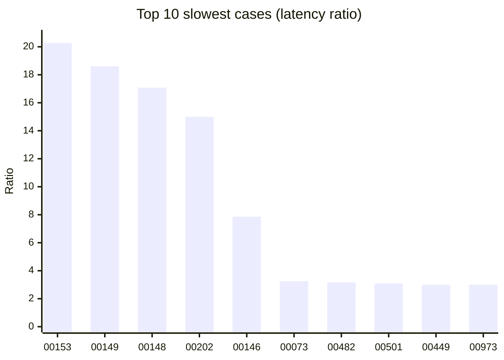
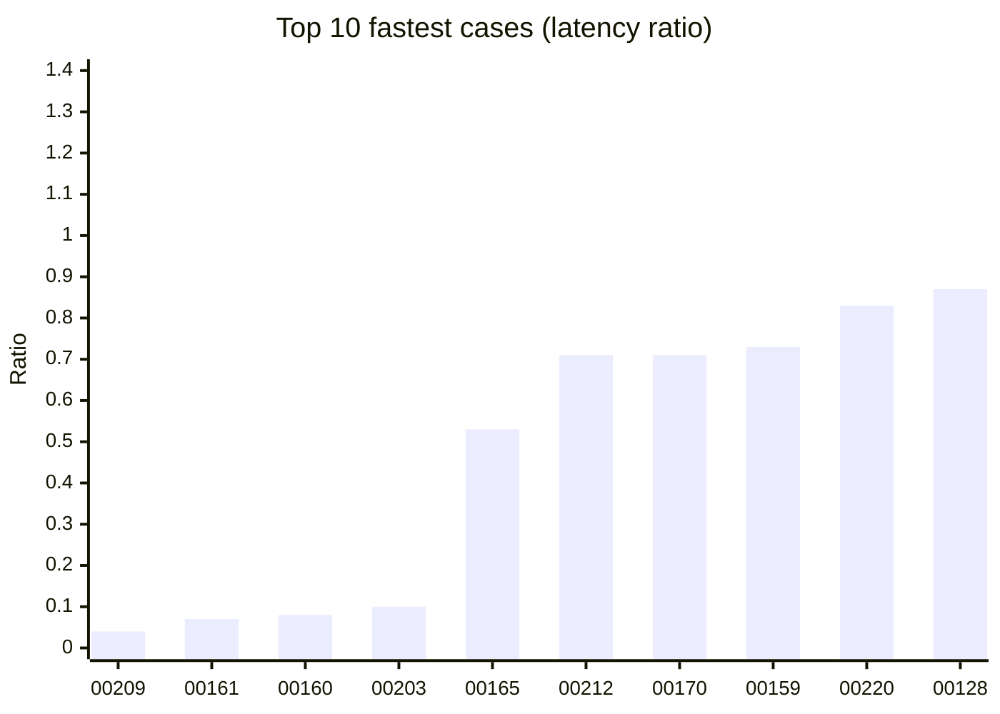
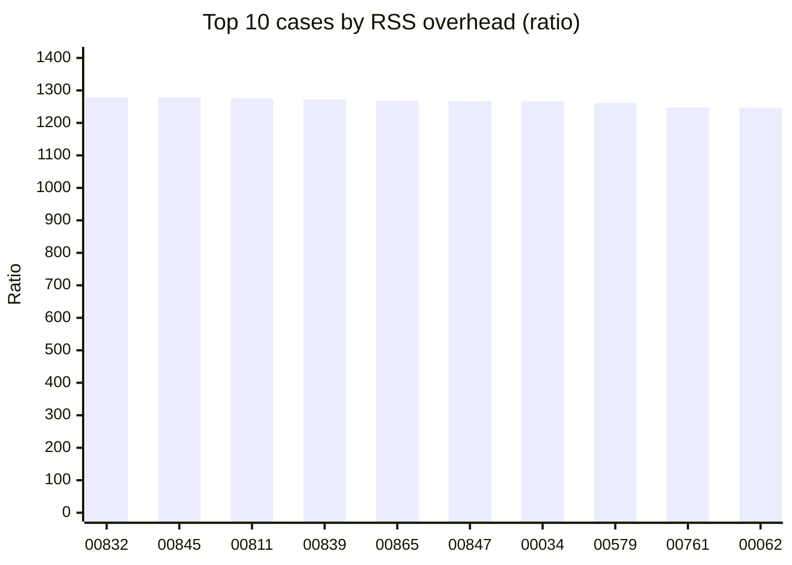

<p align="center">
  
</p>

<h1 align="center">RedlineDB</h1>

<p align="center">
  <em>Rust-native embedded SQL with SQLite-shaped compatibility, concurrent writes, and deterministic recovery.</em>
</p>

<p align="center">
  <a href="#sqlite-parity-status"></a>
  <a href="#sqlite-parity-status"></a>
  <a href="LICENSE"></a>
  <a href="rust-toolchain.toml"></a>
  
  <!-- jankurai-score-badge:begin -->
  <a href=".jankurai/repo-score.md"></a>
  <!-- jankurai-score-badge:end -->
</p>

RedlineDB is an embedded SQL engine written in Rust. It keeps the SQLite-facing
API familiar while replacing the storage core with MVCC, a concurrent B-tree,
group-commit WAL, and crash recovery designed for multi-writer workloads.

## Engine Metrics

<!-- sqlite-parity-metrics:begin -->

> _Auto-generated by `scripts/generate-metrics-readme.sh`. Do not edit by hand — CI regenerates this section on every push._

## Test results

| Suite | Total | Passed | Skipped | Failed | Pass rate |
|---|---:|---:|---:|---:|---:|
| SQLite parity (`sqlite_parity`) | 1127 | 1123 | 4 | 0 | 99.6% |
| Memory (`memory`) | 1127 | 1123 | 4 | 0 | 99.6% |
| Beyond SQLite vs Postgres (`beyond_sqlite`) | 277 | 126 | 20 | 131 | 45.5% |

## At a glance

| Metric | RedlineDB | SQLite | Ratio (RedlineDB / SQLite) |
|---|---:|---:|---:|
| Median per-case latency (parity, passed only) | 3.27 ms | 1.71 ms | 1.90× |
| Median peak RSS (memory suite) | 8.9 MiB | 12 KiB | 763.00× |
| Source LOC (code lines) | 159,960 (Rust) | 205,957 (C) | 0.78× |
| Jankurai score (final / raw, decision) | 85 / 85 (pass) | — | — |

## Where RedlineDB is strong vs weak (by category)

All 21 categories with ≥5 cases pass at 100%. Per-category latency rankings (below) show where RedlineDB is fast vs slow vs SQLite.

Largest categories by case count (corpus coverage):

| Category | Cases | Passed | Pass rate |
|---|---:|---:|---:|
| `GEN_SQL_SCALAR` | 160 | 160 | 100.0% |
| `GEN_SQL_DML` | 120 | 120 | 100.0% |
| `GEN_SQL_AGGREGATE` | 100 | 100 | 100.0% |
| `GEN_SQL_JOIN_SUBQUERY` | 100 | 100 | 100.0% |
| `GEN_SQL_CTE` | 80 | 80 | 100.0% |
| `GEN_SQL_WINDOW` | 80 | 80 | 100.0% |
| `GEN_SQL_CONSTRAINT_TX` | 80 | 80 | 100.0% |
| `GEN_SQL_VIEW_TRIGGER` | 60 | 60 | 100.0% |

## Latency — top 10 slowest cases (RedlineDB / SQLite ratio)

Higher bars = RedlineDB took longer relative to SQLite for that case. These are the rankings to investigate when squeezing per-case latency.



| Case | Name | Category | Median target | Median SQLite | Ratio |
|---|---|---|---:|---:|---:|
| `00153` | DOT_CD_TEMPFILE | `CLI_TEMPFILE` | 24.28 ms | 1.20 ms | 20.27× |
| `00149` | DOT_ONCE_TEMPFILE | `CLI_TEMPFILE` | 27.46 ms | 1.48 ms | 18.61× |
| `00148` | DOT_OUTPUT_TEMPFILE | `CLI_TEMPFILE` | 28.42 ms | 1.66 ms | 17.08× |
| `00202` | OPT_APPEND_TEMPFILE | `CLI_OPTION_TEMPFILE` | 20.56 ms | 1.37 ms | 15.00× |
| `00146` | DOT_READ_TEMPFILE | `CLI_TEMPFILE` | 20.18 ms | 2.57 ms | 7.86× |
| `00073` | INDEXED_BY | `SQL_INDEX` | 5.08 ms | 1.56 ms | 3.25× |
| `00482` | DML_WHERE_ORDER_LIMIT_095 | `GEN_SQL_DML` | 4.98 ms | 1.58 ms | 3.16× |
| `00501` | DML_WHERE_ORDER_LIMIT_114 | `GEN_SQL_DML` | 5.06 ms | 1.64 ms | 3.09× |
| `00449` | DML_WHERE_ORDER_LIMIT_062 | `GEN_SQL_DML` | 4.69 ms | 1.56 ms | 3.00× |
| `00973` | VIEW_TRIGGER_GENERATED_026 | `GEN_SQL_VIEW_TRIGGER` | 5.30 ms | 1.77 ms | 2.99× |

## Latency — top 10 fastest cases (RedlineDB / SQLite ratio)

Lower bars = RedlineDB outpaced SQLite on that case. Wins to defend.



| Case | Name | Category | Median target | Median SQLite | Ratio |
|---|---|---|---:|---:|---:|
| `00209` | OPT_INTERACTIVE_CATALOG | `CLI_OPTION_CATALOG` | 2.31 ms | 51.59 ms | 0.04× |
| `00161` | DOT_WWW_EXTERNAL_APP | `CLI_EXTERNAL_APP` | 2.46 ms | 34.09 ms | 0.07× |
| `00160` | DOT_EXCEL_EXTERNAL_APP | `CLI_EXTERNAL_APP` | 2.44 ms | 31.90 ms | 0.08× |
| `00203` | OPT_ARCHIVE_A_TEMPFILE_OPTIONAL | `CLI_OPTION_TEMPFILE_OPTIONAL` | 2.61 ms | 26.38 ms | 0.10× |
| `00165` | DOT_INTCK_CATALOG | `CLI_CATALOG` | 2.01 ms | 3.79 ms | 0.53× |
| `00212` | SQL_VACUUM_INTO_TEMPFILE | `SQL_TEMPFILE` | 54.83 ms | 77.65 ms | 0.71× |
| `00170` | OPT_VERSION | `CLI_OPTION` | 1.70 ms | 2.39 ms | 0.71× |
| `00159` | DOT_SYSTEM_SIDE_EFFECT | `CLI_SIDE_EFFECT` | 2.63 ms | 3.60 ms | 0.73× |
| `00220` | DELETE_LIMIT_OPTIONAL | `SQL_DELETE_OPTIONAL` | 2.35 ms | 2.84 ms | 0.83× |
| `00128` | DOT_DBCONFIG | `CLI_DOT_COMMAND` | 2.35 ms | 2.71 ms | 0.87× |

## Memory — top 10 cases by RSS overhead (RedlineDB / SQLite)

Per-case peak resident set size (RSS) on the `memory` suite, ranked by overhead vs SQLite. Higher bars = RedlineDB held more memory for that case — the rankings to investigate when tightening allocator footprint.



| Case | Name | Category | RedlineDB RSS | SQLite RSS | Ratio |
|---|---|---|---:|---:|---:|
| `00832` | WINDOW_PARTITION_SUM_045 | `GEN_SQL_WINDOW` | 10.0 MiB | 8 KiB | 1278.50× |
| `00845` | WINDOW_PARTITION_SUM_058 | `GEN_SQL_WINDOW` | 10.0 MiB | 8 KiB | 1278.50× |
| `00811` | WINDOW_PARTITION_SUM_024 | `GEN_SQL_WINDOW` | 10.0 MiB | 8 KiB | 1275.50× |
| `00839` | WINDOW_PARTITION_SUM_052 | `GEN_SQL_WINDOW` | 9.9 MiB | 8 KiB | 1273.00× |
| `00865` | WINDOW_PARTITION_SUM_078 | `GEN_SQL_WINDOW` | 9.9 MiB | 8 KiB | 1268.00× |
| `00847` | WINDOW_PARTITION_SUM_060 | `GEN_SQL_WINDOW` | 9.9 MiB | 8 KiB | 1266.50× |
| `00034` | EXPRESSION_INDEX | `SQL_INDEX` | 9.9 MiB | 8 KiB | 1266.00× |
| `00579` | AGG_GROUP_HAVING_072 | `GEN_SQL_AGGREGATE` | 9.9 MiB | 8 KiB | 1261.50× |
| `00761` | CTE_RECURSIVE_MATRIX_054 | `GEN_SQL_CTE` | 9.7 MiB | 8 KiB | 1247.50× |
| `00062` | WINDOW_FRAMES_ROWS | `SQL_WINDOW` | 9.7 MiB | 8 KiB | 1247.00× |

## Beyond-SQLite features — vs Postgres oracle

The `beyond_sqlite` suite runs the Postgres-shaped feature corpus (`277` cases) against RedlineDB with Postgres as the reference. RedlineDB is intentionally SQLite-shaped, so this suite surfaces where the engine has been extended past the SQLite contract and tracks divergence from Postgres semantics.

| Outcome | Cases | Share |
|---|---:|---:|
| Passes Postgres semantics | 126 | 45.5% |
| Diverges (failing parity vs Postgres) | 131 | 47.3% |
| Skipped (Postgres-only / manifest backlog) | 20 | 7.2% |

Top beyond-feature categories by coverage:

| Category | Cases | Passing Postgres | Pass rate |
|---|---:|---:|---:|
| `BEYOND_PORTABILITY_SYNTAX` | 40 | 29 | 72.5% |
| `BEYOND_RICH_TYPES` | 30 | 18 | 60.0% |
| `BEYOND_COLLATIONS_ILIKE` | 30 | 20 | 66.7% |
| `BEYOND_MIGRATION_ERGONOMICS` | 20 | 12 | 60.0% |
| `BEYOND_MATERIALIZED_VIEWS` | 20 | 0 | 0.0% |
| `BEYOND_SCHEMAS_SEQUENCES` | 20 | 13 | 65.0% |
| `BEYOND_STORED_PROCEDURES` | 20 | 0 | 0.0% |
| `BEYOND_JSONB_INDEXING` | 20 | 20 | 100.0% |

## Code health (jankurai)

- **Score:** `85` (raw `85`) (policy minimum `85`)
- **Decision:** `pass`
- **Hard findings (`high`):** 0
- **Medium findings:** 2
- **Low/info findings:** 0

Score breakdown by dimension (ranked by weighted contribution):

| Dimension | Weight | Score | Weighted |
|---|---:|---:|---:|
| Ownership and navigation surface | 13 | 100.0 | 13.0 |
| Proof lanes and test routing | 12 | 98.0 | 11.8 |
| Contract and boundary integrity | 13 | 88.0 | 11.4 |
| Security and supply-chain posture | 12 | 86.0 | 10.3 |
| Observability and repair evidence | 8 | 88.0 | 7.0 |
| Data truth and workflow safety | 8 | 85.0 | 6.8 |
| Context economy and agent instructions | 7 | 91.0 | 6.4 |
| Jankurai tool adoption and CI replacement | 7 | 80.0 | 5.6 |
| Code shape and semantic surface | 12 | 45.0 | 5.4 |
| Python containment and polyglot hygiene | 4 | 100.0 | 4.0 |
| Build speed signals | 4 | 80.0 | 3.2 |

See `target/jankurai/repo-score.md` for the full report — the CI `audit-ci` lane fails if score drops below the policy minimum or any hard cap is applied.

## Lines of code

| Engine | Language | Code lines | Comments | Files |
|---|---|---:|---:|---:|
| RedlineDB (`crates/`) | Rust | 159,960 | 6,880 | 1,666 |
| SQLite (C) amalgamation | C | 205,957 | 83,180 | 2 |
| **Delta (RedlineDB − SQLite)** | — | -45,997 | — | — |

<!-- sqlite-parity-metrics:end -->

## Redline Mission

RedlineDB keeps SQLite-shaped compatibility where that contract is valuable:
small embedded deployments, familiar SQL, a direct Rust API, and a SQLite-shaped
C surface for integrations that already expect it.

The engine is not a SQLite wrapper. It rebuilds the storage core in Rust so
MVCC, concurrent writes, WAL behavior, and recovery can be owned directly
instead of treated as constraints inherited from a single-writer file engine.

The codebase is also shaped for fast repair by agents and humans: smaller
modules, local invariants, routed proof lanes, generated evidence, and audit
metadata that point a fix at the narrowest lawful surface.

## At a Glance

| Area | What it is |
|---|---|
| Rust API | `redlinedb` for embedded use |
| CLI | `redlinedb-cli` for shell-style workflows |
| FFI | `crates/ffi` exports a SQLite-shaped C ABI surface |
| SQL engine | Parser, planner, executor, pragmas, and compatibility shims |
| Storage | Kernel-owned MVCC, WAL, catalog, and recovery layers |
| Default proof lane | `just fast` |
| SQLite parity gate | `just redline-testing-official` |

## Install

### Rust library

Pin the release in `Cargo.toml`:

```toml
[dependencies]
  redlinedb = "=3.0.0"
```

For libraries, `redlinedb = "1"` is usually fine. For binaries, keep the exact
pin and commit `Cargo.lock`.

### CLI binary

Install the published shell on Linux or macOS:

```bash
curl -LsSf https://raw.githubusercontent.com/neverhuman/RedlineDB/main/scripts/install.sh | bash
```

Pin a specific release when you need reproducible installs:

```bash
curl -LsSf https://raw.githubusercontent.com/neverhuman/RedlineDB/main/scripts/install.sh | VERSION=v3.0.0 bash
```

Lock the exact tarball digest in CI or release automation:

```bash
curl -LsSf https://raw.githubusercontent.com/neverhuman/RedlineDB/main/scripts/install.sh | \
  VERSION=v3.0.0 REDLINEDB_SHA256=<sha256> bash
```

### Build from source

```bash
cargo install redlinedb-cli --version 3.0.0 --locked
```

Or install from the tagged repository release:

```bash
cargo install --git https://github.com/neverhuman/RedlineDB.git --tag v3.0.0 --package redlinedb-cli --locked
```

### Direct download

Release tarballs are published on the [releases page](https://github.com/neverhuman/RedlineDB/releases):

| Platform | File |
|---|---|
| Linux x86_64 | `redlinedb-v3.0.0-linux-x86_64.tar.gz` |
| macOS Apple Silicon | `redlinedb-v3.0.0-macos-arm64.tar.gz` |
| macOS Intel | `redlinedb-v3.0.0-macos-x86_64.tar.gz` |

Each tarball ships with a matching `.sha256` checksum and contains the CLI,
shared libraries, and public headers.

## Quick Start

### Embedded use

```rust
use redlinedb::Database;

fn main() -> redlinedb::Result<()> {
    let db = Database::create("/tmp/demo.redline")?;
    let mut conn = db.connect()?;

    conn.execute("CREATE TABLE kv(k INTEGER PRIMARY KEY, v TEXT NOT NULL)", ())?;
    conn.execute("INSERT INTO kv VALUES (1, 'hello')", ())?;

    let value: String = conn.query_row("SELECT v FROM kv WHERE k = 1", ())?;
    println!("{value}");

    Ok(())
}
```

### CLI use

```bash
rtk cargo run -p redlinedb-cli --release -- exec /tmp/demo.redline "SELECT count(*) FROM kv"
rtk cargo run -p redlinedb-cli --release -- stats /tmp/demo.redline --json
rtk cargo run -p redlinedb-cli --release -- backup /tmp/demo.redline /tmp/demo.bak --physical
```

### Default verification

```bash
rtk just fast
rtk just redline-testing-official
rtk just sqlite-parity-report-check
```

## SQLite Parity Status

The official parity lane is sourced only from the verified external
`neverhuman/redline-testing` release artifact, which is the sole official
evidence source. Missing, skipped, failed, or unmeasured cases are hard
report-check failures rather than excluded from the denominator. The live report
below is generated only from `benchmark-results/sqlite-parity/latest/` after
`official-evidence.processed.json` validates `raw.jsonl` against the
hash-bound upstream official evidence chain, including the verified release
tarball SHA-256, the `redline-testing` binary SHA-256, the release manifest, and
the GitHub artifact attestation.

<!-- sqlite-parity-report:begin -->
**SQLite parity coverage:** **1127 / 1127** cases passed in CI. Failed: **0**. Skipped: **0**. Updated 2026-05-24.

**SQLite parity latency:** median gap **-19.69%**, worst gap **-289.42%**, faster cases **306**.

**Benchmark metadata:** RedlineDB target version **redlinedb v3.0.0 (SQLite 3.45.1 compatibility)**, SQLite reference version **3.53.1 2026-05-05 10:34:17 c88b22011a54b4f6fbd149e9f8e4de77658ce58143a1af0e3785e4e6475127e9 (64-bit)**, redline-testing runner version **redline-testing 1.0.0**.


<details id="sqlite-parity-ranked-table">
<summary>Full ranked latency table</summary>

| Rank | Case | Priority | Profile | Category | SQLite median ns | RedlineDB median ns | Improvement |
| ---: | --- | --- | --- | --- | ---: | ---: | ---: |
| 1 | AGG_GROUP_HAVING_059 | P1 | memory | GEN_SQL_AGGREGATE | 3866083 | 15055127 | -289.42% |
| 2 | JSON_EXTRACT_SET_051 | P2 | memory | GEN_SQL_JSON | 3070568 | 11762459 | -283.07% |
| 3 | DML_WHERE_ORDER_LIMIT_106 | P1 | memory | GEN_SQL_DML | 4160450 | 15849029 | -280.95% |
| 4 | INDEX_SCHEMA_PRAGMA_018 | P2 | memory | GEN_SQL_INDEX_PRAGMA | 3366709 | 12364889 | -267.27% |
| 5 | INDEX_SCHEMA_PRAGMA_005 | P2 | memory | GEN_SQL_INDEX_PRAGMA | 4157935 | 14334645 | -244.75% |
| 6 | OPT_NOUNICODE_UTF8_CATALOG | P4 | catalog | CLI_OPTION_CATALOG | 3217786 | 10031936 | -211.77% |
| 7 | CTE_RECURSIVE_MATRIX_079 | P1 | memory | GEN_SQL_CTE | 5319732 | 16466738 | -209.54% |
| 8 | WINDOW_PARTITION_SUM_047 | P2 | memory | GEN_SQL_WINDOW | 4547792 | 13640181 | -199.93% |
| 9 | CONSTRAINT_FK_SAVEPOINT_074 | P2 | memory | GEN_SQL_CONSTRAINT_TX | 4652330 | 13460000 | -189.32% |
| 10 | SCALAR_ARITH_038 | P1 | memory | GEN_SQL_SCALAR | 4108661 | 11881625 | -189.18% |
| 11 | CTE_RECURSIVE_MATRIX_006 | P1 | memory | GEN_SQL_CTE | 4272461 | 11969702 | -180.16% |
| 12 | CONSTRAINT_FK_SAVEPOINT_052 | P2 | memory | GEN_SQL_CONSTRAINT_TX | 5459828 | 14870167 | -172.36% |
| 13 | OPT_PCACHETRACE_CATALOG | P4 | catalog | CLI_OPTION_CATALOG | 3833511 | 10385124 | -170.90% |
| 14 | SUBQUERIES_EXISTS_IN | P0 | memory | SQL_SELECT | 3502164 | 9421100 | -169.01% |
| 15 | COLLATE_NOCASE_RTRIM_BINARY | P0 | memory | SQL_COLLATION | 3421071 | 9168513 | -168.00% |
| 16 | JSON_EXTRACT_SET_004 | P2 | memory | GEN_SQL_JSON | 4584231 | 12180560 | -165.71% |
| 17 | AGG_GROUP_HAVING_002 | P1 | memory | GEN_SQL_AGGREGATE | 5150743 | 13309997 | -158.41% |
| 18 | CONSTRAINT_FK_SAVEPOINT_028 | P2 | memory | GEN_SQL_CONSTRAINT_TX | 5766538 | 14734802 | -155.52% |
| 19 | CONSTRAINT_FK_SAVEPOINT_044 | P2 | memory | GEN_SQL_CONSTRAINT_TX | 5556811 | 14070745 | -153.22% |
| 20 | SCALAR_NULL_COALESCE_036 | P1 | memory | GEN_SQL_SCALAR | 5519881 | 13739519 | -148.91% |
| 21 | OPT_NO_ROWID_IN_VIEW | P4 | memory | CLI_OPTION | 5757591 | 14260645 | -147.68% |
| 22 | INDEX_SCHEMA_PRAGMA_036 | P2 | memory | GEN_SQL_INDEX_PRAGMA | 3733973 | 9233306 | -147.28% |
| 23 | WINDOW_PARTITION_SUM_019 | P2 | memory | GEN_SQL_WINDOW | 5987005 | 14758566 | -146.51% |
| 24 | SCALAR_NULL_COALESCE_035 | P1 | memory | GEN_SQL_SCALAR | 5588631 | 13771811 | -146.43% |
| 25 | CONSTRAINT_FK_SAVEPOINT_030 | P2 | memory | GEN_SQL_CONSTRAINT_TX | 4600762 | 11297771 | -145.56% |

</details>
<!-- sqlite-parity-report:end -->

## Jankurai Breakdown

<!-- sqlite-jankurai-breakdown:begin -->

{
  "generated_by": "redline-testing jankurai-compare",
  "redlinedb_score": 87,
  "redlinedb_status": "unknown",
  "score_delta": 67,
  "sqlite_ref": "version-3.53.1",
  "sqlite_score": 20,
  "sqlite_status": "unknown",
  "updated_date": "2026-05-24"
}
<!-- sqlite-jankurai-breakdown:end -->

## Architecture

<p align="center">
  
</p>

<p align="center">
  
</p>

RedlineDB is a layered Rust workspace:

- `crates/redlinedb` is the public embedded facade.
- `crates/sql` owns the parser, planner, executor, and SQLite compatibility.
- `crates/kernel` owns storage, catalog, WAL, MVCC, and recovery.
- `crates/ffi` exports the SQLite-shaped C ABI for compatibility testing.
- `crates/cli` provides the shell and administrative commands.
- `crates/bench` keeps engine-local tests and non-official harness code only.
- The official conformance corpus, memory suite, beyond-SQLite coverage, benchmark gate, and report authority live in `neverhuman/redline-testing`.

The dependency graph stays one-way: lower layers do not depend on higher layers.
That keeps the engine testable, replaceable, and easy to reason about in the
agent routing model used by this repository.

## Repository Layout

| Path | Purpose |
|---|---|
| `crates/redlinedb/` | Public Rust API |
| `crates/sql/` | SQL parser, planner, executor, and dialect support |
| `crates/kernel/` | Storage, WAL, MVCC, catalog, and recovery |
| `crates/ffi/` | SQLite-shaped C ABI shim |
| `crates/cli/` | Command-line shell |
| `crates/server/` | Optional framed server |
| `crates/bench/` | Engine-local tests and non-official harness code; not a parity evidence producer |
| `benchmark-results/sqlite-parity/latest/` | Current external-suite report artifacts and processed official evidence |
| `docs/` | Architecture, testing, and audit guidance |
| `paper/` | Evaluation writeup and reproducibility assets |

## Development Notes

- `just fast` is the default local proof lane for ordinary edits.
- `just redline-testing-official` runs the verified external official suite wrapper.
- `just official-evidence-guard` fails if official metrics can be regenerated without the verified external runner.
- `just sqlite-parity-report-update` refreshes the generated parity report from the latest processed official evidence bundle.
- `just sqlite-parity-report-check` verifies the README report block matches the committed processed official evidence bundle.
- `just sqlite-parity-report-publish-pr` is the CI entrypoint that regenerates the report and opens or updates the draft report PR after main CI succeeds.
- `scripts/ci-local.sh all` mirrors the broader local CI surface when you need it.

The repository does not expose local SQLite parity coverage, benchmark, report,
or sentinel producers. The sole source for SQLite, memory, beyond-SQLite,
latency, chart, README, Jankurai, and score evidence is the verified
`neverhuman/redline-testing` release artifact and its processed evidence
bundle.

## Contributing

Read the root `AGENTS.md`, then follow `docs/testing.md` for proof lanes and
`docs/architecture.md` for workspace structure. Keep changes narrow, avoid
touching generated zones by hand, and prefer the smallest lawful edit that
restores the invariant.

## Citing

If you reference RedlineDB in a paper or writeup, cite the evaluation material
in `paper/main.pdf` and link back to this repository release.

## License

Apache-2.0. See [LICENSE](LICENSE).
